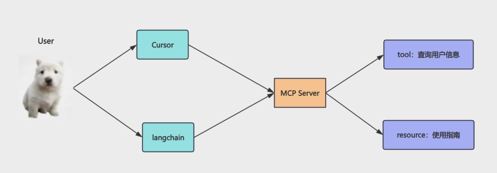
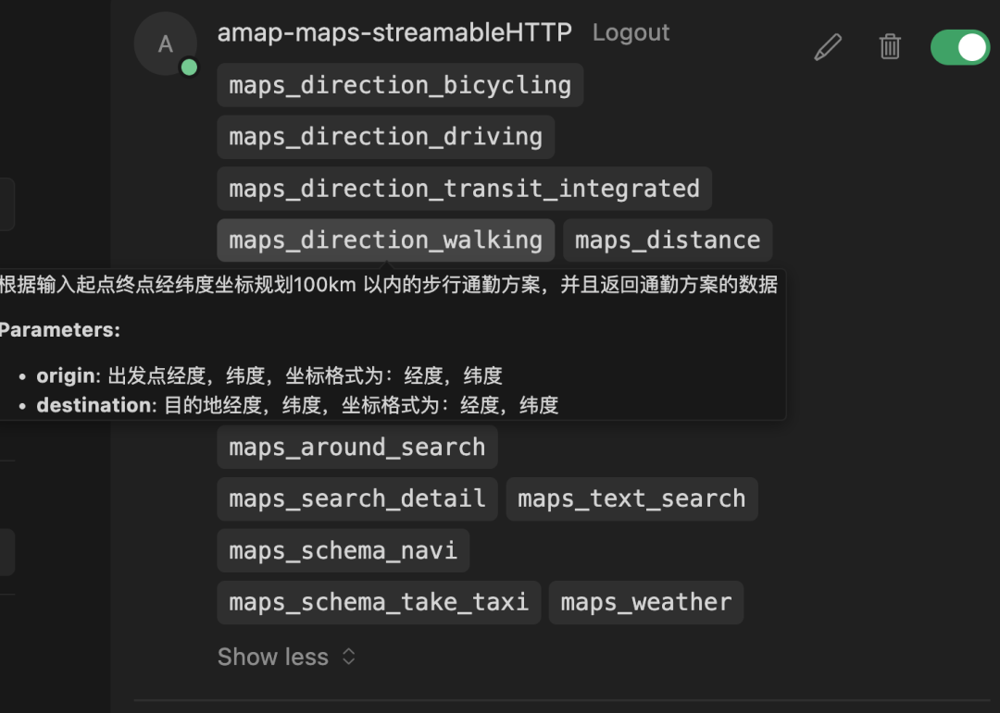
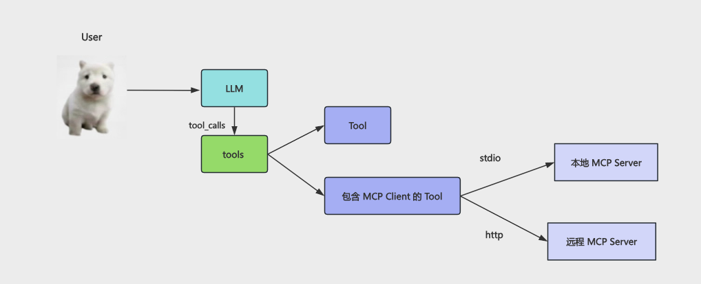
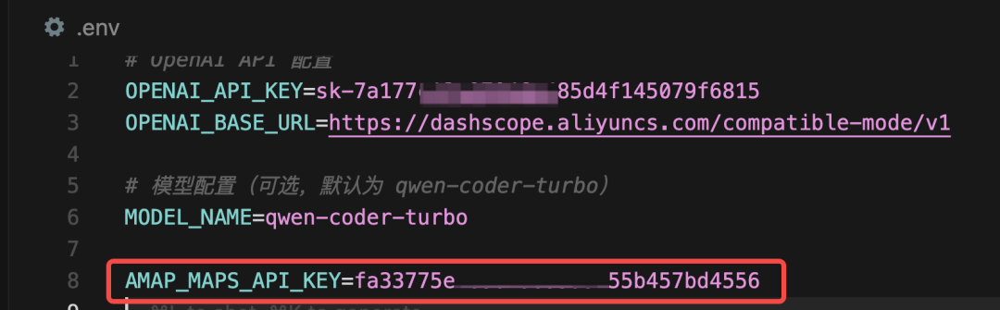
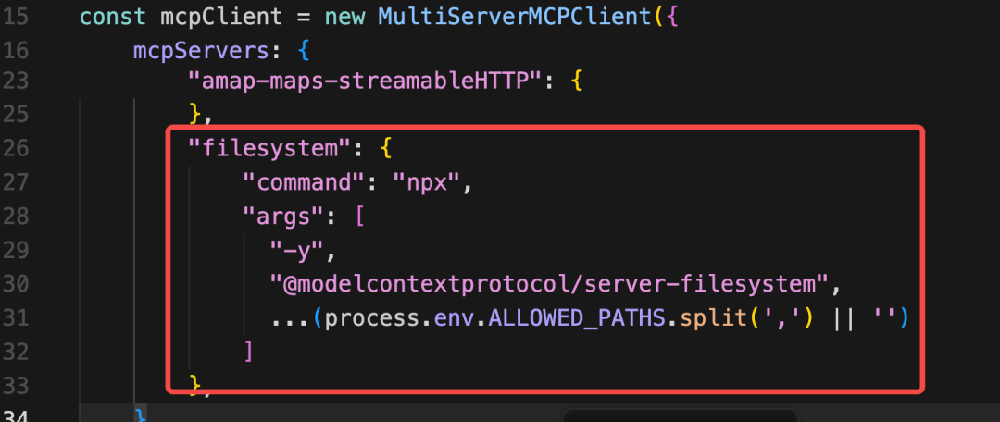
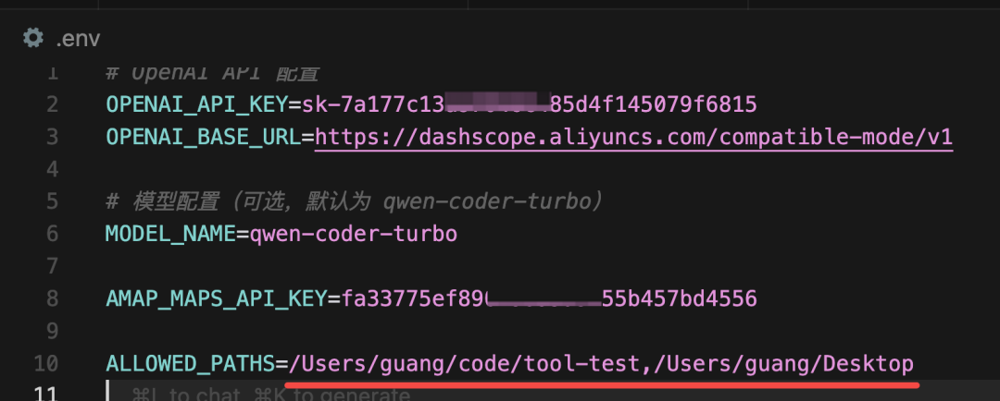
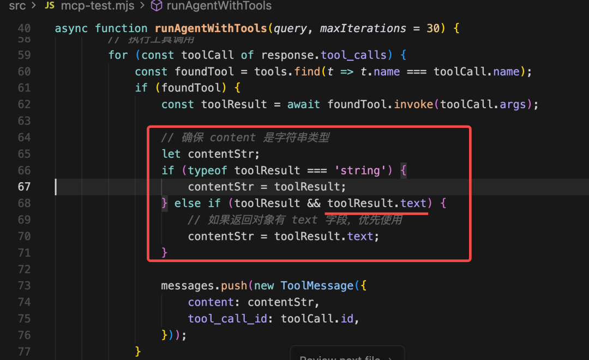
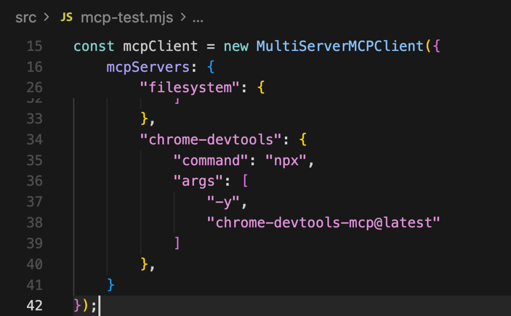
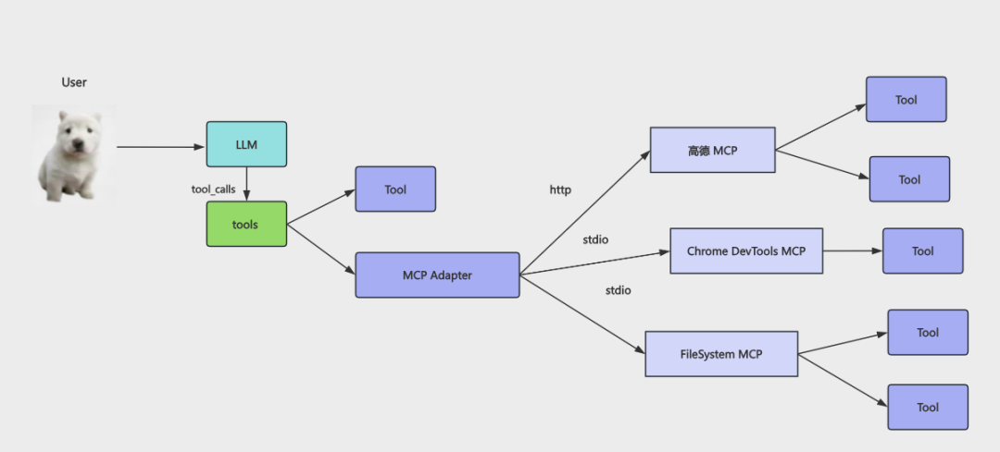

# 高德 MCP + 浏览器 MCP：LangChain 复用别人的 MCP Server

> **Python 版** | 基于 FastAPI + LangChain Python 技术栈

---

## 为什么要复用别人的 MCP Server？

上节我们学了 MCP，自己实现了一个 MCP Server，然后在 Cursor 或者 LangChain 里连上这个 Server，就可以用里面的 Tools 了。

它本质上还是 Tool，只不过包了一层进程，可以通过 stdio 和 HTTP 来访问。

有这一层协议之后，有个巨大的好处：**任何人都可以开发基于这个协议的 MCP Server，然后我们可以直接复用！**

比如上节我们写的那个 MCP Server 就可以被别人用。

这节我们用一下别人写好的 MCP Server，感受下 MCP 有多爽！

我们用这三个 MCP Server：

- **高德 MCP**：位置查询、路线规划、周边搜索等
- **Chrome DevTools MCP**：控制浏览器，打开/关闭页面、点击元素、截图等
- **FileSystem MCP**：读写文件、创建目录等

## 一、高德 MCP

### 获取 API Key

首先需要获取一个高德地图 API Key：

1. 打开 https://developer.amap.com/
2. 注册/登录账号
3. 进入「应用管理」→「我的应用」
4. 创建应用，然后创建一个 API Key
5. 服务平台选择「Web 服务」

### 两种接入方式

MCP 有两种接入方式：

#### 方式一：HTTP 远程接入（推荐）

```python
# 在 MCP Client 配置中
"amap-maps": {
    "url": "https://mcp.amap.com/mcp?key=" + os.getenv("AMAP_MAPS_API_KEY")
}
```

这就是 HTTP 的接入方式，直接连接高德的远程 MCP Server。

#### 方式二：stdio 本地进程接入

高德也支持 stdio 的本地进程接入方式，需要安装 npm 包：

```bash
npx -y @amap/amap-maps-mcp-server
```

```python
"amap-maps": {
    "command": "npx",
    "args": ["-y", "@amap/amap-maps-mcp-server"],
    "env": {
        "AMAP_MAPS_API_KEY": os.getenv("AMAP_MAPS_API_KEY")
    }
}
```

就是用命令行跑一个 npm 包，会创建一个支持 stdio 连接的进程，然后连上其中的 MCP Server 就好了。

> **简历加分项**：你可以在简历里写——"开发了一个 MCP Server 的 Python 包，包含 xxx Tool，支持 stdio/HTTP 访问。可以在 Cursor 或 LangChain 里使用。" 这样面试官一看就知道，你是真懂 MCP 的，而且还有实践经验。

**高德 MCP 配置参考截图：**








## 二、在 LangChain 中使用高德 MCP

在 tool-test 项目里创建 `src/mcp_amap_test.py`：

```python
"""
LangChain 调用高德 MCP Server 示例
"""
import os
import asyncio
from dotenv import load_dotenv
from langchain_openai import ChatOpenAI
from langchain_mcp_adapters.client import MultiServerMCPClient
from langchain_core.messages import HumanMessage, ToolMessage

load_dotenv()


async def main():
    # 1. 初始化大模型
    model = ChatOpenAI(
        model=os.getenv("MODEL_NAME", "qwen-plus"),
        api_key=os.getenv("OPENAI_API_KEY"),
        base_url=os.getenv("OPENAI_BASE_URL"),
        temperature=0,
    )

    # 2. 创建 MCP Client，连接高德 MCP Server（HTTP 方式）
    mcp_client = MultiServerMCPClient({
        "amap-maps": {
            "url": "https://mcp.amap.com/mcp?key=" + os.getenv("AMAP_MAPS_API_KEY", "")
        }
    })

    # 3. 获取 MCP 工具并绑定到模型
    async with mcp_client as client:
        tools = await client.get_tools()
        print(f"获取到 {len(tools)} 个工具:")
        for t in tools:
            print(f"  - {t.name}")

        model_with_tools = model.bind_tools(tools)

        # 4. 运行 Agent
        messages = [
            HumanMessage(content="北京南站附近的酒店，以及去的路线")
        ]

        max_iterations = 10
        for i in range(max_iterations):
            print(f"\n=== 第 {i + 1} 步 ===")
            response = await model_with_tools.ainvoke(messages)
            messages.append(response)

            if not response.tool_calls:
                print(f"\n最终回复:\n{response.content}")
                break

            print(f"检测到 {len(response.tool_calls)} 个工具调用")
            for tool_call in response.tool_calls:
                print(f"调用 {tool_call['name']}: {tool_call['args']}")
                found_tool = next((t for t in tools if t.name == tool_call["name"]), None)
                if found_tool:
                    tool_result = await found_tool.ainvoke(tool_call["args"])
                    # 确保 content 是字符串类型
                    if isinstance(tool_result, str):
                        content_str = tool_result
                    elif hasattr(tool_result, 'text'):
                        content_str = tool_result.text
                    else:
                        content_str = str(tool_result)

                    messages.append(ToolMessage(
                        content=content_str,
                        tool_call_id=tool_call["id"]
                    ))


if __name__ == "__main__":
    asyncio.run(main())
```

在 `.env` 中添加高德 API Key：

```env
AMAP_MAPS_API_KEY=你的高德API_KEY
```

运行测试：

```bash
python src/mcp_amap_test.py
```

**效果对比**：

- ❌ 不启用高德 MCP：大模型没法处理地理位置信息，让你用地图查
- ✅ 启用高德 MCP：大模型可以调用高德 MCP 里的 Tool，给出酒店位置和路线

**这就是 MCP 的好处：直接复用别人写好的 Tool。**

**LangChain 调用高德 MCP 参考截图：**













## 三、FileSystem MCP

文件读写、创建目录这种，也不用自己写 Tool，可以用现成的 MCP。

这是 MCP 官方维护的一个 MCP Server：

```python
"filesystem": {
    "command": "npx",
    "args": [
        "-y",
        "@modelcontextprotocol/server-filesystem",
        *os.getenv("ALLOWED_PATHS", "").split(",")
    ]
}
```

后面是可访问的目录，配在 `.env` 里，逗号分隔：

```env
ALLOWED_PATHS=/Users/yourname/Desktop,/Users/yourname/Documents
```

FileSystem MCP 提供的 Tool 包括：
- 读文件、写文件
- 创建目录、列出目录
- 移动文件、复制文件
- 删除文件

### 注意：Tool 返回值处理

一般我们写 Tool 都是直接返回字符串，但是 FileSystem MCP 封装的这些 Tool 返回的是对象，有 text 属性，所以要处理下：

```python
# 确保 content 是字符串类型
if isinstance(tool_result, str):
    content_str = tool_result
elif hasattr(tool_result, 'text'):
    # 如果返回对象有 text 字段，优先使用
    content_str = tool_result.text
else:
    content_str = str(tool_result)

messages.append(ToolMessage(
    content=content_str,
    tool_call_id=tool_call["id"]
))
```

### 组合使用：高德 + FileSystem

```python
messages = [
    HumanMessage(content="北京南站附近的5个酒店，以及去的路线，路线规划生成文档保存到桌面的一个 md 文件")
]
```

运行后可以看到：
1. 大模型首先调用高德 MCP 拿到了附近的酒店位置
2. 然后规划了路线
3. 最后调用 FileSystem MCP 写入了文件

**直接复用别人的 MCP，完全不用自己写。**

## 四、Chrome DevTools MCP

最后我们再来用一下 Chrome DevTools 的 MCP，它是可以用来做浏览器自动化的。

比如打开页面、点击元素、截图等。

### 配置方式

```python
"chrome-devtools": {
    "command": "npx",
    "args": ["-y", "chrome-devtools-mcp@latest"]
}
```

Chrome DevTools MCP 提供的 Tool 包括：
- 打开/关闭浏览器标签页
- 导航到 URL
- 点击元素、输入文本
- 截图
- 获取页面内容
- 执行 JavaScript

### 组合使用：高德 + Chrome DevTools

```python
messages = [
    HumanMessage(content="北京南站附近的酒店，最近的 3 个酒店，拿到酒店图片，打开浏览器，展示每个酒店的图片，每个 tab 一个 url 展示，并且把页面标题改为酒店名")
]
```

运行后可以看到：
1. 搜到了北京南站最近的 3 个酒店
2. 浏览器打开了酒店图片页面

**只要配好 MCP，大模型就可以直接调用里面的 Tools 了。**

## 完整示例：三个 MCP 组合使用

创建 `src/mcp_combined_test.py`：

```python
"""
LangChain 组合使用高德 + FileSystem + Chrome DevTools MCP Server
"""
import os
import asyncio
from dotenv import load_dotenv
from langchain_openai import ChatOpenAI
from langchain_mcp_adapters.client import MultiServerMCPClient
from langchain_core.messages import HumanMessage, ToolMessage

load_dotenv()


async def main():
    model = ChatOpenAI(
        model=os.getenv("MODEL_NAME", "qwen-plus"),
        api_key=os.getenv("OPENAI_API_KEY"),
        base_url=os.getenv("OPENAI_BASE_URL"),
        temperature=0,
    )

    # 组合三个 MCP Server
    mcp_client = MultiServerMCPClient({
        # 高德 MCP（HTTP 方式）
        "amap-maps": {
            "url": "https://mcp.amap.com/mcp?key=" + os.getenv("AMAP_MAPS_API_KEY", "")
        },
        # FileSystem MCP（stdio 方式）
        "filesystem": {
            "command": "npx",
            "args": [
                "-y",
                "@modelcontextprotocol/server-filesystem",
                *os.getenv("ALLOWED_PATHS", ".").split(",")
            ]
        },
        # Chrome DevTools MCP（stdio 方式）
        "chrome-devtools": {
            "command": "npx",
            "args": ["-y", "chrome-devtools-mcp@latest"]
        }
    })

    async with mcp_client as client:
        tools = await client.get_tools()
        print(f"共获取到 {len(tools)} 个工具")

        model_with_tools = model.bind_tools(tools)

        messages = [
            HumanMessage(content="北京南站附近最近的3个酒店，规划去每个酒店的路线，把结果保存为 md 文件到当前目录")
        ]

        for i in range(15):
            print(f"\n=== 第 {i + 1} 步 ===")
            response = await model_with_tools.ainvoke(messages)
            messages.append(response)

            if not response.tool_calls:
                print(f"\n最终回复:\n{response.content}")
                break

            for tool_call in response.tool_calls:
                print(f"调用 {tool_call['name']}")
                found_tool = next((t for t in tools if t.name == tool_call["name"]), None)
                if found_tool:
                    tool_result = await found_tool.ainvoke(tool_call["args"])
                    content_str = tool_result if isinstance(tool_result, str) else (
                        tool_result.text if hasattr(tool_result, 'text') else str(tool_result)
                    )
                    messages.append(ToolMessage(content=content_str, tool_call_id=tool_call["id"]))


if __name__ == "__main__":
    asyncio.run(main())
```

## 学习要点

1. **MCP 的核心价值**：别人开发好的 Tool，可以直接复用，不需要自己写
2. **两种接入方式**：HTTP 远程接入（简单）和 stdio 本地进程接入（灵活）
3. **返回值处理**：有些 MCP Server 的 Tool 返回对象而非字符串，需要统一处理
4. **组合使用**：多个 MCP Server 可以组合使用，实现复杂功能
5. **不需要懂底层 API**：你全程不需要知道怎么用高德的 API 查询位置、路线，不需要知道怎么用 CDP 协议控制浏览器，大模型会自己读取 Tool 描述来调用

## 扩展方向

- 探索更多现成的 MCP Server（数据库、邮件、Slack 等）
- 开发自己的 MCP Server 并发布到 PyPI
- 在 Cursor / Claude Desktop 中配置使用这些 MCP
- 组合多个 MCP Server 构建完整的 Agent 应用

---

## 配套代码库

**代码库地址**：https://github.com/iiixiyan/agent-learning-code/tree/main/01-agent-basics/07-mcp-servers

包含本文的完整可运行代码示例（高德 MCP + FileSystem MCP + Chrome DevTools MCP 组合使用）。

---

**上一篇**：[MCP：可跨进程调用的 Tool](./06_MCP-可跨进程调用的Tool.md) | **下一篇**：[RAG 检索增强：让大模型基于你的文档回答问题](./08_RAG检索增强-让大模型基于你的文档回答问题.md)
