# 结构化大模型输出：Output Parser 还是 Tool？

> **Python 版** | 基于 LangChain Python + Pydantic 技术栈
> 原课程基于 Node.js(Nest.js) + LangChain JS，本文转换为 Python 版本

---

## 为什么需要结构化输出？

我们已经调用大模型完成过很多功能了，但输出一直没做控制，都是自然语言的形式。

而很多情况下，我们希望大模型按照我们的格式要求，返回一个 JSON。比如：
- 提取文章中的人物信息（姓名、年龄、职业）
- 对用户评论进行情感分析（正面/负面/中性，置信度）
- 从合同中提取关键条款（条款类型、内容、有效期）

这就需要用到 **Output Parser** 的 API 了。

有同学说，这个不就是在 Prompt 里描述下要什么格式，然后按照这种格式解析大模型返回的结果字符串么？

没错，就是这种思路，只不过 Output Parser 对这个思路做了一下封装。

---

## 方式一：直接在 Prompt 里要求 JSON（不推荐）

我们先试试最原始的方式：直接在 Prompt 里要求大模型返回 JSON。

### 安装依赖

```bash
pip install langchain langchain-openai python-dotenv pydantic
```

### 创建项目

```bash
mkdir output-parser-test
cd output-parser-test
```

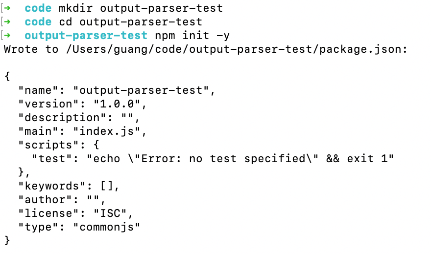

### 配置环境变量

创建 `.env` 文件：

```env
# OpenAI API 配置（以通义千问为例）
OPENAI_API_KEY=sk-xxx
OPENAI_BASE_URL=https://dashscope.aliyuncs.com/compatible-mode/v1
MODEL_NAME=qwen-plus
```

### 测试代码

创建 `src/normal.py`：

```python
"""
普通方式：直接在 Prompt 里要求 JSON 格式
"""
import os
import json
from dotenv import load_dotenv
from langchain_openai import ChatOpenAI

load_dotenv()

# 初始化模型
model = ChatOpenAI(
    model=os.getenv("MODEL_NAME", "qwen-plus"),
    api_key=os.getenv("OPENAI_API_KEY"),
    base_url=os.getenv("OPENAI_BASE_URL"),
    temperature=0,
)

# 简单的问题，要求 JSON 格式返回
question = """请介绍一下爱因斯坦的信息。
请以 JSON 格式返回，包含以下字段：
name（姓名）、birth_year（出生年份）、nationality（国籍）、
major_achievements（主要成就，数组）、famous_theory（著名理论）。"""

try:
    print("正在调用大模型...\n")
    response = model.invoke(question)
    print("收到响应:\n")
    print(response.content)

    # 解析 JSON
    json_result = json.loads(response.content)
    print("\n解析后的 JSON 对象:")
    print(json_result)
except Exception as error:
    print(f"\n错误: {error}")
```

运行：

```bash
python src/normal.py
```

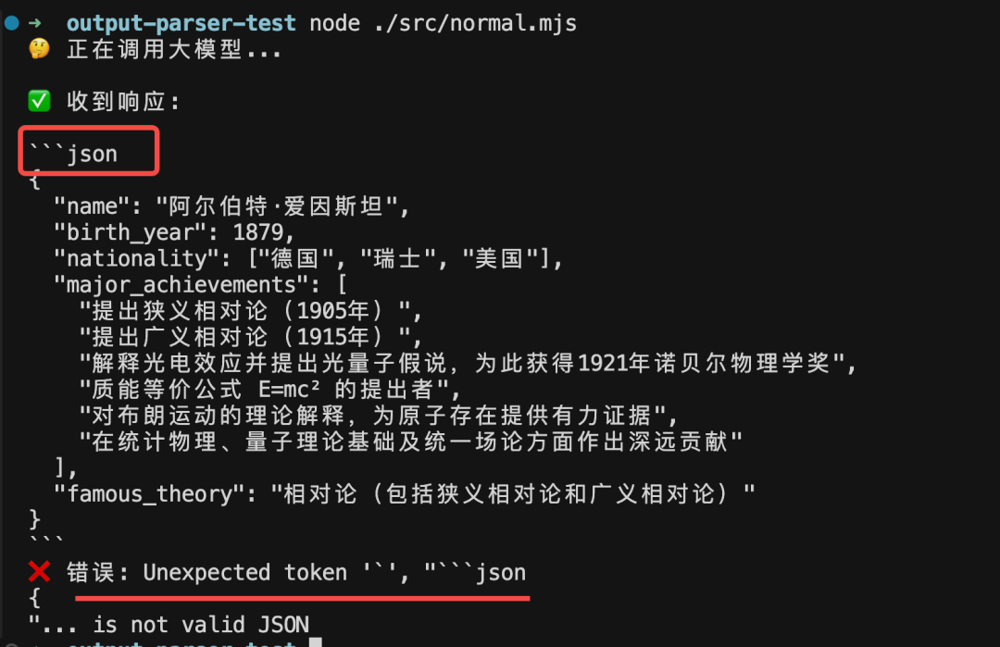

可以看到，返回的内容带了额外的 Markdown 语法（```json ... ```），解析失败了。

这是我们经常遇到的一个问题：大模型返回的 JSON 经常被 Markdown 代码块包裹，或者有额外的解释文字。

---

## 方式二：JsonOutputParser

我们用 `JsonOutputParser` 试一下。

创建 `src/json_output_parser.py`：

```python
"""
JsonOutputParser 示例：自动解析 JSON 结果
"""
import os
from dotenv import load_dotenv
from langchain_openai import ChatOpenAI
from langchain_core.output_parsers import JsonOutputParser

load_dotenv()

# 初始化模型
model = ChatOpenAI(
    model=os.getenv("MODEL_NAME", "qwen-plus"),
    api_key=os.getenv("OPENAI_API_KEY"),
    base_url=os.getenv("OPENAI_BASE_URL"),
    temperature=0,
)

# 创建 JsonOutputParser
parser = JsonOutputParser()

# 构建 Prompt，加入格式说明
question = f"""请介绍一下爱因斯坦的信息。
请以 JSON 格式返回，包含以下字段：
name（姓名）、birth_year（出生年份）、nationality（国籍）、
major_achievements（主要成就，数组）、famous_theory（著名理论）。

{parser.get_format_instructions()}"""

print("生成的 Prompt:\n")
print(question)

try:
    print("\n正在调用大模型（使用 JsonOutputParser）...\n")
    response = model.invoke(question)
    print("模型原始响应:\n")
    print(response.content)

    # 使用 parser 解析结果
    result = parser.parse(response.content)
    print("\nJsonOutputParser 自动解析的结果:\n")
    print(result)
    print(f"\n姓名: {result['name']}")
    print(f"出生年份: {result['birth_year']}")
    print(f"国籍: {result['nationality']}")
    print(f"著名理论: {result['famous_theory']}")
    print(f"主要成就: {result['major_achievements']}")
except Exception as error:
    print(f"\n错误: {error}")
```

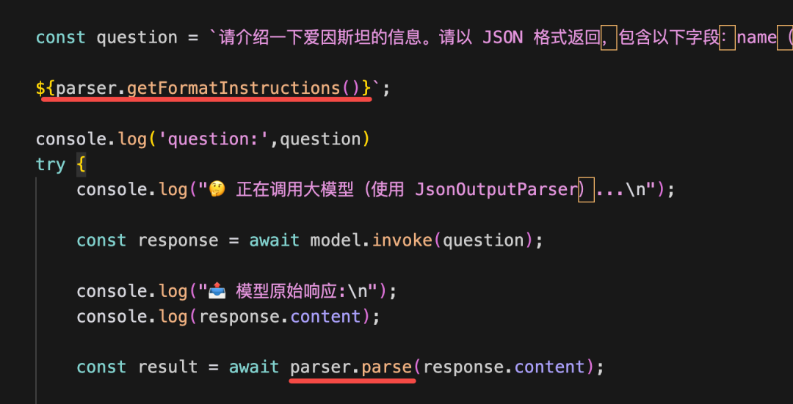

用了 `JsonOutputParser`，顾名思义，它就是用来解析 JSON 结果的。

就像前面说的，在 Prompt 里放一段格式的提示词，然后对返回的结果按照格式来 parse。分别对应：
- `parser.get_format_instructions()`：生成格式说明的提示词
- `parser.parse(response.content)`：解析返回结果

运行：

```bash
python src/json_output_parser.py
```

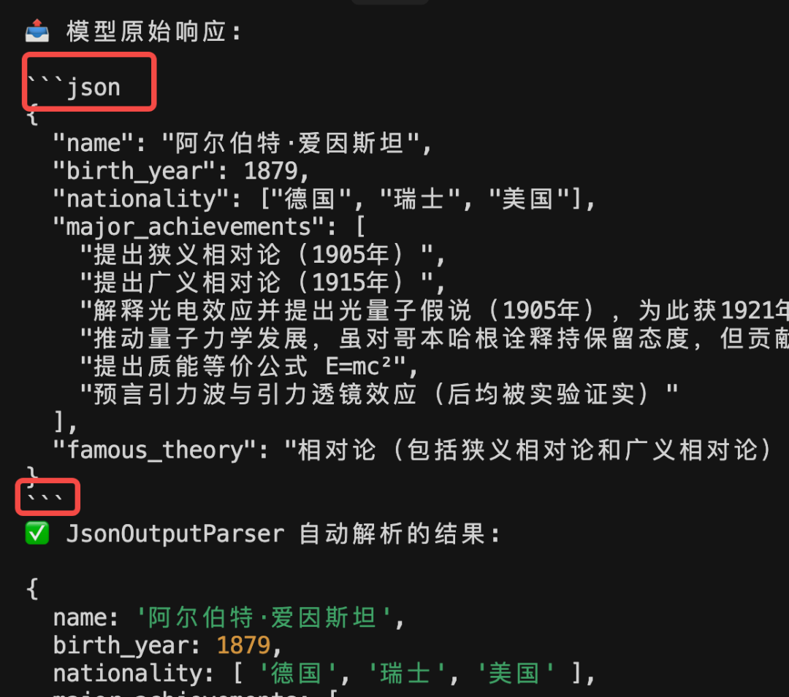

可以看到，虽然大模型返回的还是带了 Markdown 语法，但是 `JsonOutputParser` 能够解析其中的 JSON。因为它做了这种常见情况的处理（自动去除 Markdown 代码块包裹）。

> **注意**：`JsonOutputParser` 的 `get_format_instructions()` 比较简单，不需要太多提示词，因为它只要求返回 JSON。

---

## 方式三：StructuredOutputParser

`JsonOutputParser` 只能解析 JSON，但不能指定具体的字段结构。如果我们想指定字段和类型，就需要用 `StructuredOutputParser`。

### 3.1 from_names_and_descriptions

创建 `src/structured_output_parser.py`：

```python
"""
StructuredOutputParser 示例：指定字段和描述
"""
import os
from dotenv import load_dotenv
from langchain_openai import ChatOpenAI
from langchain_core.output_parsers import StructuredOutputParser

load_dotenv()

model = ChatOpenAI(
    model=os.getenv("MODEL_NAME", "qwen-plus"),
    api_key=os.getenv("OPENAI_API_KEY"),
    base_url=os.getenv("OPENAI_BASE_URL"),
    temperature=0,
)

# 定义输出结构：字段名 + 描述
parser = StructuredOutputParser.from_names_and_descriptions({
    "name": "姓名",
    "birth_year": "出生年份",
    "nationality": "国籍",
    "major_achievements": "主要成就，用逗号分隔的字符串",
    "famous_theory": "著名理论",
})

# 构建 Prompt
question = f"""请介绍一下爱因斯坦的信息。
{parser.get_format_instructions()}"""

print("生成的 Prompt:\n")
print(question)

try:
    print("\n正在调用大模型（使用 StructuredOutputParser）...\n")
    response = model.invoke(question)
    print("模型原始响应:\n")
    print(response.content)

    result = parser.parse(response.content)
    print("\nStructuredOutputParser 自动解析的结果:\n")
    print(result)
    print(f"\n姓名: {result['name']}")
    print(f"出生年份: {result['birth_year']}")
    print(f"国籍: {result['nationality']}")
    print(f"著名理论: {result['famous_theory']}")
    print(f"主要成就: {result['major_achievements']}")
except Exception as error:
    print(f"\n错误: {error}")
```

运行：

```bash
python src/structured_output_parser.py
```

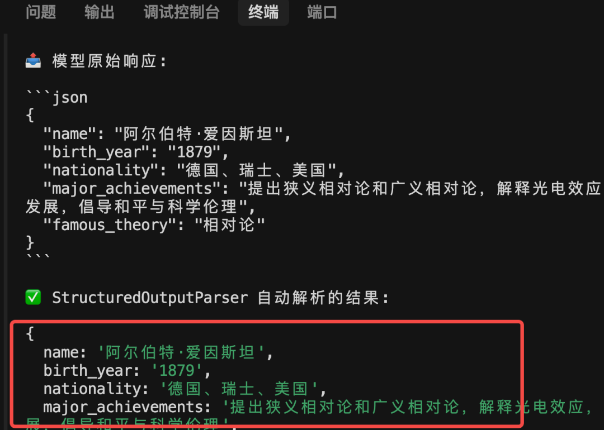

解析出的对象依然是正确的。

但现在多了一大段提示词：

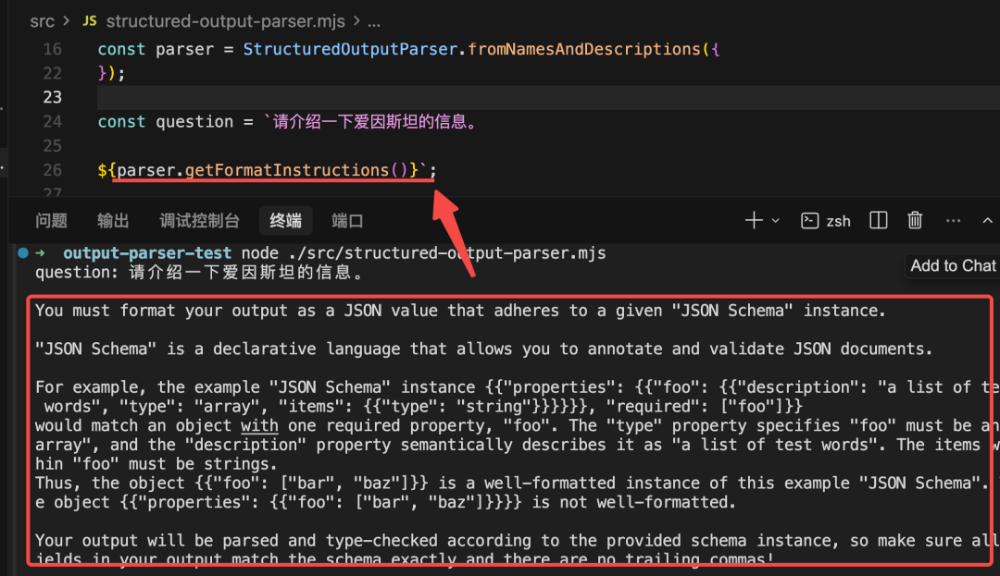

这就是 Output Parser 的原理：在 Prompt 里加入格式描述，根据这个格式来解析响应。

### 3.2 from_pydantic（推荐）

当然，就像我们之前用 Pydantic 来描述 Tool 的参数格式一样，`StructuredOutputParser` 也可以用 Pydantic 来描述复杂的对象格式。

创建 `src/structured_output_parser_pydantic.py`：

```python
"""
StructuredOutputParser + Pydantic 示例：描述复杂的对象结构
"""
import os
import json
from typing import Optional, List
from dotenv import load_dotenv
from langchain_openai import ChatOpenAI
from langchain_core.output_parsers import StructuredOutputParser
from pydantic import BaseModel, Field

load_dotenv()

model = ChatOpenAI(
    model=os.getenv("MODEL_NAME", "qwen-plus"),
    api_key=os.getenv("OPENAI_API_KEY"),
    base_url=os.getenv("OPENAI_BASE_URL"),
    temperature=0,
)


# 定义奖项结构
class Award(BaseModel):
    name: str = Field(description="奖项名称")
    year: int = Field(description="获奖年份")
    reason: Optional[str] = Field(None, description="获奖原因")


# 定义理论结构
class Theory(BaseModel):
    name: str = Field(description="理论名称")
    year: Optional[int] = Field(None, description="提出年份")
    description: str = Field(description="理论简要描述")


# 定义教育背景结构
class Education(BaseModel):
    university: str = Field(description="主要毕业院校")
    degree: str = Field(description="学位")
    graduation_year: Optional[int] = Field(None, description="毕业年份")


# 定义科学家完整信息结构
class Scientist(BaseModel):
    name: str = Field(description="科学家的全名")
    birth_year: int = Field(description="出生年份")
    death_year: Optional[int] = Field(None, description="去世年份，如果还在世则不填")
    nationality: str = Field(description="国籍")
    fields: List[str] = Field(description="研究领域列表")
    awards: List[Award] = Field(description="获得的重要奖项列表")
    major_achievements: List[str] = Field(description="主要成就列表")
    famous_theories: List[Theory] = Field(description="著名理论列表")
    education: Optional[Education] = Field(None, description="教育背景")
    biography: str = Field(description="简短传记，100字以内")


# 从 Pydantic Schema 创建 parser
parser = StructuredOutputParser.from_pydantic(Scientist)

# 构建 Prompt
question = f"""请介绍一下居里夫人（Marie Curie）的详细信息，
包括她的教育背景、研究领域、获得的奖项、主要成就和著名理论。

{parser.get_format_instructions()}"""

print("生成的 Prompt:\n")
print(question)

try:
    print("\n正在调用大模型（使用 Pydantic Schema）...\n")
    response = model.invoke(question)
    print("模型原始响应:\n")
    print(response.content)

    result = parser.parse(response.content)
    print("\nStructuredOutputParser 自动解析并验证的结果:\n")
    print(json.dumps(result, indent=2, ensure_ascii=False))

    print("\n格式化展示:")
    print(f"姓名: {result['name']}")
    print(f"出生年份: {result['birth_year']}")
    if result.get('death_year'):
        print(f"去世年份: {result['death_year']}")
    print(f"国籍: {result['nationality']}")
    print(f"研究领域: {', '.join(result['fields'])}")

    print(f"\n获得的奖项 ({len(result['awards'])}个):")
    for i, award in enumerate(result['awards'], 1):
        print(f"  {i}. {award['name']} ({award['year']})")
        if award.get('reason'):
            print(f"     原因: {award['reason']}")

    print(f"\n著名理论 ({len(result['famous_theories'])}个):")
    for i, theory in enumerate(result['famous_theories'], 1):
        year_str = f" ({theory['year']})" if theory.get('year') else ""
        print(f"  {i}. {theory['name']}{year_str}")
        print(f"     {theory['description']}")

    print(f"\n主要成就 ({len(result['major_achievements'])}个):")
    for i, achievement in enumerate(result['major_achievements'], 1):
        print(f"  {i}. {achievement}")

    print(f"\n传记:")
    print(f"  {result['biography']}")
except Exception as error:
    print(f"\n错误: {error}")
```

运行：

```bash
python src/structured_output_parser_pydantic.py
```

我们用 Pydantic 描述了一个复杂的对象结构（包含嵌套对象、数组、可选字段），然后用 `StructuredOutputParser` 生成提示词，以及 parse。

可以看到，`StructuredOutputParser` 根据格式生成了一大段提示词，并且解析也是正确的。

---

## 方式四：用 Tool Calls 获取结构化输出

有同学说，Tool 可以指定参数的对象格式，能不能直接用 Tool 来获取结构化的结果呢？

当然可以的。

创建 `src/tool_call_args.py`：

```python
"""
用 Tool Calls 获取结构化输出
"""
import os
import json
from typing import List
from dotenv import load_dotenv
from langchain_openai import ChatOpenAI
from pydantic import BaseModel, Field

load_dotenv()

model = ChatOpenAI(
    model=os.getenv("MODEL_NAME", "qwen-plus"),
    api_key=os.getenv("OPENAI_API_KEY"),
    base_url=os.getenv("OPENAI_BASE_URL"),
    temperature=0,
)


# 定义结构化输出的 Schema
class ScientistSchema(BaseModel):
    name: str = Field(description="科学家的全名")
    birth_year: int = Field(description="出生年份")
    nationality: str = Field(description="国籍")
    fields: List[str] = Field(description="研究领域列表")


# 绑定工具到模型
# 注意：这里没定义 tool 的实现逻辑，因为我们只是告诉大模型有这个 tool、参数是什么格式，不需要执行
model_with_tool = model.bind_tools([
    {
        "name": "extract_scientist_info",
        "description": "提取和结构化科学家的详细信息",
        "schema": ScientistSchema,
    }
])

# 调用模型
response = model_with_tool.invoke("介绍一下爱因斯坦")

print("response.tool_calls:")
print(json.dumps(response.tool_calls, indent=2, ensure_ascii=False))

# 获取结构化结果
result = response.tool_calls[0]["args"]
print("\n结构化结果:")
print(json.dumps(result, indent=2, ensure_ascii=False))

print(f"\n姓名: {result['name']}")
print(f"出生年份: {result['birth_year']}")
print(f"国籍: {result['nationality']}")
print(f"研究领域: {', '.join(result['fields'])}")
```

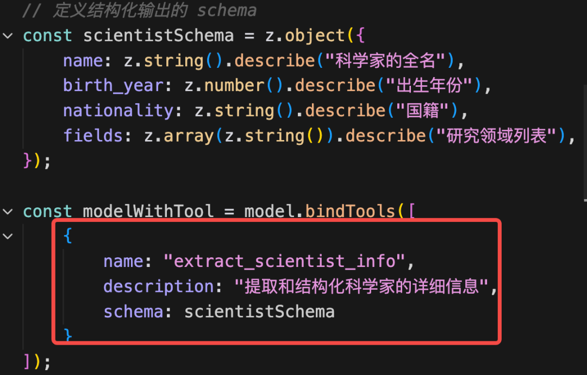

运行：

```bash
python src/tool_call_args.py
```

可以看到，通过返回的 `tool_calls` 信息，也能拿到结构化的数据。

而且，**这种方式比 Output Parser 更好**。因为模型训练的时候就保证了生成 Tool Calls 的参数一定是符合格式要求的，如果不符合，会重新生成。

那岂不是没必要用 Output Parser 了？

确实，如果只是要求结构化返回数据，用 Tool 就行了。

---

## 方式五：with_structured_output（推荐）

所以，现在获取结构化数据一般会用 `with_structured_output` 这个 API。

它会判断模型是否支持 Tool Calls，支持的话就用 Tool 的方式获取结构化数据，否则用 Output Parser 的方式，不用我们自己去处理。

创建 `src/with_structured_output.py`：

```python
"""
with_structured_output 示例：自动选择最优方式获取结构化输出
"""
import os
import json
from typing import List, Optional
from dotenv import load_dotenv
from langchain_openai import ChatOpenAI
from pydantic import BaseModel, Field

load_dotenv()

model = ChatOpenAI(
    model=os.getenv("MODEL_NAME", "qwen-plus"),
    api_key=os.getenv("OPENAI_API_KEY"),
    base_url=os.getenv("OPENAI_BASE_URL"),
    temperature=0,
)


# 定义结构化输出的 Schema
class ScientistSchema(BaseModel):
    name: str = Field(description="科学家的全名")
    birth_year: int = Field(description="出生年份")
    nationality: str = Field(description="国籍")
    fields: List[str] = Field(description="研究领域列表")


# 使用 with_structured_output 方法
# 它会自动判断模型是否支持 tool_calls，支持则用 tool，否则用 output parser
structured_model = model.with_structured_output(ScientistSchema)

# 调用模型
result = structured_model.invoke("介绍一下爱因斯坦")

print("结构化结果:")
print(json.dumps(result, indent=2, ensure_ascii=False))

print(f"\n姓名: {result['name']}")
print(f"出生年份: {result['birth_year']}")
print(f"国籍: {result['nationality']}")
print(f"研究领域: {', '.join(result['fields'])}")
```

运行：

```bash
python src/with_structured_output.py
```

所以说，现在获取结构化数据更简单了，直接用 `with_structured_output` 就行。

---

## 流式输出的结构化输出

那岂不是说 Output Parser 一般用不到了？

也不是，如果**流式打印返回数据**的场景，还是需要 Output Parser 的。而且还有一些非 JSON 格式的，比如 XML、YAML 等格式的内容，也要用 Output Parser。

### 6.1 普通流式输出

创建 `src/stream_normal.py`：

```python
"""
普通流式输出演示（无结构化）
"""
import os
from dotenv import load_dotenv
from langchain_openai import ChatOpenAI

load_dotenv()

model = ChatOpenAI(
    model=os.getenv("MODEL_NAME", "qwen-plus"),
    api_key=os.getenv("OPENAI_API_KEY"),
    base_url=os.getenv("OPENAI_BASE_URL"),
    temperature=0,
)

prompt = "详细介绍莫扎特的信息。"

print("普通流式输出演示（无结构化）\n")

try:
    stream = model.stream(prompt)
    full_content = ""
    chunk_count = 0

    print("接收流式数据:\n")
    for chunk in stream:
        chunk_count += 1
        content = chunk.content
        full_content += content
        print(content, end="", flush=True)  # 实时显示流式文本

    print(f"\n\n共接收 {chunk_count} 个数据块\n")
    print(f"完整内容长度: {len(full_content)} 字符")
except Exception as error:
    print(f"\n错误: {error}")
```

运行：

```bash
python src/stream_normal.py
```

把 `invoke` 换成 `stream` 方法就可以了，用 `for` 循环打印异步返回的 chunk。

### 6.2 with_structured_output 的流式输出

我们先用 `with_structured_output` 做一下流式的结构化输出：

创建 `src/stream_with_structured_output.py`：

```python
"""
流式结构化输出演示（with_structured_output）
"""
import os
import json
from typing import List, Optional
from dotenv import load_dotenv
from langchain_openai import ChatOpenAI
from pydantic import BaseModel, Field

load_dotenv()

model = ChatOpenAI(
    model=os.getenv("MODEL_NAME", "qwen-plus"),
    api_key=os.getenv("OPENAI_API_KEY"),
    base_url=os.getenv("OPENAI_BASE_URL"),
    temperature=0,
)


# 使用 Pydantic 定义结构化输出格式
class ComposerSchema(BaseModel):
    name: str = Field(description="姓名")
    birth_year: int = Field(description="出生年份")
    death_year: int = Field(description="去世年份")
    nationality: str = Field(description="国籍")
    occupation: str = Field(description="职业")
    famous_works: List[str] = Field(description="著名作品列表")
    biography: str = Field(description="简短传记")


structured_model = model.with_structured_output(ComposerSchema)

prompt = "详细介绍莫扎特的信息。"

print("流式结构化输出演示（with_structured_output）\n")

try:
    stream = structured_model.stream(prompt)
    chunk_count = 0
    result = None

    print("接收流式数据:\n")
    for chunk in stream:
        chunk_count += 1
        result = chunk
        print(f"[Chunk {chunk_count}]")
        print(json.dumps(chunk, indent=2, ensure_ascii=False))

    print(f"\n共接收 {chunk_count} 个数据块\n")

    if result:
        print("最终结构化结果:\n")
        print(json.dumps(result, indent=2, ensure_ascii=False))

        print("\n格式化输出:")
        print(f"姓名: {result['name']}")
        print(f"出生年份: {result['birth_year']}")
        print(f"去世年份: {result['death_year']}")
        print(f"国籍: {result['nationality']}")
        print(f"职业: {result['occupation']}")
        print(f"著名作品: {', '.join(result['famous_works'])}")
        print(f"传记: {result['biography']}")
except Exception as error:
    print(f"\n错误: {error}")
```

运行：

```bash
python src/stream_with_structured_output.py
```

可以看到，虽然我们是用的 `stream` 的流式方式打印的，但是用了 `with_structured_output` 之后，它会在 JSON 生成完通过校验后再返回（底层是 Tool Calls）。所以只有一个 chunk 包含完整 JSON。

这样明显不是真的流式啊。

### 6.3 Output Parser 的流式输出

我们换 Output Parser 试试：

创建 `src/stream_structured_partial.py`：

```python
"""
流式结构化输出演示（Output Parser 方式）
边生成边打印，最后再 parse
"""
import os
import json
from typing import List, Optional
from dotenv import load_dotenv
from langchain_openai import ChatOpenAI
from langchain_core.output_parsers import StructuredOutputParser
from pydantic import BaseModel, Field

load_dotenv()

model = ChatOpenAI(
    model=os.getenv("MODEL_NAME", "qwen-plus"),
    api_key=os.getenv("OPENAI_API_KEY"),
    base_url=os.getenv("OPENAI_BASE_URL"),
    temperature=0,
)


# 使用 Pydantic 定义结构化输出格式
class ComposerSchema(BaseModel):
    name: str = Field(description="姓名")
    birth_year: int = Field(description="出生年份")
    death_year: int = Field(description="去世年份")
    nationality: str = Field(description="国籍")
    occupation: str = Field(description="职业")
    famous_works: List[str] = Field(description="著名作品列表")
    biography: str = Field(description="简短传记")


parser = StructuredOutputParser.from_pydantic(ComposerSchema)

prompt = f"""详细介绍莫扎特的信息。

{parser.get_format_instructions()}"""

print("流式结构化输出演示（Output Parser 方式）\n")

try:
    stream = model.stream(prompt)
    full_content = ""
    chunk_count = 0

    print("接收流式数据:\n")
    for chunk in stream:
        chunk_count += 1
        content = chunk.content
        full_content += content
        print(content, end="", flush=True)  # 实时显示流式文本

    print(f"\n\n共接收 {chunk_count} 个数据块\n")

    # 解析完整内容为结构化数据
    result = parser.parse(full_content)
    print("解析后的结构化结果:\n")
    print(json.dumps(result, indent=2, ensure_ascii=False))

    print("\n格式化输出:")
    print(f"姓名: {result['name']}")
    print(f"出生年份: {result['birth_year']}")
    print(f"去世年份: {result['death_year']}")
    print(f"国籍: {result['nationality']}")
    print(f"职业: {result['occupation']}")
    print(f"著名作品: {', '.join(result['famous_works'])}")
    print(f"传记: {result['biography']}")
except Exception as error:
    print(f"\n错误: {error}")
```

运行：

```bash
python src/stream_structured_partial.py
```

我们用 `StructuredOutputParser` 解析结果，过程做了流式打印。

可以看到，现在是边生成边打印，最后再 parse。

所以**流式的情况下，用 Output Parser 还是更适合的**。

### 6.4 流式 Tool Calls + JsonOutputToolsParser

那如果我们就是想用 Tool Calls 来做结构化输出，但还是想要流式的打印，怎么办呢？

其实流式输出的情况下，如果你用了 Tool Call，是这样返回的：

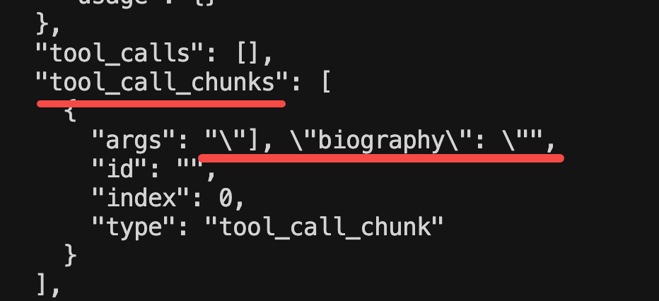

`tool_call_chunks` 里保存了 Tool 参数的部分内容，我们可以用这个来实现流式打印效果。

创建 `src/stream_tool_calls_raw.py`：

```python
"""
流式 Tool Calls 演示 - 直接打印原始 tool_calls_chunk
"""
import os
import json
from typing import List, Optional
from dotenv import load_dotenv
from langchain_openai import ChatOpenAI
from pydantic import BaseModel, Field

load_dotenv()

model = ChatOpenAI(
    model=os.getenv("MODEL_NAME", "qwen-plus"),
    api_key=os.getenv("OPENAI_API_KEY"),
    base_url=os.getenv("OPENAI_BASE_URL"),
    temperature=0,
)


# 定义结构化输出的 Schema
class ScientistSchema(BaseModel):
    name: str = Field(description="科学家的全名")
    birth_year: int = Field(description="出生年份")
    death_year: Optional[int] = Field(None, description="去世年份，如果还在世则不填")
    nationality: str = Field(description="国籍")
    fields: List[str] = Field(description="研究领域列表")
    achievements: List[str] = Field(description="主要成就")
    biography: str = Field(description="简短传记")


# 绑定工具到模型
model_with_tool = model.bind_tools([
    {
        "name": "extract_scientist_info",
        "description": "提取和结构化科学家的详细信息",
        "schema": ScientistSchema,
    }
])

print("流式 Tool Calls 演示 - 直接打印原始 tool_calls_chunk\n")

try:
    # 开启流式输出
    stream = model_with_tool.stream("详细介绍牛顿的生平和成就")

    print("实时输出流式 tool_calls_chunk:\n")
    chunk_index = 0
    for chunk in stream:
        chunk_index += 1
        # 直接打印每个 chunk 的 tool_calls 信息
        if chunk.tool_call_chunks and len(chunk.tool_call_chunks) > 0:
            args = chunk.tool_call_chunks[0].args
            if args:
                print(args, end="", flush=True)

    print("\n\n流式输出完成")
except Exception as error:
    print(f"\n错误: {error}")
    import traceback
    traceback.print_exc()
```

运行：

```bash
python src/stream_tool_calls_raw.py
```

打印 `tool_call_chunks` 片段，就可以实现流式打印效果。

但是看下 chunk 内容：

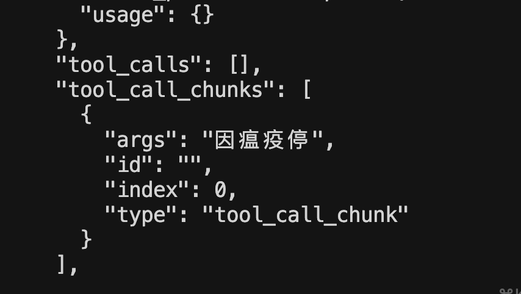

这时候是不能调用 Tool 的，因为参数还不完整，没有 `tool_calls` 信息。

如果我想参数不完整的时候，也能拿到 Tool Call 参数的 JSON 呢？

这种就可以用 `JsonOutputToolsParser` 了。

它的作用就是解析 `tool_call_chunks` 中的内容，拼接成符合 JSON 格式规范的对象，就算 chunk 还没传输完的时候，也能拿到 JSON 对象。

创建 `src/stream_tool_calls_parser.py`：

```python
"""
流式 Tool Calls + JsonOutputToolsParser 演示
即使参数不完整，也能拿到部分 JSON 对象
"""
import os
import json
from typing import List, Optional
from dotenv import load_dotenv
from langchain_openai import ChatOpenAI
from langchain_core.output_parsers.openai_tools import JsonOutputToolsParser
from pydantic import BaseModel, Field

load_dotenv()

model = ChatOpenAI(
    model=os.getenv("MODEL_NAME", "qwen-plus"),
    api_key=os.getenv("OPENAI_API_KEY"),
    base_url=os.getenv("OPENAI_BASE_URL"),
    temperature=0,
)


# 定义结构化输出的 Schema
class ScientistSchema(BaseModel):
    name: str = Field(description="科学家的全名")
    birth_year: int = Field(description="出生年份")
    death_year: Optional[int] = Field(None, description="去世年份，如果还在世则不填")
    nationality: str = Field(description="国籍")
    fields: List[str] = Field(description="研究领域列表")
    achievements: List[str] = Field(description="主要成就")
    biography: str = Field(description="简短传记")


# 绑定工具到模型
model_with_tool = model.bind_tools([
    {
        "name": "extract_scientist_info",
        "description": "提取和结构化科学家的详细信息",
        "schema": ScientistSchema,
    }
])

# 1. 绑定工具并挂载解析器
parser = JsonOutputToolsParser()
chain = model_with_tool.pipe(parser)

try:
    # 2. 开启流
    stream = chain.stream("详细介绍牛顿的生平和成就")

    print("实时输出流式内容:\n")
    for chunk in stream:
        if len(chunk) > 0:
            tool_call = chunk[0]
            # 获取当前工具调用的完整参数内容
            print(json.dumps(tool_call["args"], indent=2, ensure_ascii=False))
            print("---")

    print("\n流式输出完成")
except Exception as error:
    print(f"\n错误: {error}")
    import traceback
    traceback.print_exc()
```

运行：

```bash
python src/stream_tool_calls_parser.py
```

`JsonOutputToolsParser` 会尝试解析 `tool_call_chunks` 生成完整的 `tool_calls` 信息。

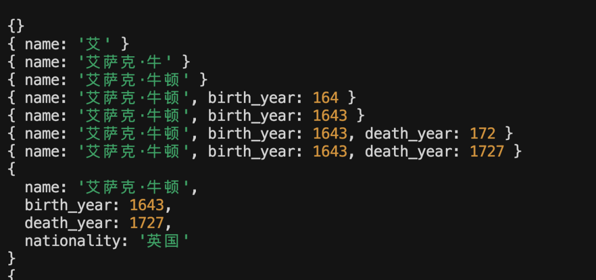

可以看到，就算是流式返回的 `tool_call_chunks` 还不完整，也会拼成正确格式的 `tool_calls`。

这样你可以实时调用工具，传入部分参数了。

---

## 方式六：XMLOutputParser

此外，我们前面说 `with_structured_output` 不适合的场景有两个：
- 流式打印内容，这种还是需要 Output Parser
- XML、YAML 等非 JSON 格式，也需要 Output Parser

我们来试一下 XML 的 Output Parser。

创建 `src/xml_output_parser.py`：

```python
"""
XMLOutputParser 示例：输出 XML 格式
"""
import os
from dotenv import load_dotenv
from langchain_openai import ChatOpenAI
from langchain_core.output_parsers import XMLOutputParser

load_dotenv()

model = ChatOpenAI(
    model=os.getenv("MODEL_NAME", "qwen-plus"),
    api_key=os.getenv("OPENAI_API_KEY"),
    base_url=os.getenv("OPENAI_BASE_URL"),
    temperature=0,
)

# 创建 XMLOutputParser
parser = XMLOutputParser()

# 构建 Prompt
question = f"""请介绍一下爱因斯坦的信息。
请以 XML 格式返回，包含以下标签：
<name>姓名</name>
<birth_year>出生年份</birth_year>
<nationality>国籍</nationality>
<famous_theory>著名理论</famous_theory>

{parser.get_format_instructions()}"""

print("生成的 Prompt:\n")
print(question)

try:
    print("\n正在调用大模型（使用 XMLOutputParser）...\n")
    response = model.invoke(question)
    print("模型原始响应:\n")
    print(response.content)

    # 解析 XML
    result = parser.parse(response.content)
    print("\nXMLOutputParser 解析的结果:\n")
    print(result)
except Exception as error:
    print(f"\n错误: {error}")
```

运行：

```bash
python src/xml_output_parser.py
```

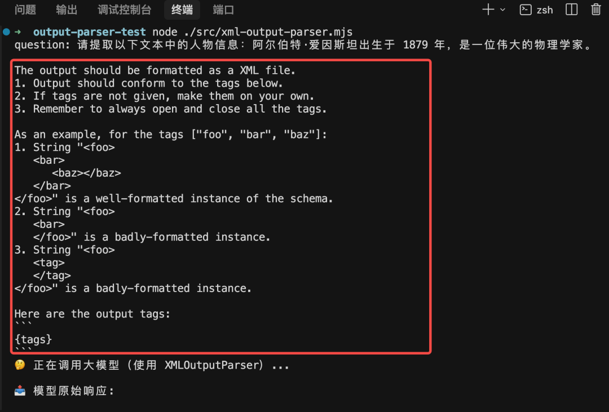

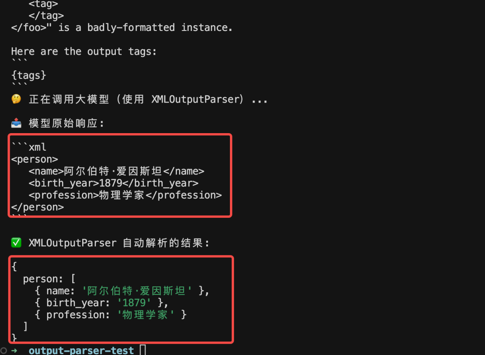

可以看到提示词里加入了一些格式信息，返回的也是 XML 格式，并且正确 parse 了出来。

这种也用不了 `with_structured_output`（也就是 Tool Call）来做结构化，还是得用 Output Parser。

---

## 各种方式对比总结

| 方式 | 原理 | 优点 | 缺点 | 适用场景 |
|------|------|------|------|----------|
| 直接 Prompt 要求 JSON | 手动解析 | 简单 | 经常解析失败 | 不推荐 |
| JsonOutputParser | Prompt + 自动解析 | 处理 Markdown 包裹 | 不能指定字段结构 | 简单 JSON 解析 |
| StructuredOutputParser | Prompt + 字段结构 + 自动解析 | 可指定字段和类型 | 提示词较长 | 需要指定字段结构 |
| Tool Calls | 模型原生支持 | 格式保证最可靠 | 非流式时才能拿到完整结果 | 非流式结构化输出 |
| **with_structured_output** | 自动选择 Tool 或 Parser | **最简单，自动适配** | 流式时不是真流式 | **推荐（非流式）** |
| Output Parser + 流式 | 边生成边打印，最后解析 | 真流式 | 需要最后解析 | **流式结构化输出** |
| JsonOutputToolsParser | 解析流式 tool_call_chunks | 流式 + 部分 JSON | 较复杂 | 流式 Tool Calls |
| XMLOutputParser | Prompt + XML 解析 | 支持 XML 格式 | - | 需要 XML 输出 |

## 最佳实践

1. **非流式结构化输出**：直接用 `model.with_structured_output(schema)`，最简单
2. **流式结构化输出**：用 `StructuredOutputParser` + `model.stream()`，边生成边打印，最后 parse
3. **流式 Tool Calls**：用 `JsonOutputToolsParser` 解析 `tool_call_chunks`
4. **非 JSON 格式**（XML、YAML等）：用对应的 Output Parser

## 学习要点

1. **Output Parser 的原理**：在 Prompt 里加入格式描述，根据这个格式来解析响应
2. **JsonOutputParser**：简单的 JSON 解析，能处理 Markdown 代码块包裹的情况
3. **StructuredOutputParser**：可以指定字段结构，支持 `from_names_and_descriptions` 和 `from_pydantic`
4. **Tool Calls 方式**：模型训练时保证参数格式正确，比 Output Parser 更可靠
5. **with_structured_output**：自动选择 Tool 或 Parser，是最简单的方式
6. **流式输出**：Output Parser 更适合流式场景，因为 with_structured_output 底层用 Tool Calls，会等完整 JSON 生成后才返回
7. **JsonOutputToolsParser**：可以解析流式的 `tool_call_chunks`，即使参数不完整也能拿到部分 JSON
8. **非 JSON 格式**：XML、YAML 等格式需要用对应的 Output Parser

## 扩展方向

- 学习 Pydantic 的高级用法（校验器、嵌套模型、自定义类型）
- 探索 Output Fixing Parser（解析失败时自动修复）
- 学习 Retry Output Parser（解析失败时自动重试）
- 探索 YAML、CSV 等其他格式的 Output Parser
- 结合 LCEL 构建结构化输出的 Chain

---

## 配套代码库

**代码库地址**：https://github.com/iiixiyan/agent-learning-code/tree/main/01-agent-basics/14-structured-output

包含本文的完整可运行代码示例（8种结构化输出方式的 Python 实现 + 对比测试）。

---

**上一篇**：[Memory 管理的三大策略](./13_Memory管理的三大策略.md) | **下一篇**：[LCEL 组装 Chain](./15_LCEL组装chain.md)
