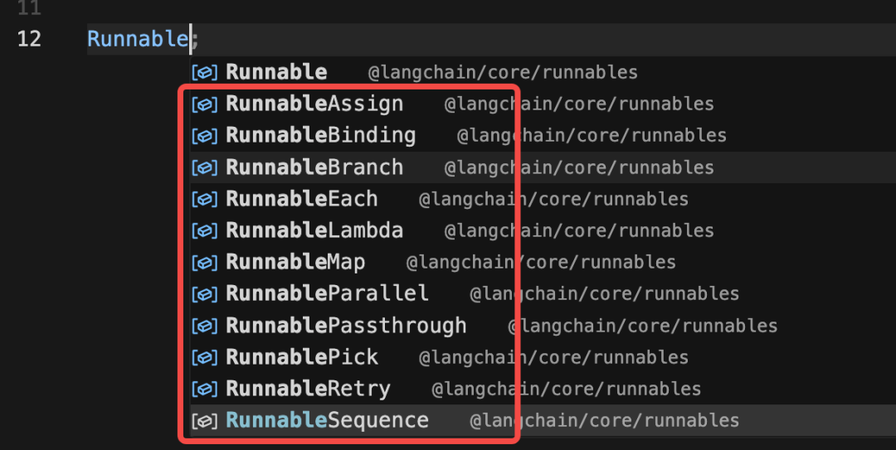
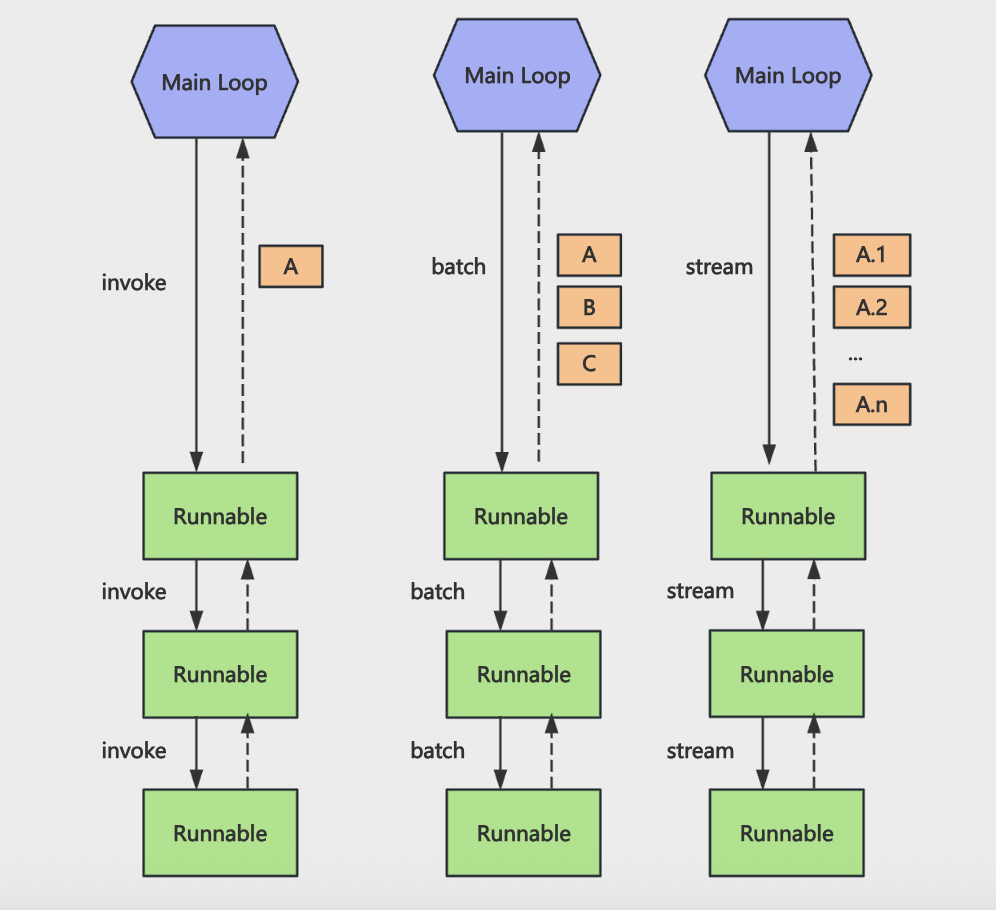
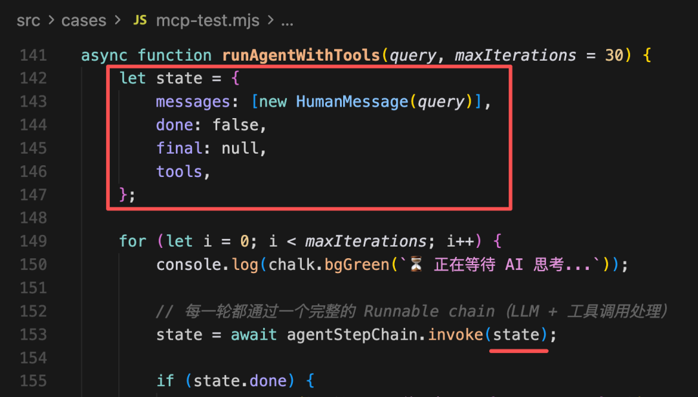
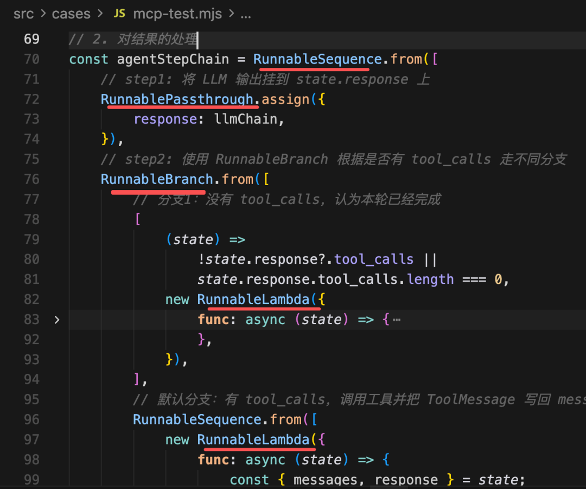
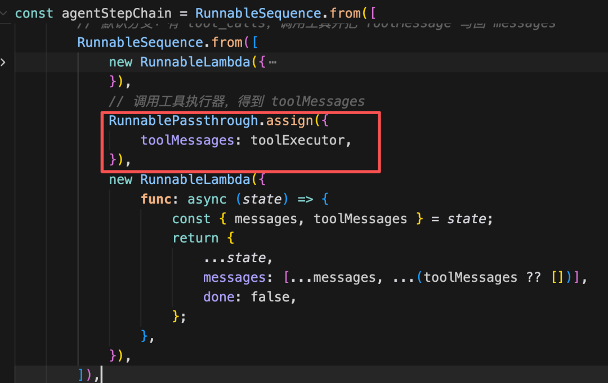
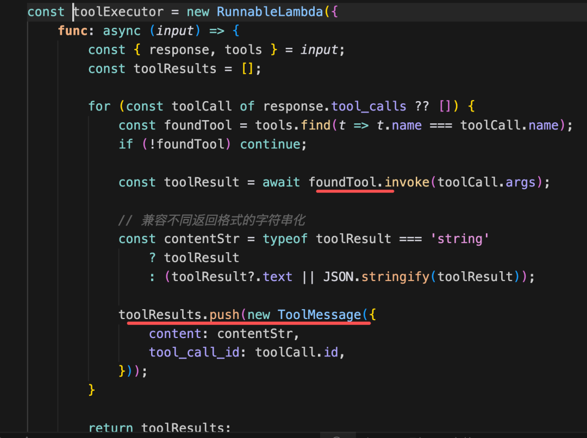
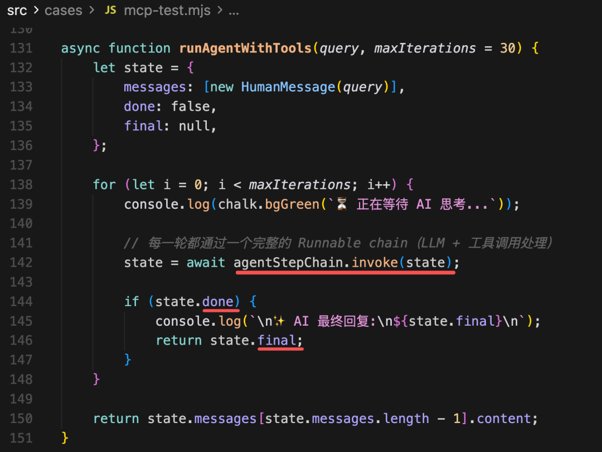
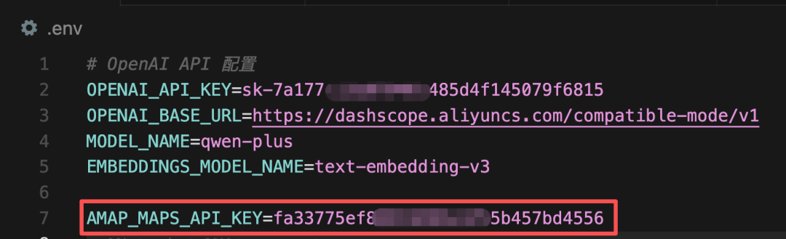
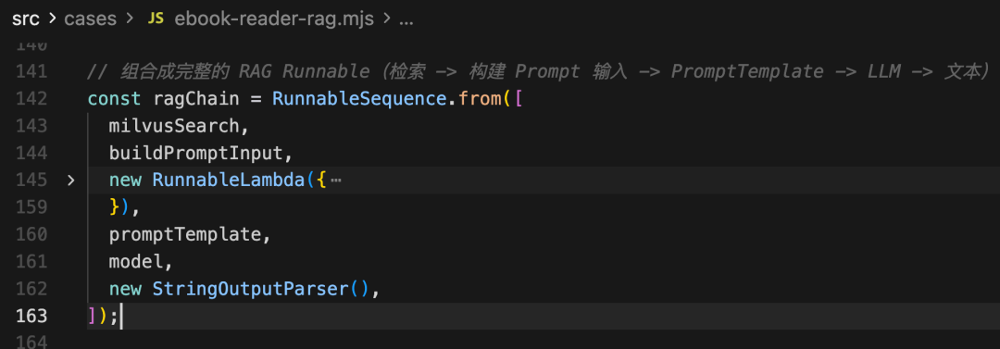

# 实战练习 LCEL 组装 Chain

> **Python 版** | 基于 LangChain Python + LCEL 技术栈
> 原课程基于 Node.js(Nest.js) + LangChain JS，本文转换为 Python 版本

---

## 本文目标

我们学了 LangChain 的各种功能：Tool、MCP、RAG、Memory、Prompt Template、Output Parser 等，并且学了 LCEL 的写法，把流程组装成 Chain 来调用。

LCEL 就是基于 Runnable 的 API 来声明 Chain，然后统一执行。



声明的 Chain 可以用 `invoke`、`batch`、`stream` 等 API 来同步调用、批量调用、流式返回，因为所有 Runnable 都实现了这些方法。



但是大家可能对用了 Runnable 之后和之前的写法的区别没有具体的认识。

这节我们就把之前做过的一些小实战用 LCEL 的方式再写一遍：

1. **MCP + Chrome Devtools**：高德地图 MCP + 浏览器自动化
2. **RAG + Milvus**：电子书语义助手

功能一样，大家感受下写法上的区别，体会下 LCEL 的好处。

---

## 实战一：MCP + Chrome Devtools（LCEL 版）

### 分析流程

首先我们分析下之前 Tool 项目里 MCP 的那个案例用 LCEL 的方式应该怎么写：

经过分析：
- `bind_tools` 之后的 model 是一个 Runnable
- Prompt Template 是一个 Runnable
- 调用大模型返回的结果处理，有个 if-else 逻辑，可以封装成 `RunnableBranch`
- 具体处理 Tool Call 的逻辑可以封装成 `RunnableLambda`

把这个 Chain 组装好，统一调用就好了。

### 安装依赖

```bash
pip install langchain langchain-openai langchain-core python-dotenv
```

### 代码实现

创建 `src/mcp_lcel.py`：

```python
"""
MCP + Chrome Devtools LCEL 版
用 Runnable 的方式组装 Agent 流程
"""
import os
import json
from dotenv import load_dotenv
from langchain_openai import ChatOpenAI
from langchain_core.messages import HumanMessage, ToolMessage, SystemMessage
from langchain_core.prompts import ChatPromptTemplate, MessagesPlaceholder
from langchain_core.runnables import (
    RunnableSequence,
    RunnableLambda,
    RunnableBranch,
    RunnablePassthrough,
)
from langchain_core.tools import tool

load_dotenv()


# ========== 1. 定义模拟工具（实际项目中用 MCP 工具） ==========

@tool
def search_hotel(location: str, limit: int = 3) -> str:
    """
    搜索指定地点附近的酒店

    Args:
        location: 地点名称
        limit: 返回酒店数量

    Returns:
        str: 酒店列表 JSON
    """
    hotels = [
        {"name": f"{location}酒店A", "address": f"{location}路1号", "image": "https://example.com/hotel-a.jpg"},
        {"name": f"{location}酒店B", "address": f"{location}路2号", "image": "https://example.com/hotel-b.jpg"},
        {"name": f"{location}酒店C", "address": f"{location}路3号", "image": "https://example.com/hotel-c.jpg"},
    ]
    return json.dumps(hotels[:limit], ensure_ascii=False)


@tool
def open_browser(url: str, title: str = "") -> str:
    """
    在浏览器中打开指定 URL

    Args:
        url: 要打开的网址
        title: 页面标题

    Returns:
        str: 操作结果
    """
    return f"已在浏览器中打开: {url}，标题设置为: {title}"


# 工具列表
tools = [search_hotel, open_browser]


# ========== 2. 初始化模型和 Prompt ==========

# 初始化大语言模型
model = ChatOpenAI(
    model=os.getenv("MODEL_NAME", "qwen-plus"),
    api_key=os.getenv("OPENAI_API_KEY"),
    base_url=os.getenv("OPENAI_BASE_URL"),
    temperature=0,
)

# 绑定工具到模型
model_with_tools = model.bind_tools(tools)

# 创建 Prompt Template
prompt = ChatPromptTemplate.from_messages([
    SystemMessage(content="你是一个可以调用工具的智能助手。"),
    MessagesPlaceholder(variable_name="messages"),
])

# LLM Chain：Prompt → 绑定工具的模型
llm_chain = prompt.pipe(model_with_tools)


# ========== 3. 定义工具执行器（RunnableLambda） ==========

def execute_tools(state):
    """
    执行工具调用，返回 ToolMessage 列表

    Args:
        state: 包含 response 和 tools 的状态

    Returns:
        list: ToolMessage 列表
    """
    response = state["response"]
    tool_results = []

    for tool_call in response.tool_calls or []:
        # 查找对应的工具
        found_tool = next((t for t in tools if t.name == tool_call["name"]), None)
        if not found_tool:
            continue

        # 执行工具
        tool_result = found_tool.invoke(tool_call["args"])

        # 封装成 ToolMessage
        tool_results.append(ToolMessage(
            content=str(tool_result),
            tool_call_id=tool_call["id"],
        ))

    return tool_results


# 工具执行器 Runnable
tool_executor = RunnableLambda(execute_tools)


# ========== 4. 组装 Agent Step Chain ==========

# 定义 Agent Step Chain
agent_step_chain = RunnableSequence.from([
    # Step 1: 将 LLM 输出挂到 state.response 上
    RunnablePassthrough.assign({
        "response": llm_chain,
    }),

    # Step 2: 使用 RunnableBranch 根据是否有 tool_calls 走不同分支
    RunnableBranch.from([
        # 分支1：没有 tool_calls，认为本轮已经完成
        (
            lambda state: not state["response"].tool_calls or len(state["response"].tool_calls) == 0,
            RunnableLambda(lambda state: {
                **state,
                "messages": [*state["messages"], state["response"]],
                "done": True,
                "final": state["response"].content,
            }),
        ),

        # 默认分支：有 tool_calls，调用工具并把 ToolMessage 写回 messages
        RunnableSequence.from([
            # 把 response 加入 messages
            RunnableLambda(lambda state: {
                **state,
                "messages": [*state["messages"], state["response"]],
            }),

            # 调用工具执行器，得到 toolMessages
            RunnablePassthrough.assign({
                "toolMessages": tool_executor,
            }),

            # 把 toolMessages 加入 messages
            RunnableLambda(lambda state: {
                **state,
                "messages": [*state["messages"], *(state.get("toolMessages") or [])],
                "done": False,
            }),
        ]),
    ]),
])


# ========== 5. 运行 Agent ==========

def run_agent_with_tools(query, max_iterations=30):
    """
    运行带工具的 Agent

    Args:
        query: 用户查询
        max_iterations: 最大迭代次数

    Returns:
        str: 最终回答
    """
    # 初始化状态
    state = {
        "messages": [HumanMessage(content=query)],
        "done": False,
        "final": None,
    }

    # 循环执行 Agent Step
    for i in range(max_iterations):
        print(f"\n⏳ 第 {i + 1} 轮，正在等待 AI 思考...")

        # 每一轮都通过一个完整的 Runnable Chain（LLM + 工具调用处理）
        state = agent_step_chain.invoke(state)

        # 如果完成，返回最终回答
        if state["done"]:
            print(f"\n✨ AI 最终回复:\n{state['final']}\n")
            return state["final"]

    # 超过最大迭代次数，返回最后一条消息
    return state["messages"][-1].content


# ========== 6. 使用示例 ==========

if __name__ == "__main__":
    result = run_agent_with_tools(
        "北京南站附近的酒店，最近的 3 个酒店，拿到酒店信息，打开浏览器展示每个酒店的图片"
    )
    print(f"最终结果: {result}")
```

### State 状态说明

我们加了一个 `state` 在多个 Runnable 之间传递，记录了：

| 字段 | 说明 |
|------|------|
| `messages` | 消息列表，包含用户、AI、工具消息 |
| `done` | 是否完成（没有 tool_calls 时为 True） |
| `final` | 最终的回复内容 |
| `response` | 当前轮次 LLM 的输出 |
| `toolMessages` | 工具执行结果 |



### LCEL 组装流程

然后用 Runnable 的方式写下逻辑：



1. 首先大模型调用结果用 `RunnablePassthrough.assign` 加到 state 的 `response` 属性上
2. 这里不用手动 invoke，在 chain invoke 的时候，会自动执行所有的 Runnable
3. 然后根据有没有 `tool_calls` 来做 if-else，也就是 `RunnableBranch`
4. if-else 分别用 `RunnableLambda` 来写处理逻辑



这里涉及到另一个 Chain 的调用，也就是执行工具的 Chain，用 `RunnablePassthrough.assign` 把执行结果加到 `toolMessage` 属性上。

另一个 Chain 就是调用 Tool，结果封装成 `ToolMessage`。



这样，整个 Chain 就串联好了。

之后统一 invoke 这个组装好的 Chain：



如果返回的 state 是 `done` 就说明执行完了，没有 `tool_call` 了，就返回 `final`，否则继续循环调用 Chain。

### 配置文件

创建 `.env` 文件：

```env
# OpenAI API 配置
OPENAI_API_KEY=sk-xxx
OPENAI_BASE_URL=https://dashscope.aliyuncs.com/compatible-mode/v1
MODEL_NAME=qwen-plus
```



运行：

```bash
python src/mcp_lcel.py
```

逻辑是一样的，只是现在改成了 LCEL 的声明式写法。

---

## 实战二：RAG + Milvus 电子书语义助手（LCEL 版）

### 分析流程

然后再改造下之前那个 RAG + Milvus 的电子书语义助手。

整个流程比较简单：
1. 从 Milvus 检索相关内容
2. 构建带有文档片段的 Prompt
3. 调用大模型
4. 打印结果

我们改成 Runnable 版本。

### 安装依赖

```bash
pip install pymilvus langchain langchain-openai python-dotenv
```

### 代码实现

创建 `src/rag_milvus_lcel.py`：

```python
"""
RAG + Milvus 电子书语义助手 LCEL 版
用 Runnable 的方式组装 RAG 流程
"""
import os
import json
from dotenv import load_dotenv
from langchain_openai import ChatOpenAI, OpenAIEmbeddings
from langchain_core.runnables import RunnableSequence, RunnableLambda
from langchain_core.prompts import PromptTemplate
from langchain_core.output_parsers import StrOutputParser
from pymilvus import connections, Collection, utility

load_dotenv()

# ========== 配置 ==========

COLLECTION_NAME = "ebook_collection"
VECTOR_DIM = 1024


# ========== 1. 初始化模型 ==========

# 初始化 Chat 模型
model = ChatOpenAI(
    temperature=0.7,
    model=os.getenv("MODEL_NAME", "qwen-plus"),
    api_key=os.getenv("OPENAI_API_KEY"),
    base_url=os.getenv("OPENAI_BASE_URL"),
)

# 初始化 Embeddings 模型
embeddings = OpenAIEmbeddings(
    api_key=os.getenv("OPENAI_API_KEY"),
    model=os.getenv("EMBEDDINGS_MODEL_NAME", "text-embedding-v3"),
    base_url=os.getenv("OPENAI_BASE_URL"),
    dimensions=VECTOR_DIM,
)


# ========== 2. 连接 Milvus ==========

def connect_milvus():
    """连接 Milvus 并加载集合"""
    print("连接到 Milvus...")
    connections.connect(
        host=os.getenv("MILVUS_HOST", "localhost"),
        port=os.getenv("MILVUS_PORT", "19530"),
    )
    print("✓ 已连接\n")

    collection = Collection(COLLECTION_NAME)
    collection.load()
    print("✓ 集合已加载\n")
    return collection


# ========== 3. 从 Milvus 检索内容的 Runnable ==========

def search_milvus(input_data):
    """
    从 Milvus 中检索相关内容

    Args:
        input_data: 包含 question 和 k 的字典

    Returns:
        dict: 包含 question 和 retrievedContent 的字典
    """
    question = input_data["question"]
    k = input_data.get("k", 5)

    try:
        # 1. 生成问题向量
        query_vector = embeddings.embed_query(question)

        # 2. 调用 Milvus 搜索
        collection = Collection(COLLECTION_NAME)
        search_params = {"metric_type": "COSINE", "params": {"nprobe": 10}}
        results = collection.search(
            data=[query_vector],
            anns_field="vector",
            param=search_params,
            limit=k,
            output_fields=["id", "book_id", "chapter_num", "index", "content"],
        )

        # 3. 处理检索结果
        retrieved_content = []
        for i, hit in enumerate(results[0]):
            retrieved_content.append({
                "id": hit.id,
                "book_id": hit.entity.get("book_id"),
                "chapter_num": hit.entity.get("chapter_num"),
                "index": hit.entity.get("index") or i,
                "content": hit.entity.get("content"),
                "score": hit.score,
            })

        return {"question": question, "retrievedContent": retrieved_content}

    except Exception as error:
        print(f"检索内容时出错: {error}")
        return {"question": question, "retrievedContent": []}


# Milvus 检索 Runnable
milvus_search = RunnableLambda(search_milvus)


# ========== 4. PromptTemplate ==========

# PromptTemplate：负责把 context / question 拼成最终 prompt
prompt_template = PromptTemplate.from_template("""你是一个专业的小说助手。基于小说内容回答问题，用准确、详细的语言。

请根据以下小说片段内容回答问题：

{context}

用户问题: {question}

回答要求：
1. 如果片段中有相关信息，请结合小说内容给出详细、准确的回答
2. 可以综合多个片段的内容，提供完整的答案
3. 如果片段中没有相关信息，请如实告知用户
4. 回答要准确，符合小说的情节和人物设定
5. 可以引用原文内容来支持你的回答

AI 助手的回答:""")


# ========== 5. 构建 context + 日志打印的 Runnable ==========

def build_prompt_input(input_data):
    """
    构建 Prompt 输入，包含 context 和 question

    Args:
        input_data: 包含 question 和 retrievedContent 的字典

    Returns:
        dict: 包含 hasContext、question、context、retrievedContent 的字典
    """
    question = input_data["question"]
    retrieved_content = input_data["retrievedContent"]

    if not retrieved_content:
        return {
            "hasContext": False,
            "question": question,
            "context": "",
            "retrievedContent": retrieved_content,
        }

    # 打印检索结果
    print("=" * 80)
    print(f"问题: {question}")
    print("=" * 80)
    print("\n【检索相关内容】")

    for i, item in enumerate(retrieved_content):
        print(f"\n[片段 {i + 1}] 相似度: {item.get('score', 'N/A')}")
        print(f"书籍: {item.get('book_id')}")
        print(f"章节: 第 {item.get('chapter_num')} 章")
        print(f"片段索引: {item.get('index')}")
        content = item.get("content", "")
        print(f"内容: {content[:200]}{'...' if len(content) > 200 else ''}")

    # 构建 context
    context = "\n\n━━━━━\n\n".join([
        f"[片段 {i + 1}]\n章节: 第 {item.get('chapter_num')} 章\n内容: {item.get('content')}"
        for i, item in enumerate(retrieved_content)
    ])

    return {
        "hasContext": True,
        "question": question,
        "context": context,
        "retrievedContent": retrieved_content,
    }


# 构建 Prompt 输入的 Runnable
build_prompt_input_runnable = RunnableLambda(build_prompt_input)


# ========== 6. 组合成完整的 RAG Runnable ==========

# 检索 → 构建 Prompt 输入 → 判断是否有上下文 → PromptTemplate → LLM → 文本解析
rag_chain = RunnableSequence.from([
    milvus_search,
    build_prompt_input_runnable,
    RunnableLambda(lambda input_data: {
        "question": input_data["question"],
        "context": input_data["context"],
        "noContext": not input_data["hasContext"],
    } if input_data["hasContext"] else {
        "question": input_data["question"],
        "context": "",
        "answer": "抱歉，我没有找到相关的小说内容。请尝试换一个问题。",
        "noContext": True,
    }),
    prompt_template,
    model,
    StrOutputParser(),
])


# ========== 7. 主函数 ==========

def main():
    """主函数：运行 RAG 查询"""
    try:
        # 连接 Milvus
        collection = connect_milvus()

        # 输入查询
        input_data = {
            "question": "鸠摩智会什么武功？",
            "k": 5,
        }

        print("=" * 80)
        print(f"问题: {input_data['question']}")
        print("=" * 80)
        print("\n【AI 流式回答】\n")

        # 流式输出
        for chunk in rag_chain.stream(input_data):
            print(chunk, end="", flush=True)

        print("\n")

    except Exception as error:
        print(f"错误: {error}")


if __name__ == "__main__":
    main()
```

### RAG Chain 数据流

整个 Chain 是这样的：



```
用户问题
    ↓
milvus_search（从 Milvus 检索相关内容）
    ↓
build_prompt_input（构建带有文档片段的 context）
    ↓
判断是否有上下文
    ├── 有上下文 → PromptTemplate（填充 Prompt）
    └── 无上下文 → 返回兜底回答
    ↓
model（调用大模型生成回答）
    ↓
StrOutputParser（解析成字符串）
    ↓
最终回答
```

这里用 `StrOutputParser` 把大模型返回结果变为字符串，然后用 `stream` 流式打印。

运行：

```bash
python src/rag_milvus_lcel.py
```

---

## LCEL 高级功能

通过这两个案例，我们就知道怎么用 Runnable 的方式来写逻辑了：

1. **分析整个流程**，拆成原子步骤
2. **根据步骤之间的关系选择组件**（线性、分支、并行、自定义逻辑等）
3. **统一调用**（invoke、stream、batch）

而且用 Chain 的方式来写有很多好处，可以在每个节点上加一些逻辑，比如重试、传入配置、回调等。

### 1. withRetry：重试逻辑

创建 `src/runnables/with_retry.py`：

```python
"""
withRetry：为 Runnable 节点加上重试逻辑
"""
import random
from langchain_core.runnables import RunnableLambda

# 一个会随机失败的 Runnable，用来演示 withRetry
attempt = 0

def unstable_function(input_data):
    """模拟不稳定的函数，70% 概率失败"""
    global attempt
    attempt += 1
    print(f"第 {attempt} 次尝试，输入: {input_data}")

    # 模拟 70% 概率失败的情况
    if random.random() < 0.7:
        print("本次尝试失败，抛出错误。")
        raise Exception("模拟的随机错误")

    print("本次尝试成功。")
    return f"成功处理: {input_data}"


# 创建不稳定的 Runnable
unstable_runnable = RunnableLambda(unstable_function)

# 使用 withRetry 为 runnable 加上重试逻辑
# 总共最多 5 次尝试
runnable_with_retry = unstable_runnable.with_retry(stop_after_attempt=5)

try:
    result = runnable_with_retry.invoke("演示 withRetry")
    print(f"✅ 最终结果: {result}")
except Exception as err:
    print(f"❌ 重试多次后仍然失败: {err}")
```

运行：

```bash
python src/runnables/with_retry.py
```

我们简单的调用下 `with_retry` 就可以给这个 Runnable 节点加上重试逻辑，不用自己实现。

### 2. withFallbacks：备选方案

创建 `src/runnables/with_fallbacks.py`：

```python
"""
withFallbacks：为 Runnable 节点加上备选方案
"""
from langchain_core.runnables import RunnableLambda

# 模拟三个"翻译服务"，优先级从高到低

def premium_translator(text):
    """高级翻译服务（模拟超时）"""
    print("[Premium] 尝试翻译...")
    raise Exception("Premium 服务超时")


def standard_translator(text):
    """标准翻译服务（模拟限流）"""
    print("[Standard] 尝试翻译...")
    raise Exception("Standard 服务限流")


def local_translator(text):
    """本地词典翻译（兜底方案）"""
    print("[Local] 使用本地词典翻译...")
    dictionary = {"hello": "你好", "world": "世界", "goodbye": "再见"}
    words = text.lower().split(" ")
    return " ".join([dictionary.get(w, w) for w in words])


# 创建 Runnable
premium = RunnableLambda(premium_translator)
standard = RunnableLambda(standard_translator)
local = RunnableLambda(local_translator)

# withFallbacks：依次尝试 premium → standard → local
translator = premium.with_fallbacks(fallbacks=[standard, local])

# 调用
result = translator.invoke("hello world")
print(f"翻译结果: {result}")
```

运行：

```bash
python src/runnables/with_fallbacks.py
```

通过 `with_fallbacks` 传入几种备选方案。当前面的报错时，会尝试后面的方案。

### 3. withConfig：配置传递

创建 `src/runnables/with_config.py`：

```python
"""
withConfig：为 Chain 传入配置，每个节点可以通过第二个参数拿到
"""
from langchain_core.runnables import RunnableLambda, RunnableSequence

# 模拟一个简单的"用户数据库"
mock_users = {
    "user-123": {
        "id": "user-123",
        "name": "张三",
        "email": "zhangsan@example.com",
    },
}


# 节点1：根据 config.configurable.user_id 查用户
def fetch_user_from_config(input_data, config):
    """从配置中获取用户信息"""
    user_id = config.get("configurable", {}).get("user_id")
    print(f"【节点1】收到了通知内容: {input_data}")
    print(f"【节点1】从 config 里拿到 user_id: {user_id}")

    user = mock_users.get(user_id) if user_id else None
    if not user:
        raise Exception("未找到用户，无法发送通知")

    return {"user": user, "notification": input_data}


# 节点2：根据 config.configurable.role 做权限判断
def check_permission_by_role(state, config):
    """根据配置中的角色做权限判断"""
    role = config.get("configurable", {}).get("role", "普通用户")
    print(f"【节点2】当前角色: {role}")

    can_send = role in ["管理员", "运营", "系统"]
    if not can_send:
        raise Exception(f"角色「{role}」无权限发送系统通知")

    return {**state, "role": role}


# 节点3：根据 locale 生成最终通知文案
def format_notification_by_locale(state, config):
    """根据配置中的语言生成本地化文案"""
    locale = config.get("configurable", {}).get("locale", "zh-CN")
    print(f"【节点3】locale: {locale}")

    if locale == "en-US":
        content = f"Dear {state['user']['name']},\n\n{state['notification']}\n\n(from role: {state['role']})"
    else:
        content = f"亲爱的 {state['user']['name']}，\n\n{state['notification']}\n\n（发送人角色：{state['role']}）"

    return {**state, "locale": locale, "finalContent": content}


# 把三个节点串起来
chain = RunnableSequence.from([
    RunnableLambda(fetch_user_from_config),
    RunnableLambda(check_permission_by_role),
    RunnableLambda(format_notification_by_locale),
])

# 使用 withConfig 为整个 chain 绑定统一的配置
chain_with_config = chain.with_config({
    "tags": ["demo", "withConfig", "notification"],
    "metadata": {"demoName": "RunnableWithConfig"},
    "configurable": {
        "user_id": "user-123",
        "role": "管理员",
        "locale": "zh-CN",
    },
})

# 再创建一个不同配置的 chain，使用英文 locale
chain_with_config_2 = chain.with_config({
    "tags": ["demo", "withConfig", "notification-en"],
    "metadata": {"demoName": "RunnableWithConfig2"},
    "configurable": {
        "user_id": "user-123",
        "role": "运营",
        "locale": "en-US",
    },
})

# 输入为"要发送的通知文案"
print("=== 中文通知 ===")
result = chain_with_config.invoke("你有一条新的系统通知，请及时查看。")
print(f"\n✅ 最终通知内容:\n{result['finalContent']}")

print("\n=== 英文通知 ===")
result_2 = chain_with_config_2.invoke("System maintenance scheduled tonight.")
print(f"\n✅ 最终通知内容:\n{result_2['finalContent']}")
```

运行：

```bash
python src/runnables/with_config.py
```

通过 `with_config` 可以给 Chain 的每个节点加上配置信息，可以通过第二个参数取出来用。

### 4. callbacks：回调函数

创建 `src/runnables/with_callbacks.py`：

```python
"""
callbacks：为 Chain 节点加上回调函数，观测每一步的输出
"""
from langchain_core.runnables import RunnableLambda, RunnableSequence

# 文本处理链：清洗 → 分词 → 统计

def clean(text):
    """清洗文本：去除首尾空格，合并多个空格"""
    return text.strip().replace("  ", " ")


def tokenize(text):
    """分词：按空格分割"""
    return text.split(" ")


def count(tokens):
    """统计：返回 tokens 和词数"""
    return {"tokens": tokens, "wordCount": len(tokens)}


# 创建 Runnable
clean_runnable = RunnableLambda(clean)
tokenize_runnable = RunnableLambda(tokenize)
count_runnable = RunnableLambda(count)

# 把三个节点串起来
chain = RunnableSequence.from([clean_runnable, tokenize_runnable, count_runnable])


# 定义回调函数
class LoggingCallback:
    """日志回调：观测每一步的输出"""

    def on_chain_start(self, serialized, inputs, **kwargs):
        """Chain 开始时调用"""
        step = serialized.get("id", ["unknown"])[-1] if serialized else "unknown"
        print(f"[START] {step}")

    def on_chain_end(self, outputs, **kwargs):
        """Chain 结束时调用"""
        print(f"[END]   output={outputs}\n")

    def on_chain_error(self, error, **kwargs):
        """Chain 出错时调用"""
        print(f"[ERROR] {error}\n")


# 使用回调
callback = LoggingCallback()

result = chain.invoke(
    "  hello   world  from  langchain  ",
    config={"callbacks": [callback]},
)

print(f"结果: {result}")
```

运行：

```bash
python src/runnables/with_callbacks.py
```

比如一条有三个节点的 Chain，我们想知道每个节点的输出，但是直接加到节点逻辑里也不大好，这种就可以用 callback 来打印。

所以，用 Chain 的方式，可以给每个节点加很多逻辑，比之前的写法灵活很多。

---

## 学习要点

1. **LCEL 开发流程**：分析流程 → 拆分原子步骤 → 选择对应 Runnable API → 统一调用（invoke/stream/batch）
2. **RunnablePassthrough.assign**：可以把某个 Runnable 的输出挂到 state 的指定属性上，不用手动 invoke
3. **RunnableBranch**：实现 if-else 分支逻辑，根据条件走不同的处理路径
4. **RunnableLambda**：把任意 Python 函数包装成 Runnable，可以插入到 Chain 中
5. **State 模式**：用字典在多个 Runnable 之间传递状态，包含 messages、done、final 等字段
6. **with_retry**：为 Runnable 节点加上重试逻辑，指定最大尝试次数
7. **with_fallbacks**：为 Runnable 节点加上备选方案，前面失败时尝试后面的
8. **with_config**：为 Chain 传入配置，每个节点可以通过第二个参数拿到
9. **callbacks**：为 Chain 节点加上回调函数，观测每一步的输出，不侵入业务逻辑
10. **LCEL 是 LangChain 的灵魂**，通过 Runnable 把所有的节点变成组件，随意组合使用，而且可以加入很多额外的逻辑

## 扩展方向

- 学习 LangGraph，用图的方式组装更复杂的 Agent 流程（基于 Runnable）
- 学习 LangSmith，调试和监控 Chain 的执行（基于 Runnable）
- 探索更多 Runnable 高级功能（RunnableWithMessageHistory、RunnableRouter 等）
- 结合实际项目，用 LCEL 重构现有的 Agent 代码
- 学习 LCEL 的异步调用（ainvoke、astream、abatch）

---

## 配套代码库

**代码库地址**：https://github.com/iiixiyan/agent-learning-code/tree/main/01-agent-basics/18-lcel-practice

包含本文的完整可运行代码示例（MCP LCEL 版 + RAG Milvus LCEL 版 + 4种高级功能演示）。

---

**上一篇**：[Runnable：把写逻辑变成组装 Chain](./17_Runnable-把写逻辑变成组装chain.md) | **下一篇**：[LangGraph 入门](./19_LangGraph入门.md)
