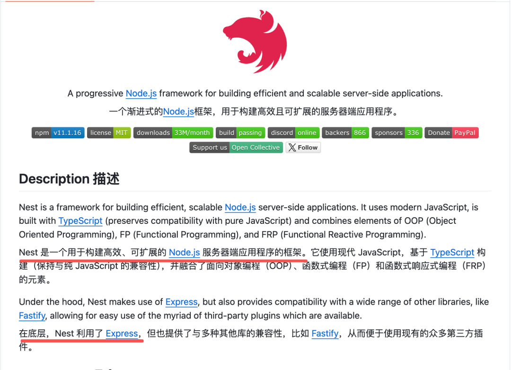
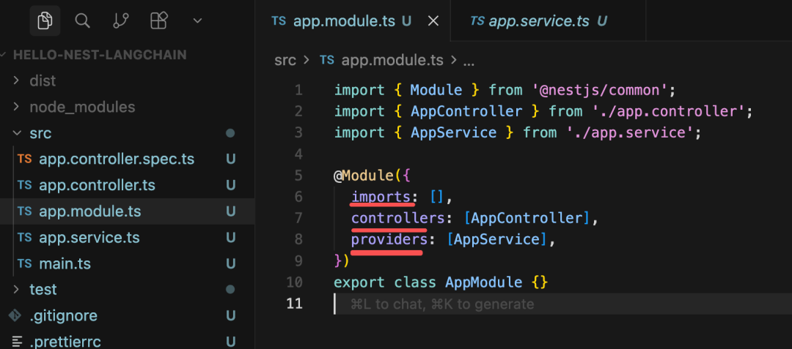
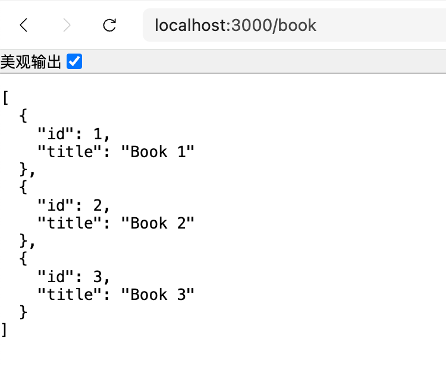
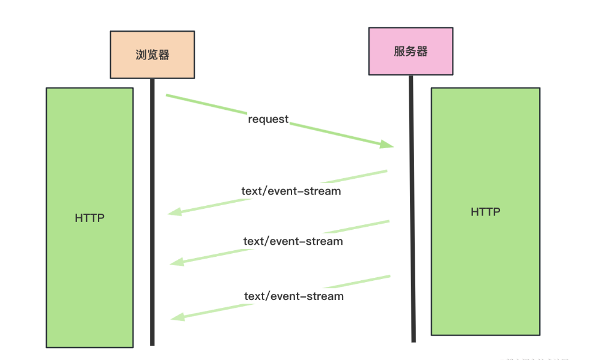
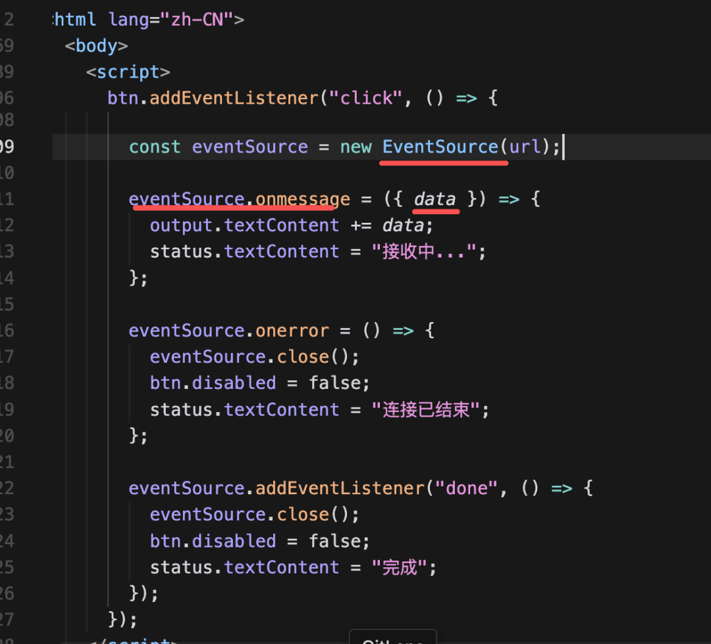
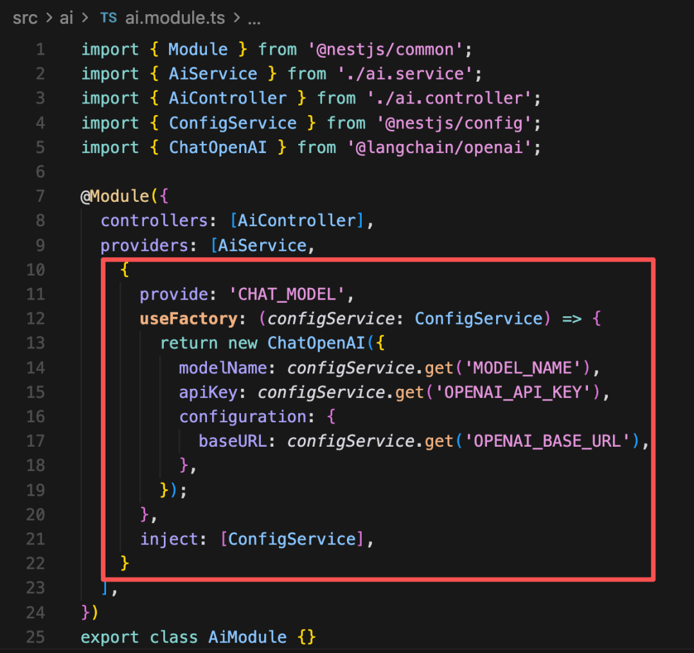

# FastAPI + LangChain 实现基于 SSE 的流式 AI 接口

> **Python 版** | 基于 FastAPI + LangChain Python 技术栈
> 原课程基于 Node.js(Nest.js) + LangChain JS，本文转换为 Python(FastAPI) + LangChain Python 版本

---

## 为什么需要后端服务？

前面学了 LangChain 的各种功能，但都是在 Python 脚本里跑的，而实际上大多数 Agent 都是跑在后端服务里。

比如你和豆包聊天的时候，它会调用 AI 接口，把你的问题传给后端，后端流式返回生成的回答。

这节我们就来学一下 LangChain 和后端框架结合，开发 AI 接口。

我们用 **FastAPI** 这个后端框架，它是 Python 生态最主流的高性能 Web 框架：



FastAPI 基于 Starlette 和 Pydantic，提供了高性能、自动文档、类型提示等特性。

---

## FastAPI 基础

### 创建项目

```bash
# 创建项目目录
mkdir fastapi-langchain-demo
cd fastapi-langchain-demo

# 创建虚拟环境
python -m venv venv
source venv/bin/activate  # Linux/Mac
# venv\Scripts\activate  # Windows

# 安装依赖
pip install fastapi uvicorn python-dotenv langchain langchain-openai
```

### 项目结构

```
fastapi-langchain-demo/
├── .env                    # 环境变量配置
├── main.py                 # 应用入口
├── modules/
│   ├── __init__.py
│   ├── book/
│   │   ├── __init__.py
│   │   ├── router.py       # 路由（类似 Nest 的 Controller）
│   │   └── service.py      # 业务逻辑（类似 Nest 的 Service）
│   └── ai/
│       ├── __init__.py
│       ├── router.py       # AI 接口路由
│       └── service.py      # AI 业务逻辑
└── public/
    └── sse-test.html       # 前端测试页面
```

FastAPI 是 MVC 架构：
- **Router**：定义路由接口（GET/POST 等）
- **Service**：写具体的业务逻辑
- **Module**：组织 Router 和 Service（FastAPI 通过 APIRouter 包含来实现）



### 依赖注入（DI）

FastAPI 支持依赖注入（Dependency Injection），通过 `Depends()` 实现。

创建 `modules/book/service.py`：

```python
"""
Book Service：业务逻辑
"""
from typing import List, Dict

# 内存 mock 仓库，适合测试，无需外部依赖
_books: List[Dict] = [
    {"id": 1, "title": "Book 1"},
    {"id": 2, "title": "Book 2"},
    {"id": 3, "title": "Book 3"},
]


class BookService:
    """书籍服务"""

    def find_all(self) -> List[Dict]:
        """获取所有书籍"""
        return [..._books]

    def find_by_id(self, book_id: int) -> Dict:
        """根据 ID 获取书籍"""
        return next((b for b in _books if b["id"] == book_id), None)
```

创建 `modules/book/router.py`：

```python
"""
Book Router：路由接口
"""
from fastapi import APIRouter, Depends, HTTPException
from typing import List, Dict
from .service import BookService

router = APIRouter(prefix="/book", tags=["书籍管理"])


# 依赖注入：FastAPI 会自动创建 BookService 实例并注入
def get_book_service() -> BookService:
    return BookService()


@router.get("", summary="获取所有书籍")
async def get_books(
    service: BookService = Depends(get_book_service)
) -> List[Dict]:
    """获取所有书籍列表"""
    return service.find_all()


@router.get("/{book_id}", summary="根据 ID 获取书籍")
async def get_book(
    book_id: int,
    service: BookService = Depends(get_book_service)
) -> Dict:
    """根据 ID 获取书籍详情"""
    book = service.find_by_id(book_id)
    if not book:
        raise HTTPException(status_code=404, detail="书籍不存在")
    return book
```

创建 `main.py`：

```python
"""
应用入口
"""
from fastapi import FastAPI
from modules.book.router import router as book_router

app = FastAPI(title="FastAPI + LangChain Demo", version="1.0.0")

# 注册路由（类似 Nest 的 Module 引入）
app.include_router(book_router)


@app.get("/", summary="健康检查")
async def root():
    return {"message": "FastAPI + LangChain Demo is running!"}


if __name__ == "__main__":
    import uvicorn
    uvicorn.run(app, host="0.0.0.0", port=8000)
```

启动服务：

```bash
uvicorn main:app --reload
```

访问 http://localhost:8000/book



可以看到接口正常返回数据。

### FastAPI 自动文档

FastAPI 自动生成 Swagger 文档，访问：
- Swagger UI：http://localhost:8000/docs
- ReDoc：http://localhost:8000/redoc

---

## 结合 LangChain 写 AI 接口

### 安装 LangChain 依赖

```bash
pip install langchain langchain-openai python-dotenv
```

### 配置文件

创建 `.env`：

```env
# OpenAI API 配置（以通义千问为例）
OPENAI_API_KEY=sk-xxx
OPENAI_BASE_URL=https://dashscope.aliyuncs.com/compatible-mode/v1
MODEL_NAME=qwen-plus
```

### AI Service

创建 `modules/ai/service.py`：

```python
"""
AI Service：LangChain 业务逻辑
"""
import os
from dotenv import load_dotenv
from langchain_openai import ChatOpenAI
from langchain_core.prompts import PromptTemplate
from langchain_core.output_parsers import StrOutputParser
from langchain_core.runnables import Runnable

load_dotenv()


class AIService:
    """AI 服务"""

    def __init__(self):
        # 在构造器里创建 ChatModel 和 chain，避免重复创建
        prompt = PromptTemplate.from_template(
            "请回答以下问题：\n\n{query}"
        )

        model = ChatOpenAI(
            temperature=0.7,
            model=os.getenv("MODEL_NAME", "qwen-plus"),
            api_key=os.getenv("OPENAI_API_KEY"),
            base_url=os.getenv("OPENAI_BASE_URL"),
        )

        # LCEL 组装 Chain：prompt → model → parser
        self.chain: Runnable = prompt | model | StrOutputParser()

    async def run_chain(self, query: str) -> str:
        """
        同步调用 Chain

        Args:
            query: 用户问题

        Returns:
            str: AI 回答
        """
        return await self.chain.ainvoke({"query": query})

    async def stream_chain(self, query: str):
        """
        流式调用 Chain（生成器）

        Args:
            query: 用户问题

        Yields:
            str: 流式返回的内容块
        """
        async for chunk in self.chain.astream({"query": query}):
            yield chunk
```

### AI Router

创建 `modules/ai/router.py`：

```python
"""
AI Router：AI 接口路由
"""
from fastapi import APIRouter, Depends, Query
from fastapi.responses import StreamingResponse
from .service import AIService

router = APIRouter(prefix="/ai", tags=["AI 接口"])


def get_ai_service() -> AIService:
    return AIService()


@router.get("/chat", summary="同步对话接口")
async def chat(
    query: str = Query(..., description="用户问题"),
    service: AIService = Depends(get_ai_service)
):
    """
    同步对话接口：等待完整回答后返回

    - **query**: 用户问题
    """
    answer = await service.run_chain(query)
    return {"answer": answer}
```

### 注册路由

更新 `main.py`：

```python
"""
应用入口
"""
from fastapi import FastAPI
from modules.book.router import router as book_router
from modules.ai.router import router as ai_router

app = FastAPI(title="FastAPI + LangChain Demo", version="1.0.0")

# 注册路由
app.include_router(book_router)
app.include_router(ai_router)


@app.get("/", summary="健康检查")
async def root():
    return {"message": "FastAPI + LangChain Demo is running!"}


if __name__ == "__main__":
    import uvicorn
    uvicorn.run(app, host="0.0.0.0", port=8000)
```

启动服务：

```bash
uvicorn main:app --reload
```

测试同步接口：

```bash
curl "http://localhost:8000/ai/chat?query=什么是LangChain"
```

这样，第一个 AI 接口就完成了。

但现在有两个问题：
- 配置没有抽离（已用 .env 解决）
- 没有流式返回内容

接下来实现流式返回。

---

## SSE 流式返回

这种不断返回内容一般用 **SSE（Server-Sent Events）** 来做。

SSE 是这样的流程：



服务端返回的 `Content-Type` 是 `text/event-stream`，这是一个流，可以多次返回内容。

### 流式接口实现

更新 `modules/ai/router.py`，添加流式接口：

```python
"""
AI Router：AI 接口路由
"""
import json
from fastapi import APIRouter, Depends, Query
from fastapi.responses import StreamingResponse
from .service import AIService

router = APIRouter(prefix="/ai", tags=["AI 接口"])


def get_ai_service() -> AIService:
    return AIService()


@router.get("/chat", summary="同步对话接口")
async def chat(
    query: str = Query(..., description="用户问题"),
    service: AIService = Depends(get_ai_service)
):
    """同步对话接口：等待完整回答后返回"""
    answer = await service.run_chain(query)
    return {"answer": answer}


@router.get("/chat/stream", summary="流式对话接口（SSE）")
async def chat_stream(
    query: str = Query(..., description="用户问题"),
    service: AIService = Depends(get_ai_service)
):
    """
    流式对话接口：基于 SSE 实时返回内容

    - **query**: 用户问题
    - 返回: text/event-stream 流式数据
    """

    async def event_generator():
        """SSE 事件生成器"""
        try:
            async for chunk in service.stream_chain(query):
                # SSE 格式：data: 内容\n\n
                yield f"data: {json.dumps({'content': chunk}, ensure_ascii=False)}\n\n"

            # 发送完成事件
            yield f"data: {json.dumps({'done': True}, ensure_ascii=False)}\n\n"
        except Exception as e:
            yield f"data: {json.dumps({'error': str(e)}, ensure_ascii=False)}\n\n"

    return StreamingResponse(
        event_generator(),
        media_type="text/event-stream",
        headers={
            "Cache-Control": "no-cache",
            "Connection": "keep-alive",
            "X-Accel-Buffering": "no",  # 禁用 Nginx 缓冲
        },
    )
```

### SSE 数据格式

SSE 的数据格式很简单：

```
data: {"content": "你"}

data: {"content": "好"}

data: {"content": "！"}

data: {"done": true}

```

每个事件以 `data:` 开头，以 `\n\n` 结尾。

### 测试流式接口

```bash
curl -N "http://localhost:8000/ai/chat/stream?query=什么是LangChain"
```

可以看到，通过 SSE 的接口就可以流式地返回内容了。

---

## 前端调用 SSE

有的同学可能不知道 SSE 的接口怎么调用，我们写一下前端代码。

创建 `public/sse-test.html`：

```html
<!DOCTYPE html>
<html lang="zh-CN">
<head>
    <meta charset="UTF-8">
    <meta name="viewport" content="width=device-width, initial-scale=1.0">
    <title>SSE 流式接口测试</title>
    <style>
        * { box-sizing: border-box; }
        body {
            font-family: system-ui, -apple-system, sans-serif;
            max-width: 640px;
            margin: 2rem auto;
            padding: 0 1rem;
        }
        label {
            display: block;
            margin-bottom: 0.5rem;
            font-weight: 500;
        }
        input[type="text"] {
            width: 100%;
            padding: 0.75rem;
            border: 1px solid #ccc;
            border-radius: 6px;
            font-size: 1rem;
            margin-bottom: 1rem;
        }
        button {
            padding: 0.6rem 1.2rem;
            font-size: 1rem;
            border: none;
            border-radius: 6px;
            cursor: pointer;
        }
        button.primary {
            background: #2563eb;
            color: white;
        }
        button.primary:hover { background: #1d4ed8; }
        button:disabled {
            opacity: 0.6;
            cursor: not-allowed;
        }
        .output {
            margin-top: 1.5rem;
            padding: 1rem;
            border: 1px solid #e5e7eb;
            border-radius: 8px;
            background: #f9fafb;
            min-height: 120px;
            white-space: pre-wrap;
            word-break: break-word;
        }
        .output:empty::before {
            content: "回复将显示在这里...";
            color: #9ca3af;
        }
        .status {
            margin-top: 0.5rem;
            font-size: 0.875rem;
            color: #6b7280;
        }
    </style>
</head>
<body>
    <h1>SSE 流式接口测试</h1>

    <label for="apiUrl">API 地址</label>
    <input type="text" id="apiUrl" value="http://localhost:8000" placeholder="http://localhost:8000">

    <label for="query">问题</label>
    <input type="text" id="query" placeholder="例如：什么是 LangChain？" value="什么是 LangChain？">

    <button type="button" id="btn" class="primary">开始流式请求</button>
    <p class="status" id="status"></p>
    <div class="output" id="output"></div>

    <script>
        const apiUrlInput = document.getElementById("apiUrl");
        const queryInput = document.getElementById("query");
        const btn = document.getElementById("btn");
        const output = document.getElementById("output");
        const status = document.getElementById("status");

        btn.addEventListener("click", () => {
            const baseUrl = apiUrlInput.value.replace(/\/$/, "");
            const q = queryInput.value.trim();

            if (!q) {
                status.textContent = "请输入问题";
                return;
            }

            const url = `${baseUrl}/ai/chat/stream?query=${encodeURIComponent(q)}`;
            output.textContent = "";
            btn.disabled = true;
            status.textContent = "连接中...";

            // 使用 EventSource 监听 SSE
            const eventSource = new EventSource(url);

            eventSource.onmessage = ({ data }) => {
                try {
                    const parsed = JSON.parse(data);
                    if (parsed.content) {
                        output.textContent += parsed.content;
                    }
                    if (parsed.done) {
                        eventSource.close();
                        btn.disabled = false;
                        status.textContent = "完成";
                    }
                } catch (e) {
                    output.textContent += data;
                }
                status.textContent = "接收中...";
            };

            eventSource.onerror = () => {
                eventSource.close();
                btn.disabled = false;
                status.textContent = "连接已结束";
            };
        });
    </script>
</body>
</html>
```

样式是让 AI 写的，不用管，只看这部分：



就是调用 `EventSource` 的 API，在 `onmessage` 回调里接收 data 就可以了。

### 配置静态文件访问

更新 `main.py`，添加静态文件服务：

```python
"""
应用入口
"""
from fastapi import FastAPI
from fastapi.staticfiles import StaticFiles
from modules.book.router import router as book_router
from modules.ai.router import router as ai_router

app = FastAPI(title="FastAPI + LangChain Demo", version="1.0.0")

# 注册路由
app.include_router(book_router)
app.include_router(ai_router)

# 挂载静态文件目录
app.mount("/static", StaticFiles(directory="public"), name="static")


@app.get("/", summary="健康检查")
async def root():
    return {"message": "FastAPI + LangChain Demo is running!"}


if __name__ == "__main__":
    import uvicorn
    uvicorn.run(app, host="0.0.0.0", port=8000)
```

访问 http://localhost:8000/static/sse-test.html

这就是 SSE 流式返回内容的体验，AI 接口基本都用这种方式来做流式功能。

---

## 代码优化：解耦 ChatModel

现在这样写是 Service 和具体的 ChatModel 耦合了，实际上应该拆分出去，动态注入。

我们用 FastAPI 的依赖注入方式创建：

创建 `modules/ai/dependencies.py`：

```python
"""
AI 依赖注入：创建 ChatModel provider
"""
import os
from dotenv import load_dotenv
from langchain_openai import ChatOpenAI

load_dotenv()


def get_chat_model() -> ChatOpenAI:
    """
    创建 ChatModel 实例（类似 Nest 的 useFactory provider）

    Returns:
        ChatOpenAI: 大语言模型实例
    """
    return ChatOpenAI(
        temperature=0.7,
        model=os.getenv("MODEL_NAME", "qwen-plus"),
        api_key=os.getenv("OPENAI_API_KEY"),
        base_url=os.getenv("OPENAI_BASE_URL"),
    )
```

更新 `modules/ai/service.py`：

```python
"""
AI Service：LangChain 业务逻辑（解耦版）
"""
from langchain_openai import ChatOpenAI
from langchain_core.prompts import PromptTemplate
from langchain_core.output_parsers import StrOutputParser
from langchain_core.runnables import Runnable


class AIService:
    """AI 服务"""

    def __init__(self, model: ChatOpenAI):
        # 通过构造器注入 ChatModel，实现解耦
        prompt = PromptTemplate.from_template(
            "请回答以下问题：\n\n{query}"
        )

        # LCEL 组装 Chain：prompt → model → parser
        self.chain: Runnable = prompt | model | StrOutputParser()

    async def run_chain(self, query: str) -> str:
        """同步调用 Chain"""
        return await self.chain.ainvoke({"query": query})

    async def stream_chain(self, query: str):
        """流式调用 Chain（生成器）"""
        async for chunk in self.chain.astream({"query": query}):
            yield chunk
```

更新 `modules/ai/router.py`：

```python
"""
AI Router：AI 接口路由（解耦版）
"""
import json
from fastapi import APIRouter, Depends, Query
from fastapi.responses import StreamingResponse
from langchain_openai import ChatOpenAI
from .service import AIService
from .dependencies import get_chat_model

router = APIRouter(prefix="/ai", tags=["AI 接口"])


def get_ai_service(model: ChatOpenAI = Depends(get_chat_model)) -> AIService:
    """
    创建 AI Service，注入 ChatModel 依赖

    Args:
        model: 大语言模型实例（由 get_chat_model 提供）

    Returns:
        AIService: AI 服务实例
    """
    return AIService(model)


@router.get("/chat", summary="同步对话接口")
async def chat(
    query: str = Query(..., description="用户问题"),
    service: AIService = Depends(get_ai_service)
):
    """同步对话接口"""
    answer = await service.run_chain(query)
    return {"answer": answer}


@router.get("/chat/stream", summary="流式对话接口（SSE）")
async def chat_stream(
    query: str = Query(..., description="用户问题"),
    service: AIService = Depends(get_ai_service)
):
    """流式对话接口：基于 SSE 实时返回内容"""

    async def event_generator():
        """SSE 事件生成器"""
        try:
            async for chunk in service.stream_chain(query):
                yield f"data: {json.dumps({'content': chunk}, ensure_ascii=False)}\n\n"
            yield f"data: {json.dumps({'done': True}, ensure_ascii=False)}\n\n"
        except Exception as e:
            yield f"data: {json.dumps({'error': str(e)}, ensure_ascii=False)}\n\n"

    return StreamingResponse(
        event_generator(),
        media_type="text/event-stream",
        headers={
            "Cache-Control": "no-cache",
            "Connection": "keep-alive",
            "X-Accel-Buffering": "no",
        },
    )
```

这样就实现了 ChatModel 和业务逻辑的解耦，可以动态切换模型。



---

## 学习要点

1. **FastAPI** 是 Python 生态最主流的高性能 Web 框架，基于 Starlette 和 Pydantic
2. **MVC 架构**：Router 定义路由接口，Service 写业务逻辑
3. **依赖注入（DI）**：通过 `Depends()` 实现，Service 可以注入到 Router 中
4. **LCEL Chain** 定义在 Service 构造器里，避免重复创建
5. **同步和流式**分别调用 `ainvoke` 和 `astream` 方法
6. **SSE（Server-Sent Events）** 是 AI 接口流式返回内容最常用的方式
7. **StreamingResponse** + 异步生成器实现 SSE，`Content-Type` 设为 `text/event-stream`
8. **SSE 数据格式**：`data: 内容\n\n`，每个事件以 `data:` 开头，`\n\n` 结尾
9. **前端用 EventSource** 监听 SSE 的 `message` 事件，拿到流式返回的数据
10. **解耦 ChatModel**：通过依赖注入创建 ChatModel provider，Service 里直接注入，实现解耦

## 扩展方向

- 学习 FastAPI 的 WebSocket 实现双向通信
- 探索 FastAPI 的中间件、异常处理、CORS 配置
- 学习 LangChain 的 LangSmith 追踪和监控
- 结合 Redis 实现对话记忆的持久化
- 学习 FastAPI 的异步数据库操作（SQLAlchemy + asyncpg）
- 探索流式接口的错误处理和重连机制

---

## 配套代码库

**代码库地址**：https://github.com/iiixiyan/agent-learning-code/tree/main/02-enterprise-backend/20-fastapi-sse

包含本文的完整可运行代码示例（FastAPI + LangChain SSE 流式接口 + 前端测试页面）。

---

**上一篇**：[LangChain 整体总结](../01-第一阶段-Agent基础入门/19_LangChain整体总结.md) | **下一篇**：[FastAPI + Tool 实现定时任务（上）](./21_FastAPI+tool实现定时任务(上).md)
