# FastAPI + Tool 实现 OpenClaw 同款定时任务功能（上）

> **Python 版** | 基于 FastAPI + LangChain Python 技术栈
> 原课程基于 Node.js(Nest.js) + LangChain JS，本文转换为 Python(FastAPI) + LangChain Python 版本

---

## 为什么需要定时任务？

定时任务是 Agent 常见功能。

比如你用豆包的时候，让它某个时间做某件事情。它会调用定时任务的 Tool 设置一个提醒，并且你可以单独管理所有的提醒。

OpenClaw 当然也有定时任务功能。我们看下它是怎么实现的：

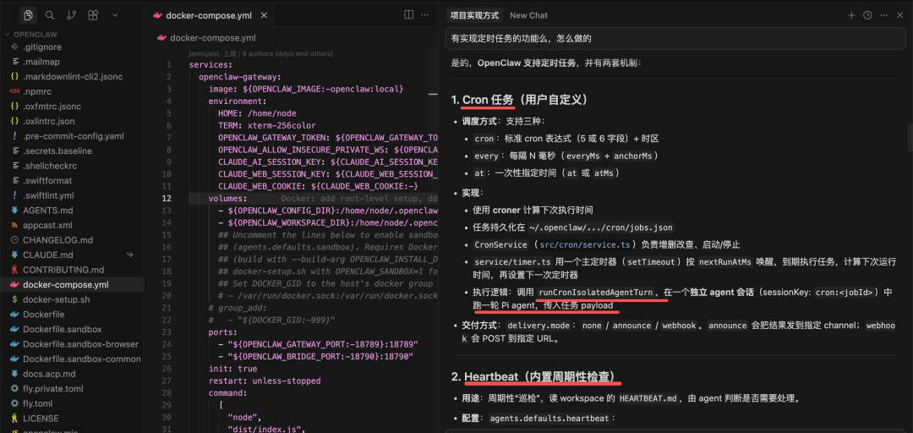

可以看到，OpenClaw 的定时任务有两种：

| 类型 | 说明 |
|------|------|
| **定时任务** | 创建定时任务，传入文本，到时间会启动一个 Agent Loop 来执行 |
| **心跳机制** | 定期主动做一些事情 |

到时间后跑一个 Agent Loop 循环调用 Tool Call 做事情：

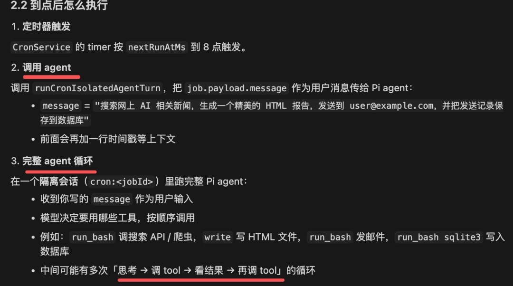

它并没有把定时任务封装成 Tool，但是有执行命令的 Tool，所以绕了一层，也是一样：

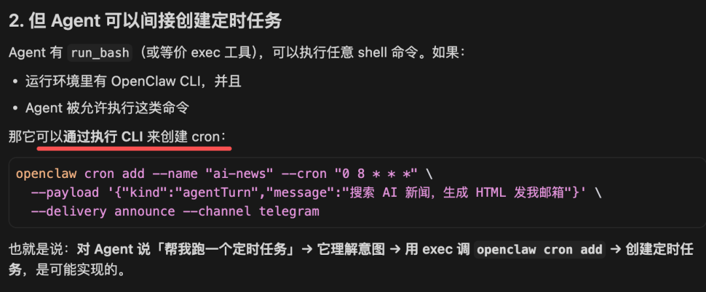

再来看下 Nanobot 的实现，它是 mini 版 OpenClaw：

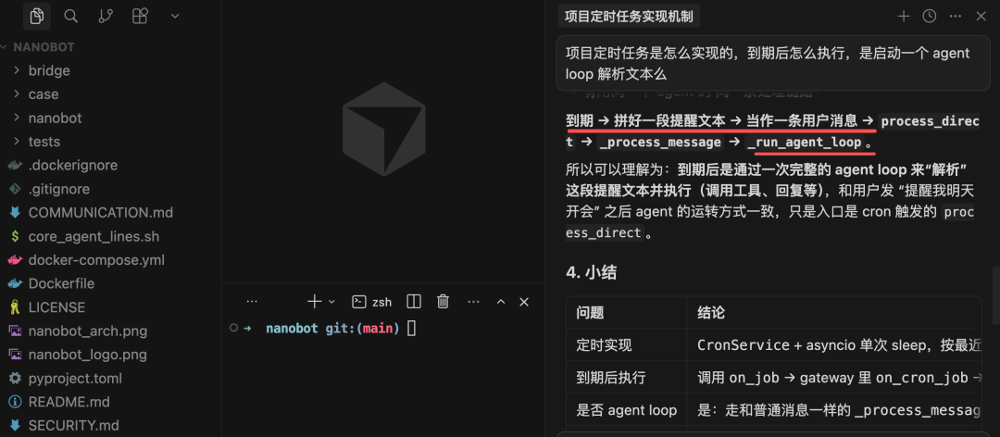

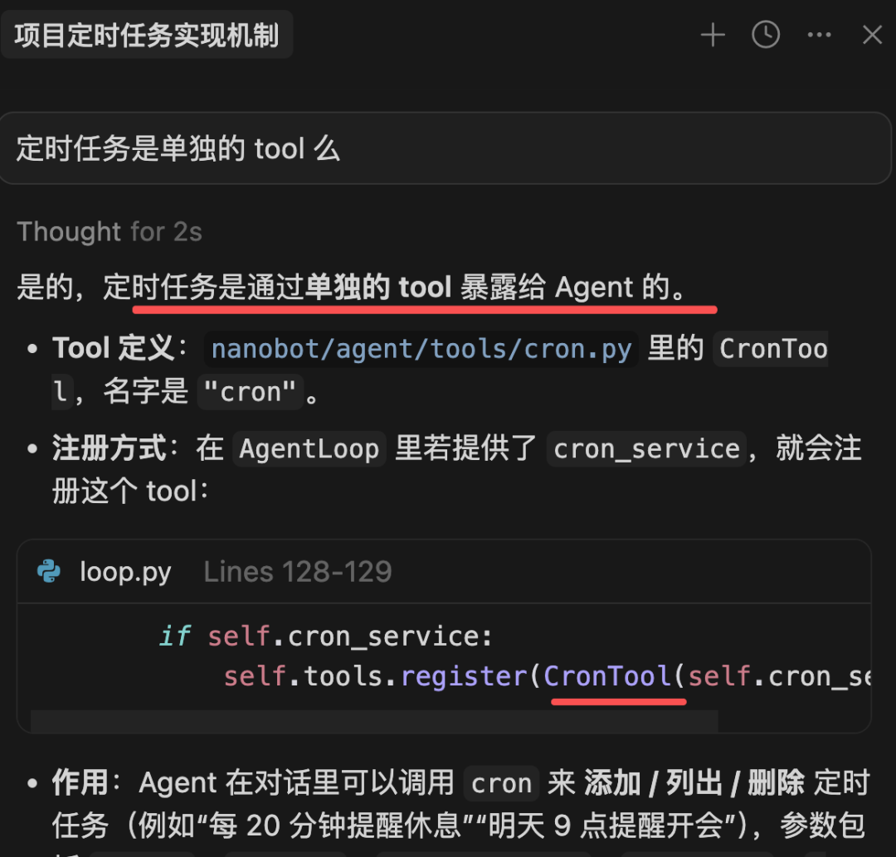

也就是这个流程：

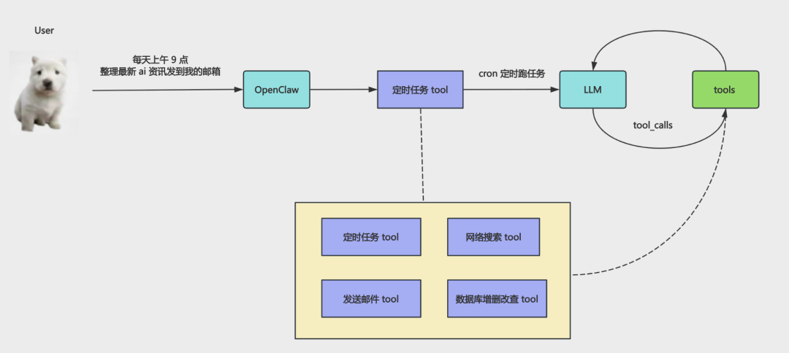

```
用户设置定时任务
    ↓
创建定时任务（存储任务描述、执行时间）
    ↓
定时任务调度器（到时间触发）
    ↓
启动 Agent Loop（循环调用 Tool）
    ↓
执行任务（调用各种 Tool：搜索、邮件、命令等）
```

既然各种 Agent 都有定时任务功能，那我们也按照这个方案实现一遍，后面可以集成到我们的 Agent 项目里。

> **注意**：本篇（上）主要实现 Tool 功能和 AI 接口，定时任务调度功能在下篇实现。

---

## 创建 FastAPI 项目

```bash
# 创建项目目录
mkdir cron-job-tool
cd cron-job-tool

# 创建虚拟环境
python -m venv venv
source venv/bin/activate  # Linux/Mac

# 安装依赖
pip install fastapi uvicorn python-dotenv langchain langchain-openai pydantic
```

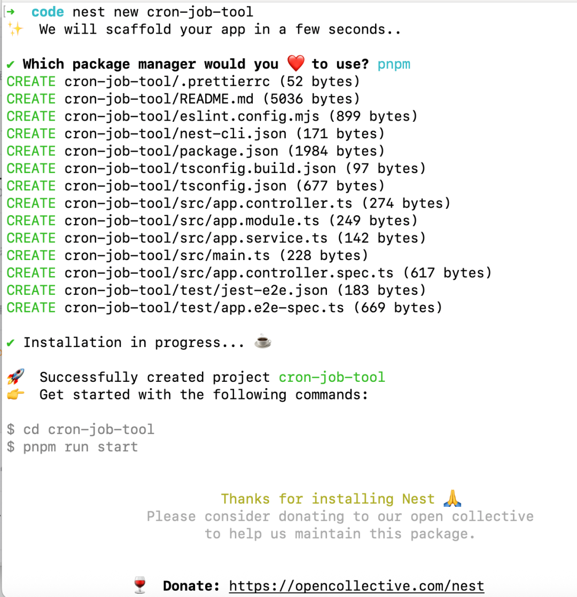

### 项目结构

```
cron-job-tool/
├── .env                    # 环境变量配置
├── main.py                 # 应用入口
├── modules/
│   ├── __init__.py
│   ├── ai/
│   │   ├── __init__.py
│   │   ├── router.py       # AI 接口路由
│   │   ├── service.py      # AI 业务逻辑
│   │   ├── dependencies.py # 依赖注入
│   │   └── tools.py        # Tool 定义
│   └── user/
│       ├── __init__.py
│       ├── router.py       # 用户接口路由
│       └── service.py      # 用户业务逻辑
└── public/
    └── ai-sse-test.html    # 前端测试页面
```

生成 AI 模块：

```bash
mkdir -p modules/ai modules/user public
```

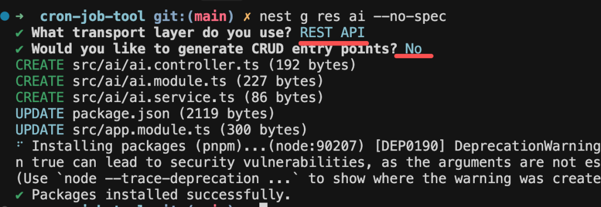

### 配置文件

创建 `.env`：

```env
# OpenAI API 配置
OPENAI_API_KEY=sk-xxx
OPENAI_BASE_URL=https://dashscope.aliyuncs.com/compatible-mode/v1
MODEL_NAME=qwen-plus

# 邮件配置（可选）
MAIL_HOST=smtp.qq.com
MAIL_PORT=587
MAIL_SECURE=false
MAIL_USER=你的邮箱
MAIL_PASS=你的授权码
MAIL_FROM="No Reply <你的邮箱>"

# 博查搜索 API（可选）
BOCHA_API_KEY=sk-xxx
```

---

## 实现 AI 功能（Tool + Agent Loop）

### 定义 Tool

创建 `modules/ai/tools.py`：

```python
"""
AI Tools：工具定义
"""
from typing import Dict, List, Optional
from pydantic import BaseModel, Field
from langchain_core.tools import tool


# ========== 查询用户 Tool ==========

class QueryUserArgs(BaseModel):
    """查询用户参数"""
    user_id: str = Field(description="用户 ID，例如: 001, 002, 003")


# Mock 数据库
_database: Dict[str, Dict] = {
    "users": {
        "001": {"id": "001", "name": "张三", "email": "zhangsan@example.com", "role": "admin"},
        "002": {"id": "002", "name": "李四", "email": "lisi@example.com", "role": "user"},
        "003": {"id": "003", "name": "王五", "email": "wangwu@example.com", "role": "user"},
    }
}


@tool(args_schema=QueryUserArgs)
def query_user(user_id: str) -> str:
    """
    查询数据库中的用户信息。输入用户 ID，返回该用户的详细信息（姓名、邮箱、角色）。

    Args:
        user_id: 用户 ID

    Returns:
        str: 用户信息
    """
    user = _database["users"].get(user_id)
    if not user:
        available_ids = ", ".join(_database["users"].keys())
        return f"用户 ID {user_id} 不存在。可用的 ID: {available_ids}"

    return f"""用户信息：
- ID: {user['id']}
- 姓名: {user['name']}
- 邮箱: {user['email']}
- 角色: {user['role']}"""


# Tool 列表
basic_tools = [query_user]
```

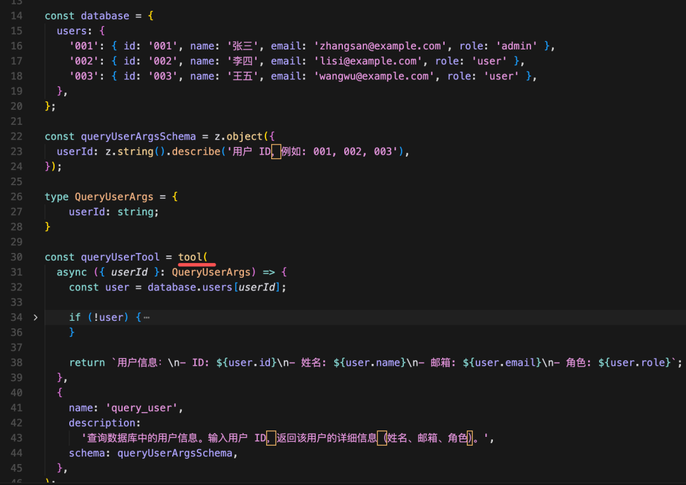

### AI Service

创建 `modules/ai/service.py`：

```python
"""
AI Service：业务逻辑（Agent Loop）
"""
from typing import List, AsyncGenerator
from langchain_openai import ChatOpenAI
from langchain_core.messages import BaseMessage, SystemMessage, HumanMessage, AIMessage, ToolMessage
from langchain_core.tools import BaseTool


class AIService:
    """AI 服务"""

    def __init__(self, model: ChatOpenAI, tools: List[BaseTool]):
        """
        初始化 AI 服务

        Args:
            model: 大语言模型
            tools: 工具列表
        """
        # 绑定工具到模型
        self.model_with_tools = model.bind_tools(tools)
        self.tools = tools
        # Tool 名称到 Tool 对象的映射
        self.tool_map = {tool.name: tool for tool in tools}

    async def run_chain(self, query: str) -> str:
        """
        同步调用 Chain（Agent Loop）

        Args:
            query: 用户问题

        Returns:
            str: AI 回答
        """
        messages: List[BaseMessage] = [
            SystemMessage(
                "你是一个智能助手，可以在需要时调用工具（如 query_user）来查询用户信息，再用结果回答用户的问题。"
            ),
            HumanMessage(query),
        ]

        while True:
            # 调用大模型（思考）
            ai_message = await self.model_with_tools.ainvoke(messages)
            messages.append(ai_message)

            tool_calls = ai_message.tool_calls or []

            # 没有要调用的工具，直接把回答返回
            if not tool_calls:
                return ai_message.content

            # 依次执行本轮需要调用的所有工具（行动）
            for tool_call in tool_calls:
                tool_call_id = tool_call.get("id", "")
                tool_name = tool_call.get("name")

                if tool_name in self.tool_map:
                    tool = self.tool_map[tool_name]
                    result = await tool.ainvoke(tool_call.get("args", {}))

                    # 把工具结果加入消息（观察）
                    messages.append(
                        ToolMessage(
                            tool_call_id=tool_call_id,
                            name=tool_name,
                            content=str(result),
                        )
                    )

    async def run_chain_stream(self, query: str) -> AsyncGenerator[str, None]:
        """
        流式调用 Chain（Agent Loop）

        Args:
            query: 用户问题

        Yields:
            str: 流式返回的内容块
        """
        messages: List[BaseMessage] = [
            SystemMessage(
                "你是一个智能助手，可以在需要时调用工具（如 query_user）来查询用户信息，再用结果回答用户的问题。"
            ),
            HumanMessage(query),
        ]

        while True:
            # 一轮对话：先让模型思考并（可能）提出工具调用
            stream = self.model_with_tools.astream(messages)
            full_ai_message: Optional[AIMessage] = None

            async for chunk in stream:
                # 使用 += 持续拼接，得到本轮完整的 AIMessage
                full_ai_message = full_ai_message + chunk if full_ai_message else chunk

                has_tool_call_chunk = (
                    hasattr(full_ai_message, "tool_call_chunks")
                    and full_ai_message.tool_call_chunks
                    and len(full_ai_message.tool_call_chunks) > 0
                )

                # 只要当前轮次还没出现 tool 调用的 chunk，就可以把文本内容流式往外推
                if not has_tool_call_chunk and chunk.content:
                    yield chunk.content

            if not full_ai_message:
                return

            messages.append(full_ai_message)
            tool_calls = full_ai_message.tool_calls or []

            # 没有工具调用：说明这一轮就是最终回答，已经在上面的 async for 中流完了，可以结束
            if not tool_calls:
                return

            # 有工具调用：本轮我们不再额外输出内容，而是执行工具，生成 ToolMessage，进入下一轮
            for tool_call in tool_calls:
                tool_call_id = tool_call.get("id", "")
                tool_name = tool_call.get("name")

                if tool_name in self.tool_map:
                    tool = self.tool_map[tool_name]
                    result = await tool.ainvoke(tool_call.get("args", {}))

                    messages.append(
                        ToolMessage(
                            tool_call_id=tool_call_id,
                            name=tool_name,
                            content=str(result),
                        )
                    )
```

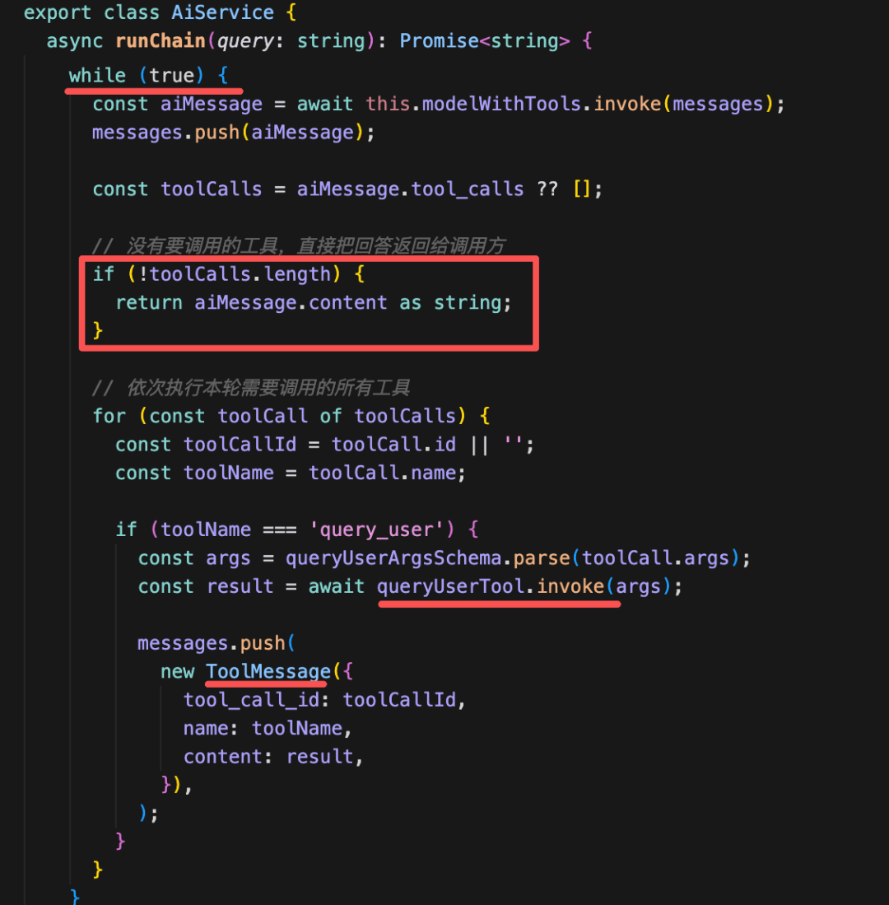

### 依赖注入

创建 `modules/ai/dependencies.py`：

```python
"""
AI 依赖注入
"""
import os
from dotenv import load_dotenv
from langchain_openai import ChatOpenAI
from .tools import basic_tools

load_dotenv()


def get_chat_model() -> ChatOpenAI:
    """创建 ChatModel 实例"""
    return ChatOpenAI(
        temperature=0.7,
        model=os.getenv("MODEL_NAME", "qwen-plus"),
        api_key=os.getenv("OPENAI_API_KEY"),
        base_url=os.getenv("OPENAI_BASE_URL"),
    )


def get_ai_service(model: ChatOpenAI = None) -> "AIService":
    """
    创建 AI Service 实例

    Args:
        model: 大语言模型实例（可选，不传则自动创建）

    Returns:
        AIService: AI 服务实例
    """
    from .service import AIService

    if model is None:
        model = get_chat_model()

    return AIService(model=model, tools=basic_tools)
```

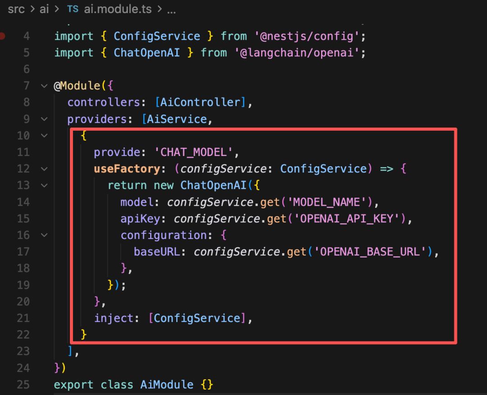

### AI Router

创建 `modules/ai/router.py`：

```python
"""
AI Router：AI 接口路由
"""
import json
from fastapi import APIRouter, Depends, Query
from fastapi.responses import StreamingResponse
from .service import AIService
from .dependencies import get_ai_service

router = APIRouter(prefix="/ai", tags=["AI 接口"])


@router.get("/chat", summary="同步对话接口")
async def chat(
    query: str = Query(..., description="用户问题"),
    service: AIService = Depends(get_ai_service),
):
    """同步对话接口：等待完整回答后返回"""
    answer = await service.run_chain(query)
    return {"answer": answer}


@router.get("/chat/stream", summary="流式对话接口（SSE）")
async def chat_stream(
    query: str = Query(..., description="用户问题"),
    service: AIService = Depends(get_ai_service),
):
    """流式对话接口：基于 SSE 实时返回内容"""

    async def event_generator():
        """SSE 事件生成器"""
        try:
            async for chunk in service.run_chain_stream(query):
                # SSE 格式：data: 内容\n\n
                yield f"data: {json.dumps({'content': chunk}, ensure_ascii=False)}\n\n"

            # 发送完成事件
            yield f"data: {json.dumps({'done': True}, ensure_ascii=False)}\n\n"
        except Exception as e:
            yield f"data: {json.dumps({'error': str(e)}, ensure_ascii=False)}\n\n"

    return StreamingResponse(
        event_generator(),
        media_type="text/event-stream",
        headers={
            "Cache-Control": "no-cache",
            "Connection": "keep-alive",
            "X-Accel-Buffering": "no",
        },
    )
```

### 应用入口

创建 `main.py`：

```python
"""
应用入口
"""
from fastapi import FastAPI
from fastapi.staticfiles import StaticFiles
from modules.ai.router import router as ai_router

app = FastAPI(title="Cron Job Tool Demo", version="1.0.0")

# 注册路由
app.include_router(ai_router)

# 挂载静态文件目录
app.mount("/static", StaticFiles(directory="public"), name="static")


@app.get("/", summary="健康检查")
async def root():
    return {"message": "Cron Job Tool Demo is running!"}


if __name__ == "__main__":
    import uvicorn
    uvicorn.run(app, host="0.0.0.0", port=8000)
```

启动服务：

```bash
uvicorn main:app --reload
```

测试同步接口：

```bash
curl "http://localhost:8000/ai/chat?query=查询用户001的信息"
```

---

## 流式版本（SSE）

上面实现了同步版本，接下来实现流式版本。

主要是流式的处理部分：

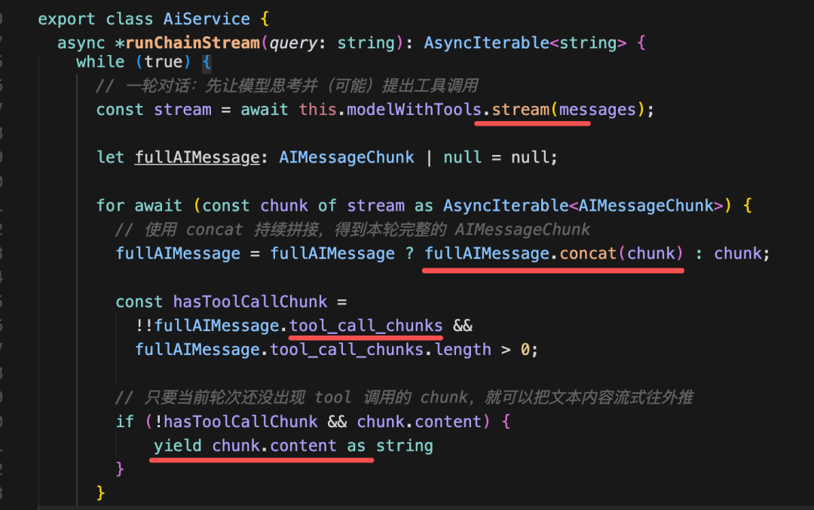

这里 `stream` 返回的是一个个 chunk，我们判断如果没有 `tool_call_chunks` 代表不是工具调用，那就直接 yield 返回内容。否则，就进入下面的工具调用逻辑，那部分和之前一样，拼接结束之后就是完整的 `tool_calls` 了。

流式接口已经在上面的 `router.py` 中实现了。

测试流式接口：

```bash
curl -N "http://localhost:8000/ai/chat/stream?query=查询用户001的信息"
```

这样，我们就完成了 Tool + 流式 + SSE。

---

## Tool 里调用 Service

但我们现在的 Tool 太简单了，能不能 Tool 里调用 Service 呢？比如 Tool 里面调用 Service 来做数据库增删改查？

其实也很简单，和之前的 ChatModel 一样定义个 provider 就好了。

### User Service

创建 `modules/user/service.py`：

```python
"""
User Service：用户业务逻辑（增删改查）
"""
from typing import List, Dict, Optional
from pydantic import BaseModel


class User(BaseModel):
    """用户模型"""
    id: str
    name: str
    email: str
    role: str


class UserService:
    """用户服务"""

    def __init__(self):
        # Mock 数据库
        self._users: Dict[str, User] = {
            "001": User(id="001", name="赵云", email="zhaoyun@example.com", role="admin"),
            "002": User(id="002", name="诸葛亮", email="zhugeliang@example.com", role="manager"),
            "003": User(id="003", name="关羽", email="guanyu@example.com", role="user"),
            "004": User(id="004", name="张飞", email="zhangfei@example.com", role="user"),
            "005": User(id="005", name="刘备", email="liubei@example.com", role="owner"),
            "006": User(id="006", name="黄忠", email="huangzhong@example.com", role="user"),
        }

    def find_all(self) -> List[User]:
        """获取所有用户"""
        return list(self._users.values())

    def find_one(self, user_id: str) -> Optional[User]:
        """根据 ID 获取用户"""
        return self._users.get(user_id)

    def create(self, user: User) -> User:
        """创建用户"""
        self._users[user.id] = user
        return user

    def update(self, user_id: str, partial: Dict) -> Optional[User]:
        """更新用户"""
        existing = self._users.get(user_id)
        if not existing:
            return None

        updated_data = existing.model_dump()
        updated_data.update(partial)
        updated_data["id"] = existing.id  # ID 不可修改

        updated_user = User(**updated_data)
        self._users[user_id] = updated_user
        return updated_user

    def remove(self, user_id: str) -> bool:
        """删除用户"""
        return self._users.pop(user_id, None) is not None
```

这里面定义了 mock 的增删改查。

### 改造 Query User Tool

更新 `modules/ai/tools.py`，添加基于 Service 的 Tool：

```python
"""
AI Tools：工具定义（基于 Service）
"""
from typing import Dict, List, Optional
from pydantic import BaseModel, Field
from langchain_core.tools import tool
from modules.user.service import UserService


# ========== 查询用户 Tool（基于 Service） ==========

class QueryUserArgs(BaseModel):
    """查询用户参数"""
    user_id: str = Field(description="用户 ID，例如: 001, 002, 003")


def create_query_user_tool(user_service: UserService):
    """
    创建查询用户 Tool（基于 UserService）

    Args:
        user_service: 用户服务实例

    Returns:
        Tool: 查询用户 Tool
    """
    @tool(args_schema=QueryUserArgs)
    def query_user(user_id: str) -> str:
        """
        查询数据库中的用户信息。输入用户 ID，返回该用户的详细信息（姓名、邮箱、角色）。
        """
        user = user_service.find_one(user_id)
        if not user:
            available_ids = ", ".join([u.id for u in user_service.find_all()])
            return f"用户 ID {user_id} 不存在。可用的 ID: {available_ids}"

        return f"""用户信息：
- ID: {user.id}
- 姓名: {user.name}
- 邮箱: {user.email}
- 角色: {user.role}"""

    return query_user
```

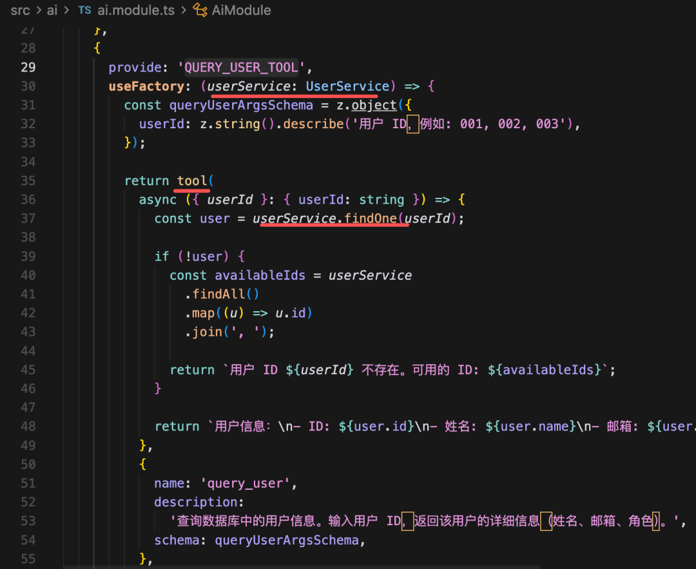

唯一的区别就是现在的实现用注入的 `user_service` 来做，返回 Tool。

### 改造依赖注入

更新 `modules/ai/dependencies.py`：

```python
"""
AI 依赖注入（基于 Service）
"""
import os
from dotenv import load_dotenv
from langchain_openai import ChatOpenAI
from modules.user.service import UserService
from .tools import create_query_user_tool

load_dotenv()

# 单例实例
_user_service = UserService()
_chat_model = None


def get_user_service() -> UserService:
    """获取 UserService 单例"""
    return _user_service


def get_chat_model() -> ChatOpenAI:
    """创建 ChatModel 实例"""
    global _chat_model
    if _chat_model is None:
        _chat_model = ChatOpenAI(
            temperature=0.7,
            model=os.getenv("MODEL_NAME", "qwen-plus"),
            api_key=os.getenv("OPENAI_API_KEY"),
            base_url=os.getenv("OPENAI_BASE_URL"),
        )
    return _chat_model


def get_ai_service() -> "AIService":
    """创建 AI Service 实例（注入 UserService）"""
    from .service import AIService

    user_service = get_user_service()
    model = get_chat_model()

    # 创建基于 Service 的 Tool
    query_user_tool = create_query_user_tool(user_service)
    tools = [query_user_tool]

    return AIService(model=model, tools=tools)
```

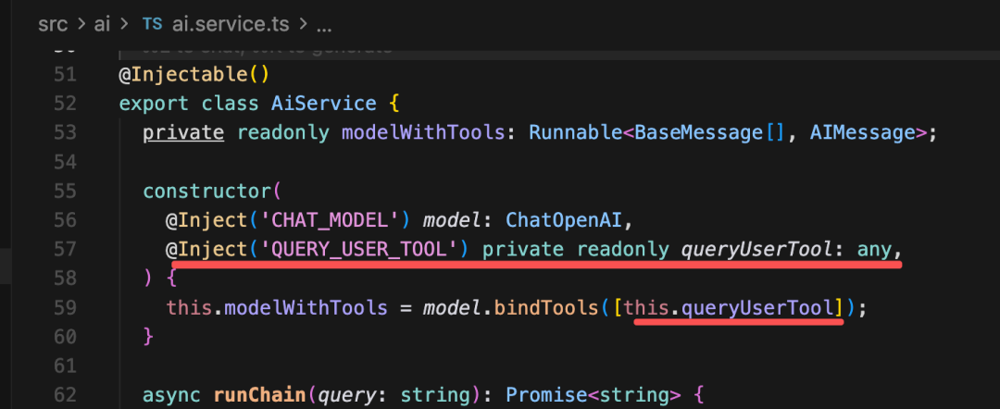

这样我们就打通了 Tool 里调用 Service。

那自然就可以实现数据库增删改查的 Tool、发送邮件的 Tool。

---

## 发送邮件的 Tool

我们用 QQ 邮箱的 SMTP 服务发送邮件。

拿到授权码之后，安装依赖：

```bash
pip install aiosmtplib
```

### 邮件 Tool

更新 `modules/ai/tools.py`，添加邮件 Tool：

```python
"""
AI Tools：邮件 Tool
"""
import os
from typing import Optional
from pydantic import BaseModel, Field, EmailStr
from langchain_core.tools import tool


class SendMailArgs(BaseModel):
    """发送邮件参数"""
    to: EmailStr = Field(description="收件人邮箱地址，例如：someone@example.com")
    subject: str = Field(description="邮件主题")
    text: Optional[str] = Field(None, description="纯文本内容，可选")
    html: Optional[str] = Field(None, description="HTML 内容，可选")


def create_send_mail_tool():
    """创建发送邮件 Tool"""

    @tool(args_schema=SendMailArgs)
    async def send_mail(to: str, subject: str, text: Optional[str] = None, html: Optional[str] = None) -> str:
        """
        发送电子邮件。需要提供收件人邮箱、主题，可选文本内容和 HTML 内容。
        """
        import aiosmtplib
        from email.mime.text import MIMEText
        from email.mime.multipart import MIMEMultipart

        mail_host = os.getenv("MAIL_HOST", "smtp.qq.com")
        mail_port = int(os.getenv("MAIL_PORT", "587"))
        mail_secure = os.getenv("MAIL_SECURE", "false") == "true"
        mail_user = os.getenv("MAIL_USER", "")
        mail_pass = os.getenv("MAIL_PASS", "")
        mail_from = os.getenv("MAIL_FROM", f"No Reply <{mail_user}>")

        if not mail_user or not mail_pass:
            return "邮件服务未配置（环境变量 MAIL_USER、MAIL_PASS），请先在服务端配置后再重试。"

        try:
            msg = MIMEMultipart("alternative")
            msg["Subject"] = subject
            msg["From"] = mail_from
            msg["To"] = to

            if text:
                msg.attach(MIMEText(text, "plain", "utf-8"))
            if html:
                msg.attach(MIMEText(html, "html", "utf-8"))
            if not text and not html:
                msg.attach(MIMEText("（无内容）", "plain", "utf-8"))

            await aiosmtplib.send(
                msg,
                hostname=mail_host,
                port=mail_port,
                use_tls=mail_secure,
                username=mail_user,
                password=mail_pass,
            )

            return f"邮件已发送到 {to}，主题为「{subject}」"
        except Exception as e:
            return f"邮件发送失败：{str(e)}"

    return send_mail
```

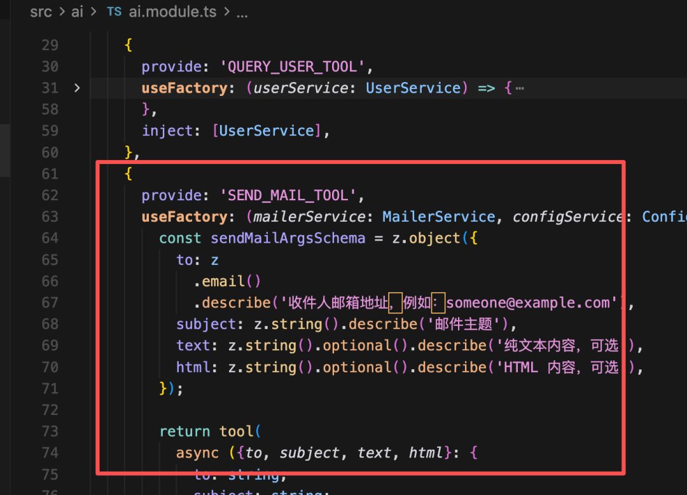

### 注册邮件 Tool

更新 `modules/ai/dependencies.py`，注册邮件 Tool：

```python
def get_ai_service() -> "AIService":
    """创建 AI Service 实例（注入 UserService + 邮件 Tool）"""
    from .service import AIService
    from .tools import create_query_user_tool, create_send_mail_tool

    user_service = get_user_service()
    model = get_chat_model()

    # 创建 Tool
    query_user_tool = create_query_user_tool(user_service)
    send_mail_tool = create_send_mail_tool()
    tools = [query_user_tool, send_mail_tool]

    return AIService(model=model, tools=tools)
```

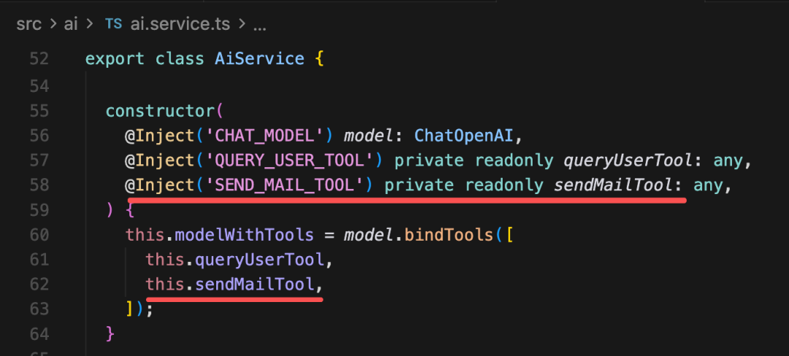

这样，我们就可以用自然语言调用这个工具了。

测试：

```bash
curl "http://localhost:8000/ai/chat?query=给zhangsan@example.com发一封邮件，主题是测试，内容是这是一封测试邮件"
```

这样，邮件发送的 Tool 就跑通了。

---

## 网络搜索的 Tool

用博查的 API：https://open.bochaai.com/

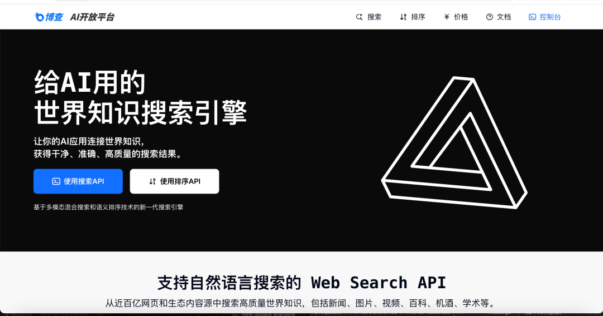

DeepSeek 的搜索就是用的这个：

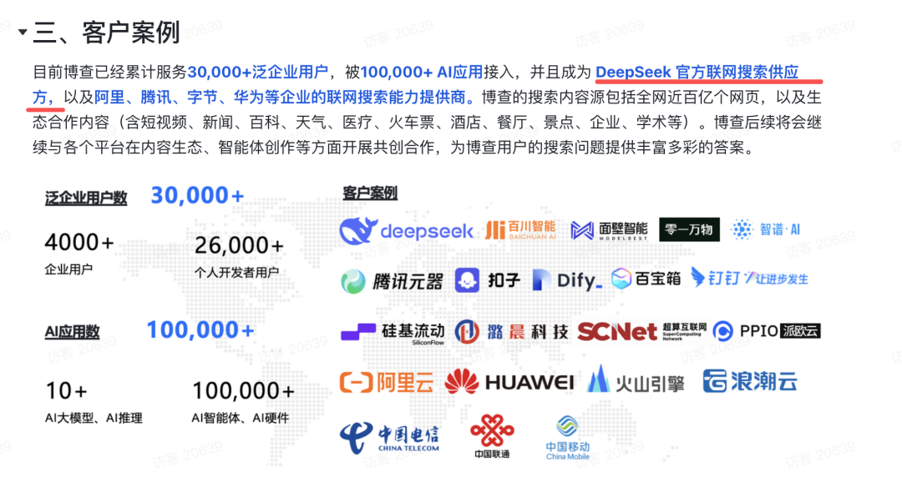

挺靠谱的。

### 网络搜索 Tool

更新 `modules/ai/tools.py`，添加网络搜索 Tool：

```python
"""
AI Tools：网络搜索 Tool
"""
import os
import httpx
from typing import Optional
from pydantic import BaseModel, Field
from langchain_core.tools import tool


class WebSearchArgs(BaseModel):
    """网络搜索参数"""
    query: str = Field(min_length=1, description="搜索关键词，例如：公司年报、某个事件等")
    count: Optional[int] = Field(None, ge=1, le=20, description="返回的搜索结果数量，默认 10 条")


def create_web_search_tool():
    """创建网络搜索 Tool（基于博查 API）"""

    @tool(args_schema=WebSearchArgs)
    async def web_search(query: str, count: Optional[int] = None) -> str:
        """
        使用 Bocha Web Search API 搜索互联网网页。输入为搜索关键词（可选 count 指定结果数量），
        返回包含标题、URL、摘要、网站名称、图标和时间等信息的结果列表。
        """
        api_key = os.getenv("BOCHA_API_KEY")
        if not api_key:
            return "Bocha Web Search 的 API Key 未配置（环境变量 BOCHA_API_KEY），请先在服务端配置后再重试。"

        url = "https://api.bochaai.com/v1/web-search"
        body = {
            "query": query,
            "freshness": "noLimit",
            "summary": True,
            "count": count or 10,
        }

        try:
            async with httpx.AsyncClient(timeout=30) as client:
                response = await client.post(
                    url,
                    headers={
                        "Authorization": f"Bearer {api_key}",
                        "Content-Type": "application/json",
                    },
                    json=body,
                )

                if response.status_code != 200:
                    return f"搜索 API 请求失败，状态码: {response.status_code}, 错误信息: {response.text}"

                data = response.json()

                if data.get("code") != 200 or not data.get("data"):
                    return f"搜索 API 请求失败，原因是: {data.get('msg', '未知错误')}"

                webpages = data.get("data", {}).get("webPages", {}).get("value", [])
                if not webpages:
                    return "未找到相关结果。"

                formatted = "\n\n".join([
                    f"""引用: {idx + 1}
标题: {page.get('name', '')}
URL: {page.get('url', '')}
摘要: {page.get('summary', '')}
网站名称: {page.get('siteName', '')}
发布时间: {page.get('dateLastCrawled', '')}"""
                    for idx, page in enumerate(webpages)
                ])

                return formatted

        except Exception as e:
            return f"搜索 API 请求失败，原因是：{str(e)}"

    return web_search
```

### 注册网络搜索 Tool

更新 `modules/ai/dependencies.py`，注册网络搜索 Tool：

```python
def get_ai_service() -> "AIService":
    """创建 AI Service 实例（注入所有 Tool）"""
    from .service import AIService
    from .tools import create_query_user_tool, create_send_mail_tool, create_web_search_tool

    user_service = get_user_service()
    model = get_chat_model()

    # 创建 Tool
    query_user_tool = create_query_user_tool(user_service)
    send_mail_tool = create_send_mail_tool()
    web_search_tool = create_web_search_tool()
    tools = [query_user_tool, send_mail_tool, web_search_tool]

    return AIService(model=model, tools=tools)
```

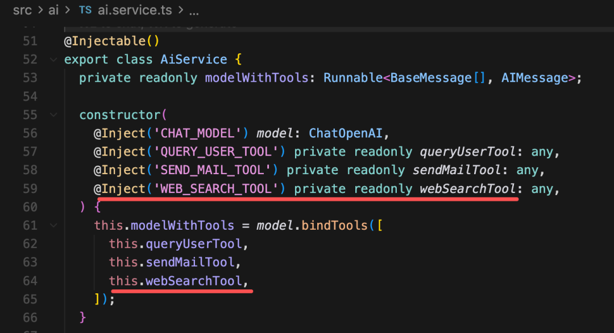

然后来测一下。当然，SSE 还是用界面测更好，我们加一个 HTML。

### 前端测试页面

创建 `public/ai-sse-test.html`：

```html
<!doctype html>
<html lang="zh-CN">
<head>
    <meta charset="UTF-8">
    <title>AI SSE Chat 测试</title>
    <style>
        * { box-sizing: border-box; }
        body {
            margin: 0;
            min-height: 100vh;
            font-family: system-ui, -apple-system, sans-serif;
            display: flex;
            align-items: center;
            justify-content: center;
            background: #f5f5f5;
            padding: 24px 16px;
        }
        .shell { width: 100%; max-width: 720px; }
        h1 { font-size: 20px; margin: 0 0 12px; }
        .card {
            background: #ffffff;
            border-radius: 10px;
            border: 1px solid #e5e7eb;
            box-shadow: 0 4px 12px rgba(15, 23, 42, 0.06);
            padding: 16px 18px 18px;
        }
        label { display: block; font-size: 13px; margin-bottom: 6px; color: #6b7280; }
        textarea {
            width: 100%;
            min-height: 80px;
            padding: 8px 10px;
            border-radius: 8px;
            border: 1px solid #d1d5db;
            resize: vertical;
            font-family: inherit;
            font-size: 14px;
            outline: none;
        }
        textarea:focus { border-color: #3b82f6; box-shadow: 0 0 0 1px rgba(59, 130, 246, 0.3); }
        .controls { display: flex; align-items: center; margin-top: 10px; gap: 10px; }
        button {
            padding: 6px 14px;
            border-radius: 999px;
            border: 1px solid #2563eb;
            background: #3b82f6;
            color: #ffffff;
            font-size: 13px;
            cursor: pointer;
        }
        button:disabled { opacity: 0.7; cursor: not-allowed; }
        .status { font-size: 12px; color: #6b7280; }
        .output {
            margin-top: 16px;
            padding: 10px;
            border-radius: 8px;
            background: #111827;
            color: #e5e7eb;
            font-family: ui-monospace, monospace;
            white-space: pre-wrap;
            max-height: 360px;
            overflow-y: auto;
        }
    </style>
</head>
<body>
    <div class="shell">
        <div class="card">
            <h1>AI SSE Chat 测试</h1>
            <label for="query">输入你的问题：</label>
            <textarea id="query" placeholder="请输入要发送给 AI 的问题..."></textarea>
            <div class="controls">
                <button id="sendBtn">开始对话（SSE）</button>
                <div class="status" id="status">状态：待机</div>
            </div>
            <div class="output" id="output"></div>
        </div>
    </div>

    <script>
        const sendBtn = document.getElementById('sendBtn');
        const queryInput = document.getElementById('query');
        const outputEl = document.getElementById('output');
        const statusEl = document.getElementById('status');
        let es = null;

        function closeEventSource() {
            if (es) { es.close(); es = null; }
            sendBtn.disabled = false;
        }

        sendBtn.onclick = () => {
            const query = queryInput.value.trim();
            if (!query) { alert('请输入问题'); return; }

            closeEventSource();
            outputEl.textContent = '';
            sendBtn.disabled = true;
            statusEl.textContent = '状态：连接中…';

            const url = `/ai/chat/stream?query=${encodeURIComponent(query)}`;
            es = new EventSource(url);

            es.onopen = () => { statusEl.textContent = '状态：已连接，流式接收中…'; };

            es.onmessage = (event) => {
                try {
                    const parsed = JSON.parse(event.data);
                    if (parsed.content) outputEl.textContent += parsed.content;
                    if (parsed.done) { closeEventSource(); statusEl.textContent = '状态：完成'; }
                } catch (e) {
                    outputEl.textContent += event.data;
                }
            };

            es.onerror = () => { closeEventSource(); statusEl.textContent = '状态：连接已结束'; };
        };
    </script>
</body>
</html>
```

访问 http://localhost:8000/static/ai-sse-test.html

这样，网络搜索的 Tool 也跑通了。

---

## 学习要点

1. **定时任务是 Agent 常见功能**：OpenClaw、Nanobot 等都有实现，核心是到时间启动 Agent Loop
2. **Agent Loop**：用 `while True` 循环，直到没有 Tool Call 就返回，否则调用 Tool，结果通过 ToolMessage 加入消息
3. **流式处理**：判断 `tool_call_chunks` 是否出现，没出现就直接 yield 文本内容，出现了就进入工具调用逻辑
4. **Tool 里调用 Service**：通过工厂函数创建 Tool，注入 Service 依赖，实现 Tool 和业务逻辑的解耦
5. **依赖注入**：FastAPI 通过 `Depends()` 实现依赖注入，单例 Service 可以全局复用
6. **邮件 Tool**：用 `aiosmtplib` 异步发送邮件，支持 SMTP 服务（如 QQ 邮箱）
7. **网络搜索 Tool**：用博查 API（DeepSeek 同款）实现网络搜索，返回格式化的搜索结果
8. **SSE 前端**：用 `EventSource` 监听 SSE 的 `message` 事件，实时显示流式内容
9. **本篇（上）**主要实现 Tool 功能和 AI 接口，**定时任务调度功能**在下篇实现

## 扩展方向

- 下篇实现定时任务调度器（APScheduler / Celery）
- 实现心跳机制（定期主动执行任务）
- 添加更多 Tool（文件操作、数据库操作、API 调用等）
- 实现 Tool 的权限控制和审计日志
- 探索 LangGraph 实现更复杂的 Agent 流程
- 实现任务管理界面（查看、编辑、删除定时任务）

---

## 配套代码库

**代码库地址**：https://github.com/iiixiyan/agent-learning-code/tree/main/02-enterprise-backend/21-cron-job-tool-part1

包含本文的完整可运行代码示例（FastAPI + Tool + Agent Loop + SSE + 邮件/搜索 Tool）。

---

**上一篇**：[FastAPI + LangChain 实现 SSE 流式接口](./20_FastAPI+LangChain实现SSE流式接口.md) | **下一篇**：[FastAPI + Tool 实现定时任务（下）](./22_FastAPI+tool实现定时任务(下).md)
