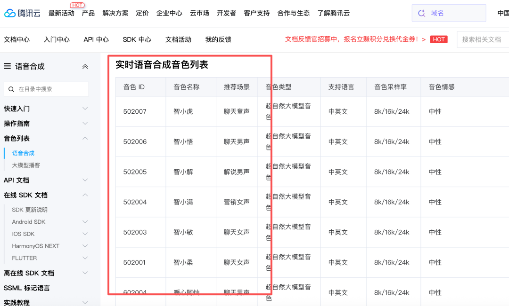
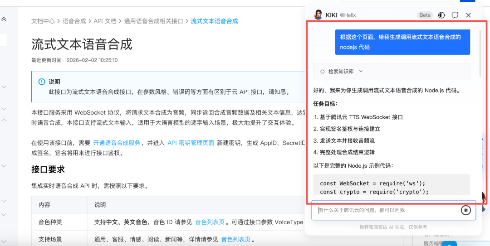
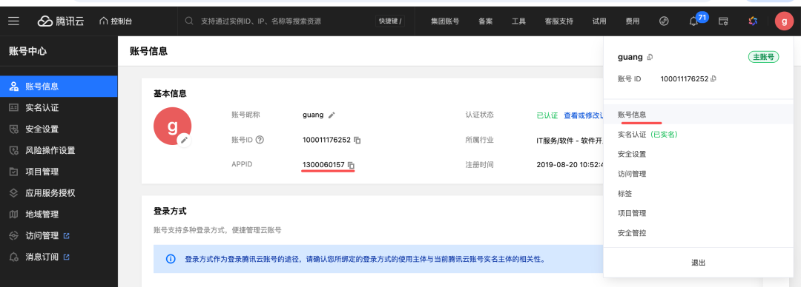
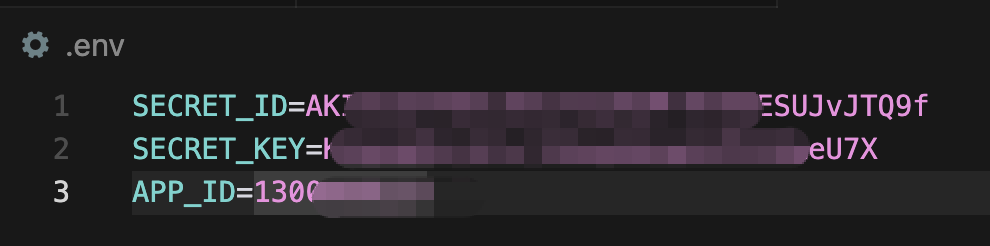
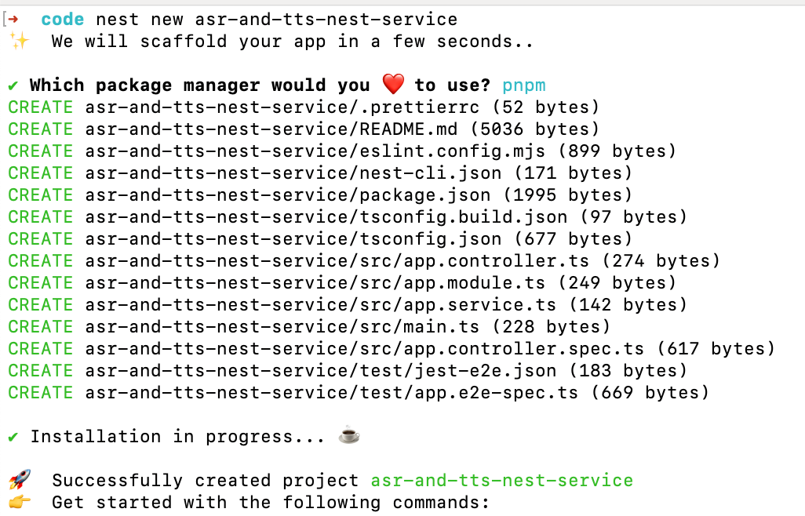
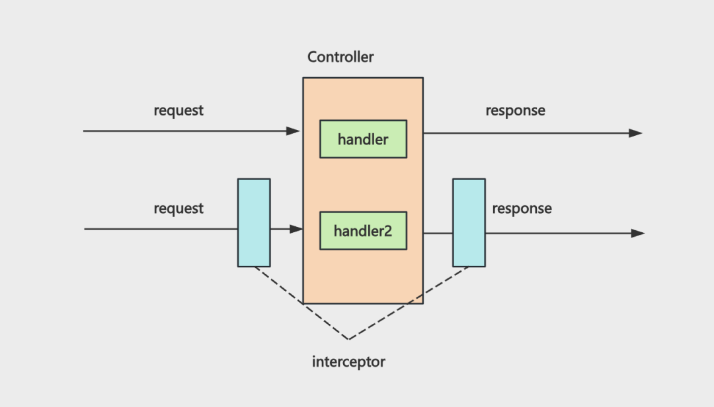

# 给 Agent 加上语音交互：ASR + 流式 TTS

> **Python 版** | 基于 FastAPI + 腾讯云语音 + LangChain Python 技术栈
> 原课程基于 Node.js(Nest.js) + LangChain JS，本文转换为 Python(FastAPI) + LangChain Python 版本

---

## 为什么需要语音交互？

我们常用的 Agent 都有语音功能。比如你用豆包的时候，语音输入会转成文字，大模型的回答会通过语音朗读，还可以切换音色。

这种 **STT（Speech To Text）** 语音转文字，**TTS（Text To Speech）** 文字转语音，基本是 Agent 开发必备技术了。

这节我们就来学一下语音相关技术，实现豆包同款功能。

## 整体架构

```
┌──────────────┐     语音文件      ┌──────────────┐
│   前端页面    │ ────────────────→ │  ASR 接口    │
│ (录音/播放)   │ ←──────────────── │ (语音转文字)  │
└──────┬───────┘     文字结果       └──────┬───────┘
       │                                     │
       │         SSE 流式文字                │
       ├─────────────────────────────────────┤
       │                                     ▼
       │                              ┌──────────────┐
       │                              │  大模型接口   │
       │                              │ (生成回答)    │
       │                              └──────┬───────┘
       │                                     │
       │         WebSocket 流式语音           │
       └─────────────────────────────────────┤
                                             ▼
                                      ┌──────────────┐
                                      │  流式 TTS    │
                                      │ (文字转语音)  │
                                      └──────────────┘
```

| 技术 | 说明 | 协议 |
|------|------|------|
| **ASR** | 语音转文字 | HTTP（上传音频文件） |
| **大模型** | 生成回答 | SSE（流式返回文字） |
| **流式 TTS** | 文字转语音 | WebSocket（流式返回音频） |

> **为什么 TTS 用 WebSocket 而不是 SSE？**
> 因为 SSE 是基于 HTTP 的文本协议，传输二进制音频数据需要转 Base64，效率低。WebSocket 支持二进制数据传输，更适合流式语音。

---

## 一、TTS 文字转语音（基础版）

我们用腾讯云的语音（各家用法都差不多）。

https://console.cloud.tencent.com/tts

拿到 SecretId、SecretKey 之后，就可以调用 API 了。

### 安装依赖

```bash
pip install tencentcloud-sdk-python python-dotenv
```

### 配置文件

创建 `.env`：

```env
# 腾讯云语音配置
SECRET_ID=你的SecretId
SECRET_KEY=你的SecretKey
APP_ID=你的AppId
```

### TTS 基础示例

```python
"""
tts_test.py - 文字转语音基础示例
"""
import os
import base64
from dotenv import load_dotenv
from tencentcloud.common import credential
from tencentcloud.tts.v20190823 import tts_client, models

load_dotenv()

# 初始化客户端
cred = credential.Credential(
    os.getenv("SECRET_ID"),
    os.getenv("SECRET_KEY")
)
client = tts_client.TtsClient(cred, "ap-beijing")

# 构造请求
req = models.TextToVoiceRequest()
req.Text = "下班路上，我还在为晚霞开心。突然电话响起：系统崩了。我的心一下揪紧，冲进办公室时几乎要绝望。可当大家一起排查、重启，屏幕终于恢复正常，我长长松了口气，笑着说：还好，我们没放弃。"
req.SessionId = "session-001"
req.VoiceType = 502006  # 音色 ID
req.Codec = "mp3"  # 输出格式

# 调用接口
resp = client.TextToVoice(req)

# 返回的 Audio 字段是 Base64 编码的音频数据
audio_data = base64.b64decode(resp.Audio)

# 保存为 MP3 文件
with open("output.mp3", "wb") as f:
    f.write(audio_data)

print("MP3 已保存至：output.mp3")
```

### 音色 ID 参考

音色 ID 从这里找：https://cloud.tencent.com/document/product/1073/92668



| 音色 ID | 名称 | 性别 | 风格 |
|---------|------|------|------|
| 101001 | 智瑜 | 女 | 通用 |
| 101002 | 智云 | 男 | 通用 |
| 502006 | 智甜 | 女 | 甜美女声 |

运行：

```bash
python tts_test.py
```

但这种直接传入全部文本生成语音的方式，显然不太适合我们的场景。比如豆包流式返回回答，语音也是流式播放的。这种就需要用**流式语音合成接口**了，它是 WebSocket 的。

---

## 二、流式 TTS（WebSocket 版）

https://cloud.tencent.com/document/product/1073/108595



### 流式 TTS 示例

```python
"""
streaming_tts_test.py - 流式文字转语音示例（WebSocket）
"""
import os
import time
import json
import hmac
import hashlib
import base64
import asyncio
from dotenv import load_dotenv
import websockets

load_dotenv()

SECRET_ID = os.getenv("SECRET_ID")
SECRET_KEY = os.getenv("SECRET_KEY")
APP_ID = os.getenv("APP_ID")
VOICE_TYPE = 101001
OUTPUT_FILE = "output_stream.mp3"

# 模拟流式返回的文本片段
TEXTS = [
    "傍晚我还在为晚霞开心，",
    "突然接到电话说系统崩了，",
    "我心里一沉冲回办公室，",
    "好在大家一起排查后终于恢复，",
    "我长长松了口气。",
]


def build_ws_url():
    """构造 WebSocket 连接 URL（含签名）"""
    now = int(time.time())
    session_id = f"session_{now}_{int(time.time() * 1000)}"

    params = {
        "Action": "TextToStreamAudioWSv2",
        "AppId": int(APP_ID),
        "Codec": "mp3",
        "Expired": now + 3600,
        "SampleRate": 16000,
        "SecretId": SECRET_ID,
        "SessionId": session_id,
        "Speed": 0,
        "Timestamp": now,
        "VoiceType": VOICE_TYPE,
        "Volume": 5,
    }

    # 构造签名字符串
    sorted_keys = sorted(params.keys())
    sign_str = "&".join([f"{k}={params[k]}" for k in sorted_keys])
    raw_str = f"GETtts.cloud.tencent.com/stream_wsv2?{sign_str}"

    # HMAC-SHA1 签名
    signature = base64.b64encode(
        hmac.new(SECRET_KEY.encode(), raw_str.encode(), hashlib.sha1).digest()
    ).decode()

    # 构造完整 URL
    query_params = "&".join([f"{k}={params[k]}" for k in sorted_keys])
    url = f"wss://tts.cloud.tencent.com/stream_wsv2?{query_params}&Signature={signature}"

    return session_id, url


async def stream_tts():
    """流式 TTS 主函数"""
    if not all([SECRET_ID, SECRET_KEY, APP_ID]):
        raise ValueError("请先在 .env 配置 SECRET_ID、SECRET_KEY、APP_ID")

    session_id, url = build_ws_url()
    total_bytes = 0
    sent = False

    async with websockets.connect(url) as ws:
        print("[连接] WebSocket 已建立")

        with open(OUTPUT_FILE, "wb") as f:
            while True:
                try:
                    message = await asyncio.wait_for(ws.recv(), timeout=30)
                except asyncio.TimeoutError:
                    print("[超时] 等待消息超时")
                    break

                # 判断是二进制数据还是文本消息
                if isinstance(message, bytes):
                    # 二进制音频数据，直接写入文件
                    f.write(message)
                    total_bytes += len(message)
                    continue

                # 文本消息（JSON）
                msg = json.loads(message)
                print("[消息]", json.dumps(msg, ensure_ascii=False))

                # 服务端就绪，开始发送文本
                if msg.get("ready") == 1 and not sent:
                    sent = True
                    for i, text in enumerate(TEXTS):
                        await ws.send(json.dumps({
                            "session_id": session_id,
                            "message_id": f"msg_{i}",
                            "action": "ACTION_SYNTHESIS",
                            "data": text,
                        }))
                        print(f"[文本] 已发送: {text}")
                        await asyncio.sleep(3)  # 模拟流式间隔

                    # 发送完成信号
                    await ws.send(json.dumps({
                        "session_id": session_id,
                        "action": "ACTION_COMPLETE",
                    }))
                    print("[文本] 已发送 ACTION_COMPLETE")

                # 错误处理
                if msg.get("code") and msg.get("code") != 0:
                    print(f"[错误] code={msg['code']}, message={msg.get('message')}")
                    break

                # 合成完成
                if msg.get("final") == 1:
                    print("[完成] 合成结束")
                    break

    print(f"[保存] 音频已保存至 {OUTPUT_FILE}，共 {total_bytes} 字节")


if __name__ == "__main__":
    asyncio.run(stream_tts())
```

### AppId 获取

AppId 从腾讯云控制台获取：



加到 `.env` 里：



运行：

```bash
pip install websockets
python streaming_tts_test.py
```

因为文本是流式返回的，所以语音一般也要流式生成，用 streaming TTS 的接口。

---

## 三、ASR 语音识别

接下来试一下语音识别 ASR（Automatic Speech Recognition），叫 STT（Speech To Text）也可以，但 ASR 用的多一些。

这个就不用流式了。你平时用豆包的时候，都是说完一段话才转成的文本。

### ASR 示例

```python
"""
asr_test.py - 语音识别示例
"""
import os
import base64
from dotenv import load_dotenv
from tencentcloud.common import credential
from tencentcloud.asr.v20190614 import asr_client, models

load_dotenv()

# 初始化客户端
cred = credential.Credential(
    os.getenv("SECRET_ID"),
    os.getenv("SECRET_KEY")
)
client = asr_client.AsrClient(cred, "ap-shanghai")

# 读取音频文件并转 Base64
with open("output.mp3", "rb") as f:
    audio_data = f.read()
audio_base64 = base64.b64encode(audio_data).decode()

# 构造请求
req = models.SentenceRecognitionRequest()
req.EngSerViceType = "16k_zh"  # 16k 中文
req.SourceType = 1  # 1: 音频数据 Base64
req.Data = audio_base64
req.DataLen = len(audio_base64)
req.VoiceFormat = "mp3"  # 音频格式

# 调用接口
resp = client.SentenceRecognition(req)

print("识别结果：", resp.Result)
```

安装依赖：

```bash
pip install tencentcloud-sdk-python
```

运行：

```bash
python asr_test.py
```

这样，我们就可以来实现豆包同款的语音交互了。

---

## 四、实现豆包同款语音交互

### 整体流程

1. 点击录音，输入一段语音
2. 服务端提供接口来转文字（ASR）
3. 用大模型生成回答
4. 流式 SSE 返回文字
5. 同时用 WebSocket 返回流式语音

### 创建后端项目

```bash
mkdir asr-tts-fastapi
cd asr-tts-fastapi
python -m venv venv
source venv/bin/activate

pip install fastapi uvicorn python-multipart python-dotenv \
    langchain langchain-openai tencentcloud-sdk-python websockets
```



### 项目结构

```
asr-tts-fastapi/
├── .env
├── main.py
├── modules/
│   ├── __init__.py
│   ├── ai/
│   │   ├── __init__.py
│   │   ├── router.py       # 大模型 SSE 接口
│   │   └── service.py      # 大模型业务逻辑
│   └── speech/
│       ├── __init__.py
│       ├── router.py       # ASR + 流式 TTS 接口
│       └── service.py      # 语音业务逻辑
└── public/
    └── voice-chat.html     # 前端语音交互页面
```

### 1. 大模型 SSE 接口

创建 `modules/ai/service.py`：

```python
"""
AI Service：大模型业务逻辑
"""
import os
from dotenv import load_dotenv
from langchain_openai import ChatOpenAI
from langchain_core.prompts import PromptTemplate
from langchain_core.output_parsers import StrOutputParser

load_dotenv()


class AIService:
    """AI 服务"""

    def __init__(self):
        prompt = PromptTemplate.from_template("请回答以下问题：\n\n{query}")
        model = ChatOpenAI(
            model=os.getenv("MODEL_NAME", "qwen-plus"),
            api_key=os.getenv("OPENAI_API_KEY"),
            base_url=os.getenv("OPENAI_BASE_URL"),
        )
        self.chain = prompt | model | StrOutputParser()

    async def stream_chain(self, query: str):
        """流式调用 Chain"""
        async for chunk in self.chain.astream({"query": query}):
            yield chunk
```

创建 `modules/ai/router.py`：

```python
"""
AI Router：大模型 SSE 接口
"""
import json
from fastapi import APIRouter, Depends, Query
from fastapi.responses import StreamingResponse
from .service import AIService

router = APIRouter(prefix="/ai", tags=["AI 接口"])


def get_ai_service() -> AIService:
    return AIService()


@router.get("/chat/stream", summary="流式对话接口（SSE）")
async def chat_stream(
    query: str = Query(..., description="用户问题"),
    service: AIService = Depends(get_ai_service),
):
    """流式对话接口：基于 SSE 实时返回文字"""

    async def event_generator():
        try:
            async for chunk in service.stream_chain(query):
                yield f"data: {json.dumps({'content': chunk}, ensure_ascii=False)}\n\n"
            yield f"data: {json.dumps({'done': True}, ensure_ascii=False)}\n\n"
        except Exception as e:
            yield f"data: {json.dumps({'error': str(e)}, ensure_ascii=False)}\n\n"

    return StreamingResponse(
        event_generator(),
        media_type="text/event-stream",
        headers={"Cache-Control": "no-cache", "Connection": "keep-alive"},
    )
```

### 2. ASR 语音识别接口

创建 `modules/speech/service.py`：

```python
"""
Speech Service：语音业务逻辑（ASR + 流式 TTS）
"""
import os
import time
import json
import hmac
import hashlib
import base64
from dotenv import load_dotenv
from tencentcloud.common import credential
from tencentcloud.asr.v20190614 import asr_client, models

load_dotenv()


class SpeechService:
    """语音服务"""

    def __init__(self):
        cred = credential.Credential(
            os.getenv("SECRET_ID"),
            os.getenv("SECRET_KEY"),
        )
        self.asr_client = asr_client.AsrClient(cred, "ap-shanghai")

    async def recognize_by_sentence(self, audio_data: bytes) -> str:
        """
        语音识别（短句识别）

        Args:
            audio_data: 音频二进制数据

        Returns:
            str: 识别出的文字
        """
        audio_base64 = base64.b64encode(audio_data).decode()

        req = models.SentenceRecognitionRequest()
        req.EngSerViceType = "16k_zh"
        req.SourceType = 1
        req.Data = audio_base64
        req.DataLen = len(audio_base64)
        req.VoiceFormat = "mp3"

        resp = self.asr_client.SentenceRecognition(req)
        return resp.Result or ""

    def build_tts_ws_url(self, voice_type: int = 101001):
        """
        构造流式 TTS WebSocket URL

        Args:
            voice_type: 音色 ID

        Returns:
            tuple: (session_id, ws_url)
        """
        now = int(time.time())
        session_id = f"session_{now}_{int(time.time() * 1000)}"

        params = {
            "Action": "TextToStreamAudioWSv2",
            "AppId": int(os.getenv("APP_ID")),
            "Codec": "mp3",
            "Expired": now + 3600,
            "SampleRate": 16000,
            "SecretId": os.getenv("SECRET_ID"),
            "SessionId": session_id,
            "Speed": 0,
            "Timestamp": now,
            "VoiceType": voice_type,
            "Volume": 5,
        }

        sorted_keys = sorted(params.keys())
        sign_str = "&".join([f"{k}={params[k]}" for k in sorted_keys])
        raw_str = f"GETtts.cloud.tencent.com/stream_wsv2?{sign_str}"

        signature = base64.b64encode(
            hmac.new(
                os.getenv("SECRET_KEY").encode(),
                raw_str.encode(),
                hashlib.sha1,
            ).digest()
        ).decode()

        query_params = "&".join([f"{k}={params[k]}" for k in sorted_keys])
        url = f"wss://tts.cloud.tencent.com/stream_wsv2?{query_params}&Signature={signature}"

        return session_id, url
```

创建 `modules/speech/router.py`：

```python
"""
Speech Router：语音接口（ASR 上传 + 流式 TTS WebSocket）
"""
from fastapi import APIRouter, UploadFile, File, HTTPException, WebSocket, WebSocketDisconnect
from .service import SpeechService
import websockets
import json
import asyncio

router = APIRouter(prefix="/speech", tags=["语音接口"])


def get_speech_service() -> SpeechService:
    return SpeechService()


@router.post("/asr", summary="语音识别接口（ASR）")
async def recognize(
    audio: UploadFile = File(..., description="音频文件"),
    service: SpeechService = Depends(get_speech_service),
):
    """
    语音识别接口：上传音频文件，返回识别出的文字

    - **audio**: 音频文件（mp3/wav/ogg 格式）
    """
    if not audio:
        raise HTTPException(status_code=400, detail="请上传音频文件")

    audio_data = await audio.read()
    if not audio_data:
        raise HTTPException(status_code=400, detail="音频文件为空")

    text = await service.recognize_by_sentence(audio_data)
    return {"text": text}


@router.websocket("/tts/stream")
async def tts_stream(websocket: WebSocket):
    """
    流式 TTS WebSocket 接口

    客户端发送 JSON: {"text": "要合成的文本", "voice_type": 101001}
    服务端返回二进制音频数据（mp3）
    """
    await websocket.accept()
    service = get_speech_service()

    try:
        while True:
            # 接收客户端消息
            data = await websocket.receive_text()
            msg = json.loads(data)

            text = msg.get("text", "")
            voice_type = msg.get("voice_type", 101001)

            if not text:
                continue

            # 构造腾讯云流式 TTS WebSocket URL
            session_id, tts_url = service.build_tts_ws_url(voice_type)

            # 连接腾讯云流式 TTS
            async with websockets.connect(tts_url) as tts_ws:
                sent = False

                while True:
                    try:
                        tts_msg = await asyncio.wait_for(tts_ws.recv(), timeout=30)
                    except asyncio.TimeoutError:
                        break

                    # 二进制音频数据，转发给客户端
                    if isinstance(tts_msg, bytes):
                        await websocket.send_bytes(tts_msg)
                        continue

                    # 文本消息
                    tts_data = json.loads(tts_msg)

                    # 服务端就绪，发送文本
                    if tts_data.get("ready") == 1 and not sent:
                        sent = True
                        await tts_ws.send(json.dumps({
                            "session_id": session_id,
                            "message_id": "msg_0",
                            "action": "ACTION_SYNTHESIS",
                            "data": text,
                        }))
                        await tts_ws.send(json.dumps({
                            "session_id": session_id,
                            "action": "ACTION_COMPLETE",
                        }))

                    # 错误
                    if tts_data.get("code") and tts_data.get("code") != 0:
                        await websocket.send_text(json.dumps({
                            "error": tts_data.get("message"),
                        }))
                        break

                    # 完成
                    if tts_data.get("final") == 1:
                        await websocket.send_text(json.dumps({"done": True}))
                        break

    except WebSocketDisconnect:
        print("客户端断开连接")
    except Exception as e:
        print(f"WebSocket 错误: {e}")
```

### 3. 应用入口

创建 `main.py`：

```python
"""
main.py - 语音交互应用入口
"""
from fastapi import FastAPI
from fastapi.staticfiles import StaticFiles
from modules.ai.router import router as ai_router
from modules.speech.router import router as speech_router

app = FastAPI(title="Agent 语音交互服务", version="1.0.0")

# 注册路由
app.include_router(ai_router)
app.include_router(speech_router)

# 挂载静态文件
app.mount("/static", StaticFiles(directory="public"), name="static")


@app.get("/", summary="健康检查")
async def root():
    return {"message": "Agent 语音交互服务运行中"}


if __name__ == "__main__":
    import uvicorn
    uvicorn.run(app, host="0.0.0.0", port=8000)
```

### 4. 前端语音交互页面

创建 `public/voice-chat.html`：

```html
<!DOCTYPE html>
<html lang="zh-CN">
<head>
    <meta charset="UTF-8">
    <meta name="viewport" content="width=device-width, initial-scale=1.0">
    <title>Agent 语音交互</title>
    <style>
        * { box-sizing: border-box; }
        body {
            font-family: system-ui, -apple-system, sans-serif;
            max-width: 720px;
            margin: 40px auto;
            padding: 0 16px;
            line-height: 1.6;
        }
        h1 { text-align: center; color: #333; }
        .controls {
            display: flex;
            gap: 10px;
            margin: 20px 0;
            flex-wrap: wrap;
        }
        button {
            padding: 10px 20px;
            font-size: 14px;
            border: none;
            border-radius: 8px;
            cursor: pointer;
            background: #3b82f6;
            color: white;
        }
        button:disabled { opacity: 0.5; cursor: not-allowed; }
        button.recording { background: #ef4444; }
        select {
            padding: 10px;
            border-radius: 8px;
            border: 1px solid #ccc;
        }
        .status {
            padding: 10px;
            background: #f3f4f6;
            border-radius: 8px;
            margin: 10px 0;
            font-size: 14px;
            color: #666;
        }
        .chat-box {
            border: 1px solid #e5e7eb;
            border-radius: 12px;
            padding: 16px;
            margin: 16px 0;
            min-height: 200px;
            background: #fafafa;
        }
        .message {
            margin: 10px 0;
            padding: 10px 14px;
            border-radius: 10px;
            max-width: 85%;
        }
        .message.user {
            background: #dbeafe;
            margin-left: auto;
        }
        .message.assistant {
            background: #f0fdf4;
        }
        .audio-player {
            margin-top: 10px;
        }
    </style>
</head>
<body>
    <h1>🎙️ Agent 语音交互</h1>

    <div class="controls">
        <button id="recordBtn">🎤 开始录音</button>
        <select id="voiceSelect">
            <option value="101001">智瑜（女声）</option>
            <option value="101002">智云（男声）</option>
            <option value="502006">智甜（甜美女声）</option>
        </select>
    </div>

    <div class="status" id="status">准备就绪，点击录音开始</div>
    <div class="chat-box" id="chatBox"></div>

    <script>
        const recordBtn = document.getElementById('recordBtn');
        const voiceSelect = document.getElementById('voiceSelect');
        const statusEl = document.getElementById('status');
        const chatBox = document.getElementById('chatBox');

        let mediaRecorder = null;
        let audioChunks = [];
        let isRecording = false;
        let ttsWebSocket = null;
        let audioContext = null;
        let audioQueue = [];
        let isPlaying = false;

        // 录音
        recordBtn.addEventListener('click', async () => {
            if (!isRecording) {
                try {
                    const stream = await navigator.mediaDevices.getUserMedia({ audio: true });
                    mediaRecorder = new MediaRecorder(stream);
                    audioChunks = [];

                    mediaRecorder.ondataavailable = (e) => {
                        if (e.data.size > 0) audioChunks.push(e.data);
                    };

                    mediaRecorder.onstop = async () => {
                        const audioBlob = new Blob(audioChunks, { type: 'audio/webm' });
                        await sendAudio(audioBlob);
                        stream.getTracks().forEach(track => track.stop());
                    };

                    mediaRecorder.start();
                    isRecording = true;
                    recordBtn.textContent = '⏹️ 停止录音';
                    recordBtn.classList.add('recording');
                    statusEl.textContent = '正在录音...';
                } catch (err) {
                    statusEl.textContent = '录音失败：' + err.message;
                }
            } else {
                mediaRecorder.stop();
                isRecording = false;
                recordBtn.textContent = '🎤 开始录音';
                recordBtn.classList.remove('recording');
                statusEl.textContent = '正在识别...';
            }
        });

        // 发送音频到 ASR 接口
        async function sendAudio(audioBlob) {
            const formData = new FormData();
            formData.append('audio', audioBlob, 'recording.webm');

            try {
                const resp = await fetch('/speech/asr', {
                    method: 'POST',
                    body: formData,
                });
                const data = await resp.json();

                if (data.text) {
                    addMessage('user', data.text);
                    statusEl.textContent = '正在生成回答...';
                    await chatAndTTS(data.text);
                } else {
                    statusEl.textContent = '未识别到语音内容';
                }
            } catch (err) {
                statusEl.textContent = '识别失败：' + err.message;
            }
        }

        // 大模型对话 + 流式 TTS
        async function chatAndTTS(query) {
            // 1. SSE 获取大模型回答
            const assistantMsg = addMessage('assistant', '');
            let fullAnswer = '';

            const eventSource = new EventSource(`/ai/chat/stream?query=${encodeURIComponent(query)}`);

            eventSource.onmessage = (event) => {
                try {
                    const data = JSON.parse(event.data);
                    if (data.content) {
                        fullAnswer += data.content;
                        assistantMsg.textContent = fullAnswer;
                    }
                    if (data.done) {
                        eventSource.close();
                        statusEl.textContent = '正在生成语音...';
                        // 2. 流式 TTS 播放
                        playTTS(fullAnswer);
                    }
                } catch (e) {
                    fullAnswer += event.data;
                    assistantMsg.textContent = fullAnswer;
                }
            };

            eventSource.onerror = () => {
                eventSource.close();
                statusEl.textContent = '对话结束';
            };
        }

        // 流式 TTS 播放
        async function playTTS(text) {
            const voiceType = voiceSelect.value;

            // 连接 WebSocket
            ttsWebSocket = new WebSocket(`ws://${window.location.host}/speech/tts/stream`);
            audioQueue = [];
            isPlaying = false;

            ttsWebSocket.onopen = () => {
                statusEl.textContent = '正在播放语音...';
                ttsWebSocket.send(JSON.stringify({ text, voice_type: parseInt(voiceType) }));
            };

            ttsWebSocket.onmessage = async (event) => {
                if (event.data instanceof Blob) {
                    // 二进制音频数据
                    audioQueue.push(event.data);
                    if (!isPlaying) playNextAudio();
                } else {
                    try {
                        const data = JSON.parse(event.data);
                        if (data.done) {
                            statusEl.textContent = '播放完成';
                        }
                        if (data.error) {
                            statusEl.textContent = '语音生成失败：' + data.error;
                        }
                    } catch (e) {}
                }
            };

            ttsWebSocket.onerror = () => {
                statusEl.textContent = '语音连接错误';
            };
        }

        // 播放下一段音频
        async function playNextAudio() {
            if (audioQueue.length === 0) {
                isPlaying = false;
                return;
            }

            isPlaying = true;
            const blob = audioQueue.shift();

            if (!audioContext) {
                audioContext = new (window.AudioContext || window.webkitAudioContext)();
            }

            const arrayBuffer = await blob.arrayBuffer();
            const audioBuffer = await audioContext.decodeAudioData(arrayBuffer);

            const source = audioContext.createBufferSource();
            source.buffer = audioBuffer;
            source.connect(audioContext.destination);
            source.onended = () => playNextAudio();
            source.start();
        }

        // 添加消息
        function addMessage(role, content) {
            const msg = document.createElement('div');
            msg.className = `message ${role}`;
            msg.textContent = content;
            chatBox.appendChild(msg);
            chatBox.scrollTop = chatBox.scrollHeight;
            return msg;
        }
    </script>
</body>
</html>
```

### 5. 运行

```bash
uvicorn main:app --reload
```

访问 http://localhost:8000/static/voice-chat.html



---

## 学习要点

1. **ASR（语音识别）**：用腾讯云 `SentenceRecognition` 接口，上传音频文件 Base64，返回识别文字
2. **TTS（文字转语音）**：基础版用 `TextToVoice` 接口，返回 Base64 音频数据；流式版用 WebSocket
3. **流式 TTS**：通过 WebSocket 连接腾讯云流式合成接口，逐段发送文本，实时接收二进制音频数据
4. **签名机制**：腾讯云 API 需要 HMAC-SHA1 签名，构造签名字符串时参数按字母排序
5. **SSE vs WebSocket**：SSE 适合文本流式传输（大模型回答），WebSocket 适合二进制数据传输（流式音频）
6. **FastAPI 文件上传**：用 `UploadFile` 接收音频文件，`File()` 装饰器解析表单文件
7. **FastAPI WebSocket**：用 `@router.websocket()` 装饰器定义 WebSocket 接口，`websocket.receive_text()` / `websocket.send_bytes()` 收发数据
8. **前端录音**：用 `MediaRecorder` API 录制音频，`navigator.mediaDevices.getUserMedia()` 获取麦克风权限
9. **前端播放**：用 `AudioContext` API 解码和播放二进制音频数据，实现流式播放

## 扩展方向

- 实现实时语音识别（流式 ASR），边说边转文字
- 添加更多音色选择和语速、语调调节
- 实现语音打断功能（用户说话时暂停播放）
- 添加对话历史记录和语音回放
- 集成更多语音服务商（阿里云、百度、讯飞等）
- 实现多语言语音识别和合成
- 添加语音唤醒功能（关键词唤醒）
- 优化音频播放的缓冲和延迟

---

## 配套代码库

**代码库地址**：https://github.com/iiixiyan/agent-learning-code/tree/main/02-enterprise-backend/23-voice-interaction

包含本文的完整可运行代码示例（FastAPI + ASR + 流式 TTS + 前端语音交互页面）。

---

**上一篇**：[FastAPI + Tool 实现定时任务（下）](./22_FastAPI+tool实现定时任务(下).md) | **下一篇**：[AGUI 协议](./24_AGUI协议.md)
