# 图编排引擎：LangGraph 和多 Agent 架构

> **Python 版** | 基于 LangGraph Python + LangChain Python 技术栈
> 原课程基于 Node.js + LangChain JS，本文转换为 Python 版本

---

## 为什么需要多 Agent 架构？

复杂的 Agent 产品基本都是多 Agent 架构。为什么呢？

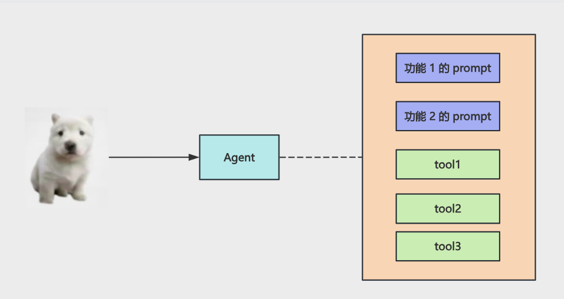

### 原因一：决策准确率更高、token 消耗更低

单 Agent 架构下，所有 Tool 的描述、每个功能的 Prompt 都放到 System Prompt 里。实际上执行每个功能只需要其中一部分 Prompt，但每次都全带上。这样会导致：
- Token 消耗更高
- 无关信息干扰，思考效率低
- 更容易出错

而如果你拆分成多个 Agent 呢？

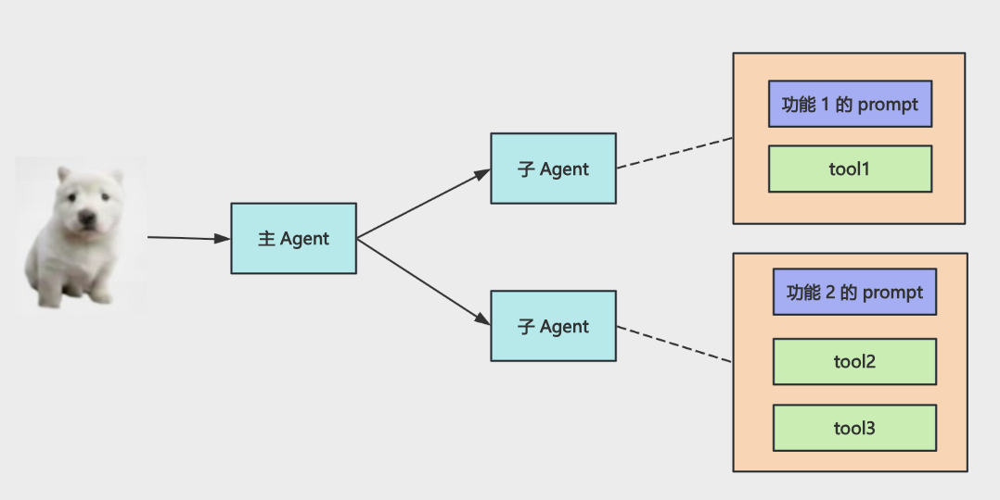

每个 Agent 只保留需要的 Prompt，执行功能的时候：
- 消耗的 Token 更少
- 没有无关信息干扰
- 准确率更高

### 原因二：并行思考和任务处理

单 Agent 只有一个大脑，需要一步步思考，调用 Tool：

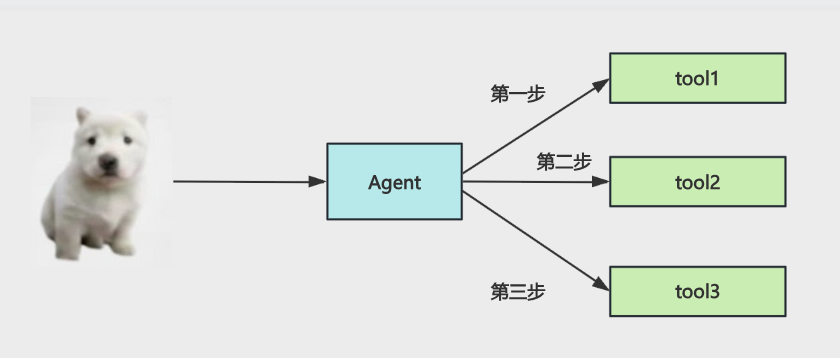

而多 Agent 的多个大脑可以并行思考，主 Agent 下发任务，子 Agent 并行处理完成后返回：

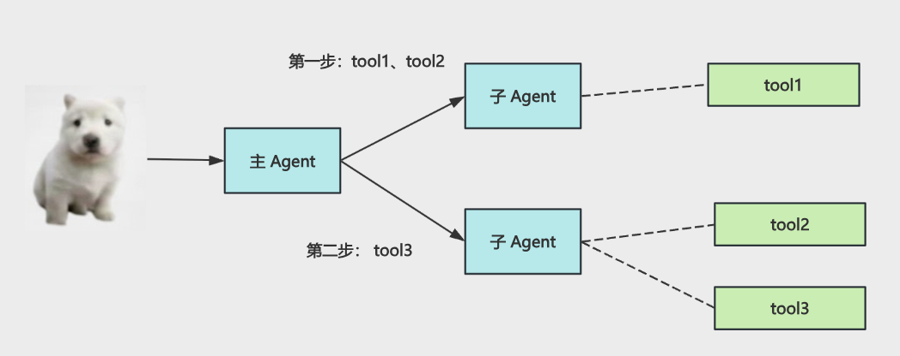

### 原因三：多角色互相讨论，纠错能力更强

单 Agent 虽然可以加上反思阶段，但相当于自己给自己纠错。

而多 Agent 每个都是不同的角色，可以互相讨论纠错：

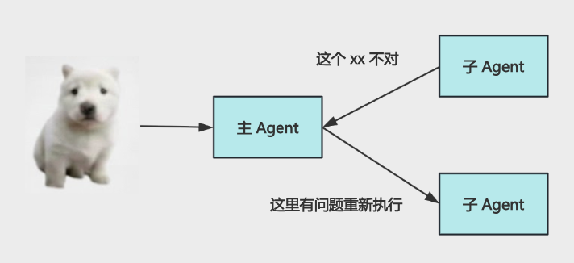

### 总结

| 优势 | 说明 |
|------|------|
| **决策准确率更高、token 消耗更低** | 每个 Agent 只带必要的最少 Prompt，没有冗余信息干扰 |
| **并行思考和任务处理** | 主管分派任务，子 Agent 并行处理，整体效率更高 |
| **多角色互相讨论，纠错能力更强** | 多 Agent 有不同角色，可以互相监督、互相纠错 |

现在复杂 Agent 产品基本都是多 Agent 架构的。

实现 Multi Agent 就需要学习 LangGraph 了。用到的 API 还是 LangChain 那些，但它多了一套图编排引擎。

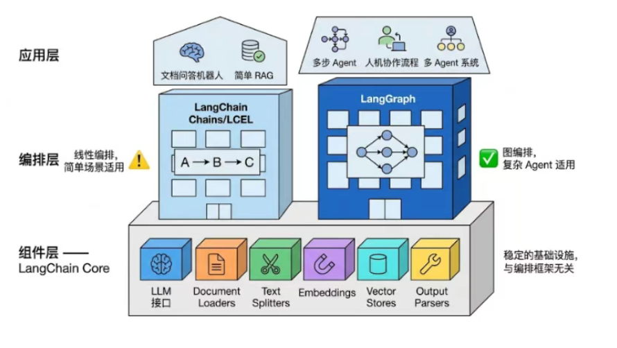

我们学了 LangChain 的组件，学了 LCEL 的线性编排，今天来学一下 LangGraph 的图编排引擎。

---

## 一、LangGraph 基础

### 安装依赖

```bash
pip install langgraph langchain langchain-openai python-dotenv
```

### 创建项目

```bash
mkdir langgraph-test
cd langgraph-test
```

创建 `.env`：

```env
OPENAI_API_KEY=sk-xxx
OPENAI_BASE_URL=https://dashscope.aliyuncs.com/compatible-mode/v1
MODEL_NAME=qwen-plus
```

### 第一个图：基础 StateGraph

创建 `basic_graph.py`：

```python
"""
basic_graph.py - LangGraph 基础示例
"""
from typing import TypedDict
from langgraph.graph import StateGraph, START, END


# 定义状态（State）
class State(TypedDict):
    text: str


# 定义节点（Node）
def step1(state: State) -> State:
    """第一步：在文本后追加 step1"""
    return {"text": f"{state['text']} -> step1"}


def step2(state: State) -> State:
    """第二步：在文本后追加 step2"""
    return {"text": f"{state['text']} -> step2"}


# 创建图
graph = StateGraph(State)

# 添加节点
graph.add_node("step1", step1)
graph.add_node("step2", step2)

# 添加边（Edge）
graph.add_edge(START, "step1")
graph.add_edge("step1", "step2")
graph.add_edge("step2", END)

# 编译图
app = graph.compile()

# 执行图
result = app.invoke({"text": "hello"})
print("result:", result)
# 输出: result: {'text': 'hello -> step1 -> step2'}
```

### 核心概念

| 概念 | 说明 | Python API |
|------|------|------------|
| **State（状态）** | 图中节点之间传递的数据 | `TypedDict` 或 `Annotation` |
| **Node（节点）** | 执行具体逻辑的函数 | `graph.add_node(name, func)` |
| **Edge（边）** | 节点之间的连接 | `graph.add_edge(from, to)` |
| **START** | 图的入口节点 | `langgraph.graph.START` |
| **END** | 图的出口节点 | `langgraph.graph.END` |
| **compile()** | 编译图为可执行应用 | `graph.compile()` |

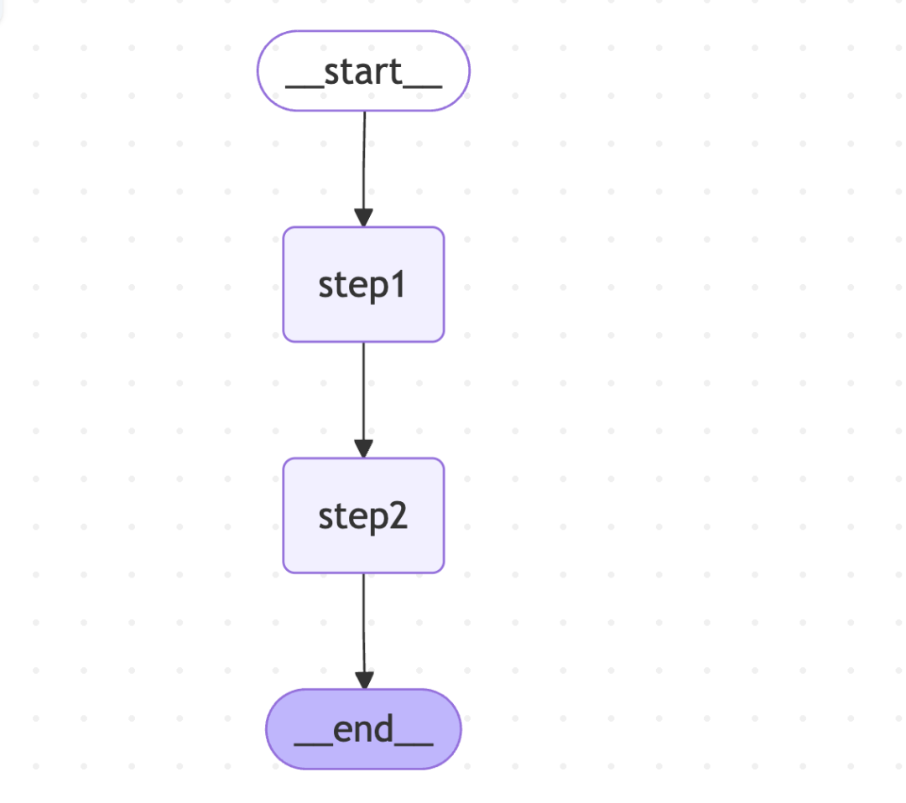

### 可视化图

LangGraph 支持导出 Mermaid 格式的图：

```python
# 获取图的可视化数据
graph_data = app.get_graph()

# 导出为 Mermaid 格式
mermaid_code = graph_data.draw_mermaid()
print(mermaid_code)
```

可以将 Mermaid 代码复制到 https://mermaid.live 或 Markdown 的 ` ```mermaid ` 代码块中查看。

---

## 二、分支（Conditional Edges）

图中当然有分支。用 `add_conditional_edges` 添加分支。

创建 `conditional_routing.py`：

```python
"""
conditional_routing.py - 条件分支示例
"""
import re
from typing import TypedDict, Literal
from langgraph.graph import StateGraph, START, END


class State(TypedDict):
    query: str
    route: str
    answer: str


def router(state: State) -> State:
    """路由节点：判断是数学问题还是聊天问题"""
    is_math = bool(re.search(r'[+\-*/]', state['query']))
    return {"route": "math" if is_math else "chat"}


def math_node(state: State) -> State:
    """数学节点：计算表达式"""
    try:
        result = eval(state['query'])
        return {"answer": str(result)}
    except Exception:
        return {"answer": "表达式无法计算"}


def chat_node(state: State) -> State:
    """聊天节点：简单回复"""
    return {"answer": f"你说的是：{state['query']}"}


def route_condition(state: State) -> Literal["math", "chat"]:
    """条件函数：返回下一个节点的名称"""
    return state["route"]


# 创建图
graph = StateGraph(State)

# 添加节点
graph.add_node("router", router)
graph.add_node("math", math_node)
graph.add_node("chat", chat_node)

# 添加边
graph.add_edge(START, "router")

# 添加条件边：根据 route 字段决定走哪个分支
graph.add_conditional_edges(
    "router",
    route_condition,
    {
        "math": "math",
        "chat": "chat",
    }
)

graph.add_edge("math", END)
graph.add_edge("chat", END)

# 编译
app = graph.compile()

# 测试
print("result:", app.invoke({"query": "你好"}))
# 输出: {'query': '你好', 'route': 'chat', 'answer': '你说的是：你好'}

print("result:", app.invoke({"query": "10 * 8"}))
# 输出: {'query': '10 * 8', 'route': 'math', 'answer': '80'}
```

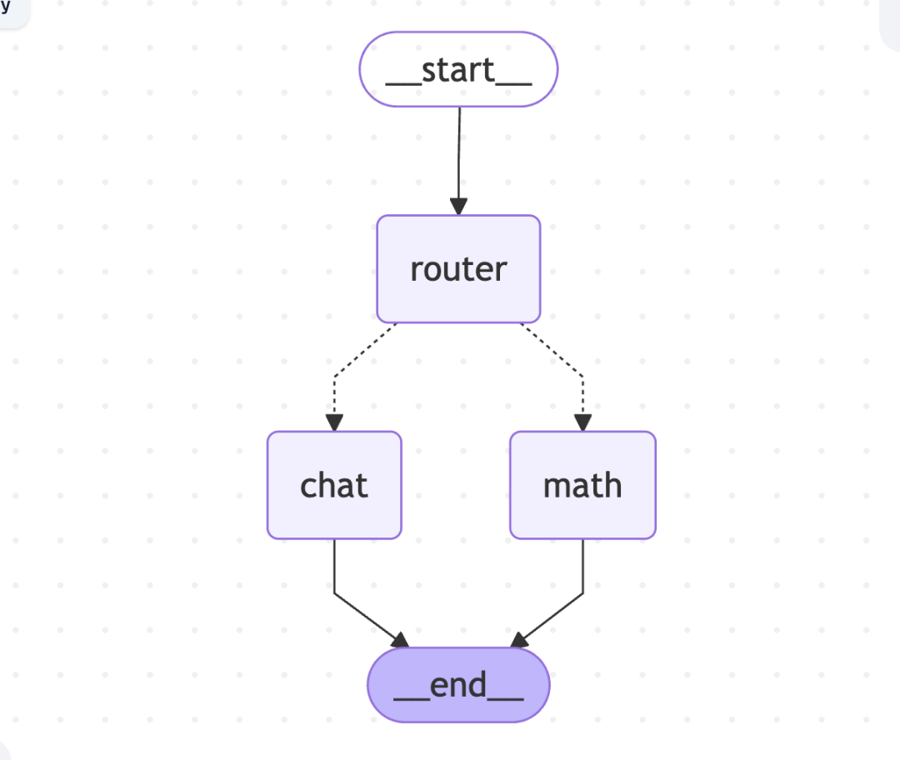

### 条件边 API

```python
graph.add_conditional_edges(
    source_node,      # 源节点名称
    condition_func,   # 条件函数，接收 state，返回下一个节点名称
    {                 # 映射：条件函数返回值 -> 目标节点名称
        "value1": "node1",
        "value2": "node2",
    }
)
```

---

## 三、循环（Loop）

循环其实也是用分支来实现：条件满足就到 END，否则重新路由到之前的节点。

创建 `loop_retry.py`：

```python
"""
loop_retry.py - 循环重试示例
"""
from typing import TypedDict, Literal
from langgraph.graph import StateGraph, START, END


class State(TypedDict):
    tries: int
    ok: bool
    message: str


def attempt(state: State) -> State:
    """尝试节点：模拟执行，第3次成功"""
    tries = state["tries"] + 1
    ok = tries >= 3
    return {
        "tries": tries,
        "ok": ok,
        "message": f"第 {tries} 次成功" if ok else f"第 {tries} 次失败，继续重试",
    }


def retry_condition(state: State) -> Literal["done", "retry"]:
    """条件函数：成功就结束，否则重试"""
    return "done" if state["ok"] else "retry"


# 创建图
graph = StateGraph(State)

# 添加节点
graph.add_node("attempt", attempt)

# 添加边
graph.add_edge(START, "attempt")

# 添加条件边：成功就结束，否则回到 attempt 节点
graph.add_conditional_edges(
    "attempt",
    retry_condition,
    {
        "retry": "attempt",  # 回到 attempt 节点，形成循环
        "done": END,
    }
)

# 编译
app = graph.compile()

# 执行
result = app.invoke({"tries": 0})
print("result:", result)
# 输出: {'tries': 3, 'ok': True, 'message': '第 3 次成功'}
```

### 循环模式

```
START → attempt → 条件判断
                ↓
         ┌──────┴──────┐
         ↓             ↓
      retry          done
         ↓             ↓
      attempt        END
```

同样用 `add_conditional_edges` 判断条件满足就到 END 节点，否则重新路由到之前的节点，这样就可以实现循环效果。

---

## 四、状态保存（Checkpointer）

经过这几个例子，应该能看出节点之间是通过 state 通信的。那把 state 保存下来不就是把当前图的执行状态保存下来了么？

这个通过 Checkpointer 的 API 就可以保存。

创建 `checkpointer_memory.py`：

```python
"""
checkpointer_memory.py - 状态保存示例
"""
from typing import TypedDict
from langgraph.graph import StateGraph, START, END
from langgraph.checkpoint.memory import MemorySaver


class State(TypedDict):
    visit_count: int
    message: str


def record_visit(state: State) -> State:
    """记录访问：每跑一轮图，访问次数 +1"""
    visit_count = state["visit_count"] + 1
    if visit_count == 1:
        message = "这是你在本会话里第 1 次进入。"
    else:
        message = f"这是你在本会话里第 {visit_count} 次进入"
    return {"visit_count": visit_count, "message": message}


# 创建图
graph = StateGraph(State)
graph.add_node("record_visit", record_visit)
graph.add_edge(START, "record_visit")
graph.add_edge("record_visit", END)

# 使用 MemorySaver 保存状态到内存
checkpointer = MemorySaver()
app = graph.compile(checkpointer=checkpointer)

# 不同用户的配置（thread_id 区分会话）
user1 = {"configurable": {"thread_id": "用户-小张"}}
user2 = {"configurable": {"thread_id": "用户-小李"}}

# 用户1 执行3次
res1 = app.invoke({}, user1)
res2 = app.invoke({}, user1)
res3 = app.invoke({}, user1)

# 用户2 执行1次
res4 = app.invoke({}, user2)

print("用户1 第1次:", res1)  # visit_count: 1
print("用户1 第2次:", res2)  # visit_count: 2
print("用户1 第3次:", res3)  # visit_count: 3
print("用户2 第1次:", res4)  # visit_count: 1
```

### Checkpointer 类型

| Checkpointer | 说明 | 适用场景 |
|--------------|------|----------|
| `MemorySaver` | 保存到内存 | 开发测试、临时会话 |
| `SqliteSaver` | 保存到 SQLite | 小型应用、单机部署 |
| `PostgresSaver` | 保存到 PostgreSQL | 生产环境、分布式部署 |
| `RedisSaver` | 保存到 Redis | 高性能、缓存场景 |

我们用 `MemorySaver` 来把 state 保存到内存里，这样下次就会基于上次的 state 继续执行。

---

## 五、中断和恢复（Interrupt）

我们用 Cursor 之类的 Coding Agent，它经常会让你确认，确认后再继续执行。这种打断功能咋做呢？

LangGraph 提供了 `interrupt` 的 API。

创建 `graph_interrupt.py`：

```python
"""
graph_interrupt.py - 中断和恢复示例
"""
from typing import TypedDict
from langgraph.graph import StateGraph, START, END
from langgraph.checkpoint.memory import MemorySaver
from langgraph.types import interrupt, Command


class State(TypedDict):
    action_summary: str
    user_input: str


def show_transfer(state: State) -> State:
    """展示一笔待确认的转账"""
    return {"action_summary": "向张三转账 ¥100（模拟，不会真扣款）"}


def wait_confirm(state: State) -> State:
    """等待用户确认：中断图的执行，等待用户输入"""
    # interrupt 会中断图的执行，返回 value 给调用方
    # 用户恢复时传入的值会作为 interrupt 的返回值
    user_input = interrupt({
        "hint": "输入「确认」或备注后，图才会继续",
        "action_summary": state["action_summary"],
    })
    return {"user_input": str(user_input)}


# 创建图
graph = StateGraph(State)
graph.add_node("show_transfer", show_transfer)
graph.add_node("wait_confirm", wait_confirm)
graph.add_edge(START, "show_transfer")
graph.add_edge("show_transfer", "wait_confirm")
graph.add_edge("wait_confirm", END)

# 编译（需要 checkpointer 才能中断）
app = graph.compile(checkpointer=MemorySaver())

# 配置
config = {"configurable": {"thread_id": "interrupt-demo"}}

# 第一次调用：图会在 interrupt 处暂停
paused = app.invoke({}, config)
print("\n待你确认：", paused.get("__interrupt__"))

# 模拟用户输入
user_input = input("> ").strip()
if not user_input:
    print("未输入，退出。")
    exit(1)

# 第二次调用：传入 Command(resume=...) 恢复执行
done = app.invoke(Command(resume=user_input), config)
print("结果：", done)
```

### 中断 API

| API | 说明 |
|-----|------|
| `interrupt(value)` | 中断图的执行，返回 value 给调用方 |
| `Command(resume=value)` | 恢复图的执行，value 作为 interrupt 的返回值 |
| `__interrupt__` | 中断时返回的特殊字段，包含 interrupt 的 value |

用 `interrupt` 中断图的执行，等待用户输入之后再次 `invoke`，传入 `Command(resume='xxx')`，这样图就会在上次断点位置继续执行。

---

## 六、预构建节点（Prebuilt）

此外，有些常用的节点，LangGraph 给封装好了，放到 `prebuilt` 下。

### ToolNode 和 toolsCondition

创建 `prebuilt_tool_node.py`：

```python
"""
prebuilt_tool_node.py - 预构建 ToolNode 示例
"""
import os
from dotenv import load_dotenv
from langchain_openai import ChatOpenAI
from langchain_core.tools import tool
from langchain_core.messages import HumanMessage
from langgraph.graph import StateGraph, START, END
from langgraph.prebuilt import ToolNode, tools_condition
from langgraph.graph.message import MessagesState

load_dotenv()


# Mock 数据：模拟库存查询
_inventory = {
    "SKU-001": {"name": "无线鼠标", "stock": 42},
    "SKU-002": {"name": "机械键盘", "stock": 7},
    "SKU-003": {"name": "USB-C 线缆", "stock": 120},
}


@tool
def get_product_stock(sku: str) -> str:
    """
    按 SKU 查商品名与库存，SKU 如 SKU-001。
    """
    key = sku.strip().upper()
    row = _inventory.get(key)
    if not row:
        return f'{{"found": false, "sku": "{sku}"}}'
    return f'{{"found": true, "sku": "{key}", "name": "{row["name"]}", "stock": {row["stock"]}}}'


# 初始化模型并绑定工具
tools = [get_product_stock]
llm = ChatOpenAI(
    model=os.getenv("MODEL_NAME", "qwen-plus"),
    api_key=os.getenv("OPENAI_API_KEY"),
    base_url=os.getenv("OPENAI_BASE_URL"),
).bind_tools(tools)


def agent(state: MessagesState) -> MessagesState:
    """Agent 节点：调用大模型"""
    response = llm.invoke(state["messages"])
    return {"messages": response}


# 使用预构建的 ToolNode
tool_node = ToolNode(tools)

# 创建图
graph = StateGraph(MessagesState)
graph.add_node("agent", agent)
graph.add_node("tools", tool_node)

graph.add_edge(START, "agent")

# 使用预构建的 toolsCondition：有 tool_call 就走 tools，否则走 END
graph.add_conditional_edges(
    "agent",
    tools_condition,
    ["tools", END]
)

graph.add_edge("tools", "agent")

# 编译
app = graph.compile()

# 执行
result = app.invoke({
    "messages": [
        HumanMessage("查一下 SKU-001 的库存还有多少，回答里带上商品名和数字。")
    ]
})

last = result["messages"][-1]
print(last.content)
```

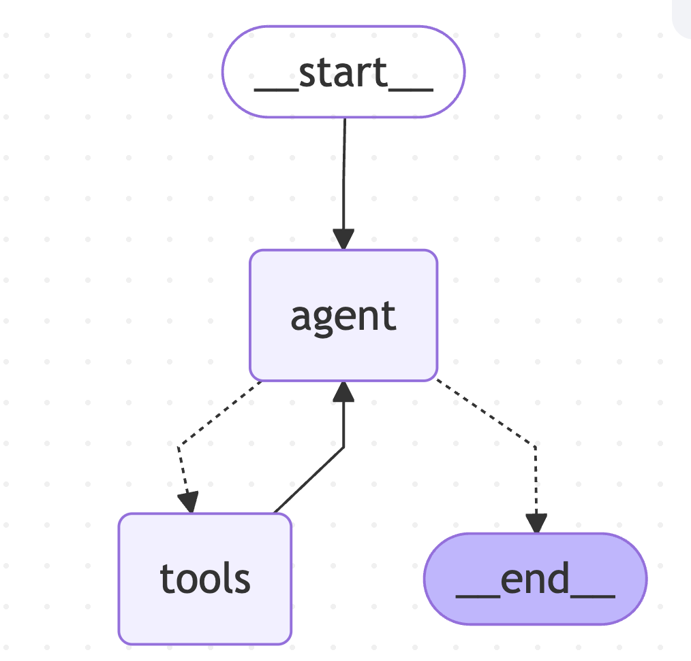

### 预构建 API

| API | 说明 |
|-----|------|
| `ToolNode(tools)` | 预构建的工具执行节点，自动处理 tool_calls |
| `tools_condition` | 预构建的条件函数，有 tool_call 走 tools，否则走 END |
| `MessagesState` | 预构建的状态，包含 `messages` 字段 |

比如我们要调用 Tool，用图的写法需要创建 model 节点、tool 节点，然后加一个 conditional 节点判断。但不用自己写，LangGraph 内置了 `ToolNode` 和 `tools_condition` 的 API。

---

## 七、createAgent 预构建 Agent

当然，像这么常用的 Agent Loop 自然也给封装好了，就是 `create_agent` 的 API。

创建 `prebuilt_agent.py`：

```python
"""
prebuilt_agent.py - create_agent 预构建 Agent 示例
"""
import os
from dotenv import load_dotenv
from langchain_openai import ChatOpenAI
from langchain_core.tools import tool
from langchain_core.messages import HumanMessage
from langgraph.checkpoint.memory import MemorySaver
from langgraph.prebuilt import create_react_agent

load_dotenv()


# Mock 数据
_inventory = {
    "SKU-001": {"name": "无线鼠标", "stock": 42},
    "SKU-002": {"name": "机械键盘", "stock": 7},
    "SKU-003": {"name": "USB-C 线缆", "stock": 120},
}


@tool
def get_product_stock(sku: str) -> str:
    """按 SKU 查商品名与库存，SKU 如 SKU-001。"""
    key = sku.strip().upper()
    row = _inventory.get(key)
    if not row:
        return f'{{"found": false, "sku": "{sku}"}}'
    return f'{{"found": true, "sku": "{key}", "name": "{row["name"]}", "stock": {row["stock"]}}}'


# 初始化模型
model = ChatOpenAI(
    model=os.getenv("MODEL_NAME", "qwen-plus"),
    api_key=os.getenv("OPENAI_API_KEY"),
    base_url=os.getenv("OPENAI_BASE_URL"),
)

# 使用 create_react_agent 创建 Agent
agent = create_react_agent(
    model,
    tools=[get_product_stock],
    state_modifier="你是仓库助手。问库存时必须调用 get_product_stock（模拟数据），禁止编造。",
    checkpointer=MemorySaver(),
)

# 执行
result = agent.invoke(
    {"messages": [HumanMessage("SKU-002 还剩多少库存？")]},
    {"configurable": {"thread_id": "demo-thread"}}
)

last = result["messages"][-1]
print(last.content)
```

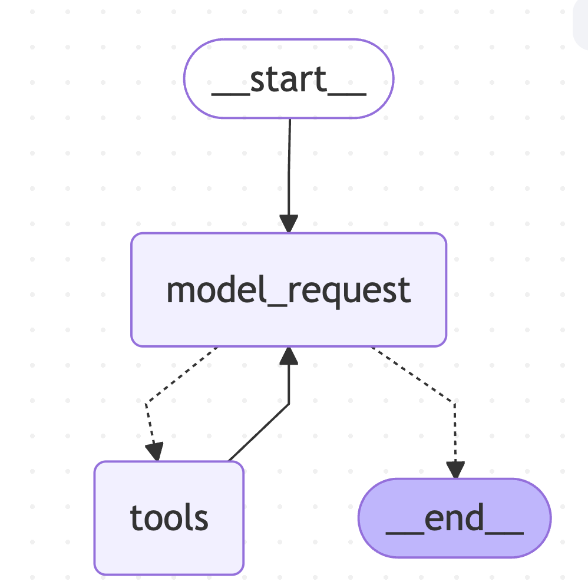

直接用 `create_react_agent` 来跑 Agent Loop。看一下它的图，和刚才写的一样，这个 API 内部就是基于 LangGraph 构建的 Agent Loop 的图。

### create_react_agent 参数

| 参数 | 说明 |
|------|------|
| `model` | 大语言模型 |
| `tools` | 工具列表 |
| `state_modifier` | 系统提示词或状态修改函数 |
| `checkpointer` | 状态保存器（可选） |
| `debug` | 是否开启调试模式 |

---

## 八、多 Agent 架构（Supervisor-Worker 模式）

学完 LangGraph 的图，我们来写一个多 Agent 的架构。

多 Agent 最常用的是 **Supervisor - Worker 模式**，也就是"主管 - 工人"模式。

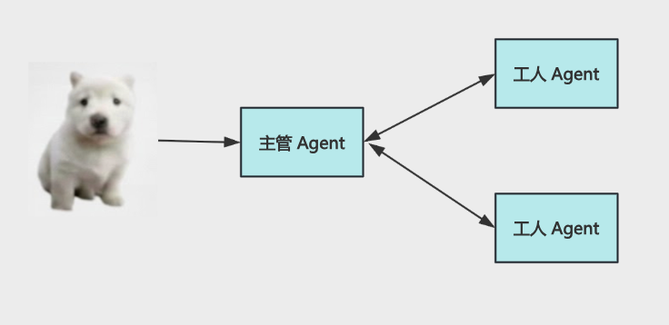

```
                    ┌─────────────┐
                    │  Supervisor │
                    │   (主管)     │
                    └──────┬──────┘
                           │
              ┌────────────┼────────────┐
              ▼            ▼            ▼
        ┌──────────┐ ┌──────────┐ ┌──────────┐
        │ Worker A │ │ Worker B │ │ Worker C │
        │ (天气)    │ │ (小知识)  │ │ (搜索)    │
        └──────────┘ └──────────┘ └──────────┘
```

### 安装依赖

```bash
pip install langgraph langchain langchain-openai
```

### 完整实现

创建 `multi_agent_supervisor.py`：

```python
"""
multi_agent_supervisor.py - 多 Agent Supervisor-Worker 模式
"""
import os
from typing import Literal
from dotenv import load_dotenv
from langchain_openai import ChatOpenAI
from langchain_core.tools import tool
from langchain_core.messages import HumanMessage, SystemMessage
from langgraph.graph import StateGraph, START, END
from langgraph.prebuilt import create_react_agent
from langgraph.types import Command
from langgraph.graph.message import MessagesState

load_dotenv()


# ============ Mock 数据和工具 ============

@tool
def lookup_weather(city: str) -> str:
    """查询某城市当日天气概况（气温区间、天气、空气质量等）。"""
    weather_data = {
        "杭州": {"temp": "18-25°C", "weather": "晴", "aqi": "良"},
        "北京": {"temp": "10-20°C", "weather": "多云", "aqi": "轻度污染"},
        "上海": {"temp": "20-28°C", "weather": "阴", "aqi": "优"},
    }
    data = weather_data.get(city, {"temp": "未知", "weather": "未知", "aqi": "未知"})
    return f"{city}天气：气温 {data['temp']}，{data['weather']}，空气质量 {data['aqi']}"


@tool
def lookup_city_trivia(city: str) -> str:
    """查询与某城市相关的一句趣味知识。"""
    trivia = {
        "杭州": "杭州西湖是中国唯一一个湖泊类世界文化遗产。",
        "北京": "北京故宫是世界上现存规模最大、保存最为完整的木质结构古建筑之一。",
        "上海": "上海外滩的万国建筑博览群汇集了52幢风格迥异的古典复兴大楼。",
    }
    return trivia.get(city, f"暂无关于{city}的趣味知识。")


# ============ 初始化模型 ============

model = ChatOpenAI(
    model=os.getenv("MODEL_NAME", "qwen-plus"),
    api_key=os.getenv("OPENAI_API_KEY"),
    base_url=os.getenv("OPENAI_BASE_URL"),
)


# ============ 创建子 Agent ============

# 子 Agent A：只回答天气类问题
weather_agent = create_react_agent(
    model,
    tools=[lookup_weather],
    state_modifier="你只处理天气。用户提到城市时，用 lookup_weather 查询后再用中文简短说明。",
)

# 子 Agent B：只回答城市小知识
trivia_agent = create_react_agent(
    model,
    tools=[lookup_city_trivia],
    state_modifier="你只处理与城市相关的小知识。用 lookup_city_trivia 查询后用中文简短说明。",
)


# ============ Supervisor 节点 ============

def supervisor_node(state: MessagesState) -> Command:
    """
    Supervisor 节点：分析用户问题，决定调用哪个子 Agent
    """
    messages = state["messages"]
    user_query = messages[-1].content if messages else ""

    # 简单的路由逻辑（实际可用大模型判断）
    if any(kw in user_query for kw in ["天气", "气温", "下雨", "晴天", "温度"]):
        next_agent = "weather_agent"
    elif any(kw in user_query for kw in ["小知识", "趣味", "知识", "介绍"]):
        next_agent = "trivia_agent"
    else:
        # 默认都问一下
        next_agent = "weather_agent"

    return Command(goto=next_agent)


# ============ 子 Agent 包装节点 ============

def weather_agent_node(state: MessagesState) -> MessagesState:
    """天气 Agent 节点"""
    result = weather_agent.invoke(state)
    return {"messages": result["messages"]}


def trivia_agent_node(state: MessagesState) -> MessagesState:
    """小知识 Agent 节点"""
    result = trivia_agent.invoke(state)
    return {"messages": result["messages"]}


# ============ 汇总节点 ============

def summarize_node(state: MessagesState) -> MessagesState:
    """汇总节点：整合子 Agent 的回答"""
    messages = state["messages"]
    # 取最后一条消息作为汇总结果
    last_message = messages[-1]
    summary = f"【汇总】\n{last_message.content}"
    return {"messages": [HumanMessage(content=summary)]}


# ============ 构建图 ============

graph = StateGraph(MessagesState)

# 添加节点
graph.add_node("supervisor", supervisor_node)
graph.add_node("weather_agent", weather_agent_node)
graph.add_node("trivia_agent", trivia_agent_node)
graph.add_node("summarize", summarize_node)

# 添加边
graph.add_edge(START, "supervisor")

# Supervisor 到子 Agent 的条件边
graph.add_conditional_edges(
    "supervisor",
    lambda state: state.get("next", "weather_agent"),
    {
        "weather_agent": "weather_agent",
        "trivia_agent": "trivia_agent",
    }
)

# 子 Agent 到汇总节点
graph.add_edge("weather_agent", "summarize")
graph.add_edge("trivia_agent", "summarize")

# 汇总节点到 END
graph.add_edge("summarize", END)

# 编译
app = graph.compile()


# ============ 测试 ============

if __name__ == "__main__":
    # 测试天气查询
    result1 = app.invoke({
        "messages": [HumanMessage("杭州今天天气怎么样？")]
    })
    print("天气查询结果:", result1["messages"][-1].content)
    print()

    # 测试小知识查询
    result2 = app.invoke({
        "messages": [HumanMessage("给我讲一个北京的小知识")]
    })
    print("小知识查询结果:", result2["messages"][-1].content)
```

### Supervisor-Worker 模式要点

| 角色 | 职责 |
|------|------|
| **Supervisor（主管）** | 接收用户问题，分析意图，分派任务给子 Agent |
| **Worker（工人）** | 专注于特定领域的任务，只带必要的工具和 Prompt |
| **Summarizer（汇总）** | 整合子 Agent 的结果，生成最终回答 |

### 多 Agent 的优势

1. **职责分离**：每个 Agent 只负责一个领域，Prompt 更精简
2. **并行处理**：多个子 Agent 可以并行执行任务
3. **易于扩展**：新增功能只需添加新的子 Agent
4. **容错性强**：某个子 Agent 失败不影响其他 Agent

---

## 学习要点

1. **LangGraph** 是 LangChain 的图编排引擎，用于构建复杂的 Agent 工作流
2. **核心概念**：State（状态）、Node（节点）、Edge（边）、START、END
3. **条件边** `add_conditional_edges` 实现分支逻辑，根据 state 决定下一个节点
4. **循环**也是用条件边实现：条件不满足就回到之前的节点
5. **Checkpointer** 保存图的执行状态，支持会话持久化（MemorySaver/SqliteSaver/PostgresSaver）
6. **Interrupt** 实现图的中断和恢复，用于需要用户确认的场景
7. **预构建节点**：`ToolNode`、`toolsCondition` 简化 Tool Calling 的图构建
8. **create_react_agent** 一键创建 ReAct Agent，内部基于 LangGraph 构建 Agent Loop
9. **多 Agent 架构**最常用 Supervisor-Worker 模式，主管分派任务，子 Agent 并行处理
10. **多 Agent 的优势**：职责分离、并行处理、易于扩展、容错性强

## 扩展方向

- 学习 LangGraph 的子图（Subgraph）嵌套调用
- 探索 LangGraph 的并行执行（Send API）
- 学习 LangGraph 的流式输出（stream_mode）
- 实现更复杂的多 Agent 协作（如辩论模式、评审模式）
- 集成 LangSmith 进行图的追踪和调试
- 学习 LangGraph 的 Human-in-the-loop 模式
- 探索 LangGraph 的持久化存储（Postgres/Redis）
- 实现多 Agent 的任务队列和调度

---

## 配套代码库

**代码库地址**：https://github.com/iiixiyan/agent-learning-code/tree/main/02-enterprise-backend/25-langgraph-multi-agent

包含本文的完整可运行代码示例（LangGraph 基础、分支、循环、状态保存、中断恢复、预构建节点、多 Agent 架构）。

---

**上一篇**：[AGUI 协议](./24_AGUI协议.md) | **下一篇**：[Agentic RAG](./26_Agentic-RAG.md)
