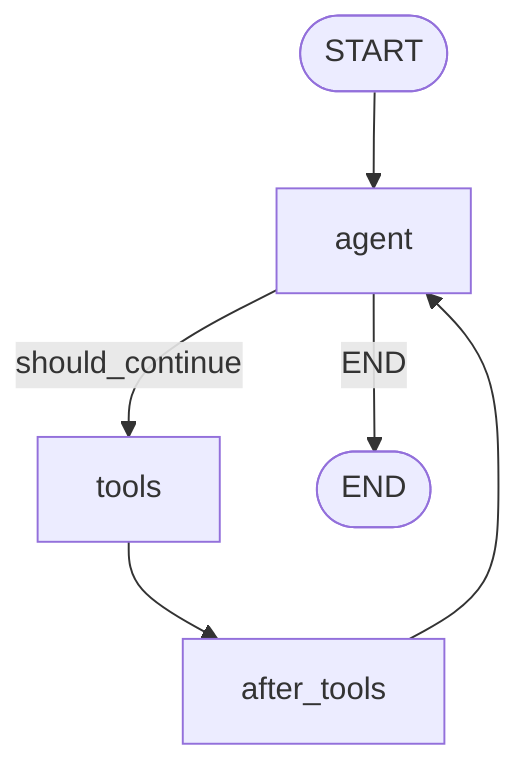

# Agentic RAG：基于 LangGraph 实现大模型自主决策的 RAG 闭环系统

> **Python 版** | 基于 LangGraph + LangChain Python 技术栈
> 前置知识：[RAG 基础](../01-第一阶段-Agent基础入门/11_RAG检索增强生成.md)、[LangGraph 图编排](./25_图编排引擎-LangGraph和多Agent架构.md)

---

## 什么是 Agentic RAG？

传统的 RAG（Retrieval-Augmented Generation）流程是固定的：用户提问 → 检索文档 → 拼接 Prompt → 大模型生成回答。这个流程是线性的，大模型没有决策权。

而 **Agentic RAG** 让大模型自主决策整个检索流程：

| 决策点 | 传统 RAG | Agentic RAG |
|--------|----------|-------------|
| **是否检索** | 固定检索 | 大模型判断是否需要检索 |
| **检索什么** | 固定用用户问题检索 | 大模型自主生成检索查询 |
| **检索几次** | 固定1次 | 大模型判断是否需要多轮检索 |
| **结果是否足够** | 不判断 | 大模型评估检索结果质量 |
| **调用什么工具** | 只有检索 | 检索、搜索、计算、代码执行等 |

### 核心思想

Agentic RAG 的核心是把 RAG 流程变成一个 **Agent 闭环**，大模型作为"智能调度员"，可以：

1. **自主判断**：这个问题需要检索吗？
2. **自主查询**：应该用什么关键词检索？
3. **自主评估**：检索结果够不够？需要再检索吗？
4. **自主生成**：基于检索结果生成最终回答

```
┌─────────────────────────────────────────────────────┐
│                    Agentic RAG 闭环                    │
│                                                       │
│  ┌──────────┐    ┌──────────┐    ┌──────────┐      │
│  │  用户提问  │ →  │  大模型   │ →  │  决策节点  │      │
│  └──────────┘    │ (思考)    │    └────┬─────┘      │
│                   └──────────┘         │              │
│                        ▲                ▼              │
│                        │         ┌──────────────┐     │
│                        │         │ 需要检索吗？   │     │
│                        │         └──┬───────┬───┘     │
│                        │            │       │          │
│                        │        是  │       │  否      │
│                        │            ▼       ▼          │
│                        │      ┌────────┐ ┌────────┐   │
│                        │      │ 检索文档 │ │ 直接回答 │   │
│                        │      └───┬────┘ └───┬────┘   │
│                        │          │            │        │
│                        │          ▼            │        │
│                        │    ┌──────────┐      │        │
│                        │    │ 结果评估  │      │        │
│                        │    └──┬───┬───┘      │        │
│                        │       │   │           │        │
│                        │  足够 │   │ 不足      │        │
│                        │       ▼   ▼           │        │
│                        │  生成回答  重新检索     │        │
│                        │       │               │        │
│                        └───────┴───────────────┘        │
└─────────────────────────────────────────────────────┘
```

---

## 传统 RAG vs Agentic RAG

### 传统 RAG 的问题

| 问题 | 说明 |
|------|------|
| **无效检索** | 简单问题（如"1+1等于几"）也走检索流程，浪费资源 |
| **查询质量差** | 直接用用户原始问题检索，可能关键词不精准 |
| **一次检索不够** | 复杂问题需要多轮检索，但传统 RAG 只检索一次 |
| **结果不评估** | 检索结果质量差也直接用，导致回答不准确 |
| **工具单一** | 只有向量检索，无法调用网络搜索、代码执行等工具 |

### Agentic RAG 的优势

| 优势 | 说明 |
|------|------|
| **精准检索** | 大模型判断是否需要检索，避免无效检索 |
| **查询优化** | 大模型自主生成更精准的检索查询 |
| **多轮检索** | 可以迭代检索，直到结果足够 |
| **质量评估** | 大模型评估检索结果，不足就重新检索 |
| **多工具协作** | 可以调用检索、搜索、计算、代码执行等多种工具 |

---

## Agentic RAG 核心流程

### 流程步骤

```
Step 1: 接收用户问题
    ↓
Step 2: 大模型思考：这个问题需要检索吗？
    ├─ 不需要 → 直接生成回答 → 结束
    └─ 需要 → 进入 Step 3
    ↓
Step 3: 大模型生成检索查询（可能优化用户问题）
    ↓
Step 4: 执行检索（向量检索 / 网络搜索 / 数据库查询）
    ↓
Step 5: 大模型评估检索结果
    ├─ 足够 → 进入 Step 6
    └─ 不足 → 回到 Step 3（重新检索，可能换关键词或换工具）
    ↓
Step 6: 大模型基于检索结果生成最终回答
    ↓
结束
```

### 关键节点

| 节点 | 职责 | 实现方式 |
|------|------|----------|
| **思考节点** | 判断是否需要检索、生成检索查询 | 大模型调用 |
| **检索节点** | 执行检索操作 | Tool 调用 |
| **评估节点** | 评估检索结果是否足够 | 大模型调用 |
| **生成节点** | 生成最终回答 | 大模型调用 |

---

## 基于 LangGraph 的实现

### 安装依赖

```bash
pip install langgraph langchain langchain-openai langchain-community chromadb python-dotenv
```

### 完整代码

创建 `agentic_rag.py`：

```python
"""
agentic_rag.py - 基于 LangGraph 的 Agentic RAG 实现
"""
import os
from typing import TypedDict, List, Literal
from dotenv import load_dotenv
from langchain_openai import ChatOpenAI, OpenAIEmbeddings
from langchain_community.vectorstores import Chroma
from langchain_core.tools import tool
from langchain_core.messages import HumanMessage, SystemMessage, AIMessage, ToolMessage
from langgraph.graph import StateGraph, START, END
from langgraph.prebuilt import ToolNode

load_dotenv()


# ============ 1. 初始化模型和向量库 ============

# 大模型
llm = ChatOpenAI(
    model=os.getenv("MODEL_NAME", "qwen-plus"),
    api_key=os.getenv("OPENAI_API_KEY"),
    base_url=os.getenv("OPENAI_BASE_URL"),
    temperature=0,
)

# Embedding 模型
embeddings = OpenAIEmbeddings(
    model="text-embedding-v2",
    api_key=os.getenv("OPENAI_API_KEY"),
    base_url=os.getenv("OPENAI_BASE_URL"),
)

# 模拟文档数据
documents = [
    "LangChain 是一个用于开发由语言模型驱动的应用程序的框架。",
    "LangGraph 是 LangChain 的图编排引擎，用于构建复杂的 Agent 工作流。",
    "RAG（检索增强生成）是一种结合检索和生成的技术，可以让大模型基于外部知识回答问题。",
    "Agentic RAG 让大模型自主决策检索流程，包括是否检索、检索什么、检索几次。",
    "Chroma 是一个轻量级的向量数据库，适合开发和原型验证。",
    "FastAPI 是一个现代、高性能的 Python Web 框架，用于构建 API。",
]

# 创建向量库
vectorstore = Chroma.from_texts(
    texts=documents,
    embedding=embeddings,
    persist_directory="./chroma_db",
)
retriever = vectorstore.as_retriever(search_kwargs={"k": 3})


# ============ 2. 定义工具 ============

@tool
def retrieve_documents(query: str) -> str:
    """
    从知识库中检索相关文档。输入检索查询，返回相关文档内容。

    Args:
        query: 检索查询关键词

    Returns:
        str: 检索到的相关文档内容
    """
    docs = retriever.invoke(query)
    if not docs:
        return "未检索到相关文档。"
    return "\n\n".join([f"[文档 {i+1}]\n{doc.page_content}" for i, doc in enumerate(docs)])


@tool
def web_search(query: str) -> str:
    """
    网络搜索。输入搜索关键词，返回搜索结果摘要。
    （注：此处为模拟实现，实际使用时接入真实搜索 API）

    Args:
        query: 搜索关键词

    Returns:
        str: 搜索结果摘要
    """
    # 模拟搜索结果
    mock_results = {
        "LangGraph": "LangGraph 是 LangChain 团队开发的图编排框架，支持构建有状态、多角色的 Agent 应用。最新版本支持持久化、流式输出和人工介入。",
        "Agentic RAG": "Agentic RAG 是 2024 年兴起的 RAG 范式，核心是让 LLM 自主控制检索流程。代表框架包括 LangGraph、LlamaIndex Workflows、Haystack 2.0。",
    }
    return mock_results.get(query, f"搜索结果：关于'{query}'的相关信息（模拟数据）。")


@tool
def calculate(expression: str) -> str:
    """
    数学计算。输入数学表达式，返回计算结果。

    Args:
        expression: 数学表达式，如 '2 + 3 * 4'

    Returns:
        str: 计算结果
    """
    try:
        result = eval(expression)
        return f"计算结果：{expression} = {result}"
    except Exception as e:
        return f"计算失败：{str(e)}"


tools = [retrieve_documents, web_search, calculate]
tool_node = ToolNode(tools)
llm_with_tools = llm.bind_tools(tools)


# ============ 3. 定义状态 ============

class AgentState(TypedDict):
    """Agent 状态"""
    messages: List  # 对话消息列表
    retrieve_count: int  # 检索次数
    max_retrieves: int  # 最大检索次数


# ============ 4. 定义节点 ============

def agent_node(state: AgentState) -> AgentState:
    """
    Agent 节点：大模型思考，决定是否调用工具或直接回答

    这是 Agentic RAG 的核心节点，大模型会：
    1. 判断问题是否需要检索
    2. 如果需要，生成检索查询并调用检索工具
    3. 如果不需要，直接生成回答
    4. 评估检索结果，决定是否需要再次检索
    """
    messages = state["messages"]
    retrieve_count = state["retrieve_count"]

    # 系统提示词：指导大模型进行 Agentic RAG 决策
    system_prompt = f"""你是一个智能 RAG 助手，可以调用工具来回答问题。

## 工具说明
- retrieve_documents: 从知识库检索文档，适合回答关于 LangChain、LangGraph、RAG 等技术问题
- web_search: 网络搜索，适合回答最新动态、时事新闻等知识库没有的内容
- calculate: 数学计算，适合回答数学问题

## 决策规则
1. 简单问题（如问候、常识）直接回答，不需要调用工具
2. 技术问题优先调用 retrieve_documents 检索
3. 如果检索结果不够，可以再次检索（换关键词或换工具）
4. 数学问题调用 calculate 工具
5. 最多检索 {state['max_retrieves']} 次，超过后基于已有信息回答

## 当前检索次数：{retrieve_count}/{state['max_retrieves']}
"""

    # 调用大模型
    response = llm_with_tools.invoke([SystemMessage(system_prompt)] + messages)

    return {
        "messages": messages + [response],
        "retrieve_count": retrieve_count,
        "max_retrieves": state["max_retrieves"],
    }


def should_continue(state: AgentState) -> Literal["tools", END]:
    """
    条件边：判断是否继续调用工具

    如果大模型返回了 tool_calls，就走工具节点；否则结束
    """
    messages = state["messages"]
    last_message = messages[-1]

    if last_message.tool_calls:
        return "tools"
    return END


def after_tools(state: AgentState) -> AgentState:
    """
    工具执行后节点：更新检索次数

    每次调用检索工具后，检索次数 +1
    """
    messages = state["messages"]
    retrieve_count = state["retrieve_count"]

    # 检查最后一条消息是否是 ToolMessage（工具执行结果）
    if isinstance(messages[-1], ToolMessage):
        # 检查是否调用了检索类工具
        tool_name = messages[-1].name
        if tool_name in ["retrieve_documents", "web_search"]:
            retrieve_count += 1

    return {
        "messages": messages,
        "retrieve_count": retrieve_count,
        "max_retrieves": state["max_retrieves"],
    }


# ============ 5. 构建图 ============

graph = StateGraph(AgentState)

# 添加节点
graph.add_node("agent", agent_node)
graph.add_node("tools", tool_node)
graph.add_node("after_tools", after_tools)

# 添加边
graph.add_edge(START, "agent")

# 条件边：agent 节点后，判断是否调用工具
graph.add_conditional_edges(
    "agent",
    should_continue,
    {
        "tools": "tools",
        END: END,
    }
)

# 工具执行后，回到 agent 节点（让大模型评估结果并决定下一步）
graph.add_edge("tools", "after_tools")
graph.add_edge("after_tools", "agent")

# 编译图
app = graph.compile()


# ============ 6. 运行示例 ============

def run_agentic_rag(question: str, max_retrieves: int = 3) -> str:
    """
    运行 Agentic RAG

    Args:
        question: 用户问题
        max_retrieves: 最大检索次数

    Returns:
        str: 最终回答
    """
    initial_state = {
        "messages": [HumanMessage(content=question)],
        "retrieve_count": 0,
        "max_retrieves": max_retrieves,
    }

    result = app.invoke(initial_state)
    final_message = result["messages"][-1]

    print(f"\n{'='*60}")
    print(f"问题：{question}")
    print(f"检索次数：{result['retrieve_count']}/{max_retrieves}")
    print(f"回答：{final_message.content}")
    print(f"{'='*60}\n")

    return final_message.content


if __name__ == "__main__":
    # 示例1：需要检索的技术问题
    run_agentic_rag("什么是 Agentic RAG？它和传统 RAG 有什么区别？")

    # 示例2：简单问题，不需要检索
    run_agentic_rag("你好，介绍一下你自己")

    # 示例3：数学问题，调用计算工具
    run_agentic_rag("计算 15 * 23 + 100 等于多少？")

    # 示例4：需要多轮检索的复杂问题
    run_agentic_rag("LangGraph 和 Agentic RAG 有什么关系？请详细说明", max_retrieves=3)
```

---

## 代码解析

### 核心设计

| 组件 | 说明 |
|------|------|
| **agent_node** | 大模型思考节点，决定是否调用工具、生成检索查询、评估结果 |
| **tool_node** | 工具执行节点，执行检索、搜索、计算等工具 |
| **after_tools** | 工具后处理节点，更新检索次数 |
| **should_continue** | 条件判断函数，决定是否继续调用工具 |

### 工作流程

```
START → agent → 条件判断
                ├─ 有 tool_calls → tools → after_tools → agent（循环）
                └─ 无 tool_calls → END（结束）
```

### 关键技巧

1. **系统提示词动态化**：把当前检索次数传入系统提示词，让大模型知道还能检索几次
2. **最大检索次数限制**：防止无限循环检索，超过次数后大模型基于已有信息回答
3. **多工具支持**：不仅有检索，还有搜索和计算，让 Agent 更灵活
4. **工具结果评估**：大模型看到工具结果后，可以决定是否需要再次检索

---

## 可视化图

LangGraph 支持导出 Mermaid 格式的图：

```python
# 获取图的可视化
graph_data = app.get_graph()

# 导出为 Mermaid
mermaid_code = graph_data.draw_mermaid()
print(mermaid_code)
```

导出的 Mermaid 图：



---

## 进阶：添加人工确认

Agentic RAG 可以结合 LangGraph 的 interrupt 功能，在检索前让用户确认：

```python
from langgraph.types import interrupt, Command

def agent_node_with_confirm(state: AgentState) -> AgentState:
    """带人工确认的 Agent 节点"""
    messages = state["messages"]
    response = llm_with_tools.invoke(messages)

    # 如果大模型要调用检索工具，先中断让用户确认
    if response.tool_calls:
        tool_names = [tc["name"] for tc in response.tool_calls]
        user_confirm = interrupt({
            "hint": f"Agent 想要调用工具：{tool_names}，是否确认？",
            "tool_calls": response.tool_calls,
        })

        if user_confirm == "取消":
            # 用户取消，直接返回回答
            return {
                "messages": messages + [AIMessage(content="用户取消了工具调用，基于已有信息回答。")],
                "retrieve_count": state["retrieve_count"],
                "max_retrieves": state["max_retrieves"],
            }

    return {
        "messages": messages + [response],
        "retrieve_count": state["retrieve_count"],
        "max_retrieves": state["max_retrieves"],
    }
```

---

## 学习要点

1. **Agentic RAG 的核心**是让大模型自主决策检索流程，而不是固定的线性流程
2. **传统 RAG 的问题**：无效检索、查询质量差、一次检索不够、不评估结果、工具单一
3. **Agentic RAG 的优势**：精准检索、查询优化、多轮检索、质量评估、多工具协作
4. **LangGraph 实现**：用 StateGraph 构建循环图，agent 节点思考，tools 节点执行，条件边判断是否继续
5. **系统提示词动态化**：把检索次数传入提示词，让大模型知道检索预算
6. **最大检索次数限制**：防止无限循环，超过次数后基于已有信息回答
7. **多工具协作**：检索、搜索、计算等工具组合使用，让 Agent 更灵活
8. **人工确认**：结合 interrupt 功能，可以在关键操作前让用户确认

## 扩展方向

- 集成更强大的检索器（混合检索、重排序 Reranker）
- 添加查询重写（Query Rewriting）节点，优化检索查询
- 实现多路召回（向量检索 + 关键词检索 + 知识图谱）
- 添加回答校验节点，检查回答是否基于检索结果
- 集成 LangSmith 进行追踪和调试
- 实现流式输出（stream_mode="updates"）
- 添加更多工具（代码执行、API 调用、数据库查询）
- 实现多轮对话的 Agentic RAG（结合 Memory）
- 探索 Self-RAG（自我检索增强生成）和 Corrective RAG

---

## 配套代码库

**代码库地址**：https://github.com/iiixiyan/agent-learning-code/tree/main/02-enterprise-backend/26-agentic-rag

包含本文的完整可运行代码示例（基于 LangGraph 的 Agentic RAG 闭环系统 + 多工具支持 + 人工确认）。

---

**上一篇**：[图编排引擎 - LangGraph 和多 Agent 架构](./25_图编排引擎-LangGraph和多Agent架构.md) | **下一篇**：[基于 Docker Compose 的部署](./27_基于Docker-Compose的部署.md)
