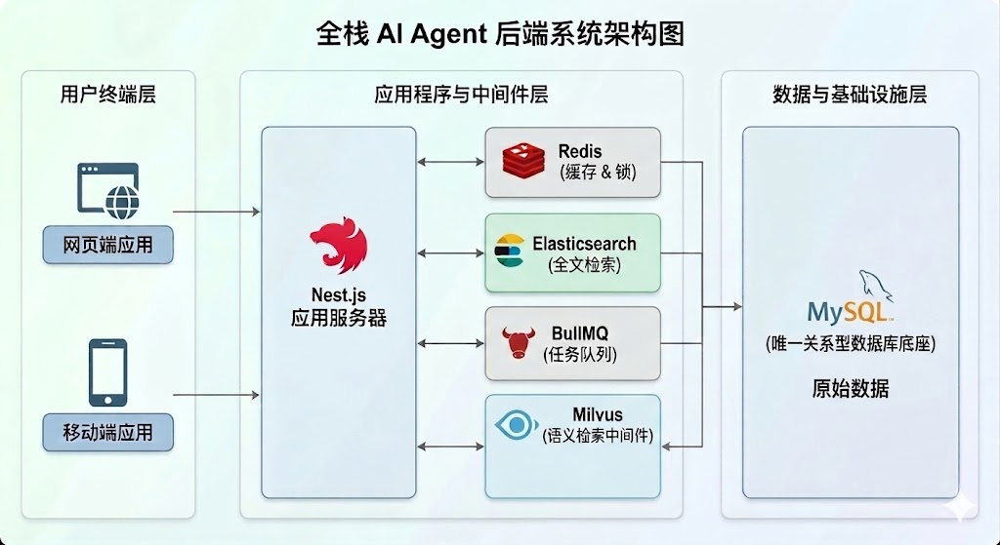
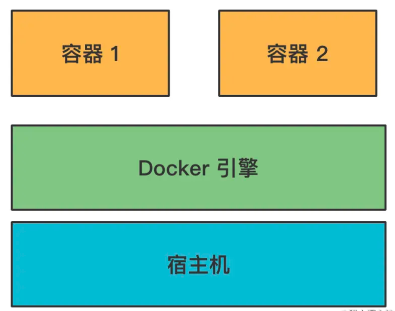
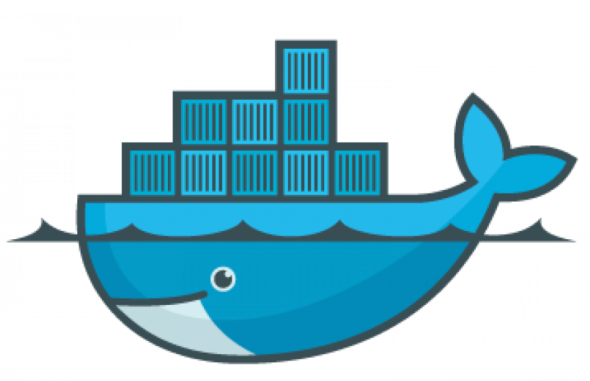
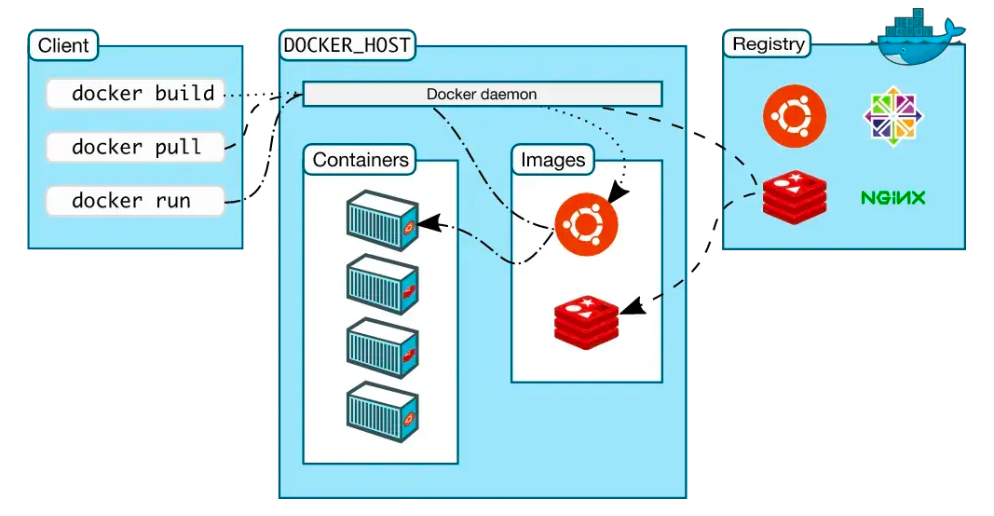
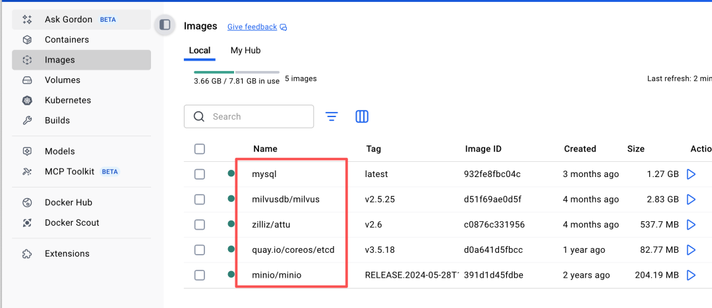
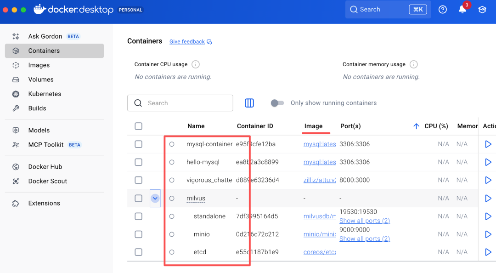
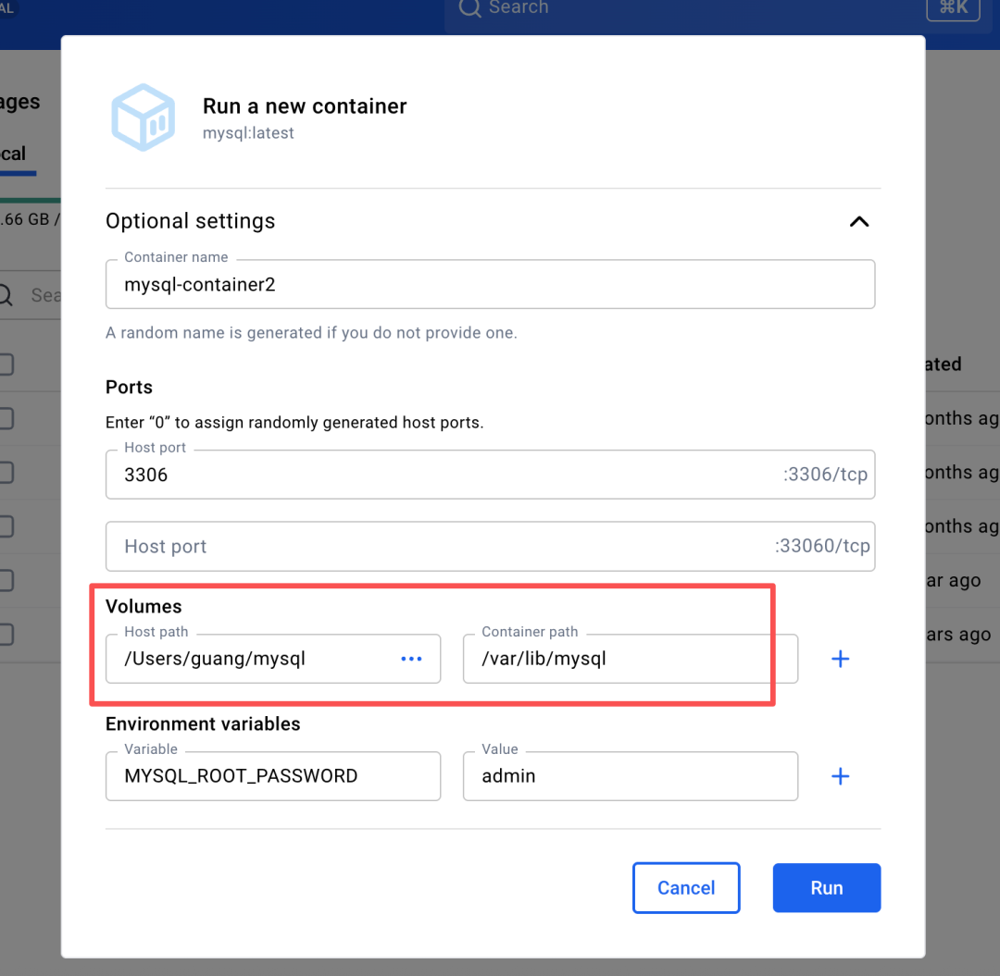
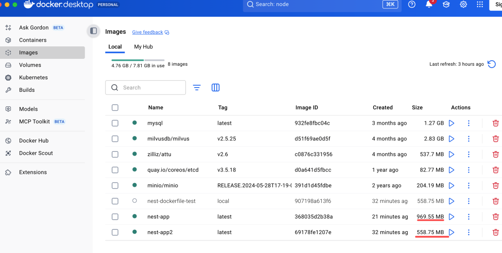
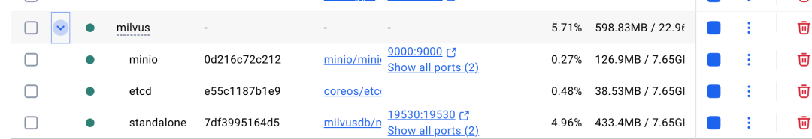
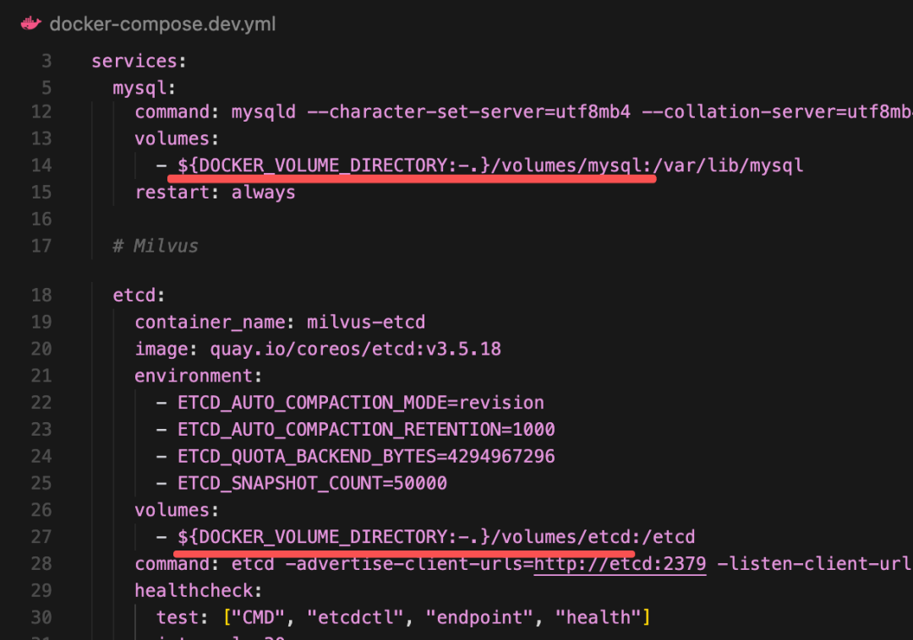

# 基于 Docker Compose 的本地开发提效和生产环境部署

> **Python 版** | 基于 FastAPI + Docker + Docker Compose 技术栈
> 原课程基于 Node.js(Nest.js)，本文转换为 Python(FastAPI) 版本

---

## 为什么需要 Docker？

业务项目的 Agent 都是在后端跑的。比如业务数据存在 MySQL，知识存在向量数据库 Milvus、短期记忆存 Redis、需要关键词检索的放在 ElasticSearch 等。

### 数据库 vs 中间件

| 类型 | 说明 | 示例 | 核心要求 |
|------|------|------|----------|
| **数据库** | 持久化存储业务原始数据 | MySQL、PostgreSQL | 稳健、不丢失 |
| **中间件** | 专项能力的辅助基础软件 | Redis、ElasticSearch、Milvus、RabbitMQ | 高性能、专项能力 |

中间件的作用：
- **检索补足**：MySQL 不擅长全文模糊搜索，引入 ElasticSearch 做高性能检索
- **性能补足**：数据库读写磁盘太慢，用 Redis 内存级缓存
- **异步补足**：业务逻辑处理太耗时，用消息队列做任务缓冲和解耦



**数据库是根，中间件是特种兵。** MySQL 存的是业务原始数据，是根，不能丢。而 Redis 专门做缓存、ES 做全文检索、Milvus 做语义检索、RabbitMQ 做消息队列，各司其职、专精专用，它们不是原始数据，丢了也不影响数据完整性。

**业务代码是数据库和中间件的调度者**，整合所有底层组件，最终实现完整的业务功能，对外提供服务。

---

## Docker 基础

### 什么是 Docker？

Docker 将应用及其依赖环境统一封装为**镜像（Image）**，镜像运行后就成为**容器（Container）**。

一台服务器可以同时运行多个容器，容器之间相互隔离，拥有独立的文件系统、网络、端口等环境，互不干扰。



这也是为什么它的 logo 是这样的：



### Docker Hub

Docker 提供了 **Docker Hub** 镜像仓库，可以把本地镜像 push 到仓库，或者从仓库 pull 镜像到本地。



### 镜像 vs 容器

| 概念 | 说明 | 类比 |
|------|------|------|
| **镜像（Image）** | 应用及其依赖的封装模板 | 类（Class） |
| **容器（Container）** | 镜像运行后的实例 | 对象（Object） |





### 常用 docker run 参数

```bash
docker run -d \
  --name mysql-container \
  -p 3306:3306 \
  -e MYSQL_ROOT_PASSWORD=admin \
  -v /path/to/mysql:/var/lib/mysql \
  mysql:latest
```

| 参数 | 说明 |
|------|------|
| `-d` | 后台运行（detached） |
| `--name` | 容器名称 |
| `-p` | 端口映射（宿主机端口:容器端口） |
| `-e` | 环境变量 |
| `-v` | 数据卷挂载（宿主机目录:容器目录） |



### 数据卷（Volume）

虽然在容器内跑数据库，但我们希望数据能持久化保存到宿主机，这样下次跑其他容器，也能用这个目录下的数据。这就是**数据卷 Volume** 的作用。

---

## Dockerfile 编写

如果我们想自己创建一个 Docker 镜像，比如把 FastAPI 项目打包成镜像，就要写 **Dockerfile**。

### 基础版 Dockerfile

```dockerfile
# 指定基础镜像（必须第一行）
FROM python:3.12-slim

# 设置容器内工作目录
WORKDIR /app

# 先复制 requirements.txt 利用缓存加速
COPY requirements.txt .

# 安装依赖
RUN pip install --no-cache-dir -r requirements.txt -i https://pypi.tuna.tsinghua.edu.cn/simple

# 复制项目所有代码到容器内
COPY . .

# 声明暴露端口（仅声明）
EXPOSE 8000

# 容器启动时执行的命令
CMD ["uvicorn", "main:app", "--host", "0.0.0.0", "--port", "8000"]
```

### Dockerfile 指令说明

| 指令 | 说明 |
|------|------|
| `FROM` | 指定基础镜像，一切从这个镜像开始构建 |
| `WORKDIR` | 指定容器内的工作目录，后续命令都在这个目录执行 |
| `COPY` | 将宿主机的文件/目录复制到容器内部 |
| `RUN` | 在构建镜像时执行命令，比如安装依赖 |
| `EXPOSE` | 声明容器要暴露的端口，仅作声明 |
| `CMD` | 容器启动时执行的默认命令，一个 Dockerfile 只能有一个 CMD |

### .dockerignore

创建 `.dockerignore` 文件，忽略不需要复制的文件：

```
__pycache__/
*.pyc
*.pyo
.env
.venv/
venv/
.git/
.vscode/
.idea/
*.db
volumes/
```

### 构建和运行

```bash
# 构建镜像
docker build -t fastapi-app .

# 运行容器
docker run -d \
  --name fastapi-container \
  -p 8000:8000 \
  fastapi-app
```

---

## 多阶段构建

基础版 Dockerfile 会把源码、构建工具等都打包进镜像，导致镜像体积更大。我们一般用**多阶段构建**来优化。

### 多阶段构建 Dockerfile

```dockerfile
# ========== 构建阶段 ==========
# 需要构建工具才能编译，但最终镜像不需要
FROM python:3.12-slim AS builder

WORKDIR /app

# 安装构建依赖
COPY requirements.txt .
RUN pip install --no-cache-dir --user -r requirements.txt -i https://pypi.tuna.tsinghua.edu.cn/simple

# 复制源码
COPY . .

# 如果有编译步骤（如 Cython、protobuf），在这里执行
# RUN python setup.py build_ext --inplace


# ========== 运行阶段 ==========
# 仅保留运行时需要的文件，镜像更小
FROM python:3.12-slim

ENV PYTHONUNBUFFERED=1 \
    PYTHONDONTWRITEBYTECODE=1

WORKDIR /app

# 从构建阶段复制已安装的依赖
COPY --from=builder /root/.local /root/.local

# 从构建阶段复制应用代码
COPY --from=builder /app .

# 确保本地 bin 在 PATH 中
ENV PATH=/root/.local/bin:$PATH

# 暴露端口
EXPOSE 8000

# 启动命令
CMD ["uvicorn", "main:app", "--host", "0.0.0.0", "--port", "8000"]
```

### 多阶段构建原理

```
构建阶段（builder）          运行阶段（最终镜像）
┌─────────────────┐          ┌─────────────────┐
│ 基础镜像         │          │ 基础镜像         │
│ + 构建工具       │   复制    │ + 运行时依赖     │
│ + 依赖安装       │ ───────→ │ + 应用代码       │
│ + 源码           │          │                 │
│ + 编译产物       │          │ （更小的体积）   │
└─────────────────┘          └─────────────────┘
```

第一个阶段镜像只用于构建，之后再创建一个镜像，把前一个镜像构建出来的代码复制过去跑起来。这样只保留最后一个镜像的文件，体积更小。



---

## Docker Compose 本地开发环境

现在有了 MySQL、Milvus 等镜像，有了 FastAPI 服务的镜像，如果想让它们一起跑呢？这就需要 **Docker Compose** 了。

### 什么是 Docker Compose？

**Docker Compose 用于编排多个容器，统一管理启动参数、依赖顺序与网络环境。**

**所有容器默认处于同一内网，天然互通，可直接用容器名互相调用。**



### 本地开发 docker-compose.dev.yml

创建 `docker-compose.dev.yml`：

```yaml
version: '3.8'

services:
  # ========== MySQL ==========
  mysql:
    image: mysql:8.0
    container_name: mysql-dev
    ports:
      - "3306:3306"
    environment:
      MYSQL_ROOT_PASSWORD: admin
      MYSQL_DATABASE: agent_db
    command: mysqld --character-set-server=utf8mb4 --collation-server=utf8mb4_general_ci
    volumes:
      - ${DOCKER_VOLUME_DIRECTORY:-.}/volumes/mysql:/var/lib/mysql
    restart: always
    healthcheck:
      test: ["CMD", "mysqladmin", "ping", "-h", "localhost"]
      interval: 10s
      timeout: 5s
      retries: 5

  # ========== Redis ==========
  redis:
    image: redis:7-alpine
    container_name: redis-dev
    ports:
      - "6379:6379"
    volumes:
      - ${DOCKER_VOLUME_DIRECTORY:-.}/volumes/redis:/data
    restart: always
    healthcheck:
      test: ["CMD", "redis-cli", "ping"]
      interval: 10s
      timeout: 5s
      retries: 5

  # ========== Milvus 依赖：etcd ==========
  etcd:
    container_name: milvus-etcd
    image: quay.io/coreos/etcd:v3.5.18
    environment:
      - ETCD_AUTO_COMPACTION_MODE=revision
      - ETCD_AUTO_COMPACTION_RETENTION=1000
      - ETCD_QUOTA_BACKEND_BYTES=4294967296
    volumes:
      - ${DOCKER_VOLUME_DIRECTORY:-.}/volumes/etcd:/etcd
    command: etcd -advertise-client-urls=http://etcd:2379 -listen-client-urls http://0.0.0.0:2379 --data-dir /etcd
    healthcheck:
      test: ["CMD", "etcdctl", "endpoint", "health"]
      interval: 30s
      timeout: 20s
      retries: 3

  # ========== Milvus 依赖：minio ==========
  minio:
    container_name: milvus-minio
    image: minio/minio:RELEASE.2024-05-28T17-19-04Z
    environment:
      MINIO_ACCESS_KEY: minioadmin
      MINIO_SECRET_KEY: minioadmin
    ports:
      - "9001:9001"
      - "9000:9000"
    volumes:
      - ${DOCKER_VOLUME_DIRECTORY:-.}/volumes/minio:/minio_data
    command: minio server /minio_data --console-address ":9001"
    healthcheck:
      test: ["CMD", "curl", "-f", "http://localhost:9000/minio/health/live"]
      interval: 30s
      timeout: 20s
      retries: 3

  # ========== Milvus ==========
  milvus:
    container_name: milvus-standalone
    image: milvusdb/milvus:v2.5.25
    command: ["milvus", "run", "standalone"]
    security_opt:
      - seccomp:unconfined
    environment:
      ETCD_ENDPOINTS: etcd:2379
      MINIO_ADDRESS: minio:9000
    volumes:
      - ${DOCKER_VOLUME_DIRECTORY:-.}/volumes/milvus:/var/lib/milvus
    healthcheck:
      test: ["CMD", "curl", "-f", "http://localhost:9091/healthz"]
      interval: 30s
      start_period: 90s
      timeout: 20s
      retries: 3
    ports:
      - "19530:19530"
      - "9091:9091"
    depends_on:
      - etcd
      - minio

networks:
  default:
    name: agent-network
```

### 关键配置说明



`${DOCKER_VOLUME_DIRECTORY:-.}` 的意思是：
- 如果指定了环境变量 `DOCKER_VOLUME_DIRECTORY=/abc`，路径就是 `/abc/volumes/mysql`
- 没有指定就是 `./volumes/mysql`

这样指定默认值，还支持环境变量来修改的方式更灵活。

### 启动和停止脚本

在 `package.json`（Node.js）或 `Makefile`（Python）中添加命令：

```makefile
# Makefile
.PHONY: docker-up docker-down

docker-up:
	DOCKER_VOLUME_DIRECTORY=./data docker compose -f docker-compose.dev.yml up -d

docker-down:
	docker compose -f docker-compose.dev.yml down
```

使用：

```bash
# 启动所有服务
make docker-up

# 停止所有服务
make docker-down
```

或者直接用命令：

```bash
# 启动
docker compose -f docker-compose.dev.yml up -d

# 停止
docker compose -f docker-compose.dev.yml down

# 查看日志
docker compose -f docker-compose.dev.yml logs -f mysql

# 重启某个服务
docker compose -f docker-compose.dev.yml restart mysql
```

这样，本地环境就可以一键启动了，不用一个个跑 docker 容器。

---

## 生产环境部署

### FastAPI + SQLAlchemy 项目示例

首先，我们用 FastAPI + SQLAlchemy 实现一个简单的图书管理接口。

#### 项目结构

```
fastapi-app/
├── .env
├── .dockerignore
├── Dockerfile
├── docker-compose.yml
├── requirements.txt
├── main.py
├── database.py
├── models.py
└── schemas.py
```

#### requirements.txt

```
fastapi==0.115.0
uvicorn==0.30.6
sqlalchemy==2.0.35
pymysql==1.1.1
python-dotenv==1.0.1
pydantic==2.9.2
```

#### database.py

```python
"""数据库连接配置"""
import os
from dotenv import load_dotenv
from sqlalchemy import create_engine
from sqlalchemy.ext.declarative import declarative_base
from sqlalchemy.orm import sessionmaker

load_dotenv()

# 从环境变量读取数据库配置
DB_HOST = os.getenv("DB_HOST", "mysql")
DB_PORT = os.getenv("DB_PORT", "3306")
DB_USER = os.getenv("DB_USER", "root")
DB_PASSWORD = os.getenv("DB_PASSWORD", "admin")
DB_NAME = os.getenv("DB_NAME", "agent_db")

# MySQL 连接字符串
DATABASE_URL = f"mysql+pymysql://{DB_USER}:{DB_PASSWORD}@{DB_HOST}:{DB_PORT}/{DB_NAME}?charset=utf8mb4"

engine = create_engine(DATABASE_URL, pool_pre_ping=True, pool_recycle=3600)
SessionLocal = sessionmaker(autocommit=False, autoflush=False, bind=engine)
Base = declarative_base()


def get_db():
    """获取数据库会话（FastAPI 依赖注入）"""
    db = SessionLocal()
    try:
        yield db
    finally:
        db.close()
```

#### models.py

```python
"""数据模型"""
from sqlalchemy import Column, Integer, String, Text, DateTime, Numeric
from sqlalchemy.sql import func
from database import Base


class Book(Base):
    """图书模型"""
    __tablename__ = "books"

    id = Column(Integer, primary_key=True, index=True)
    title = Column(String(255), nullable=False, comment="书名")
    author = Column(String(255), nullable=False, comment="作者")
    description = Column(Text, comment="描述")
    price = Column(Numeric(10, 2), default=0, comment="价格")
    stock = Column(Integer, default=0, comment="库存")
    published_at = Column(DateTime, comment="出版日期")
    created_at = Column(DateTime, server_default=func.now(), comment="创建时间")
    updated_at = Column(DateTime, server_default=func.now(), onupdate=func.now(), comment="更新时间")
```

#### schemas.py

```python
"""Pydantic 模式（请求/响应验证）"""
from pydantic import BaseModel
from datetime import datetime
from typing import Optional


class BookBase(BaseModel):
    title: str
    author: str
    description: Optional[str] = None
    price: float = 0
    stock: int = 0
    published_at: Optional[datetime] = None


class BookCreate(BookBase):
    pass


class BookUpdate(BaseModel):
    title: Optional[str] = None
    author: Optional[str] = None
    description: Optional[str] = None
    price: Optional[float] = None
    stock: Optional[int] = None
    published_at: Optional[datetime] = None


class BookResponse(BookBase):
    id: int
    created_at: datetime
    updated_at: datetime

    class Config:
        from_attributes = True
```

#### main.py

```python
"""FastAPI 应用入口"""
from fastapi import FastAPI, Depends, HTTPException
from sqlalchemy.orm import Session
from typing import List
from database import engine, get_db, Base
from models import Book
from schemas import BookCreate, BookUpdate, BookResponse

# 创建表
Base.metadata.create_all(bind=engine)

app = FastAPI(title="Agent 后端服务", version="1.0.0")


@app.post("/books", response_model=BookResponse, summary="创建图书")
def create_book(book: BookCreate, db: Session = Depends(get_db)):
    """创建新图书"""
    db_book = Book(**book.model_dump())
    db.add(db_book)
    db.commit()
    db.refresh(db_book)
    return db_book


@app.get("/books", response_model=List[BookResponse], summary="获取所有图书")
def get_books(db: Session = Depends(get_db)):
    """获取所有图书列表"""
    return db.query(Book).order_by(Book.id.desc()).all()


@app.get("/books/{book_id}", response_model=BookResponse, summary="获取图书详情")
def get_book(book_id: int, db: Session = Depends(get_db)):
    """根据 ID 获取图书详情"""
    book = db.query(Book).filter(Book.id == book_id).first()
    if not book:
        raise HTTPException(status_code=404, detail="图书不存在")
    return book


@app.put("/books/{book_id}", response_model=BookResponse, summary="更新图书")
def update_book(book_id: int, book: BookUpdate, db: Session = Depends(get_db)):
    """更新图书信息"""
    db_book = db.query(Book).filter(Book.id == book_id).first()
    if not db_book:
        raise HTTPException(status_code=404, detail="图书不存在")

    update_data = book.model_dump(exclude_unset=True)
    for key, value in update_data.items():
        setattr(db_book, key, value)

    db.commit()
    db.refresh(db_book)
    return db_book


@app.delete("/books/{book_id}", summary="删除图书")
def delete_book(book_id: int, db: Session = Depends(get_db)):
    """删除图书"""
    db_book = db.query(Book).filter(Book.id == book_id).first()
    if not db_book:
        raise HTTPException(status_code=404, detail="图书不存在")

    db.delete(db_book)
    db.commit()
    return {"deleted": True}


@app.get("/", summary="健康检查")
def root():
    return {"message": "Agent 后端服务运行中"}
```

### 生产环境 docker-compose.yml

创建 `docker-compose.yml`：

```yaml
version: '3.8'

services:
  # ========== MySQL ==========
  mysql:
    image: mysql:8.0
    container_name: agent-mysql
    restart: always
    environment:
      MYSQL_ROOT_PASSWORD: ${MYSQL_ROOT_PASSWORD:-admin}
      MYSQL_DATABASE: ${MYSQL_DATABASE:-agent_db}
    volumes:
      - mysql_data:/var/lib/mysql
    command: mysqld --character-set-server=utf8mb4 --collation-server=utf8mb4_general_ci
    healthcheck:
      test: ["CMD", "mysqladmin", "ping", "-h", "localhost"]
      interval: 10s
      timeout: 5s
      retries: 5
    networks:
      - agent-network

  # ========== Redis ==========
  redis:
    image: redis:7-alpine
    container_name: agent-redis
    restart: always
    volumes:
      - redis_data:/data
    healthcheck:
      test: ["CMD", "redis-cli", "ping"]
      interval: 10s
      timeout: 5s
      retries: 5
    networks:
      - agent-network

  # ========== FastAPI 应用 ==========
  app:
    build:
      context: .
      dockerfile: Dockerfile
    container_name: agent-app
    restart: always
    ports:
      - "8000:8000"
    environment:
      - DB_HOST=mysql
      - DB_PORT=3306
      - DB_USER=root
      - DB_PASSWORD=${MYSQL_ROOT_PASSWORD:-admin}
      - DB_NAME=${MYSQL_DATABASE:-agent_db}
      - REDIS_HOST=redis
      - REDIS_PORT=6379
    depends_on:
      mysql:
        condition: service_healthy
      redis:
        condition: service_healthy
    networks:
      - agent-network

volumes:
  mysql_data:
  redis_data:

networks:
  agent-network:
    driver: bridge
```

### 生产环境 .env

```env
# MySQL
MYSQL_ROOT_PASSWORD=your_secure_password
MYSQL_DATABASE=agent_db

# 应用
APP_ENV=production
```

### 部署命令

```bash
# 构建并启动
docker compose up -d --build

# 查看日志
docker compose logs -f app

# 重启应用
docker compose restart app

# 停止并移除容器
docker compose down

# 停止并移除容器和数据卷（谨慎！会删除数据）
docker compose down -v
```

### 测试接口

```bash
# 1. 新增图书
curl -X POST "http://localhost:8000/books" \
  -H "Content-Type: application/json" \
  -d '{
    "title": "Clean Code",
    "author": "Robert C. Martin",
    "description": "代码整洁之道",
    "price": 59.90,
    "stock": 100
  }'

# 2. 获取所有图书
curl "http://localhost:8000/books"

# 3. 获取图书详情
curl "http://localhost:8000/books/1"

# 4. 更新图书
curl -X PUT "http://localhost:8000/books/1" \
  -H "Content-Type: application/json" \
  -d '{"price": 49.90, "stock": 80}'

# 5. 删除图书
curl -X DELETE "http://localhost:8000/books/1"
```

---

## Docker Compose 常用命令

| 命令 | 说明 |
|------|------|
| `docker compose up -d` | 启动所有服务（后台运行） |
| `docker compose up -d --build` | 重新构建镜像并启动 |
| `docker compose down` | 停止并移除所有容器 |
| `docker compose logs -f` | 查看所有服务日志（实时） |
| `docker compose logs -f <service>` | 查看指定服务日志 |
| `docker compose ps` | 查看服务状态 |
| `docker compose restart <service>` | 重启指定服务 |
| `docker compose exec <service> <cmd>` | 在容器内执行命令 |
| `docker compose pull` | 拉取最新镜像 |

---

## 学习要点

1. **Docker** 将应用及其依赖封装为镜像，镜像运行后成为容器，容器之间相互隔离
2. **数据库 vs 中间件**：数据库存业务原始数据（不能丢），中间件提供专项能力（缓存、检索、消息队列）
3. **Dockerfile** 指令：`FROM` 基础镜像、`WORKDIR` 工作目录、`COPY` 复制文件、`RUN` 构建时执行、`EXPOSE` 声明端口、`CMD` 启动命令
4. **多阶段构建**：构建阶段安装依赖和编译，运行阶段只复制必要文件，减小镜像体积
5. **数据卷（Volume）**：将容器内数据持久化到宿主机，容器删除后数据不丢失
6. **Docker Compose** 编排多个容器，统一管理启动参数、依赖顺序与网络环境
7. **容器内网互通**：同一 Compose 网络内的容器可以直接用容器名互相调用
8. **健康检查（healthcheck）**：确保依赖服务就绪后再启动应用，避免连接失败
9. **环境变量配置**：用 `.env` 文件管理敏感信息，不要硬编码在代码或 Dockerfile 中
10. **生产环境最佳实践**：使用命名卷（named volume）而非绑定挂载，设置 `restart: always`，配置健康检查

## 扩展方向

- 学习 Docker 网络模式（bridge、host、overlay）
- 探索 Docker Swarm 或 Kubernetes 进行容器编排
- 学习 CI/CD 流水线（GitHub Actions、GitLab CI）自动构建和部署
- 配置 Nginx 反向代理和 HTTPS（Let's Encrypt）
- 学习日志收集和监控（ELK、Prometheus + Grafana）
- 探索蓝绿部署和滚动更新策略
- 学习 Docker 安全最佳实践（非 root 用户、只读文件系统、secrets 管理）
- 配置私有镜像仓库（Harbor、AWS ECR）

---

## 配套代码库

**代码库地址**：https://github.com/iiixiyan/agent-learning-code/tree/main/02-enterprise-backend/27-docker-compose-deploy

包含本文的完整可运行代码示例（FastAPI + SQLAlchemy + MySQL + Redis + Docker Compose 本地开发和生产环境部署）。

---

**上一篇**：[Agentic RAG](./26_Agentic-RAG.md) | **下一篇**：[ElasticSearch 全文检索](./28_ElasticSearch全文检索.md)
