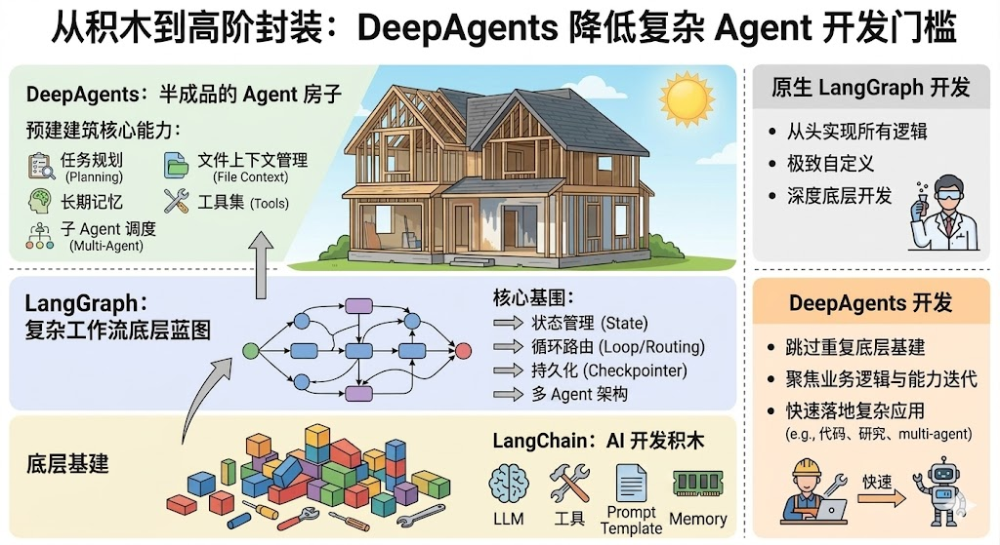
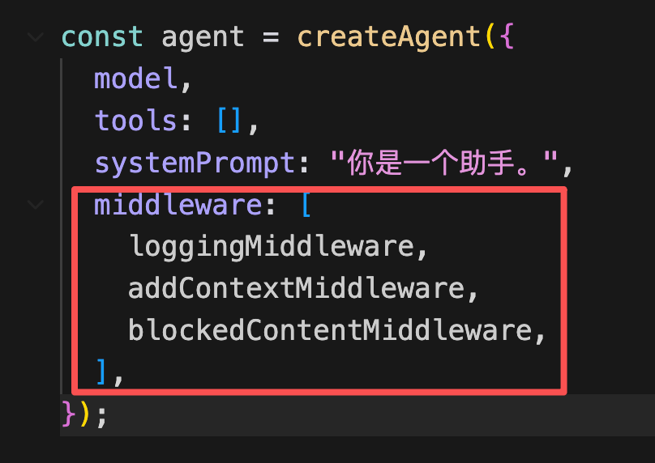
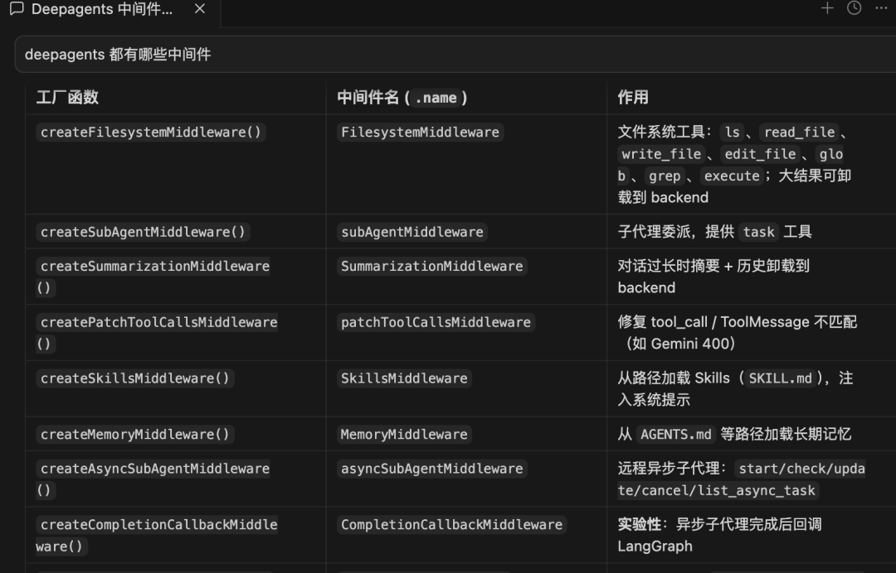
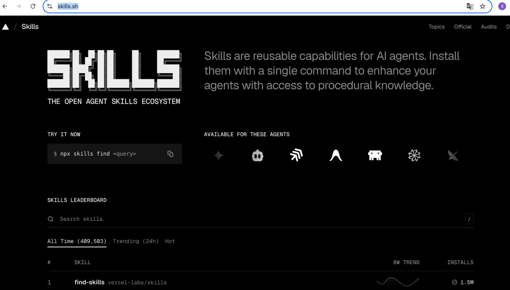
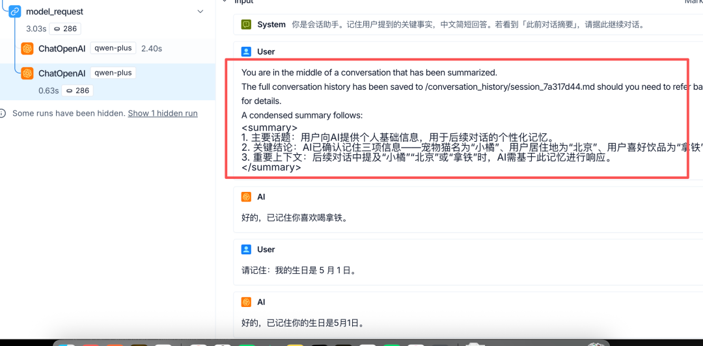
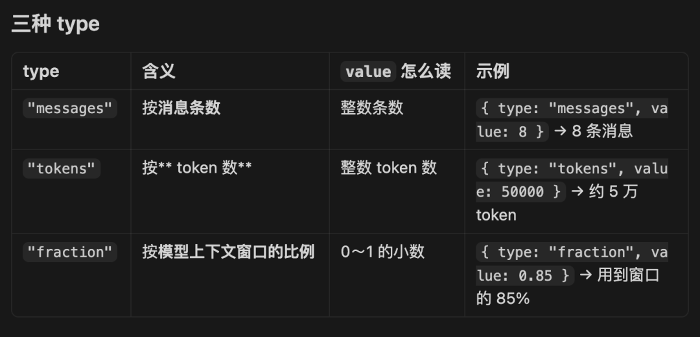

# DeepAgents：开箱即用的 Skill、上下文压缩等 Middleware

> **Python 版** | 基于 DeepAgents 概念 + Python LangGraph 实现
> 前置知识：[LangGraph 图编排和多 Agent](../02-第二阶段-企业级后端与进阶框架/25_图编排引擎-LangGraph和多Agent架构.md)

---

## 为什么需要 DeepAgents？

我们学了 LangChain、LangGraph，可以基于它们实现各种 Agent。但如果想做一个复杂的 Agent，全部从头自己实现还是比较麻烦。

有没有基于 LangGraph 再封装一层，也就是半成品的 Agent 框架呢？有的，就是 **DeepAgents**。

### 三层架构对比



| 层级 | 框架 | 定位 | 适用场景 |
|------|------|------|----------|
| **底层基建** | LangChain | AI 开发积木（LLM、工具、Prompt、记忆） | 基础组件使用 |
| **中层蓝图** | LangGraph | 复杂工作流底层蓝图（状态管理、循环路由、持久化） | 极致自定义、深度开发 |
| **高阶封装** | DeepAgents | 半成品 Agent 房子（任务规划、长期记忆、子 Agent、上下文压缩） | 快速落地复杂 Agent |

**DeepAgents 最大的优势**：大幅降低复杂 Agent 的开发门槛，跳过重复的底层基建，直接聚焦业务逻辑与能力迭代。

### DeepAgents 预建核心能力

| 能力 | 说明 |
|------|------|
| **任务规划（Planning）** | 自动拆解复杂任务为子任务 |
| **文件上下文管理（File Context）** | 读写、修改、搜索文件 |
| **长期记忆（Long-term Memory）** | 持久化存储用户偏好和项目信息 |
| **工具集（Tools）** | 内置常用工具，支持扩展 |
| **子 Agent 调度（Multi-Agent）** | 声明式创建和调度子 Agent |

---

## Middleware 机制

DeepAgents 的核心扩展机制是 **Middleware（中间件）**，可以在 Agent 运行的各个阶段插入自定义逻辑。

### Middleware 钩子点

```
Agent 执行流程：
  beforeAgent ──► beforeModel ──► [模型调用] ──► afterModel
       │                                              │
       │         ┌── wrapModelCall (包装模型调用) ──┐│
       │         │                                    ││
       ▼         ▼                                    ▼▼
  beforeTool ──► wrapToolCall ──► [工具执行] ──► afterTool
       │
       ▼
  afterAgent
```

| 钩子 | 说明 | 典型用途 |
|------|------|----------|
| `beforeAgent` | Agent 开始前 | 日志、初始化状态 |
| `beforeModel` | 模型调用前 | 注入上下文、敏感词拦截 |
| `wrapModelCall` | 包装模型调用 | 修改请求/响应、重试 |
| `afterModel` | 模型调用后 | 统计调用次数、日志 |
| `beforeTool` | 工具调用前 | 权限校验、参数校验 |
| `wrapToolCall` | 包装工具调用 | 修改工具结果、日志 |
| `afterTool` | 工具调用后 | 统计、后处理 |
| `afterAgent` | Agent 结束后 | 汇总统计、清理 |

### Middleware 配置示例



---

## Python 实现自定义 Middleware

虽然 DeepAgents 原生是 JavaScript 版本，但我们可以用 Python 的 LangGraph 实现类似的 Middleware 机制。

### 安装依赖

```bash
pip install langgraph langchain-openai python-dotenv
```

### 完整 Middleware 示例

创建 `middleware_demo.py`：

```python
"""
middleware_demo.py - Python 版 Middleware 机制实现
基于 LangGraph，实现日志、上下文注入、敏感词拦截等中间件
"""
import os
from typing import TypedDict, Annotated, Sequence
from dotenv import load_dotenv
from langchain_openai import ChatOpenAI
from langchain_core.messages import BaseMessage, HumanMessage, AIMessage, SystemMessage
from langgraph.graph import StateGraph, END
from langgraph.graph.message import add_messages
import operator

load_dotenv()


# ========== 状态定义 ==========

class AgentState(TypedDict):
    messages: Annotated[Sequence[BaseMessage], add_messages]
    model_call_count: int  # 模型调用次数统计
    tool_call_count: int   # 工具调用次数统计


# ========== Middleware 基类 ==========

class Middleware:
    """Middleware 基类"""

    name: str = "BaseMiddleware"

    def before_agent(self, state: AgentState) -> AgentState:
        """Agent 开始前"""
        return state

    def before_model(self, state: AgentState) -> AgentState:
        """模型调用前"""
        return state

    def after_model(self, state: AgentState) -> AgentState:
        """模型调用后"""
        return state

    def before_tool(self, state: AgentState) -> AgentState:
        """工具调用前"""
        return state

    def after_tool(self, state: AgentState) -> AgentState:
        """工具调用后"""
        return state

    def after_agent(self, state: AgentState) -> AgentState:
        """Agent 结束后"""
        return state


# ========== 自定义 Middleware 1: 日志 + 统计 ==========

class LoggingMiddleware(Middleware):
    """日志 + 模型调用次数统计"""

    name = "LoggingMiddleware"

    def before_agent(self, state: AgentState) -> AgentState:
        print(f"\n[Logging] Agent 开始，消息数: {len(state['messages'])}")
        return state

    def before_model(self, state: AgentState) -> AgentState:
        print(f"[Logging] 即将调用模型，当前消息数: {len(state['messages'])}, "
              f"已调用: {state.get('model_call_count', 0)} 次")
        return state

    def after_model(self, state: AgentState) -> AgentState:
        last = state["messages"][-1]
        preview = last.content[:80] if isinstance(last.content, str) else str(last.content)[:80]
        print(f"[Logging] 模型返回: {preview}...")
        state["model_call_count"] = state.get("model_call_count", 0) + 1
        return state

    def after_agent(self, state: AgentState) -> AgentState:
        print(f"[Logging] Agent 结束，累计模型调用: {state.get('model_call_count', 0)} 次\n")
        return state


# ========== 自定义 Middleware 2: 注入系统上下文 ==========

class AddContextMiddleware(Middleware):
    """在每次模型调用前追加系统上下文"""

    name = "AddContextMiddleware"

    def __init__(self, extra_context: str):
        self.extra_context = extra_context

    def before_model(self, state: AgentState) -> AgentState:
        print("[AddContext] 注入额外系统上下文")
        # 在消息列表开头插入系统消息
        system_msg = SystemMessage(content=self.extra_context)
        state["messages"] = [system_msg] + list(state["messages"])
        return state


# ========== 自定义 Middleware 3: 敏感词拦截 ==========

class BlockedContentMiddleware(Middleware):
    """拦截敏感词，直接结束 Agent"""

    name = "BlockedContentMiddleware"

    def __init__(self, blocked_words: list[str]):
        self.blocked_words = blocked_words

    def before_model(self, state: AgentState) -> AgentState:
        last = state["messages"][-1]
        text = last.content if isinstance(last.content, str) else str(last.content)

        for word in self.blocked_words:
            if word in text:
                print(f"[Blocked] 检测到敏感词 '{word}'，短路结束")
                # 直接添加拒绝消息并标记结束
                state["messages"].append(AIMessage(content="该请求包含敏感内容，无法处理。"))
                state["blocked"] = True
                return state

        return state


# ========== Agent 核心（带 Middleware 支持） ==========

class MiddlewareAgent:
    """支持 Middleware 的 Agent"""

    def __init__(self, model, middlewares: list[Middleware] = None):
        self.model = model
        self.middlewares = middlewares or []

    def invoke(self, messages: list[BaseMessage]) -> AgentState:
        """
        执行 Agent，支持 Middleware 钩子

        Args:
            messages: 初始消息列表

        Returns:
            AgentState: 最终状态
        """
        state: AgentState = {
            "messages": list(messages),
            "model_call_count": 0,
            "tool_call_count": 0,
        }

        # beforeAgent
        for mw in self.middlewares:
            state = mw.before_agent(state)

        # 简单 Agent Loop（最多 5 轮）
        for _ in range(5):
            # 检查是否被拦截
            if state.get("blocked"):
                break

            # beforeModel
            for mw in self.middlewares:
                state = mw.before_model(state)

            # 模型调用
            response = self.model.invoke(state["messages"])
            state["messages"].append(response)

            # afterModel
            for mw in self.middlewares:
                state = mw.after_model(state)

            # 如果没有工具调用，结束
            if not response.tool_calls:
                break

        # afterAgent
        for mw in self.middlewares:
            state = mw.after_agent(state)

        return state


# ========== 使用示例 ==========

if __name__ == "__main__":
    # 初始化模型
    model = ChatOpenAI(
        model=os.getenv("MODEL_NAME", "qwen-plus"),
        api_key=os.getenv("OPENAI_API_KEY"),
        base_url=os.getenv("OPENAI_BASE_URL"),
        temperature=0,
    )

    # 创建 Middleware
    middlewares = [
        LoggingMiddleware(),
        AddContextMiddleware(extra_context="\n\n请用一句话简洁回答。"),
        BlockedContentMiddleware(blocked_words=["BLOCKED", "禁止"]),
    ]

    # 创建 Agent
    agent = MiddlewareAgent(model=model, middlewares=middlewares)

    # 测试1: 正常问题
    print("=" * 60)
    print("测试1: 正常问题")
    print("=" * 60)
    result = agent.invoke([HumanMessage(content="用中文说：middleware 是什么？")])
    print(f"回复: {result['messages'][-1].content}")
    print(f"modelCallCount: {result['model_call_count']}")

    # 测试2: 敏感词拦截
    print("\n" + "=" * 60)
    print("测试2: 敏感词拦截")
    print("=" * 60)
    result = agent.invoke([HumanMessage(content="这句话包含 BLOCKED 关键词")])
    print(f"回复: {result['messages'][-1].content}")
    print(f"modelCallCount: {result['model_call_count']}")
```

### 运行示例

```bash
python middleware_demo.py
```

---

## DeepAgents 内置中间件

DeepAgents 提供了很多开箱即用的中间件：



| 工厂函数 | 中间件名 | 作用 |
|----------|----------|------|
| `createFilesystemMiddleware()` | FilesystemMiddleware | 文件系统工具：ls、read_file、write_file、edit_file、grep、execute |
| `createSubAgentMiddleware()` | subAgentMiddleware | 子代理委派，提供 task 工具 |
| `createSummarizationMiddleware()` | SummarizationMiddleware | 对话过长时摘要 + 历史卸载到 backend |
| `createPatchToolCallsMiddleware()` | patchToolCallsMiddleware | 修复 tool_call / ToolMessage 不匹配 |
| `createSkillsMiddleware()` | SkillsMiddleware | 从路径加载 Skills（SKILL.md），注入系统提示 |
| `createMemoryMiddleware()` | MemoryMiddleware | 从 AGENTS.md 等路径加载长期记忆 |
| `createAsyncSubAgentMiddleware()` | asyncSubAgentMiddleware | 远程异步子代理：start/check/update/cancel/list_async_task |

---

## FilesystemMiddleware（文件系统）

文件系统中间件可以指定一个 backend 作为文件系统，然后提供读写、修改、搜索文件的命令，还做了权限控制。

### Python 实现文件系统 Agent

创建 `filesystem_agent.py`：

```python
"""
filesystem_agent.py - Python 版文件系统 Agent
实现文件读写、搜索、权限控制
"""
import os
from typing import TypedDict, Annotated, Sequence
from dotenv import load_dotenv
from langchain_openai import ChatOpenAI
from langchain_core.messages import BaseMessage, HumanMessage
from langchain_core.tools import tool
from langgraph.prebuilt import create_react_agent

load_dotenv()

# 工作区目录
WORKSPACE_DIR = os.path.join(os.path.dirname(__file__), "workspace")
os.makedirs(WORKSPACE_DIR, exist_ok=True)


# ========== 工具定义 ==========

@tool
def list_files(path: str = "/") -> str:
    """
    列出指定目录下的文件和文件夹。

    Args:
        path: 目录路径，以 / 开头，如 / 或 /subdir

    Returns:
        str: 文件列表
    """
    full_path = os.path.join(WORKSPACE_DIR, path.lstrip("/"))
    if not os.path.exists(full_path):
        return f"错误：路径不存在 - {path}"
    if not os.path.isdir(full_path):
        return f"错误：不是目录 - {path}"

    items = os.listdir(full_path)
    result = [f"目录: {path}"]
    for item in sorted(items):
        item_path = os.path.join(full_path, item)
        if os.path.isdir(item_path):
            result.append(f"  📁 {item}/")
        else:
            size = os.path.getsize(item_path)
            result.append(f"  📄 {item} ({size} bytes)")
    return "\n".join(result)


@tool
def read_file(path: str) -> str:
    """
    读取文件内容。

    Args:
        path: 文件路径，以 / 开头，如 /todo.md

    Returns:
        str: 文件内容
    """
    full_path = os.path.join(WORKSPACE_DIR, path.lstrip("/"))
    if not os.path.exists(full_path):
        return f"错误：文件不存在 - {path}"
    if not os.path.isfile(full_path):
        return f"错误：不是文件 - {path}"

    with open(full_path, "r", encoding="utf-8") as f:
        content = f.read()
    return f"文件: {path}\n---\n{content}"


@tool
def write_file(path: str, content: str) -> str:
    """
    写入文件（覆盖已有内容）。

    Args:
        path: 文件路径，以 / 开头
        content: 文件内容

    Returns:
        str: 操作结果
    """
    full_path = os.path.join(WORKSPACE_DIR, path.lstrip("/"))
    os.makedirs(os.path.dirname(full_path), exist_ok=True)

    with open(full_path, "w", encoding="utf-8") as f:
        f.write(content)
    return f"✅ 已写入文件: {path} ({len(content)} 字符)"


@tool
def search_files(keyword: str, path: str = "/") -> str:
    """
    在文件中搜索关键词。

    Args:
        keyword: 搜索关键词
        path: 搜索目录，以 / 开头

    Returns:
        str: 搜索结果
    """
    full_path = os.path.join(WORKSPACE_DIR, path.lstrip("/"))
    if not os.path.exists(full_path):
        return f"错误：路径不存在 - {path}"

    results = []
    for root, dirs, files in os.walk(full_path):
        for file in files:
            file_path = os.path.join(root, file)
            rel_path = "/" + os.path.relpath(file_path, WORKSPACE_DIR)
            try:
                with open(file_path, "r", encoding="utf-8") as f:
                    for i, line in enumerate(f, 1):
                        if keyword in line:
                            results.append(f"{rel_path}:{i}: {line.strip()[:80]}")
            except Exception:
                continue

    if not results:
        return f"未找到包含 '{keyword}' 的文件"
    return f"找到 {len(results)} 处匹配:\n" + "\n".join(results[:20])


# ========== 创建 Agent ==========

tools = [list_files, read_file, write_file, search_files]

model = ChatOpenAI(
    model=os.getenv("MODEL_NAME", "qwen-plus"),
    api_key=os.getenv("OPENAI_API_KEY"),
    base_url=os.getenv("OPENAI_BASE_URL"),
    temperature=0,
)

system_prompt = """你是一个文件系统助手。
工作区根路径为 /。可用工具：list_files、read_file、write_file、search_files。
中文回答。操作文件前先列出目录确认。"""

agent = create_react_agent(model, tools, state_modifier=system_prompt)


# ========== 使用示例 ==========

if __name__ == "__main__":
    # 初始化测试文件
    with open(os.path.join(WORKSPACE_DIR, "secret.txt"), "w") as f:
        f.write("机密：不得读取")

    print("=" * 60)
    print("测试: 文件系统 Agent")
    print("=" * 60)

    prompt = "write_file 创建 /todo.md（三条待办），然后 list_files /，最后一句话总结。"
    print(f"\n用户: {prompt}")

    result = agent.invoke({"messages": [HumanMessage(content=prompt)]})
    print(f"\n回复: {result['messages'][-1].content}")

    # 验证文件
    print("\n" + "=" * 60)
    print("验证: 生成的文件")
    print("=" * 60)
    todo_path = os.path.join(WORKSPACE_DIR, "todo.md")
    if os.path.exists(todo_path):
        with open(todo_path, "r") as f:
            print(f.read())
```

---

## SkillsMiddleware（Skill 支持）

Skills 是可复用的能力包，每个 Skill 包含一个 `SKILL.md` 文件，描述如何完成特定任务。



### Python 实现 Skill 加载

```python
"""
skills_agent.py - Python 版 Skill 加载和使用
"""
import os
from typing import TypedDict
from dotenv import load_dotenv
from langchain_openai import ChatOpenAI
from langchain_core.messages import HumanMessage, SystemMessage
from langchain_core.tools import tool
from langgraph.prebuilt import create_react_agent

load_dotenv()

SKILLS_DIR = os.path.join(os.path.dirname(__file__), ".agents", "skills")


def load_skill(skill_name: str) -> str:
    """
    加载 Skill 的 SKILL.md 内容

    Args:
        skill_name: Skill 名称

    Returns:
        str: SKILL.md 内容
    """
    skill_path = os.path.join(SKILLS_DIR, skill_name, "SKILL.md")
    if not os.path.exists(skill_path):
        return f"Skill '{skill_name}' 未找到"
    with open(skill_path, "r", encoding="utf-8") as f:
        return f.read()


def list_skills() -> str:
    """列出所有可用的 Skill"""
    if not os.path.exists(SKILLS_DIR):
        return "暂无可用 Skill"
    skills = [d for d in os.listdir(SKILLS_DIR)
              if os.path.isdir(os.path.join(SKILLS_DIR, d))]
    return "可用 Skill:\n" + "\n".join(f"- {s}" for s in sorted(skills))


@tool
def use_skill(skill_name: str, task: str) -> str:
    """
    使用指定的 Skill 完成任务。

    Args:
        skill_name: Skill 名称
        task: 要完成的任务描述

    Returns:
        str: 任务结果
    """
    skill_content = load_skill(skill_name)
    return f"已加载 Skill: {skill_name}\n\n{skill_content}\n\n任务: {task}"


# 创建 Agent
tools = [use_skill]

model = ChatOpenAI(
    model=os.getenv("MODEL_NAME", "qwen-plus"),
    api_key=os.getenv("OPENAI_API_KEY"),
    base_url=os.getenv("OPENAI_BASE_URL"),
    temperature=0,
)

system_prompt = f"""你是一个 Skill 助手。
可用 Skills: {list_skills()}
需要时使用 use_skill 工具加载对应 Skill 的说明，然后按说明完成任务。
中文回答。"""

agent = create_react_agent(model, tools, state_modifier=system_prompt)
```

---

## SubAgentMiddleware（子 Agent）

子 Agent 中间件用于创建多 Agent 系统，声明式定义子 Agent，主 Agent 通过 `task` 工具委派任务。

### Python 实现多 Agent

```python
"""
subagent_demo.py - Python 版多 Agent 系统
主 Agent 调度子 Agent 完成复杂任务
"""
import os
from typing import TypedDict, Annotated, Sequence
from dotenv import load_dotenv
from langchain_openai import ChatOpenAI
from langchain_core.messages import BaseMessage, HumanMessage, AIMessage
from langchain_core.tools import tool
from langgraph.prebuilt import create_react_agent
from langgraph.graph import StateGraph, END

load_dotenv()

model = ChatOpenAI(
    model=os.getenv("MODEL_NAME", "qwen-plus"),
    api_key=os.getenv("OPENAI_API_KEY"),
    base_url=os.getenv("OPENAI_BASE_URL"),
    temperature=0,
)


# ========== 子 Agent 1: 数学解题 ==========

@tool
def calculator(expression: str) -> str:
    """计算数学表达式，如 '2 + 3 * 4'"""
    try:
        result = eval(expression)
        return f"计算结果: {expression} = {result}"
    except Exception as e:
        return f"计算错误: {e}"


math_solver = create_react_agent(
    model,
    [calculator],
    state_modifier="你是数学解题子 Agent。必须用 calculator 完成计算，不要心算。输出：题目理解、分步算式、最终答案。"
)


# ========== 子 Agent 2: 辅导讲解 ==========

kid_tutor = create_react_agent(
    model,
    [],
    state_modifier="你是辅导讲解子 Agent，面向小学生家长。根据解题过程，用短句、比喻或分步提问方式讲解。说明：先想什么、再算什么、怎么检查答案。"
)


# ========== 子 Agent 3: 出题 ==========

@tool
def make_problem(template: str, seed: int) -> str:
    """生成一道同类应用题。template: divide_then_add | share_candy | group_buy"""
    n = (seed % 7) + 3
    problems = {
        "divide_then_add": f"小红有 {n*6} 张贴纸，平均分给 {n} 个小组，又买了 2 包每包 {n+2} 张的。每个小组现在一共有多少张？",
        "share_candy": f"小刚有 {n*4} 块糖，要分给 {n} 位同学，妈妈又买了 3 袋每袋 {n} 块的。每位同学现在能分到多少块？",
        "group_buy": f"班里有 {n} 个小组，每组先分到 {n*5} 支铅笔，老师又补了 2 盒每盒 {n+1} 支。每个小组现在有多少支？",
    }
    return problems.get(template, problems["share_candy"])


practice_maker = create_react_agent(
    model,
    [make_problem],
    state_modifier="你是出题子 Agent。调用 make_problem 至少 2 次（不同 template 或不同 seed），每道题给出题干和解题提示。"
)


# ========== 主 Agent: 调度子 Agent ==========

@tool
def delegate_to_solver(problem: str) -> str:
    """委派给数学解题子 Agent，传入题目描述"""
    result = math_solver.invoke({"messages": [HumanMessage(content=problem)]})
    return result["messages"][-1].content


@tool
def delegate_to_tutor(solution: str) -> str:
    """委派给辅导讲解子 Agent，传入解题过程"""
    result = kid_tutor.invoke({"messages": [HumanMessage(content=solution)]})
    return result["messages"][-1].content


@tool
def delegate_to_practice_maker(topic: str) -> str:
    """委派给出题子 Agent，传入题目类型"""
    result = practice_maker.invoke({"messages": [HumanMessage(content=topic)]})
    return result["messages"][-1].content


main_agent = create_react_agent(
    model,
    [delegate_to_solver, delegate_to_tutor, delegate_to_practice_maker],
    state_modifier="""你是小学数学辅导主 Agent，通过委派子 Agent 完成任务，自己不解题、不讲题、不出题。
按顺序：① delegate_to_solver 解题 ② delegate_to_tutor 教家长怎么讲 ③ delegate_to_practice_maker 出 2 道类似练习题。
最后向家长汇总：答案、辅导要点、两道练习题。中文。"""
)


# ========== 使用示例 ==========

if __name__ == "__main__":
    problem = """孩子遇到这道题：
「小明有 24 块糖，平均分给 6 个同学；
妈妈又买了 3 包糖，每包 5 块。每个同学现在一共有多少块？」
请先解题，再教家长怎么讲，最后出 2 道类似练习题，并汇总给我。"""

    print("场景: 小学应用题辅导（解题 → 讲题 → 出题）")
    print(f"\n用户: {problem}\n")

    result = main_agent.invoke({"messages": [HumanMessage(content=problem)]})
    print(f"\n最终回复:\n{result['messages'][-1].content}")
```

---

## MemoryMiddleware（长期记忆）

长期记忆中间件可以把记忆存储在 markdown 文件里，支持读取、更新，持久化存储。

### Python 实现长期记忆

```python
"""
memory_agent.py - Python 版长期记忆 Agent
从 markdown 文件读取记忆，用户要求记住时更新文件
"""
import os
from dotenv import load_dotenv
from langchain_openai import ChatOpenAI
from langchain_core.messages import HumanMessage, SystemMessage
from langchain_core.tools import tool
from langgraph.prebuilt import create_react_agent

load_dotenv()

WORKSPACE_DIR = os.path.join(os.path.dirname(__file__), "workspace-memory")
os.makedirs(WORKSPACE_DIR, exist_ok=True)

PROJECT_MEMORY_PATH = os.path.join(WORKSPACE_DIR, "AGENTS.md")
PREFERENCES_MEMORY_PATH = os.path.join(WORKSPACE_DIR, "preferences.md")


@tool
def read_memory(memory_type: str) -> str:
    """
    读取记忆文件。

    Args:
        memory_type: 记忆类型，project（项目信息）或 preferences（用户偏好）

    Returns:
        str: 记忆内容
    """
    path = PROJECT_MEMORY_PATH if memory_type == "project" else PREFERENCES_MEMORY_PATH
    if not os.path.exists(path):
        return f"暂无 {memory_type} 记忆"
    with open(path, "r", encoding="utf-8") as f:
        return f.read()


@tool
def write_memory(memory_type: str, content: str) -> str:
    """
    写入记忆文件（覆盖）。

    Args:
        memory_type: 记忆类型，project 或 preferences
        content: 记忆内容
    """
    path = PROJECT_MEMORY_PATH if memory_type == "project" else PREFERENCES_MEMORY_PATH
    with open(path, "w", encoding="utf-8") as f:
        f.write(content)
    return f"✅ 已更新 {memory_type} 记忆"


@tool
def append_memory(memory_type: str, content: str) -> str:
    """
    追加记忆内容。

    Args:
        memory_type: 记忆类型
        content: 要追加的内容
    """
    path = PROJECT_MEMORY_PATH if memory_type == "project" else PREFERENCES_MEMORY_PATH
    with open(path, "a", encoding="utf-8") as f:
        f.write(f"\n{content}\n")
    return f"✅ 已追加到 {memory_type} 记忆"


tools = [read_memory, write_memory, append_memory]

model = ChatOpenAI(
    model=os.getenv("MODEL_NAME", "qwen-plus"),
    api_key=os.getenv("OPENAI_API_KEY"),
    base_url=os.getenv("OPENAI_BASE_URL"),
    temperature=0,
)

system_prompt = """你是项目助手。
根据记忆回答问题；用户要求记住时，必须立刻调用 write_memory 或 append_memory：
- project 记忆：项目说明、技术栈、架构、仓库约定等
- preferences 记忆：用户个人偏好（语言、包管理器、回答风格等）
不要混写：项目事实不要写入 preferences，个人偏好不要写入 project。
中文回答。"""

agent = create_react_agent(model, tools, state_modifier=system_prompt)


# 使用示例
if __name__ == "__main__":
    prompts = [
        "根据记忆，这个项目是做什么的？只答一句。",
        "请记住：我常用的包管理器是 pip。",
        "请记住：本仓库主入口脚本是 src/main.py。",
        "我常用什么包管理器？本 demo 主入口脚本路径是什么？各用一行回答。",
    ]

    messages = []
    for prompt in prompts:
        print(f"\n用户: {prompt}")
        messages.append(HumanMessage(content=prompt))
        result = agent.invoke({"messages": messages})
        messages = result["messages"]
        print(f"回复: {messages[-1].content}")
```

---

## SummarizationMiddleware（上下文压缩）

摘要中间件的作用：如果当前对话上下文长度超过预设阈值，就自动对历史对话进行摘要压缩，剔除冗余信息，只保留关键上下文摘要，再传入大模型。



### 三种触发方式



| type | 含义 | value 怎么读 | 示例 |
|------|------|-------------|------|
| `"messages"` | 按消息条数 | 整数条数 | `{type: "messages", value: 8}` → 8 条消息 |
| `"tokens"` | 按 token 数 | 整数 token 数 | `{type: "tokens", value: 50000}` → 约 5 万 token |
| `"fraction"` | 按模型上下文窗口比例 | 0~1 的小数 | `{type: "fraction", value: 0.85}` → 用到窗口的 85% |

### Python 实现上下文压缩

```python
"""
summarization_agent.py - Python 版上下文压缩 Agent
对话过长时自动摘要历史，控制 token 消耗
"""
import os
from typing import TypedDict, Annotated, Sequence
from dotenv import load_dotenv
from langchain_openai import ChatOpenAI
from langchain_core.messages import BaseMessage, HumanMessage, AIMessage, SystemMessage, RemoveMessage
from langgraph.graph import StateGraph, END
from langgraph.graph.message import add_messages

load_dotenv()


class State(TypedDict):
    messages: Annotated[Sequence[BaseMessage], add_messages]
    summary: str  # 历史对话摘要


model = ChatOpenAI(
    model=os.getenv("MODEL_NAME", "qwen-plus"),
    api_key=os.getenv("OPENAI_API_KEY"),
    base_url=os.getenv("OPENAI_BASE_URL"),
    temperature=0,
)

# 触发摘要的阈值（消息条数）
TRIGGER_MESSAGES = 8
# 保留的最新消息条数
KEEP_MESSAGES = 4


def should_summarize(state: State) -> bool:
    """判断是否需要摘要"""
    return len(state["messages"]) > TRIGGER_MESSAGES


def summarize_history(state: State) -> State:
    """对历史对话进行摘要"""
    messages = state["messages"]
    # 需要摘要的消息（除了最后 KEEP_MESSAGES 条）
    to_summarize = messages[:-KEEP_MESSAGES]
    # 保留的最新消息
    kept = messages[-KEEP_MESSAGES:]

    # 构造摘要 prompt
    summary_prompt = f"""你是对话摘要助手。请用中文总结以下对话，包含：
1. 讨论的主要话题
2. 达成的关键结论或决定
3. 继续对话所需的重要上下文
保持简洁，不要罗列无关细节。

待摘要的对话：
{chr(10).join(f"{m.type}: {m.content}" for m in to_summarize)}

摘要："""

    summary = model.invoke([HumanMessage(content=summary_prompt)]).content

    # 构造新的消息列表：摘要 + 保留的最新消息
    summary_msg = SystemMessage(content=f"此前对话摘要：\n{summary}")
    new_messages = [summary_msg] + list(kept)

    # 删除旧消息，添加新消息
    delete_messages = [RemoveMessage(id=m.id) for m in messages]

    return {
        "messages": delete_messages + new_messages,
        "summary": summary,
    }


def chat_node(state: State) -> State:
    """聊天节点"""
    # 如果有摘要，注入到系统提示
    messages = list(state["messages"])
    if state.get("summary"):
        # 摘要已经作为 SystemMessage 在消息列表中了
        pass

    response = model.invoke(messages)
    return {"messages": [response]}


# 构建图
workflow = StateGraph(State)
workflow.add_node("chat", chat_node)
workflow.add_node("summarize", summarize_history)

workflow.set_entry_point("chat")

# 条件边：聊天后判断是否需要摘要
workflow.add_conditional_edges(
    "chat",
    should_summarize,
    {
        True: "summarize",
        False: END,
    }
)
workflow.add_edge("summarize", END)

app = workflow.compile()


# 使用示例
if __name__ == "__main__":
    state = {"messages": [], "summary": ""}

    prompts = [
        "请记住：我的宠物猫叫小橘。",
        "请记住：我住在北京。",
        "请记住：我喜欢喝拿铁。",
        "请记住：我的生日是 5 月 1 日。",
        "根据我们聊过的内容，我的猫叫什么、住哪、喜欢喝什么、生日是哪天？每项一行。",
    ]

    for i, prompt in enumerate(prompts, 1):
        print(f"\n[{i}] 用户: {prompt}")
        state["messages"].append(HumanMessage(content=prompt))
        state = app.invoke(state)
        print(f"    AI: {state['messages'][-1].content}")
        print(f"    当前消息数: {len(state['messages'])}")
        if state.get("summary"):
            print(f"    已有摘要: {state['summary'][:80]}...")
```

---

## 学习要点

1. **DeepAgents** 是基于 LangGraph 的高阶封装，提供半成品 Agent 框架，大幅降低复杂 Agent 开发门槛
2. **三层架构**：LangChain（积木）→ LangGraph（蓝图）→ DeepAgents（半成品房子）
3. **Middleware 机制**是核心扩展点，可以在 Agent 运行的各个阶段（before/after model、tool、agent）插入自定义逻辑
4. **自定义 Middleware** 可以实现日志统计、上下文注入、敏感词拦截、工具扩展等功能
5. **FilesystemMiddleware** 提供文件系统工具（ls、read、write、edit、grep），还支持权限控制
6. **SkillsMiddleware** 从路径加载 Skills（SKILL.md），让 Agent 支持可复用的能力包
7. **SubAgentMiddleware** 声明式创建子 Agent，主 Agent 通过 task 工具委派任务，实现多 Agent 协作
8. **MemoryMiddleware** 从 markdown 文件加载长期记忆，支持读取和更新，持久化存储用户偏好和项目信息
9. **SummarizationMiddleware** 对话过长时自动摘要压缩，支持三种触发方式（messages/tokens/fraction），控制 token 消耗
10. **Python 实现**：虽然 DeepAgents 原生是 JS，但可以用 LangGraph 实现类似的 Middleware 机制和各个中间件功能

## 扩展方向

- 学习 DeepAgents 的其他功能（任务规划、浏览器自动化、代码执行）
- 探索 DeepAgents Python 版本的最新进展
- 学习更多 Middleware 的高级用法（wrapModelCall、wrapToolCall、状态扩展）
- 探索多 Agent 协作模式（Supervisor-Worker、Pipeline、Debate）
- 学习长期记忆的高级用法（向量记忆、结构化记忆、记忆检索）
- 探索上下文压缩的优化策略（滑动窗口、重要性评分、分层摘要）
- 学习 Skill 生态（skills.sh、自定义 Skill 开发、Skill 组合）
- 探索文件系统 Agent 的安全机制（沙箱、权限控制、操作审计）
- 学习 Agent 可观测性（LangSmith 集成、自定义追踪、性能监控）
- 探索生产级 Agent 部署（错误处理、重试机制、降级策略、成本控制）

---

## 配套代码库

**代码库地址**：https://github.com/iiixiyan/agent-learning-code/tree/main/03-retrieval-knowledge/32-deepagents-middleware

包含本文的完整可运行代码示例（Middleware 机制 + 文件系统 Agent + Skill 加载 + 多 Agent 系统 + 长期记忆 + 上下文压缩）。

---

**上一篇**：[LangSmith 全链路观测](./31_LangSmith全链路观测.md) | **下一篇**：[DeepAgents 实战](./33_DeepAgents实战.md)
