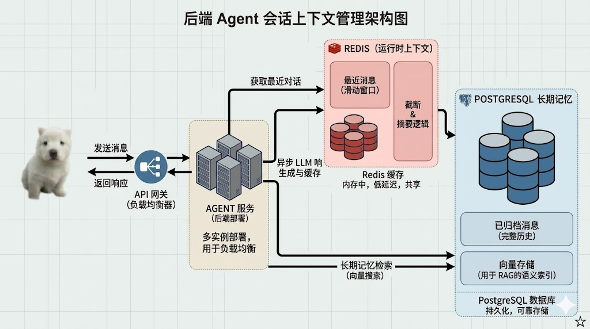
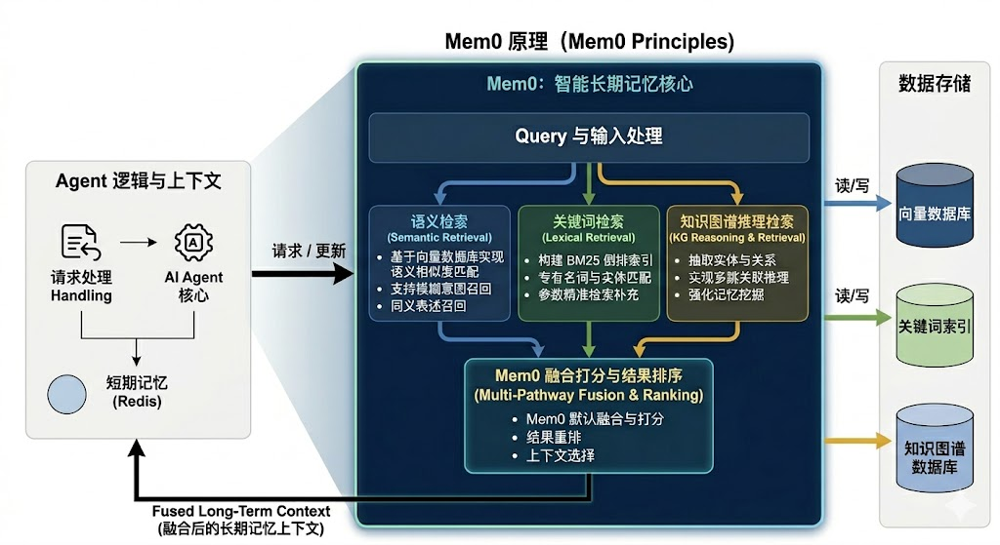
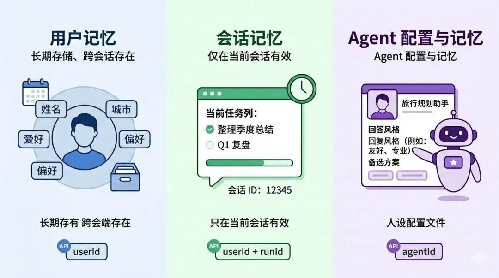

# Mem0：分层记忆 + 三路召回的长期记忆方案

> **Python 版** | 基于 Mem0 + Redis + LangChain Python 技术栈
> 前置知识：[Redis 短期记忆](./35_Redis-实现Agent短期记忆.md)、[混合检索 RAG](./29_混合检索RAG.md)

---

## 为什么需要长期记忆？

我们用 Redis 做了短期记忆存储（会话级，高速读写），但短期记忆有局限性：会话结束后数据就过期了，Agent 无法记住用户的长期偏好和历史信息。

**长期记忆**需要持久化存储，并且支持语义检索。但只是语义检索还不够，最好还要支持关键词检索、知识图谱检索——这就是**三路召回**。

### 后端 Agent 会话上下文管理架构



| 存储层 | 技术 | 存储内容 | 特点 |
|--------|------|----------|------|
| **运行时上下文** | Redis | 最近消息（滑动窗口）、截断与摘要 | 内存中，低延迟，共享 |
| **长期记忆** | PostgreSQL/Mem0 | 已归档消息（完整历史）、向量存储（RAG语义索引） | 持久化，可靠存储 |

### 三路召回



| 检索方式 | 说明 | 擅长场景 |
|----------|------|----------|
| **语义检索** | 基于向量数据库实现语义相似度匹配 | 模糊意图、同义表述的历史记忆召回 |
| **关键词检索** | 构建 BM25 倒排索引 | 实体、专有名词、关键参数等精准检索 |
| **知识图谱推理检索** | 抽取实体与实体间关系 | 多跳关联检索与逻辑推理，强化记忆关联挖掘 |

三类检索能力协同工作，三路融合召回，提升长期记忆召回的准确率与有效性。

### 为什么选 Mem0？

自己实现三路召回挺麻烦的。**Mem0** 是业界主流的 Agent 长期记忆库，原生集成：
- 向量语义检索
- BM25 关键词检索
- 知识图谱关联检索

默认完成三路检索的融合打分与结果排序，完全契合技术需求。引入 Mem0 后，无需从零实现记忆检索能力，大幅缩短项目落地周期。

---

## Mem0 快速开始

### 安装依赖

```bash
pip install mem0ai python-dotenv langchain langchain-openai
```

### 获取 API Key

1. 访问 [Mem0 官网](https://mem0.ai/) 注册账号
2. 在 Settings → API Keys 中创建 API Key
3. 免费版有调用次数限制，生产环境建议升级付费版或自部署

### 配置环境变量

创建 `.env` 文件：

```bash
# Mem0 配置
MEM0_API_KEY=m0-你的_api_key

# 大模型配置
OPENAI_API_KEY=你的_api_key
OPENAI_BASE_URL=https://dashscope.aliyuncs.com/compatible-mode/v1
MODEL_NAME=qwen-plus
```

---

## Mem0 基础使用

### 完整示例

创建 `mem0_basic.py`：

```python
"""
mem0_basic.py - Mem0 基础使用完整示例
包含：添加记忆、搜索记忆、列出全部、获取单条、更新、变更历史、删除
"""
import os
import json
from dotenv import load_dotenv
from mem0 import MemoryClient

load_dotenv()

# 初始化 Mem0 客户端
client = MemoryClient(api_key=os.getenv("MEM0_API_KEY"))

USER_ID = "demo-user"


def log(title, data):
    """格式化输出"""
    print(f"\n{'='*60}")
    print(f"📌 {title}")
    print(f"{'='*60}")
    if isinstance(data, str):
        print(data)
    else:
        print(json.dumps(data, indent=2, ensure_ascii=False))


# ========== 1. 添加记忆 ==========
conversation = [
    {"role": "user", "content": "我是素食主义者，而且对坚果过敏。"},
    {"role": "assistant", "content": "好的，我会记住你的饮食偏好。"},
    {"role": "user", "content": "我住在北京，平时喜欢跑步。"},
    {"role": "assistant", "content": "已记录：北京、爱好跑步。"},
]

added = client.add(conversation, user_id=USER_ID)
log("添加记忆", added)


# ========== 2. 搜索记忆 ==========
# 等待异步处理完成（Mem0 add 是异步的）
import time
time.sleep(2)

search_result = client.search(
    "用户的饮食限制是什么？",
    user_id=USER_ID,
    limit=5,
)
log("搜索记忆", search_result)


# ========== 3. 列出全部记忆 ==========
all_memories = client.get_all(user_id=USER_ID, limit=10)
log("列出全部记忆", all_memories)


# ========== 4. 获取单条记忆 ==========
# 从搜索结果或列表中获取第一条记忆的 ID
memories_list = all_memories.get("results", []) if isinstance(all_memories, dict) else all_memories

if memories_list:
    first_memory_id = memories_list[0]["id"]

    # 获取单条记忆
    memory = client.get(first_memory_id)
    log("获取单条记忆", memory)

    # 更新记忆
    updated = client.update(
        first_memory_id,
        text=f"{memory.get('memory', '')}（已通过示例脚本更新）"
    )
    log("更新记忆", updated)

    # 记忆变更历史
    history = client.history(first_memory_id)
    log("记忆变更历史", history)


# ========== 5. 删除记忆 ==========
# 删除单条
# client.delete(first_memory_id)
# log("删除单条记忆", {"deleted": first_memory_id})

# 删除全部（取消注释运行）
# deleted = client.delete_all(user_id=USER_ID)
# log("清理全部测试数据", deleted)

print("\n✅ Mem0 基础使用演示完成！")
print("提示：取消注释 delete_all 可删除本次测试用户的全部记忆")
```

### 运行示例

```bash
python mem0_basic.py
```

### Mem0 API 速查表

| API | 说明 | 参数 |
|-----|------|------|
| `client.add(messages, user_id=...)` | 添加记忆 | messages: 对话列表, user_id/agent_id/run_id |
| `client.search(query, user_id=...)` | 搜索记忆 | query: 查询文本, limit: 返回数量 |
| `client.get_all(user_id=...)` | 列出全部记忆 | limit: 分页大小 |
| `client.get(memory_id)` | 获取单条记忆 | memory_id: 记忆ID |
| `client.update(memory_id, text=...)` | 更新记忆 | text: 新内容 |
| `client.history(memory_id)` | 变更历史 | memory_id: 记忆ID |
| `client.delete(memory_id)` | 删除单条 | memory_id: 记忆ID |
| `client.delete_all(user_id=...)` | 删除全部 | user_id/agent_id/run_id |

---

## 三种记忆 Scope

Mem0 一共有三种记忆的作用范围：



| 记忆类型 | 绑定字段 | 存储内容 | 生命周期 | 适用场景 |
|----------|----------|----------|----------|----------|
| **用户记忆（User Memory）** | `user_id` | 跟着人走的长期信息：姓名、城市、偏好、习惯 | 跨会话、跨 Agent | 个性化、跨场景复用 |
| **会话记忆（Session Memory）** | `user_id` + `run_id` | 当前对话的任务上下文：这次要做什么、讨论到哪一步 | 会话级，结束可清理 | 任务上下文、临时目标 |
| **Agent 记忆（Agent Memory）** | `agent_id` | 某个 Agent 自己的设定：角色、语气、回答方式、专业领域 | 跨用户、跨会话 | 独立人格和风格 |

**用户记忆管"这个人"，会话记忆管"这次聊什么"，Agent 记忆管"这个助手是谁"。**

### 三种 Scope 完整示例

创建 `mem0_scoped_memory.py`：

```python
"""
mem0_scoped_memory.py - Mem0 三种记忆 Scope 完整示例
用户记忆、会话记忆、Agent 记忆的独立存储和检索
"""
import os
import time
import json
from dotenv import load_dotenv
from mem0 import MemoryClient

load_dotenv()

client = MemoryClient(api_key=os.getenv("MEM0_API_KEY"))

USER_ID = "mem0_test_user"
RUN_ID = "mem0_test_session"
AGENT_ID = "mem0_test_agent"


def log(title, data):
    print(f"\n{'='*60}")
    print(f"📌 {title}")
    print(f"{'='*60}")
    if isinstance(data, list):
        for item in data:
            print(f"  - {item}")
    elif isinstance(data, str):
        print(data)
    else:
        print(json.dumps(data, indent=2, ensure_ascii=False))


# ========== 1. 用户记忆 ==========
def add_user_memory():
    """添加用户记忆（跨会话长期）"""
    messages = [
        {"role": "user", "content": "我叫小明，住在杭州，平时喜欢骑行和摄影。"},
        {"role": "assistant", "content": "好的，已记住你的姓名、城市和爱好。"},
    ]
    added = client.add(messages, user_id=USER_ID)
    log("用户记忆 — add", added)


def search_user_memory():
    """搜索用户记忆"""
    searched = client.search(
        "用户住在哪里，有什么爱好",
        user_id=USER_ID,
        limit=5,
    )
    memories = [m["memory"] for m in searched.get("results", [])]
    log("用户记忆 — search", memories)

    listed = client.get_all(user_id=USER_ID, limit=5)
    memories = [m["memory"] for m in listed.get("results", [])]
    log("用户记忆 — getAll", memories)


# ========== 2. 会话记忆 ==========
def add_session_memory():
    """添加会话记忆（仅当前会话）"""
    messages = [
        {"role": "user", "content": "这次聊天先帮我把季度总结的大纲列出来，重点写 Q1 的项目复盘。"},
        {"role": "assistant", "content": "明白，我们先围绕 Q1 项目复盘整理季度总结大纲。"},
    ]
    added = client.add(messages, user_id=USER_ID, run_id=RUN_ID)
    log("会话记忆 — add", added)


def search_session_memory():
    """搜索会话记忆"""
    searched = client.search(
        "这次对话要先做什么",
        user_id=USER_ID,
        run_id=RUN_ID,
        limit=5,
    )
    memories = [m["memory"] for m in searched.get("results", [])]
    log("会话记忆 — search", memories)

    listed = client.get_all(user_id=USER_ID, run_id=RUN_ID, limit=5)
    memories = [m["memory"] for m in listed.get("results", [])]
    log("会话记忆 — getAll", memories)


# ========== 3. Agent 记忆 ==========
def add_agent_memory():
    """添加 Agent 记忆（Agent 设定）"""
    messages = [
        {"role": "user", "content": "你现在是旅行规划助手，回答时多给具体建议和备选方案。"},
        {"role": "assistant", "content": "好的，我会以旅行规划助手的身份，提供具体建议和备选方案。"},
    ]
    added = client.add(messages, agent_id=AGENT_ID)
    log("Agent 记忆 — add", added)


def search_agent_memory():
    """搜索 Agent 记忆"""
    searched = client.search(
        "这个 Agent 的角色和回答方式",
        agent_id=AGENT_ID,
        limit=5,
    )
    memories = [m["memory"] for m in searched.get("results", [])]
    log("Agent 记忆 — search", memories)

    listed = client.get_all(agent_id=AGENT_ID, limit=5)
    memories = [m["memory"] for m in listed.get("results", [])]
    log("Agent 记忆 — getAll", memories)


# ========== 主流程 ==========
if __name__ == "__main__":
    import sys

    action = sys.argv[1] if len(sys.argv) > 1 else "add"

    if "--cleanup" in sys.argv:
        client.delete_all(user_id=USER_ID)
        client.delete_all(user_id=USER_ID, run_id=RUN_ID)
        client.delete_all(agent_id=AGENT_ID)
        log("清理完成", {"USER_ID": USER_ID, "RUN_ID": RUN_ID, "AGENT_ID": AGENT_ID})
        sys.exit(0)

    if action == "add":
        add_user_memory()
        add_session_memory()
        add_agent_memory()
        print("\n⏳ add 已提交（异步处理），2秒后运行: python mem0_scoped_memory.py search")
        time.sleep(2)

    elif action == "search":
        search_user_memory()
        search_session_memory()
        search_agent_memory()

    else:
        print(f"未知命令: {action}，可用: add | search | --cleanup")
```

### 运行示例

```bash
# 添加记忆
python mem0_scoped_memory.py add

# 搜索记忆
python mem0_scoped_memory.py search

# 清理测试数据
python mem0_scoped_memory.py --cleanup
```

---

## Redis 短期记忆 + Mem0 长期记忆集成

在 Agent 里接入 Mem0 做长期记忆，用 Redis 存短期记忆，实现完整的分层记忆体系。

### 架构设计

```
用户输入
   │
   ▼
┌─────────────────────────────────────────────┐
│  1. 从 Redis 加载短期记忆（最近对话历史）      │
└────────────────────┬────────────────────────┘
                     │
                     ▼
┌─────────────────────────────────────────────┐
│  2. 从 Mem0 搜索长期记忆（用户层 + 会话层）    │
│     - 用户层：跨会话长期偏好                    │
│     - 会话层：当前任务上下文                    │
└────────────────────┬────────────────────────┘
                     │
                     ▼
┌─────────────────────────────────────────────┐
│  3. 构建系统消息（长期记忆）+ 历史消息（短期）  │
│     + 当前用户输入 → 调用大模型                 │
└────────────────────┬────────────────────────┘
                     │
                     ▼
┌─────────────────────────────────────────────┐
│  4. 大模型生成回答                             │
└────────────────────┬────────────────────────┘
                     │
                     ▼
┌─────────────────────────────────────────────┐
│  5. 写回 Redis（短期记忆，TTL 过期）           │
└────────────────────┬────────────────────────┘
                     │
                     ▼
┌─────────────────────────────────────────────┐
│  6. 记忆分层分类器判断是否写入 Mem0            │
│     - 用户层：长期事实（身份、偏好、习惯）       │
│     - 会话层：当前任务（大纲、进度、待办）       │
│     - 均不写：寒暄、通用内容、无信息增量         │
└─────────────────────────────────────────────┘
```

### 完整实现

创建 `mem0_redis_agent.py`：

```python
"""
mem0_redis_agent.py - Redis 短期记忆 + Mem0 长期记忆 集成 Agent
Redis 记这轮聊天，Mem0 记值得长期留着的事
"""
import os
import json
import time
from dotenv import load_dotenv
import redis
from mem0 import MemoryClient
from langchain_openai import ChatOpenAI
from langchain_core.messages import SystemMessage, HumanMessage, AIMessage
from langchain_core.prompts import ChatPromptTemplate, MessagesPlaceholder

load_dotenv()

# ========== 配置 ==========
REDIS_HOST = os.getenv("REDIS_HOST", "localhost")
REDIS_PORT = int(os.getenv("REDIS_PORT", 6379))
REDIS_DB = int(os.getenv("REDIS_DB", 0))
MEMORY_TTL = int(os.getenv("MEMORY_TTL_SECONDS", 1800))  # 30分钟
KEY_PREFIX = os.getenv("MEMORY_KEY_PREFIX", "agent:short_memory")

USER_ID = os.getenv("MEM0_USER_ID", "demo_user_001")
SESSION_ID = os.getenv("MEM0_SESSION_ID", "session_001")
MEM0_TOP_K = int(os.getenv("MEM0_TOP_K", 5))


# ========== 1. Redis 短期记忆存储 ==========
class RedisShortTermMemory:
    """Redis 短期记忆存储：存当前会话的对话历史"""

    def __init__(self, redis_client, key_prefix, ttl_seconds):
        self.redis = redis_client
        self.key_prefix = key_prefix
        self.ttl_seconds = ttl_seconds

    def _key(self, session_id):
        return f"{self.key_prefix}:{session_id}:messages"

    def load_messages(self, session_id):
        """加载会话历史消息"""
        raw = self.redis.get(self._key(session_id))
        if not raw:
            return []
        messages_data = json.loads(raw)
        messages = []
        for msg in messages_data:
            if msg["role"] == "user":
                messages.append(HumanMessage(content=msg["content"]))
            elif msg["role"] == "assistant":
                messages.append(AIMessage(content=msg["content"]))
            elif msg["role"] == "system":
                messages.append(SystemMessage(content=msg["content"]))
        return messages

    def save_messages(self, session_id, messages):
        """保存会话历史消息（过滤 SystemMessage，不写回 Redis）"""
        # 过滤 SystemMessage（Mem0 注入的记忆消息不写回短期记忆）
        redis_messages = [
            {"role": m.type, "content": m.content}
            for m in messages
            if m.type in ("user", "assistant")
        ]
        payload = json.dumps(redis_messages, ensure_ascii=False)
        self.redis.set(self._key(session_id), payload, ex=self.ttl_seconds)

    def clear(self, session_id):
        """清除会话记忆"""
        self.redis.delete(self._key(session_id))

    def ttl(self, session_id):
        """获取剩余 TTL"""
        return self.redis.ttl(self._key(session_id))


# ========== 2. Mem0 长期记忆存储 ==========
class Mem0LongTermMemory:
    """Mem0 长期记忆存储：用户层 + 会话层"""

    def __init__(self, client, user_id, session_id, top_k, classifier_llm):
        self.client = client
        self.user_id = user_id
        self.session_id = session_id
        self.top_k = top_k
        self.classifier = classifier_llm

    def search(self, query):
        """搜索长期记忆（用户层 + 会话层并行搜索）"""
        user_result = self.client.search(
            query, user_id=self.user_id, limit=self.top_k
        )
        session_result = self.client.search(
            query, user_id=self.user_id, run_id=self.session_id, limit=self.top_k
        )
        return {
            "user": user_result.get("results", []),
            "session": session_result.get("results", []),
        }

    def build_system_message(self, memories):
        """构建包含长期记忆的系统消息"""
        blocks = []
        if memories["user"]:
            user_memories = "\n".join(f"- {m['memory']}" for m in memories["user"])
            blocks.append(f"【用户长期记忆】\n{user_memories}")
        if memories["session"]:
            session_memories = "\n".join(f"- {m['memory']}" for m in memories["session"])
            blocks.append(f"【当前会话记忆】\n{session_memories}")
        if not blocks:
            return None
        content = "\n\n".join(blocks) + "\n\n请结合以上记忆回答，勿编造。"
        return SystemMessage(content=content)

    def classify_and_persist(self, user_text, assistant_text):
        """
        记忆分层分类器：判断本轮对话是否有新事实需写入 Mem0
        分为用户层（长期）和会话层（当前任务）
        """
        classifier_prompt = f"""你是记忆分层分类器。判断本轮对话是否有「新事实」需写入 Mem0，并分到正确层级。

## user 层（跨会话长期）
- 用户身份与画像：姓名、职业、居住地、长期爱好
- 长期偏好与约束：饮食过敏、回答风格、常用技术栈
- 持续数周以上的个人背景（非单次任务）

## session 层（仅当前会话）
- 当前正在做的任务、目标、文档大纲、方案草稿
- 本会话内的进度、决策、待办、临时约定
- 用户明确用「这次」「本轮」「当前会话」描述的工作上下文

## 均不写入
- 寒暄、致谢、纯确认
- 助手生成的通用内容（攻略、示例代码、建议清单），用户未明确采纳为新事实
- 无信息增量的复述

请用 JSON 格式回答：
{{"write_user": true/false, "write_session": true/false, "reason": "分类理由"}}

用户：{user_text}
助手：{assistant_text}"""

        response = self.classifier.invoke(classifier_prompt)
        # 解析 JSON
        try:
            content = response.content
            start = content.find("{")
            end = content.rfind("}") + 1
            if start != -1 and end != -1:
                result = json.loads(content[start:end])
            else:
                result = {"write_user": False, "write_session": False, "reason": "解析失败"}
        except Exception:
            result = {"write_user": False, "write_session": False, "reason": "解析异常"}

        turn = [
            {"role": "user", "content": user_text},
            {"role": "assistant", "content": assistant_text},
        ]

        written = []
        if result["write_user"]:
            self.client.add(turn, user_id=self.user_id)
            written.append("user")
        if result["write_session"]:
            self.client.add(turn, user_id=self.user_id, run_id=self.session_id)
            written.append("session")

        return {"written": written, "reason": result["reason"]}

    def clear(self):
        """清除长期记忆"""
        self.client.delete_all(user_id=self.user_id)
        self.client.delete_all(user_id=self.user_id, run_id=self.session_id)


# ========== 3. Agent 主逻辑 ==========
class MemoryAgent:
    """带分层记忆的 Agent"""

    def __init__(self):
        # Redis
        self.redis_client = redis.Redis(host=REDIS_HOST, port=REDIS_PORT, db=REDIS_DB, decode_responses=True)
        self.short_memory = RedisShortTermMemory(self.redis_client, KEY_PREFIX, MEMORY_TTL)

        # Mem0
        self.mem0_client = MemoryClient(api_key=os.getenv("MEM0_API_KEY"))
        self.classifier_llm = ChatOpenAI(
            model=os.getenv("MODEL_NAME", "qwen-plus"),
            api_key=os.getenv("OPENAI_API_KEY"),
            base_url=os.getenv("OPENAI_BASE_URL"),
            temperature=0,
        )
        self.long_memory = Mem0LongTermMemory(
            self.mem0_client, USER_ID, SESSION_ID, MEM0_TOP_K, self.classifier_llm
        )

        # 大模型
        self.llm = ChatOpenAI(
            model=os.getenv("MODEL_NAME", "qwen-plus"),
            api_key=os.getenv("OPENAI_API_KEY"),
            base_url=os.getenv("OPENAI_BASE_URL"),
            temperature=0,
        )

        print(f"✅ Agent 初始化完成")
        print(f"   用户: {USER_ID} | 会话: {SESSION_ID}")

    def chat(self, user_text):
        """
        单轮对话：加载短期记忆 + 搜索长期记忆 → 生成回答 → 写回短期记忆 → 分类写入长期记忆
        """
        # 1. 加载短期记忆
        history = self.short_memory.load_messages(SESSION_ID)
        print(f"  ↳ Redis 加载 {len(history)} 条历史")

        # 2. 搜索长期记忆
        memories = self.long_memory.search(user_text)
        if memories["user"]:
            print(f"  ↳ Mem0 用户层 {len(memories['user'])} 条")
        if memories["session"]:
            print(f"  ↳ Mem0 会话层 {len(memories['session'])} 条")

        # 3. 构建消息
        memory_msg = self.long_memory.build_system_message(memories)
        messages = []
        if memory_msg:
            messages.append(memory_msg)
        messages.extend(history)
        messages.append(HumanMessage(content=user_text))

        # 4. 调用大模型
        response = self.llm.invoke(messages)
        assistant_text = response.content

        # 5. 写回短期记忆
        all_messages = messages + [response]
        self.short_memory.save_messages(SESSION_ID, all_messages)
        ttl = self.short_memory.ttl(SESSION_ID)
        print(f"  ↳ Redis 写回 (TTL {ttl}s)")

        # 6. 分类写入长期记忆
        result = self.long_memory.classify_and_persist(user_text, assistant_text)
        print(f"  ↳ 分类: {result['reason']}")
        if result["written"]:
            print(f"  ↳ Mem0 写入: {', '.join(result['written'])}")
        else:
            print(f"  ↳ Mem0 未写入")

        return assistant_text


# ========== 使用示例 ==========
if __name__ == "__main__":
    agent = MemoryAgent()

    print("\n输入消息开始对话（输入 :clear 清 Redis，:clear-mem0 清 Mem0，exit 退出）\n")

    while True:
        user_text = input("你: ").strip()
        if not user_text:
            continue
        if user_text.lower() in ("exit", "quit", ":q"):
            break
        if user_text == ":clear":
            agent.short_memory.clear(SESSION_ID)
            print("已清空 Redis 短期记忆\n")
            continue
        if user_text == ":clear-mem0":
            agent.long_memory.clear()
            print("已清空 Mem0 长期记忆\n")
            continue

        print("AI: ", end="", flush=True)
        response = agent.chat(user_text)
        print(f"{response}\n")
```

### 运行示例

```bash
# 1. 启动 Redis
docker compose up -d redis

# 2. 配置 .env（参考上文）

# 3. 运行 Agent
python mem0_redis_agent.py
```

---

## 学习要点

1. **长期记忆**需要持久化存储，支持语义检索，Mem0 是业界主流的 Agent 长期记忆库
2. **三路召回**：语义检索（向量）+ 关键词检索（BM25）+ 知识图谱推理检索，Mem0 原生集成并自动融合打分
3. **三种记忆 Scope**：用户记忆（user_id，跨会话长期）、会话记忆（user_id+run_id，当前任务）、Agent记忆（agent_id，Agent设定）
4. **用户记忆管"这个人"，会话记忆管"这次聊什么"，Agent记忆管"这个助手是谁"**
5. **分层记忆架构**：Redis 做短期记忆（会话级，高速，TTL过期），Mem0 做长期记忆（持久化，三路召回）
6. **记忆分层分类器**：用大模型判断本轮对话是否有新事实，分到用户层或会话层，避免无用信息写入长期记忆
7. **Mem0 add 是异步的**，添加记忆后需要等待几秒再搜索，否则可能搜不到
8. **SystemMessage 不写回 Redis**：Mem0 注入的长期记忆系统消息只在当前轮使用，不存入短期记忆
9. **免费版有调用次数限制**，生产环境建议升级付费版或自部署 Mem0（开源，支持 Qdrant/PG 向量存储）
10. **Mem0 可以自部署**，支持多种向量数据库（Qdrant、Weaviate、PGVector、Chroma），适合对数据隐私有要求的场景

## 扩展方向

- 学习 Mem0 自部署（开源版本，支持 Qdrant/PGVector/Weaviate 向量存储）
- 探索 Mem0 的知识图谱功能（实体关系抽取、多跳推理）
- 学习记忆重要性评分（自动遗忘不重要的记忆，保留重要记忆）
- 探索多模态记忆（文本 + 图片 + 音频的统一记忆存储）
- 学习记忆脱敏和隐私保护（PII 检测、敏感信息过滤）
- 探索跨用户记忆共享（团队知识库、组织级记忆）
- 学习记忆冲突检测和解决（同一事实有多个版本时如何处理）
- 探索记忆激活机制（根据上下文动态激活相关记忆，而非全量搜索）
- 学习 Mem0 的 LangChain/LangGraph 集成（官方提供的 Memory 组件）
- 探索记忆评估（如何量化长期记忆的召回准确率和有用性）

---

## 配套代码库

**代码库地址**：https://github.com/iiixiyan/agent-learning-code/tree/main/03-retrieval-knowledge/36-mem0-long-term-memory

包含本文的完整可运行代码示例（Mem0 基础使用 + 三种 Scope + Redis短期记忆+Mem0长期记忆集成 Agent + 记忆分层分类器）。

---

**上一篇**：[Redis 短期记忆](./35_Redis-实现Agent短期记忆.md) | **下一篇**：[第四阶段 - 企业级 Agent 应用](../04-第四阶段-企业级Agent应用/37_企业级Agent架构设计.md)
