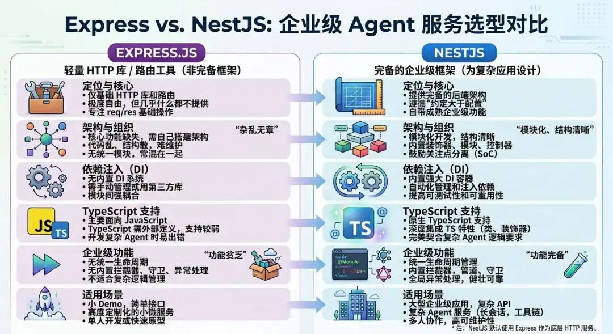
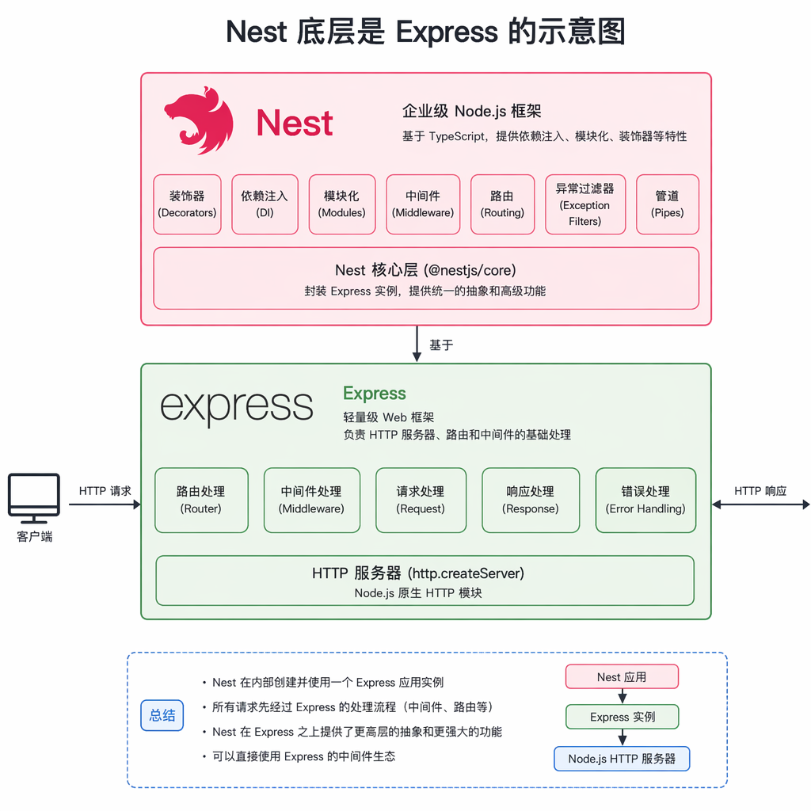
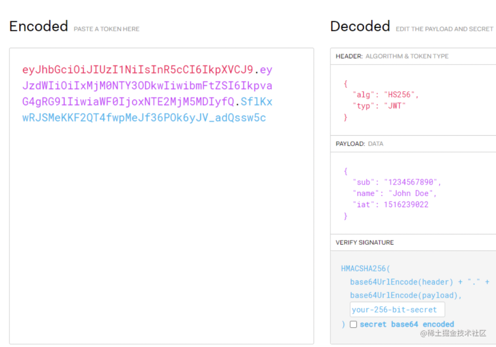

# FastAPI 进阶：企业级 Python 后端最主流框架

> **Python 版** | 基于 FastAPI + Pydantic + python-jose 技术栈
> 前置知识：[FastAPI 基础](../02-第二阶段-企业级后端与进阶框架/20_FastAPI+LangChain实现SSE流式接口.md)

---

## 为什么需要企业级后端框架？

业务项目的 Agent 都是跑在后端的，所以除了学习 Agent 框架外，我们还要学后端框架。

Python 最主流的后端框架是 **FastAPI**。

### Flask vs FastAPI

| 维度 | Flask | FastAPI |
|------|-------|---------|
| **定位** | 轻量 HTTP 库、路由工具 | 企业级完备框架 |
| **模块化** | 需手动组织 | 原生支持 APIRouter 模块化 |
| **类型约束** | 无 | Pydantic 强类型校验 |
| **依赖注入** | 需手动实现 | 原生 Depends 依赖注入 |
| **中间件** | 基础支持 | 丰富的中间件 + 依赖注入 |
| **异常处理** | 基础 errorhandler | 全局异常处理器 |
| **自动文档** | 需手动配置 | 原生 Swagger/ReDoc |
| **异步支持** | 需扩展 | 原生 async/await |
| **性能** | 中等 | 高性能（接近 Node.js/Go） |

**结论**：Flask 小 Demo 很快，但一上企业级 Agent 项目，代码乱、结构散、后期维护困难。FastAPI 自带一整套成熟架构，能让服务结构清晰、可扩展、可维护、可上线。

### FastAPI 核心架构能力



| 能力 | FastAPI 实现 | 说明 |
|------|-------------|------|
| **模块化** | APIRouter | 按业务模块拆分路由 |
| **依赖注入** | Depends | 统一管理依赖，自动注入 |
| **强类型** | Pydantic | 请求/响应数据校验、类型转换 |
| **中间件** | @app.middleware | 全局请求/响应处理 |
| **异常处理** | @app.exception_handler | 全局异常捕获和格式化 |
| **自动文档** | /docs /redoc | 自动生成 API 文档 |
| **异步支持** | async/await | 原生异步，高并发 |

### FastAPI 底层



FastAPI 并不是从零写的新框架：
- **底层 Web 框架**：Starlette（高性能 ASGI 框架）
- **数据校验**：Pydantic（类型校验、序列化）
- **异步支持**：原生 async/await

相当于 FastAPI 站在了 Starlette 和 Pydantic 的肩膀上，保留了高性能，又补上了工程化能力。

---

## 依赖注入（DI / IoC）

### 什么是依赖注入？

在 Flask 里，你需要手动创建所有对象、手动传递依赖。

在 FastAPI 里，通过 `Depends` 实现依赖注入：
- 统一管理所有依赖（数据库连接、配置、服务、工具类）
- 自动创建对象、自动注入依赖，不用开发者手动实例化

### 基础示例

```python
"""
di_demo.py - FastAPI 依赖注入基础示例
"""
from fastapi import FastAPI, Depends
from pydantic import BaseModel

app = FastAPI(title="依赖注入示例")


# ========== 1. 依赖函数 ==========
def get_db():
    """数据库连接依赖（模拟）"""
    db = {"connected": True, "data": {}}
    try:
        yield db
    finally:
        db["connected"] = False


def get_settings():
    """配置依赖"""
    return {
        "app_name": "Agent Learning",
        "version": "1.0.0",
        "debug": True,
    }


# ========== 2. 服务类（可注入） ==========
class UserService:
    """用户服务：封装用户相关业务逻辑"""

    def __init__(self, db: dict = Depends(get_db), settings: dict = Depends(get_settings)):
        self.db = db
        self.settings = settings

    def get_user(self, user_id: int):
        """获取用户信息"""
        return {
            "id": user_id,
            "name": f"用户{user_id}",
            "app": self.settings["app_name"],
        }

    def create_user(self, name: str):
        """创建用户"""
        user_id = len(self.db["data"]) + 1
        self.db["data"][user_id] = {"name": name}
        return {"id": user_id, "name": name}


# ========== 3. 路由中使用依赖注入 ==========
@app.get("/users/{user_id}")
def get_user(
    user_id: int,
    user_service: UserService = Depends(UserService),
):
    """获取用户（注入 UserService）"""
    return user_service.get_user(user_id)


@app.post("/users")
def create_user(
    name: str,
    user_service: UserService = Depends(UserService),
):
    """创建用户（注入 UserService）"""
    return user_service.create_user(name)


@app.get("/settings")
def get_settings_info(settings: dict = Depends(get_settings)):
    """获取配置（注入 settings）"""
    return settings


if __name__ == "__main__":
    import uvicorn
    uvicorn.run(app, host="0.0.0.0", port=8000)
```

### 依赖注入的好处

| 好处 | 说明 |
|------|------|
| **解耦** | 路由不直接依赖具体实现，只依赖接口 |
| **可测试** | 测试时可以注入 Mock 依赖 |
| **复用** | 同一个依赖可以在多个路由中复用 |
| **生命周期管理** | 依赖的创建和销毁由框架管理（yield 语法） |
| **代码清晰** | 路由函数只关注业务逻辑，不关心依赖如何创建 |

---

## AOP（面向切面编程）

### 什么是 AOP？

将系统比作纵向的、由多个业务模块（用户模块、订单模块、支付模块）组成的结构。

而**日志、权限、缓存、异常处理**等功能，像一把"横向的刀"，切穿了所有的业务模块。

**AOP 的本质**：在代码运行的"特定位置"，动态地插入这些横向逻辑。

如果没有 AOP，你需要在每一个接口的开头都写一遍 `check_user_auth()`：
- 维护噩梦：权限校验逻辑变动，需要修改所有涉及的文件
- 代码污染：业务逻辑被大量辅助代码包围，核心业务意图模糊

FastAPI 的 AOP 可以在不修改原始代码的情况下，像"插件"一样为接口添加功能。

### FastAPI 的 4 种 AOP 机制

| 机制 | Nest.js 对应 | FastAPI 实现 | 说明 |
|------|-------------|-------------|------|
| **守卫（Guard）** | Guards | 依赖注入函数 | 请求进入前执行，身份认证、权限校验 |
| **管道（Pipe）** | Pipes | Pydantic 模型 + 依赖注入 | 请求入参校验、类型转换、数据清洗 |
| **拦截器（Interceptor）** | Interceptors | 中间件 + 依赖注入 | 环绕请求执行，前置/后置处理，日志、耗时统计 |
| **异常过滤器（Exception Filter）** | Exception Filters | @app.exception_handler | 统一捕获异常，格式化错误响应 |

---

### 1. 守卫（Guard）：权限校验

```python
"""
guard_demo.py - FastAPI 守卫（权限校验）示例
"""
from fastapi import FastAPI, Depends, HTTPException, Header
from pydantic import BaseModel

app = FastAPI(title="守卫示例")


# ========== 守卫：认证守卫 ==========
def get_current_user(authorization: str = Header(None)):
    """
    认证守卫：校验 Bearer Token，返回当前用户

    Args:
        authorization: Authorization 请求头

    Returns:
        dict: 当前用户信息

    Raises:
        HTTPException: 401 未认证 / 403 无权限
    """
    if not authorization:
        raise HTTPException(status_code=401, detail="请携带 Bearer Token")

    if not authorization.startswith("Bearer "):
        raise HTTPException(status_code=401, detail="Token 格式错误")

    token = authorization.split(" ")[1]

    # 模拟 Token 校验（实际用 JWT）
    if token == "valid-token":
        return {"id": 1, "username": "admin", "role": "admin"}
    elif token == "user-token":
        return {"id": 2, "username": "user", "role": "user"}
    else:
        raise HTTPException(status_code=401, detail="Token 无效或已过期")


def require_admin(current_user: dict = Depends(get_current_user)):
    """
    权限守卫：要求管理员角色

    Args:
        current_user: 当前用户（由 get_current_user 注入）

    Returns:
        dict: 当前用户信息

    Raises:
        HTTPException: 403 无权限
    """
    if current_user["role"] != "admin":
        raise HTTPException(status_code=403, detail="需要管理员权限")
    return current_user


# ========== 路由中使用守卫 ==========
@app.get("/profile")
def get_profile(current_user: dict = Depends(get_current_user)):
    """获取当前用户资料（需要登录）"""
    return {"user": current_user}


@app.get("/admin/users")
def get_all_users(admin_user: dict = Depends(require_admin)):
    """获取所有用户（需要管理员权限）"""
    return {
        "users": [
            {"id": 1, "username": "admin"},
            {"id": 2, "username": "user"},
        ],
        "operator": admin_user["username"],
    }


@app.get("/public")
def public_endpoint():
    """公开接口（不需要登录）"""
    return {"message": "这是公开接口"}


if __name__ == "__main__":
    import uvicorn
    uvicorn.run(app, host="0.0.0.0", port=8000)
```

---

### 2. 管道（Pipe）：参数校验

```python
"""
pipe_demo.py - FastAPI 管道（参数校验）示例
"""
from fastapi import FastAPI, Query, Path, HTTPException
from pydantic import BaseModel, Field, field_validator

app = FastAPI(title="管道示例")


# ========== Pydantic 模型校验（管道） ==========
class UserCreate(BaseModel):
    """创建用户请求模型"""
    username: str = Field(..., min_length=3, max_length=20, description="用户名（3-20字符）")
    age: int = Field(..., ge=0, le=150, description="年龄（0-150）")
    email: str = Field(..., pattern=r"^[\w\.-]+@[\w\.-]+\.\w+$", description="邮箱")

    @field_validator("username")
    @classmethod
    def username_must_not_contain_spaces(cls, v):
        """自定义校验：用户名不能包含空格"""
        if " " in v:
            raise ValueError("用户名不能包含空格")
        return v


class PositiveInt(int):
    """正整数类型（自定义管道）"""

    @classmethod
    def __get_validators__(cls):
        yield cls.validate

    @classmethod
    def validate(cls, v):
        if not isinstance(v, int) or v <= 0:
            raise HTTPException(status_code=400, detail="必须是正整数")
        return v


# ========== 路由中使用管道 ==========
@app.post("/users")
def create_user(user: UserCreate):
    """
    创建用户（Pydantic 自动校验）

    - username: 3-20字符，不能有空格
    - age: 0-150
    - email: 邮箱格式
    """
    return {
        "message": "用户创建成功",
        "user": user.model_dump(),
    }


@app.get("/users/{user_id}")
def get_user(
    user_id: int = Path(..., ge=1, description="用户ID（正整数）"),
    page: int = Query(1, ge=1, description="页码（正整数）"),
    page_size: int = Query(10, ge=1, le=100, description="每页数量（1-100）"),
):
    """
    获取用户（Path/Query 参数校验）

    - user_id: 路径参数，必须 >= 1
    - page: 查询参数，默认 1，必须 >= 1
    - page_size: 查询参数，默认 10，1-100
    """
    return {
        "user_id": user_id,
        "pagination": {"page": page, "page_size": page_size},
    }


if __name__ == "__main__":
    import uvicorn
    uvicorn.run(app, host="0.0.0.0", port=8000)
```

---

### 3. 拦截器（Interceptor）：日志 + 耗时统计

```python
"""
interceptor_demo.py - FastAPI 拦截器（中间件）示例
日志、耗时统计、响应封装
"""
import time
from fastapi import FastAPI, Request
from fastapi.responses import JSONResponse
from starlette.middleware.base import BaseHTTPMiddleware

app = FastAPI(title="拦截器示例")


# ========== 中间件 1：日志 + 耗时统计 ==========
class LoggingMiddleware(BaseHTTPMiddleware):
    """日志中间件：记录请求方法、路径、耗时、状态码"""

    async def dispatch(self, request: Request, call_next):
        start_time = time.time()

        # 前置处理：记录请求信息
        print(f"[请求] {request.method} {request.url.path}")

        # 调用下一个中间件/路由
        response = await call_next(request)

        # 后置处理：计算耗时
        process_time = time.time() - start_time
        response.headers["X-Process-Time"] = str(process_time)

        print(f"[响应] {request.method} {request.url.path} "
              f"状态码: {response.status_code} 耗时: {process_time:.4f}s")

        return response


# ========== 中间件 2：统一响应格式封装 ==========
class ResponseFormatMiddleware(BaseHTTPMiddleware):
    """响应格式中间件：统一封装响应格式为 {code, data, message}"""

    async def dispatch(self, request: Request, call_next):
        response = await call_next(request)

        # 只处理 JSON 响应
        if response.headers.get("content-type") == "application/json":
            # 读取原始响应体
            body = b""
            async for chunk in response.body_iterator:
                body += chunk

            try:
                import json
                original_data = json.loads(body)

                # 如果已经是标准格式，不重复封装
                if isinstance(original_data, dict) and "code" in original_data:
                    return response

                # 封装为标准格式
                formatted = {
                    "code": response.status_code,
                    "message": "success",
                    "data": original_data,
                }
                return JSONResponse(
                    content=formatted,
                    status_code=response.status_code,
                    headers=dict(response.headers),
                )
            except Exception:
                pass

        return response


# ========== 注册中间件 ==========
app.add_middleware(LoggingMiddleware)
app.add_middleware(ResponseFormatMiddleware)


# ========== 示例路由 ==========
@app.get("/hello")
def hello():
    return {"message": "Hello, FastAPI!"}


@app.get("/users/{user_id}")
def get_user(user_id: int):
    return {"id": user_id, "name": f"用户{user_id}"}


if __name__ == "__main__":
    import uvicorn
    uvicorn.run(app, host="0.0.0.0", port=8000)
```

---

### 4. 异常过滤器（Exception Filter）

```python
"""
exception_filter_demo.py - FastAPI 异常过滤器示例
统一异常捕获和格式化
"""
from fastapi import FastAPI, HTTPException, Request
from fastapi.responses import JSONResponse
from fastapi.exceptions import RequestValidationError
from starlette.exceptions import HTTPException as StarletteHTTPException

app = FastAPI(title="异常过滤器示例")


# ========== 自定义异常 ==========
class BusinessException(Exception):
    """业务异常：自定义业务逻辑错误"""

    def __init__(self, code: int, message: str):
        self.code = code
        self.message = message


# ========== 异常过滤器 1：业务异常 ==========
@app.exception_handler(BusinessException)
async def business_exception_handler(request: Request, exc: BusinessException):
    """统一处理业务异常"""
    return JSONResponse(
        status_code=200,  # 业务异常 HTTP 状态码可以是 200，用 code 区分
        content={
            "code": exc.code,
            "message": exc.message,
            "data": None,
        },
    )


# ========== 异常过滤器 2：HTTP 异常 ==========
@app.exception_handler(StarletteHTTPException)
async def http_exception_handler(request: Request, exc: StarletteHTTPException):
    """统一处理 HTTP 异常（404、401、403 等）"""
    return JSONResponse(
        status_code=exc.status_code,
        content={
            "code": exc.status_code,
            "message": exc.detail if isinstance(exc.detail, str) else "请求错误",
            "data": None,
        },
    )


# ========== 异常过滤器 3：参数校验异常 ==========
@app.exception_handler(RequestValidationError)
async def validation_exception_handler(request: Request, exc: RequestValidationError):
    """统一处理参数校验异常（422）"""
    errors = []
    for error in exc.errors():
        errors.append({
            "field": ".".join(str(loc) for loc in error["loc"]),
            "message": error["msg"],
        })

    return JSONResponse(
        status_code=400,  # 将 422 改为 400
        content={
            "code": 400,
            "message": "参数校验失败",
            "data": {"errors": errors},
        },
    )


# ========== 异常过滤器 4：全局兜底异常 ==========
@app.exception_handler(Exception)
async def global_exception_handler(request: Request, exc: Exception):
    """全局兜底异常处理器：捕获所有未处理的异常"""
    print(f"[未处理异常] {request.method} {request.url.path}: {exc}")
    return JSONResponse(
        status_code=500,
        content={
            "code": 500,
            "message": "服务器内部错误",
            "data": None,
        },
    )


# ========== 示例路由 ==========
@app.get("/business-error")
def business_error():
    """触发业务异常"""
    raise BusinessException(code=1001, message="用户余额不足")


@app.get("/not-found")
def not_found():
    """触发 404"""
    raise HTTPException(status_code=404, detail="资源不存在")


@app.get("/server-error")
def server_error():
    """触发 500（全局兜底）"""
    raise ValueError("这是一个未处理的异常")


from pydantic import BaseModel


class UserCreate(BaseModel):
    username: str
    age: int


@app.post("/users")
def create_user(user: UserCreate):
    """参数校验失败会触发 400"""
    return user


if __name__ == "__main__":
    import uvicorn
    uvicorn.run(app, host="0.0.0.0", port=8000)
```

---

## JWT 认证

### 什么是 JWT？

JWT（JSON Web Token）是目前最常用的认证方案：
- 用户登录后，服务器签发一个 Token
- 客户端在后续请求的 `Authorization` header 中通过 `Bearer xxx` 携带 Token
- 服务器验证 Token 有效性，解码出用户信息



### JWT 完整实现

```python
"""
jwt_demo.py - FastAPI JWT 认证完整示例
包含：登录签发 Token、Token 校验、受保护接口、刷新 Token
"""
import os
from datetime import datetime, timedelta
from typing import Optional
from fastapi import FastAPI, Depends, HTTPException, Header
from pydantic import BaseModel
from jose import JWTError, jwt
from passlib.context import CryptContext

app = FastAPI(title="JWT 认证示例")

# ========== 配置 ==========
SECRET_KEY = os.getenv("JWT_SECRET_KEY", "your-secret-key-change-in-production")
ALGORITHM = "HS256"
ACCESS_TOKEN_EXPIRE_MINUTES = 60  # Access Token 1小时过期
REFRESH_TOKEN_EXPIRE_DAYS = 7      # Refresh Token 7天过期

# 密码加密
pwd_context = CryptContext(schemes=["bcrypt"], deprecated="auto")

# 模拟用户数据库
fake_users_db = {
    "admin": {
        "username": "admin",
        "hashed_password": pwd_context.hash("admin123"),
        "role": "admin",
    },
    "user": {
        "username": "user",
        "hashed_password": pwd_context.hash("user123"),
        "role": "user",
    },
}


# ========== Pydantic 模型 ==========
class LoginRequest(BaseModel):
    username: str
    password: str


class TokenResponse(BaseModel):
    access_token: str
    refresh_token: str
    token_type: str = "bearer"
    expires_in: int


class UserInfo(BaseModel):
    username: str
    role: str


# ========== JWT 工具函数 ==========
def create_access_token(data: dict, expires_delta: Optional[timedelta] = None):
    """签发 Access Token"""
    to_encode = data.copy()
    expire = datetime.utcnow() + (expires_delta or timedelta(minutes=ACCESS_TOKEN_EXPIRE_MINUTES))
    to_encode.update({"exp": expire, "type": "access"})
    return jwt.encode(to_encode, SECRET_KEY, algorithm=ALGORITHM)


def create_refresh_token(data: dict):
    """签发 Refresh Token"""
    to_encode = data.copy()
    expire = datetime.utcnow() + timedelta(days=REFRESH_TOKEN_EXPIRE_DAYS)
    to_encode.update({"exp": expire, "type": "refresh"})
    return jwt.encode(to_encode, SECRET_KEY, algorithm=ALGORITHM)


def verify_token(token: str, token_type: str = "access"):
    """
    验证 Token

    Args:
        token: JWT Token
        token_type: access 或 refresh

    Returns:
        dict: Token 中的 payload

    Raises:
        HTTPException: 401 Token 无效或过期
    """
    try:
        payload = jwt.decode(token, SECRET_KEY, algorithms=[ALGORITHM])
        if payload.get("type") != token_type:
            raise HTTPException(status_code=401, detail="Token 类型错误")
        return payload
    except JWTError:
        raise HTTPException(status_code=401, detail="Token 无效或已过期")


def get_current_user(authorization: str = Header(None)):
    """
    从 Authorization header 获取当前用户（依赖注入）

    Args:
        authorization: Authorization header

    Returns:
        dict: 用户信息

    Raises:
        HTTPException: 401 未认证
    """
    if not authorization or not authorization.startswith("Bearer "):
        raise HTTPException(status_code=401, detail="请携带 Bearer Token")

    token = authorization.split(" ")[1]
    payload = verify_token(token, token_type="access")

    username = payload.get("sub")
    if not username or username not in fake_users_db:
        raise HTTPException(status_code=401, detail="用户不存在")

    user = fake_users_db[username]
    return {"username": user["username"], "role": user["role"]}


# ========== 路由 ==========
@app.post("/auth/login", response_model=TokenResponse)
def login(request: LoginRequest):
    """
    登录接口：验证用户名密码，签发 Token

    测试账号：
    - admin / admin123（管理员）
    - user / user123（普通用户）
    """
    user = fake_users_db.get(request.username)
    if not user or not pwd_context.verify(request.password, user["hashed_password"]):
        raise HTTPException(status_code=401, detail="用户名或密码错误")

    # 签发 Token
    access_token = create_access_token(data={"sub": user["username"], "role": user["role"]})
    refresh_token = create_refresh_token(data={"sub": user["username"]})

    return TokenResponse(
        access_token=access_token,
        refresh_token=refresh_token,
        expires_in=ACCESS_TOKEN_EXPIRE_MINUTES * 60,
    )


@app.post("/auth/refresh")
def refresh_token(refresh_token: str = Header(..., alias="X-Refresh-Token")):
    """
    刷新 Token：用 Refresh Token 换取新的 Access Token

    Header: X-Refresh-Token: <refresh_token>
    """
    payload = verify_token(refresh_token, token_type="refresh")
    username = payload.get("sub")

    if username not in fake_users_db:
        raise HTTPException(status_code=401, detail="用户不存在")

    user = fake_users_db[username]
    new_access_token = create_access_token(data={"sub": username, "role": user["role"]})

    return {
        "access_token": new_access_token,
        "token_type": "bearer",
        "expires_in": ACCESS_TOKEN_EXPIRE_MINUTES * 60,
    }


@app.get("/auth/profile", response_model=UserInfo)
def get_profile(current_user: dict = Depends(get_current_user)):
    """获取当前用户信息（需要登录）"""
    return current_user


@app.get("/admin/dashboard")
def admin_dashboard(current_user: dict = Depends(get_current_user)):
    """管理员仪表盘（需要管理员权限）"""
    if current_user["role"] != "admin":
        raise HTTPException(status_code=403, detail="需要管理员权限")
    return {
        "message": "欢迎管理员",
        "stats": {"users": 100, "orders": 50, "revenue": 10000},
    }


if __name__ == "__main__":
    import uvicorn
    uvicorn.run(app, host="0.0.0.0", port=8000)
```

### 安装依赖

```bash
pip install fastapi uvicorn python-jose[cryptography] passlib[bcrypt] python-multipart
```

### 测试 JWT

```bash
# 1. 登录获取 Token
curl -X POST http://localhost:8000/auth/login \
  -H "Content-Type: application/json" \
  -d '{"username": "admin", "password": "admin123"}'

# 2. 访问受保护接口（携带 Token）
curl http://localhost:8000/auth/profile \
  -H "Authorization: Bearer <access_token>"

# 3. 访问管理员接口
curl http://localhost:8000/admin/dashboard \
  -H "Authorization: Bearer <access_token>"

# 4. 刷新 Token
curl http://localhost:8000/auth/refresh \
  -H "X-Refresh-Token: <refresh_token>"

# 5. 未携带 Token → 401
curl http://localhost:8000/auth/profile

# 6. Token 无效 → 401
curl http://localhost:8000/auth/profile \
  -H "Authorization: Bearer invalid-token"
```

---

## 综合实战：完整的用户模块

```python
"""
user_module.py - 完整的用户模块（CRUD + AOP + JWT）
集成：依赖注入、守卫、管道、拦截器、异常过滤器、JWT 认证
"""
from fastapi import FastAPI, Depends, HTTPException, Header, Request
from fastapi.responses import JSONResponse
from pydantic import BaseModel, Field, field_validator
from datetime import datetime, timedelta
from typing import Optional
from jose import JWTError, jwt
from passlib.context import CryptContext
import time

app = FastAPI(title="用户模块综合实战")

# ========== 配置 ==========
SECRET_KEY = "demo-secret-key"
ALGORITHM = "HS256"
TOKEN_EXPIRE_MINUTES = 60

pwd_context = CryptContext(schemes=["bcrypt"], deprecated="auto")

# 模拟数据库
users_db = {}


# ========== Pydantic 模型（管道） ==========
class UserCreate(BaseModel):
    username: str = Field(..., min_length=3, max_length=20)
    password: str = Field(..., min_length=6, max_length=50)
    email: str = Field(..., pattern=r"^[\w\.-]+@[\w\.-]+\.\w+$")

    @field_validator("username")
    @classmethod
    def no_spaces(cls, v):
        if " " in v:
            raise ValueError("用户名不能包含空格")
        return v


class UserUpdate(BaseModel):
    email: Optional[str] = Field(None, pattern=r"^[\w\.-]+@[\w\.-]+\.\w+$")
    password: Optional[str] = Field(None, min_length=6)


class UserResponse(BaseModel):
    id: int
    username: str
    email: str
    role: str
    created_at: str


class LoginRequest(BaseModel):
    username: str
    password: str


# ========== 服务层（依赖注入） ==========
class UserService:
    """用户服务：封装所有用户相关业务逻辑"""

    def __init__(self):
        self.next_id = 1

    def create(self, user_data: UserCreate) -> dict:
        """创建用户"""
        if user_data.username in users_db:
            raise HTTPException(status_code=400, detail="用户名已存在")

        user = {
            "id": self.next_id,
            "username": user_data.username,
            "email": user_data.email,
            "hashed_password": pwd_context.hash(user_data.password),
            "role": "user",
            "created_at": datetime.now().isoformat(),
        }
        users_db[user_data.username] = user
        self.next_id += 1
        return user

    def get_by_id(self, user_id: int) -> dict:
        """根据 ID 获取用户"""
        for user in users_db.values():
            if user["id"] == user_id:
                return user
        raise HTTPException(status_code=404, detail="用户不存在")

    def get_by_username(self, username: str) -> Optional[dict]:
        """根据用户名获取用户"""
        return users_db.get(username)

    def update(self, user_id: int, update_data: UserUpdate) -> dict:
        """更新用户"""
        user = self.get_by_id(user_id)
        if update_data.email:
            user["email"] = update_data.email
        if update_data.password:
            user["hashed_password"] = pwd_context.hash(update_data.password)
        return user

    def delete(self, user_id: int):
        """删除用户"""
        user = self.get_by_id(user_id)
        del users_db[user["username"]]

    def verify_password(self, username: str, password: str) -> dict:
        """验证密码"""
        user = self.get_by_username(username)
        if not user or not pwd_context.verify(password, user["hashed_password"]):
            raise HTTPException(status_code=401, detail="用户名或密码错误")
        return user

    def list_all(self) -> list:
        """列出所有用户"""
        return list(users_db.values())


def get_user_service() -> UserService:
    """用户服务依赖注入"""
    return UserService()


# ========== JWT 认证（守卫） ==========
def create_token(data: dict) -> str:
    """签发 JWT Token"""
    to_encode = data.copy()
    to_encode["exp"] = datetime.utcnow() + timedelta(minutes=TOKEN_EXPIRE_MINUTES)
    return jwt.encode(to_encode, SECRET_KEY, algorithm=ALGORITHM)


def get_current_user(
    authorization: str = Header(None),
    user_service: UserService = Depends(get_user_service),
) -> dict:
    """认证守卫：获取当前登录用户"""
    if not authorization or not authorization.startswith("Bearer "):
        raise HTTPException(status_code=401, detail="请携带 Bearer Token")

    token = authorization.split(" ")[1]
    try:
        payload = jwt.decode(token, SECRET_KEY, algorithms=[ALGORITHM])
        username = payload.get("sub")
    except JWTError:
        raise HTTPException(status_code=401, detail="Token 无效或已过期")

    user = user_service.get_by_username(username)
    if not user:
        raise HTTPException(status_code=401, detail="用户不存在")
    return user


def require_admin(current_user: dict = Depends(get_current_user)) -> dict:
    """权限守卫：要求管理员角色"""
    if current_user["role"] != "admin":
        raise HTTPException(status_code=403, detail="需要管理员权限")
    return current_user


# ========== 中间件（拦截器） ==========
@app.middleware("http")
async def log_and_time(request: Request, call_next):
    """日志 + 耗时统计中间件"""
    start = time.time()
    print(f"[请求] {request.method} {request.url.path}")
    response = await call_next(request)
    process_time = time.time() - start
    response.headers["X-Process-Time"] = f"{process_time:.4f}"
    print(f"[响应] {request.method} {request.url.path} {response.status_code} {process_time:.4f}s")
    return response


# ========== 异常过滤器 ==========
@app.exception_handler(HTTPException)
async def http_exception_handler(request: Request, exc: HTTPException):
    """统一 HTTP 异常处理"""
    return JSONResponse(
        status_code=exc.status_code,
        content={"code": exc.status_code, "message": exc.detail, "data": None},
    )


# ========== 路由 ==========
@app.post("/auth/register")
def register(
    user_data: UserCreate,
    user_service: UserService = Depends(get_user_service),
):
    """注册用户（管道校验 + 依赖注入）"""
    user = user_service.create(user_data)
    return {"code": 200, "message": "注册成功", "data": {"id": user["id"], "username": user["username"]}}


@app.post("/auth/login")
def login(
    login_data: LoginRequest,
    user_service: UserService = Depends(get_user_service),
):
    """登录（签发 JWT Token）"""
    user = user_service.verify_password(login_data.username, login_data.password)
    token = create_token({"sub": user["username"], "role": user["role"]})
    return {"code": 200, "message": "登录成功", "data": {"access_token": token, "token_type": "bearer"}}


@app.get("/users/me")
def get_my_profile(current_user: dict = Depends(get_current_user)):
    """获取当前用户资料（守卫：需要登录）"""
    return {
        "code": 200,
        "message": "success",
        "data": {
            "id": current_user["id"],
            "username": current_user["username"],
            "email": current_user["email"],
            "role": current_user["role"],
        },
    }


@app.get("/users")
def list_users(
    current_user: dict = Depends(require_admin),
    user_service: UserService = Depends(get_user_service),
):
    """列出所有用户（守卫：需要管理员权限）"""
    users = user_service.list_all()
    return {
        "code": 200,
        "message": "success",
        "data": [
            {"id": u["id"], "username": u["username"], "email": u["email"], "role": u["role"]}
            for u in users
        ],
    }


@app.put("/users/{user_id}")
def update_user(
    user_id: int,
    update_data: UserUpdate,
    current_user: dict = Depends(get_current_user),
    user_service: UserService = Depends(get_user_service),
):
    """更新用户（只能更新自己）"""
    if current_user["id"] != user_id and current_user["role"] != "admin":
        raise HTTPException(status_code=403, detail="只能更新自己的信息")
    user = user_service.update(user_id, update_data)
    return {"code": 200, "message": "更新成功", "data": {"id": user["id"], "email": user["email"]}}


@app.delete("/users/{user_id}")
def delete_user(
    user_id: int,
    current_user: dict = Depends(require_admin),
    user_service: UserService = Depends(get_user_service),
):
    """删除用户（守卫：需要管理员权限）"""
    user_service.delete(user_id)
    return {"code": 200, "message": "删除成功", "data": None}


if __name__ == "__main__":
    import uvicorn
    uvicorn.run(app, host="0.0.0.0", port=8000)
```

---

## 学习要点

1. **FastAPI** 是企业级 Python 后端最主流框架，自带模块化、依赖注入、强类型、中间件、异常处理、自动文档
2. **依赖注入（DI/IoC）**：通过 `Depends` 统一管理依赖，自动注入，解耦代码，便于测试
3. **AOP（面向切面编程）**：把通用逻辑（日志、权限、缓存、异常处理）抽离，动态插入，不污染业务代码
4. **守卫（Guard）**：请求进入前执行，身份认证、权限校验，用依赖注入函数实现
5. **管道（Pipe）**：请求入参校验、类型转换、数据清洗，用 Pydantic 模型 + Field/Path/Query 实现
6. **拦截器（Interceptor）**：环绕请求执行，前置/后置处理，日志、耗时统计、响应封装，用中间件实现
7. **异常过滤器（Exception Filter）**：统一捕获异常，格式化错误响应，用 `@app.exception_handler` 实现
8. **JWT 认证**：登录签发 Token，后续请求携带 Bearer Token，服务器验证解码用户信息，支持 Access Token + Refresh Token
9. **模块化**：用 APIRouter 按业务模块拆分路由，主应用 include_router 注册
10. **框架的意义**：FastAPI 提供统一架构和规范，让项目结构清晰、可扩展、可维护、可上线

## 扩展方向

- 学习 FastAPI 大型项目结构（分层架构：router/service/repository/model）
- 探索 FastAPI 异步数据库（SQLAlchemy 2.0 async、asyncpg、databases）
- 学习 FastAPI WebSocket（实时通信、Agent 流式输出）
- 探索 FastAPI 后台任务（BackgroundTasks、Celery、RabbitMQ）
- 学习 FastAPI 测试（pytest + TestClient + 依赖覆盖）
- 探索 FastAPI 部署（Gunicorn + Uvicorn workers、Docker、Kubernetes）
- 学习 FastAPI 性能优化（连接池、缓存、异步、数据库索引）
- 探索 FastAPI 安全（CORS、HTTPS、速率限制、CSRF）
- 学习 FastAPI 多语言国际化（i18n）
- 探索 FastAPI + GraphQL（Strawberry、Ariadne）

---

## 配套代码库

**代码库地址**：https://github.com/iiixiyan/agent-learning-code/tree/main/04-storage-monitoring/37-fastapi-advanced

包含本文的完整可运行代码示例（依赖注入 + 4种AOP机制 + JWT认证 + 完整用户模块CRUD）。

---

**上一篇**：[Mem0 长期记忆方案](../03-第三阶段-检索增强与知识图谱/36_Mem0-长期记忆方案.md) | **下一篇**：[Agent 的对象存储方案](./38_Agent的对象存储方案.md)
