# Agent 的对象存储方案：MinIO、RustFS、阿里云 OSS

> **Python 版** | 基于 boto3 (S3 SDK) + MinIO + 阿里云 OSS 技术栈
> 前置知识：[PostgreSQL 持久化存储](../03-第三阶段-检索增强与知识图谱/34_PostgreSQL.md)

---

## 为什么需要对象存储？

AI Agent 在跑业务的时候，时时刻刻都要读写各种文件：用户上传的文档、AI 自己生成的报表、图片视频。普通本地文件夹根本扛不住海量文件的生产场景，所以要用**对象存储（Object Storage）**。

### 三类典型场景

| 场景 | 说明 | 存储内容 |
|------|------|----------|
| **RAG 知识库** | 存放所有原始文件，给智能问答提供数据源 | PDF、Word、网页、Markdown |
| **Agent 产出物** | 保存 Agent 自动运行产出的报表、图表、运行日志 | 图片、Excel、PDF、日志文件 |
| **多模态素材** | 统一存图片、音频、视频，支撑多模态 AI 处理 | 图片、音频、视频 |

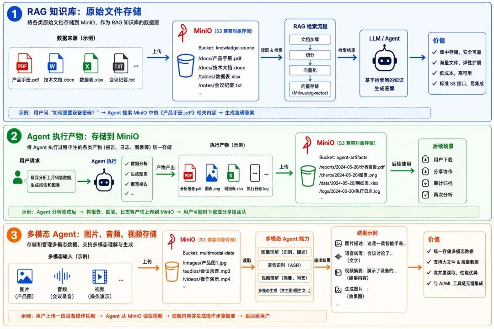

---

## 对象存储在知识库中的角色

### 数据入库流程

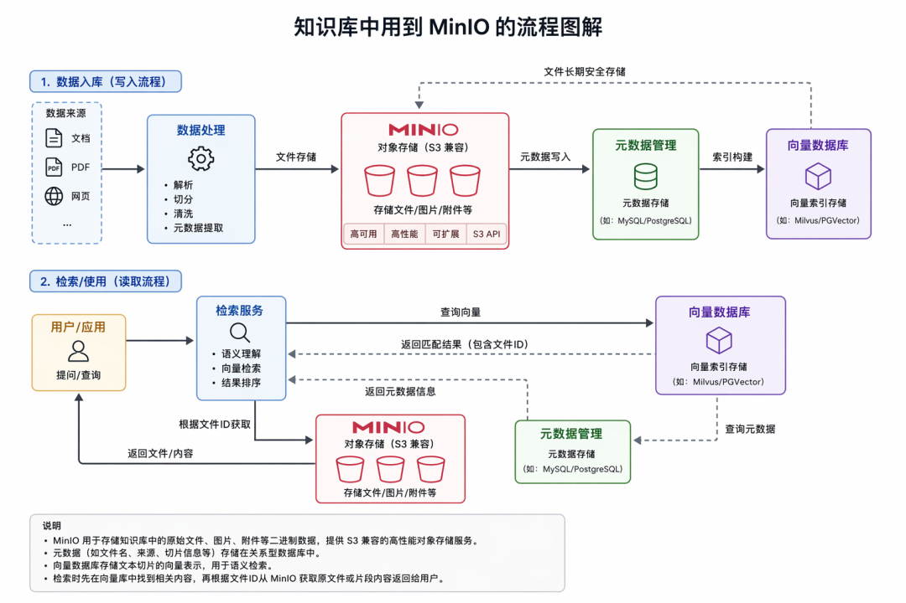

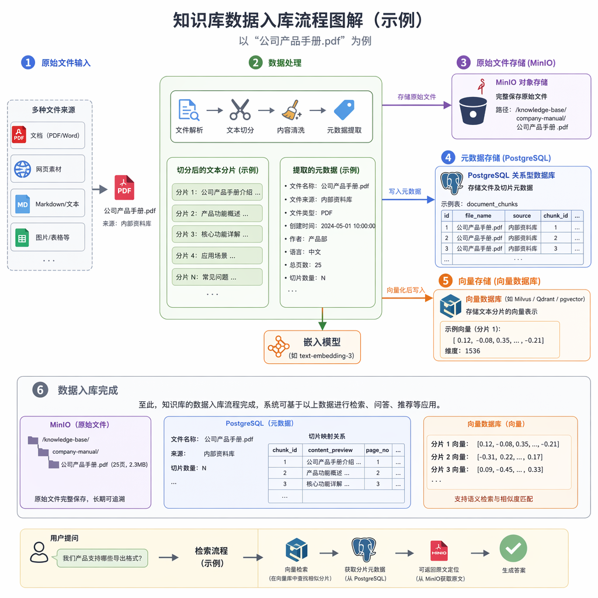

| 步骤 | 处理内容 | 存储位置 |
|------|----------|----------|
| 1 | 用户上传 PDF/网页素材 | 临时存储 |
| 2 | 文件解析、文本切分、内容清洗、元数据提取 | 内存处理 |
| 3 | 原始文件完整存入 | **对象存储（MinIO/OSS）** |
| 4 | 文件名称、来源、切片等元数据写入 | **关系型数据库（PostgreSQL）** |
| 5 | 文本分片向量化，存入 | **向量数据库** |

### 检索流程

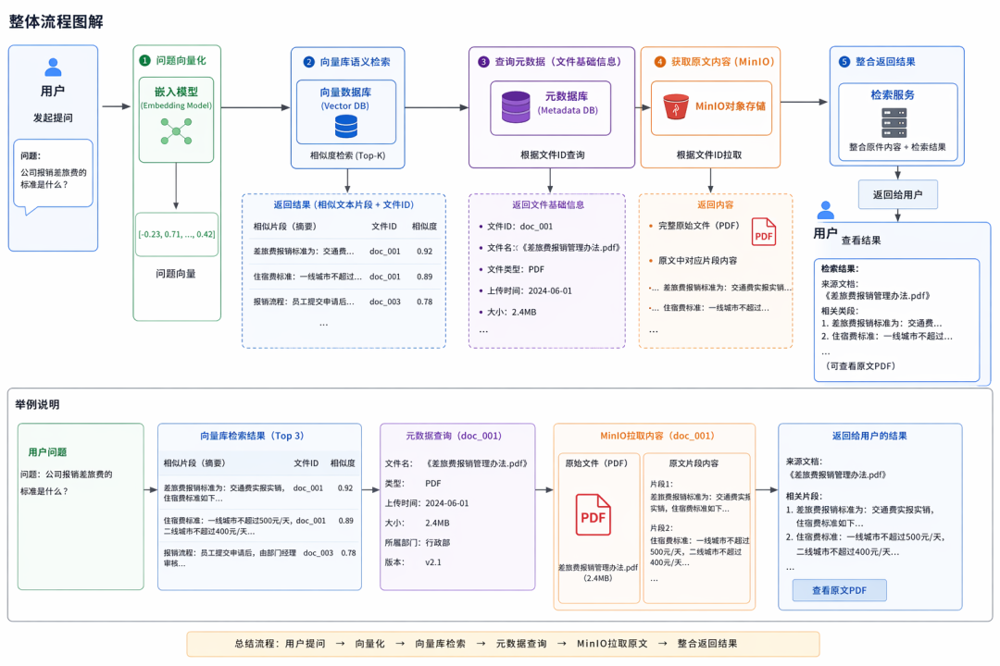

| 步骤 | 操作 | 数据源 |
|------|------|--------|
| 1 | 用户问题向量化，语义检索 | 向量数据库 |
| 2 | 返回高相似度文本片段 + 文件 ID | 向量数据库 |
| 3 | 用文件 ID 调取文件基础信息 | 元数据库（PostgreSQL） |
| 4 | 用文件 ID 拉取完整原始文件 | **对象存储（MinIO/OSS）** |
| 5 | 原文内容 + 检索结果返回用户 | 综合返回 |

### 为什么对象存储不可替代？

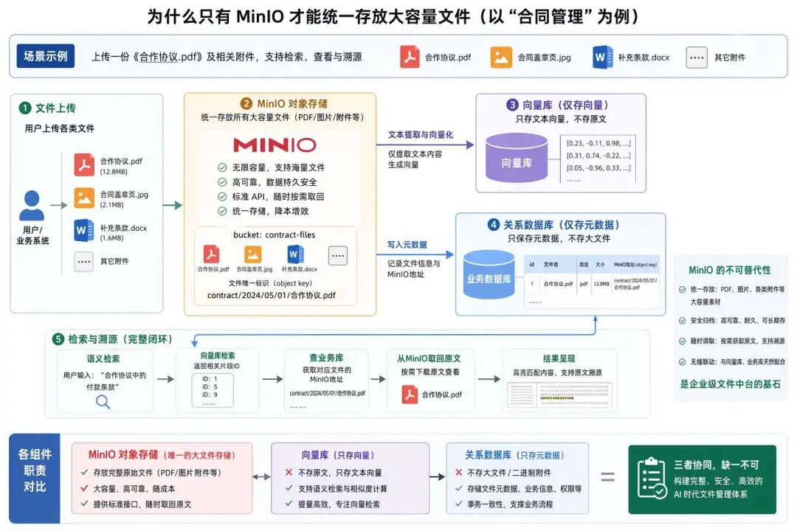

| 存储类型 | 能存什么 | 不能存什么 |
|----------|----------|------------|
| **向量数据库** | 文本向量 | 完整原始文件、大体积二进制附件 |
| **关系数据库** | 元数据（名称、来源、切片信息） | 大体积二进制附件 |
| **对象存储** | PDF、图片、音视频、各类附件 | — |

**只有对象存储能统一存放大容量素材，既能长期安全归档，又能随时按需调取原文溯源。**

---

## 三种对象存储方案对比

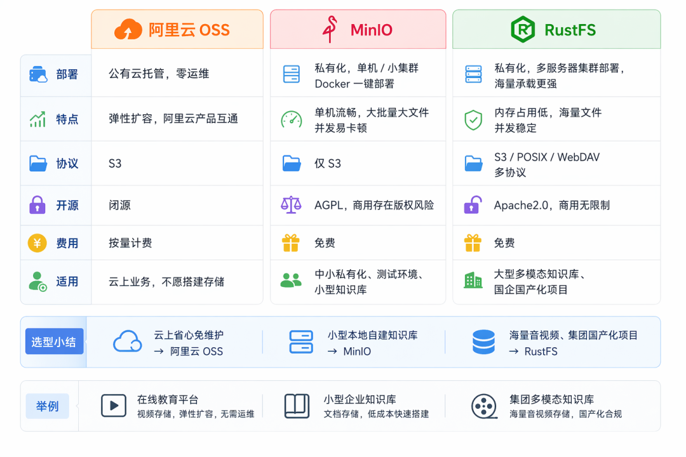

| 维度 | 阿里云 OSS | MinIO | RustFS |
|------|-----------|-------|--------|
| **类型** | 公有云托管服务 | 轻量化私有化方案 | 大型私有化集群 |
| **部署** | 零运维，开箱即用 | Docker 一键部署 | 多服务器分布式部署 |
| **运维成本** | 极低（托管） | 低（单机/小集群） | 中高（集群运维） |
| **并发能力** | 强（云原生弹性） | 中（大批量大文件易卡顿） | 强（海量文件并发稳定） |
| **性能** | 高（CDN 加速） | 中（单机性能） | 高（Rust 底层，内存占用低） |
| **协议兼容** | S3 兼容 | S3 兼容 | S3 + POSIX + WebDAV |
| **开源协议** | 闭源（商用） | AGPL（商用有版权风险） | Apache 2.0（商用无约束） |
| **适用场景** | 线上 SaaS、在线教育 | 中小企业小型知识库、本地测试 | 集团级多模态知识库、国产化项目 |

### 选型建议

- **业务跑在公有云上、想省去运维压力** → 直接选**阿里云 OSS**
- **小型本地自建知识库、低成本快速落地** → 优先 **MinIO**
- **海量音视频存储、大型集团国产化项目** → 推荐 **RustFS**

---

## 对象存储的核心概念

### 本地文件存储 vs 对象存储

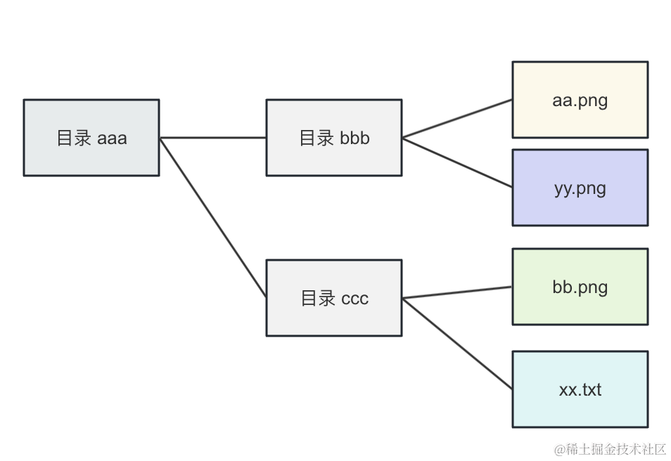

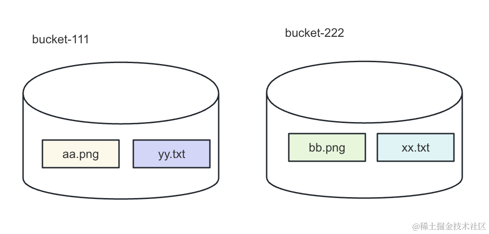

| 特性 | 本地文件存储 | 对象存储（OSS） |
|------|-------------|-----------------|
| **结构** | 目录-文件树状层级 | 扁平化，所有文件平铺在桶内 |
| **文件夹** | 真实存在 | 不存在原生文件夹，是模拟的 |
| **容量** | 受磁盘限制 | 理论无限（分布式） |
| **访问** | 本地路径 | HTTP/HTTPS API |
| **元数据** | 文件系统属性 | 自定义 Key-Value 元数据 |

### Object 对象结构

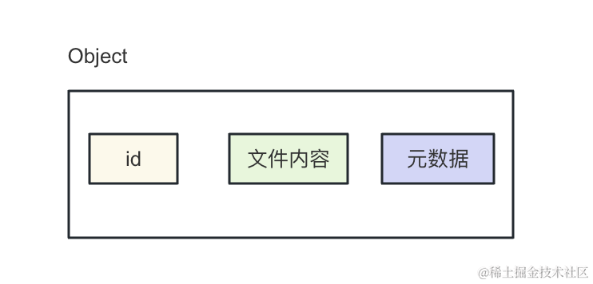

每个 Object 对象包含三部分核心信息：

| 部分 | 说明 | 示例 |
|------|------|------|
| **唯一 Key 标识** | 对象的唯一路径，用 `/` 模拟目录 | `aaa/bbb/first.png` |
| **文件二进制内容** | 实际的文件数据 | 图片/视频/PDF 的二进制 |
| **自定义元数据** | Key-Value 形式的附加信息 | `Content-Type`, `author`, `upload-time` |

### 虚拟目录的实现原理

- OSS 只是解析文件 Key 里的 `/` 斜杠分隔符，渲染出目录分层视图
- 用 Key 前缀做分组检索
- 手动创建空文件夹时，本质是生成一个以 `/` 结尾的 0 字节占位对象

### 块存储 vs 文件存储 vs 对象存储

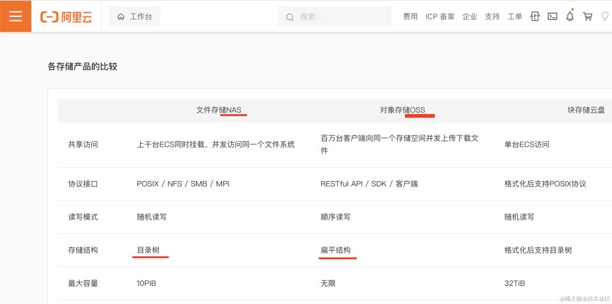

| 存储类型 | 说明 | 容量 | 适用场景 |
|----------|------|------|----------|
| **块存储** | 整块磁盘，需要自己格式化 | 有限 | 系统盘、数据库 |
| **文件存储** | 有目录层次，上传下载文件 | 有限 | NAS、共享文件夹 |
| **对象存储** | Key-Value 存储，分布式实现 | 无限 | 海量文件、图片、视频、备份 |

**绝大多数情况下，我们都是用 OSS 对象存储。**

---

## Python 统一 S3 SDK（boto3）

所有对象存储服务都遵循 **AWS S3 标准协议**，所以用一个 `boto3`（AWS 官方 Python S3 SDK）就能对接所有 OSS 服务。

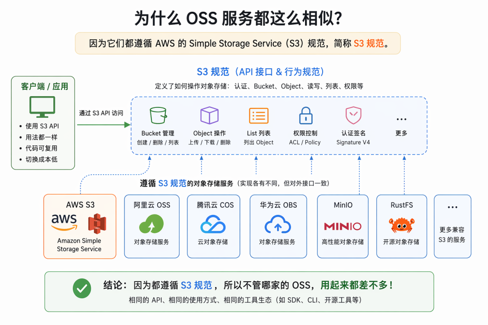

### 安装依赖

```bash
pip install boto3 python-dotenv
```

### 完整工具类

创建 `s3_storage.py`：

```python
"""
s3_storage.py - 统一 S3 对象存储工具类
兼容：阿里云 OSS、MinIO、RustFS、AWS S3
"""
import os
from typing import Optional, List, Dict
from dotenv import load_dotenv
import boto3
from botocore.exceptions import ClientError
from botocore.config import Config

load_dotenv()


class S3Storage:
    """
    统一 S3 对象存储客户端

    兼容所有 S3 兼容的对象存储服务：
    - 阿里云 OSS
    - MinIO
    - RustFS
    - AWS S3
    """

    def __init__(
        self,
        endpoint_url: str,
        access_key_id: str,
        secret_access_key: str,
        region_name: str = "us-east-1",
        bucket_name: str = "default",
    ):
        """
        初始化 S3 客户端

        Args:
            endpoint_url: S3 服务端点
                - 阿里云 OSS: https://oss-cn-hangzhou.aliyuncs.com
                - MinIO: http://localhost:9000
                - RustFS: http://localhost:9000
                - AWS S3: 不填（使用默认）
            access_key_id: Access Key ID
            secret_access_key: Secret Access Key
            region_name: 区域名（本地私有存储随便填）
            bucket_name: 默认桶名
        """
        self.bucket_name = bucket_name

        # boto3 配置
        config = Config(
            signature_version="s3v4",
            s3={"addressing_style": "path"},  # path-style，本地私有存储必须
        )

        self.s3 = boto3.client(
            "s3",
            endpoint_url=endpoint_url,
            aws_access_key_id=access_key_id,
            aws_secret_access_key=secret_access_key,
            region_name=region_name,
            config=config,
        )

        print(f"✅ S3 客户端初始化成功: {endpoint_url}")

    # ========== 桶操作 ==========
    def create_bucket(self, bucket_name: Optional[str] = None):
        """创建桶"""
        bucket = bucket_name or self.bucket_name
        try:
            self.s3.create_bucket(Bucket=bucket)
            print(f"✅ 创建桶: {bucket}")
        except ClientError as e:
            if e.response["Error"]["Code"] == "BucketAlreadyOwnedByYou":
                print(f"ℹ️  桶已存在: {bucket}")
            else:
                raise

    def list_buckets(self) -> List[str]:
        """列出所有桶"""
        response = self.s3.list_buckets()
        return [bucket["Name"] for bucket in response["Buckets"]]

    # ========== 上传操作 ==========
    def upload_file(
        self,
        local_path: str,
        object_key: str,
        bucket_name: Optional[str] = None,
        content_type: Optional[str] = None,
        metadata: Optional[Dict[str, str]] = None,
    ) -> str:
        """
        上传本地文件到对象存储

        Args:
            local_path: 本地文件路径
            object_key: 对象路径（如 aaa/bbb/file.png）
            bucket_name: 桶名
            content_type: 文件 MIME 类型
            metadata: 自定义元数据

        Returns:
            str: 对象的访问 URL
        """
        bucket = bucket_name or self.bucket_name
        extra_args = {}
        if content_type:
            extra_args["ContentType"] = content_type
        if metadata:
            extra_args["Metadata"] = metadata

        self.s3.upload_file(local_path, bucket, object_key, ExtraArgs=extra_args)
        url = f"{self.s3.meta.endpoint_url}/{bucket}/{object_key}"
        print(f"✅ 上传成功: {local_path} → {object_key}")
        return url

    def upload_bytes(
        self,
        data: bytes,
        object_key: str,
        bucket_name: Optional[str] = None,
        content_type: str = "application/octet-stream",
    ) -> str:
        """
        上传字节数据（适合内存中的文件，如 AI 生成的图片）

        Args:
            data: 字节数据
            object_key: 对象路径
            bucket_name: 桶名
            content_type: MIME 类型

        Returns:
            str: 对象的访问 URL
        """
        bucket = bucket_name or self.bucket_name
        self.s3.put_object(
            Bucket=bucket,
            Key=object_key,
            Body=data,
            ContentType=content_type,
        )
        url = f"{self.s3.meta.endpoint_url}/{bucket}/{object_key}"
        print(f"✅ 字节上传成功: {object_key} ({len(data)} bytes)")
        return url

    # ========== 下载操作 ==========
    def download_file(
        self,
        object_key: str,
        local_path: str,
        bucket_name: Optional[str] = None,
    ):
        """
        下载对象到本地文件

        Args:
            object_key: 对象路径
            local_path: 本地保存路径
            bucket_name: 桶名
        """
        bucket = bucket_name or self.bucket_name
        self.s3.download_file(bucket, object_key, local_path)
        print(f"✅ 下载成功: {object_key} → {local_path}")

    def download_bytes(
        self,
        object_key: str,
        bucket_name: Optional[str] = None,
    ) -> bytes:
        """
        下载对象为字节数据

        Args:
            object_key: 对象路径
            bucket_name: 桶名

        Returns:
            bytes: 文件字节数据
        """
        bucket = bucket_name or self.bucket_name
        response = self.s3.get_object(Bucket=bucket, Key=object_key)
        data = response["Body"].read()
        print(f"✅ 字节下载成功: {object_key} ({len(data)} bytes)")
        return data

    # ========== 查询操作 ==========
    def list_objects(
        self,
        prefix: str = "",
        bucket_name: Optional[str] = None,
        max_keys: int = 1000,
    ) -> List[Dict]:
        """
        列出桶中的对象（支持前缀过滤，模拟目录浏览）

        Args:
            prefix: 前缀过滤（如 "aaa/" 模拟目录）
            bucket_name: 桶名
            max_keys: 最大返回数量

        Returns:
            List[Dict]: 对象列表
        """
        bucket = bucket_name or self.bucket_name
        response = self.s3.list_objects_v2(
            Bucket=bucket,
            Prefix=prefix,
            MaxKeys=max_keys,
        )
        objects = []
        if "Contents" in response:
            for obj in response["Contents"]:
                objects.append({
                    "key": obj["Key"],
                    "size": obj["Size"],
                    "last_modified": str(obj["LastModified"]),
                    "etag": obj["ETag"],
                })
        return objects

    def get_object_metadata(
        self,
        object_key: str,
        bucket_name: Optional[str] = None,
    ) -> Dict:
        """
        获取对象元数据

        Args:
            object_key: 对象路径
            bucket_name: 桶名

        Returns:
            Dict: 元数据信息
        """
        bucket = bucket_name or self.bucket_name
        response = self.s3.head_object(Bucket=bucket, Key=object_key)
        return {
            "content_type": response.get("ContentType"),
            "content_length": response.get("ContentLength"),
            "last_modified": str(response.get("LastModified")),
            "metadata": response.get("Metadata", {}),
            "etag": response.get("ETag"),
        }

    # ========== 删除操作 ==========
    def delete_object(
        self,
        object_key: str,
        bucket_name: Optional[str] = None,
    ):
        """删除对象"""
        bucket = bucket_name or self.bucket_name
        self.s3.delete_object(Bucket=bucket, Key=object_key)
        print(f"✅ 删除成功: {object_key}")

    def delete_objects(
        self,
        object_keys: List[str],
        bucket_name: Optional[str] = None,
    ):
        """批量删除对象"""
        bucket = bucket_name or self.bucket_name
        objects = [{"Key": key} for key in object_keys]
        self.s3.delete_objects(
            Bucket=bucket,
            Delete={"Objects": objects},
        )
        print(f"✅ 批量删除成功: {len(object_keys)} 个对象")

    # ========== 生成预签名 URL ==========
    def generate_presigned_url(
        self,
        object_key: str,
        bucket_name: Optional[str] = None,
        expiration: int = 3600,
    ) -> str:
        """
        生成预签名 URL（私有桶的临时访问链接）

        Args:
            object_key: 对象路径
            bucket_name: 桶名
            expiration: 过期时间（秒）

        Returns:
            str: 预签名 URL
        """
        bucket = bucket_name or self.bucket_name
        url = self.s3.generate_presigned_url(
            "get_object",
            Params={"Bucket": bucket, "Key": object_key},
            ExpiresIn=expiration,
        )
        return url


# ========== 使用示例 ==========
if __name__ == "__main__":
    # ===== 方式1：MinIO（本地私有部署） =====
    storage = S3Storage(
        endpoint_url="http://localhost:9000",
        access_key_id="admin",
        secret_access_key="Admin@123456",
        bucket_name="my-bucket",
    )

    # ===== 方式2：阿里云 OSS =====
    # storage = S3Storage(
    #     endpoint_url="https://oss-cn-hangzhou.aliyuncs.com",
    #     access_key_id=os.getenv("OSS_ACCESS_KEY_ID"),
    #     secret_access_key=os.getenv("OSS_ACCESS_KEY_SECRET"),
    #     bucket_name="my-bucket",
    # )

    # ===== 方式3：RustFS（本地私有部署） =====
    # storage = S3Storage(
    #     endpoint_url="http://localhost:9000",
    #     access_key_id="admin",
    #     secret_access_key="Admin@123456",
    #     bucket_name="my-bucket",
    # )

    # 创建桶
    storage.create_bucket()

    # 列出所有桶
    print(f"\n所有桶: {storage.list_buckets()}")

    # 上传文件
    storage.upload_file(
        local_path="test.png",
        object_key="images/test.png",
        content_type="image/png",
        metadata={"author": "agent", "category": "test"},
    )

    # 上传字节数据（AI 生成的图片）
    import io
    from PIL import Image
    img = Image.new("RGB", (100, 100), color="red")
    img_bytes = io.BytesIO()
    img.save(img_bytes, format="PNG")
    storage.upload_bytes(
        data=img_bytes.getvalue(),
        object_key="generated/red.png",
        content_type="image/png",
    )

    # 列出对象（模拟目录浏览）
    print(f"\nimages/ 目录下的对象:")
    for obj in storage.list_objects(prefix="images/"):
        print(f"  - {obj['key']} ({obj['size']} bytes)")

    # 获取对象元数据
    metadata = storage.get_object_metadata("images/test.png")
    print(f"\n对象元数据: {metadata}")

    # 下载文件
    storage.download_file("images/test.png", "downloaded_test.png")

    # 下载字节数据
    data = storage.download_bytes("images/test.png")
    print(f"\n下载字节数: {len(data)}")

    # 生成预签名 URL（私有桶临时访问）
    url = storage.generate_presigned_url("images/test.png", expiration=3600)
    print(f"\n预签名 URL（1小时有效）: {url}")

    # 删除对象
    # storage.delete_object("images/test.png")
    # storage.delete_objects(["images/test.png", "generated/red.png"])

    print("\n✅ 所有操作完成！")
```

---

## MinIO 私有化部署

### Docker Compose 部署

```yaml
# docker-compose.yml
version: "3.8"

services:
  minio:
    image: minio/minio:RELEASE.2025-04-22T22-12-26Z
    container_name: minio-server
    restart: always
    ports:
      - "9000:9000"   # S3 对象存储 API 端口（程序对接用）
      - "9001:9001"   # Web 图形控制台端口（浏览器访问 UI）
    environment:
      MINIO_ROOT_USER: admin           # 登录账号（至少3位）
      MINIO_ROOT_PASSWORD: Admin@123456  # 登录密码（至少8位，数字+字母）
    volumes:
      - ./minio-data:/data             # 持久化数据
    command: server /data --console-address ":9001"
```

```bash
# 启动 MinIO
docker compose up -d

# 访问控制台
# 浏览器打开 http://localhost:9001
# 账号: admin, 密码: Admin@123456
```

### MinIO 控制台

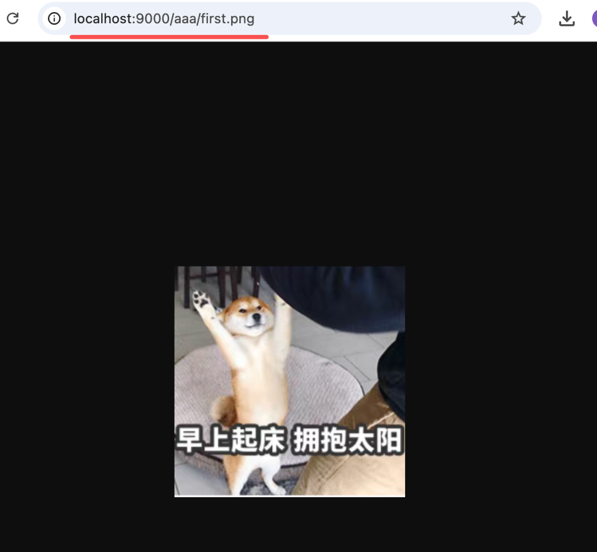

---

## 阿里云 OSS

### 开通服务

1. 访问 [阿里云 OSS 官网](https://www.aliyun.com/product/oss)
2. 开通 OSS 服务（5 块钱够用半年）
3. 进入控制台，创建 Bucket
4. 获取 AccessKey（AccessKey ID + AccessKey Secret）

### 配置示例

```python
# .env
OSS_REGION=oss-cn-hangzhou
OSS_ACCESS_KEY_ID=你的AccessKey ID
OSS_ACCESS_KEY_SECRET=你的AccessKey Secret
OSS_BUCKET=你的桶名
OSS_ENDPOINT=https://oss-cn-hangzhou.aliyuncs.com
```

```python
# 使用统一 S3Storage 类
from s3_storage import S3Storage
import os

storage = S3Storage(
    endpoint_url=os.getenv("OSS_ENDPOINT"),
    access_key_id=os.getenv("OSS_ACCESS_KEY_ID"),
    secret_access_key=os.getenv("OSS_ACCESS_KEY_SECRET"),
    bucket_name=os.getenv("OSS_BUCKET"),
)

# 上传文件
storage.upload_file("document.pdf", "documents/document.pdf", content_type="application/pdf")
```

---

## RustFS 私有化部署

### Docker Compose 部署

```yaml
# docker-compose.yml
version: "3.8"

services:
  rustfs:
    image: rustfs/rustfs:latest
    container_name: rustfs-server
    restart: always
    ports:
      - "9000:9000"   # S3 API 端口
      - "9001:9001"   # Web 控制台端口
    environment:
      TZ: Asia/Shanghai
      RUSTFS_ACCESS_KEY: admin           # S3/后台登录账号
      RUSTFS_SECRET_KEY: Admin@123456    # 密钥
      RUSTFS_CONSOLE_ENABLE: "true"       # 开启 Web 管理控制台
    volumes:
      - ./volumes/rustfs-data:/data
      - ./volumes/rustfs-logs:/logs
    command: server /data
```

```bash
# 启动 RustFS
docker compose up -d

# 访问控制台
# 浏览器打开 http://localhost:9001
```

---

## 知识库场景完整示例

```python
"""
knowledge_base_storage.py - 知识库场景的对象存储完整示例
包含：文件上传、元数据存储、文件检索、原文溯源
"""
import os
import uuid
from datetime import datetime
from dotenv import load_dotenv
from s3_storage import S3Storage
import psycopg2

load_dotenv()


class KnowledgeBaseStorage:
    """知识库存储：对象存储 + 元数据库"""

    def __init__(self):
        # 对象存储
        self.storage = S3Storage(
            endpoint_url=os.getenv("S3_ENDPOINT", "http://localhost:9000"),
            access_key_id=os.getenv("S3_ACCESS_KEY_ID", "admin"),
            secret_access_key=os.getenv("S3_SECRET_ACCESS_KEY", "Admin@123456"),
            bucket_name=os.getenv("S3_BUCKET", "knowledge-base"),
        )
        self.storage.create_bucket()

        # 元数据库（PostgreSQL）
        self.db_conn = psycopg2.connect(
            host=os.getenv("DB_HOST", "localhost"),
            dbname=os.getenv("DB_NAME", "agent_db"),
            user=os.getenv("DB_USER", "postgres"),
            password=os.getenv("DB_PASSWORD", "password"),
        )
        self._init_db()

    def _init_db(self):
        """初始化元数据表"""
        with self.db_conn.cursor() as cur:
            cur.execute("""
                CREATE TABLE IF NOT EXISTS documents (
                    id SERIAL PRIMARY KEY,
                    file_id VARCHAR(64) UNIQUE,
                    filename VARCHAR(255),
                    object_key VARCHAR(512),
                    content_type VARCHAR(100),
                    file_size BIGINT,
                    source VARCHAR(255),
                    status VARCHAR(50) DEFAULT 'uploaded',
                    chunk_count INTEGER DEFAULT 0,
                    created_at TIMESTAMP DEFAULT CURRENT_TIMESTAMP
                )
            """)
        self.db_conn.commit()

    def upload_document(self, local_path: str, source: str = "user_upload") -> dict:
        """
        上传文档到知识库

        Args:
            local_path: 本地文件路径
            source: 来源

        Returns:
            dict: 文档元数据
        """
        file_id = str(uuid.uuid4())[:8]
        filename = os.path.basename(local_path)
        object_key = f"documents/{file_id}/{filename}"
        file_size = os.path.getsize(local_path)

        # 1. 上传到对象存储
        content_type = "application/pdf" if filename.endswith(".pdf") else "application/octet-stream"
        self.storage.upload_file(local_path, object_key, content_type=content_type)

        # 2. 元数据存入数据库
        with self.db_conn.cursor() as cur:
            cur.execute("""
                INSERT INTO documents (file_id, filename, object_key, content_type, file_size, source)
                VALUES (%s, %s, %s, %s, %s, %s)
                RETURNING id, file_id, filename, object_key, created_at
            """, (file_id, filename, object_key, content_type, file_size, source))
            doc = cur.fetchone()
        self.db_conn.commit()

        return {
            "id": doc[0],
            "file_id": doc[1],
            "filename": doc[2],
            "object_key": doc[3],
            "created_at": str(doc[4]),
        }

    def get_document(self, file_id: str) -> dict:
        """根据 file_id 获取文档元数据"""
        with self.db_conn.cursor() as cur:
            cur.execute("SELECT * FROM documents WHERE file_id = %s", (file_id,))
            row = cur.fetchone()
        if not row:
            return None
        return {
            "id": row[0],
            "file_id": row[1],
            "filename": row[2],
            "object_key": row[3],
            "content_type": row[4],
            "file_size": row[5],
            "source": row[6],
            "status": row[7],
            "chunk_count": row[8],
            "created_at": str(row[9]),
        }

    def download_original(self, file_id: str, save_path: str):
        """
        下载原始文件（溯源）

        Args:
            file_id: 文件 ID
            save_path: 本地保存路径
        """
        doc = self.get_document(file_id)
        if not doc:
            raise ValueError(f"文件不存在: {file_id}")
        self.storage.download_file(doc["object_key"], save_path)

    def list_documents(self, limit: int = 50) -> list:
        """列出所有文档"""
        with self.db_conn.cursor() as cur:
            cur.execute("""
                SELECT file_id, filename, file_size, status, created_at
                FROM documents ORDER BY created_at DESC LIMIT %s
            """, (limit,))
            rows = cur.fetchall()
        return [
            {
                "file_id": r[0],
                "filename": r[1],
                "file_size": r[2],
                "status": r[3],
                "created_at": str(r[4]),
            }
            for r in rows
        ]


# 使用示例
if __name__ == "__main__":
    kb = KnowledgeBaseStorage()

    # 上传文档
    doc = kb.upload_document("article.pdf", source="user_upload")
    print(f"上传成功: {doc}")

    # 列出文档
    print(f"\n所有文档: {kb.list_documents()}")

    # 获取文档元数据
    doc_info = kb.get_document(doc["file_id"])
    print(f"\n文档信息: {doc_info}")

    # 下载原始文件（溯源）
    kb.download_original(doc["file_id"], "downloaded_article.pdf")
    print("\n原始文件下载完成")
```

---

## 学习要点

1. **对象存储**是 AI Agent 存储文件的底层核心支撑，统一存放 PDF、图片、音视频等大容量素材
2. **三种主流方案**：阿里云 OSS（公有云托管，零运维）、MinIO（轻量私有化，Docker 一键部署）、RustFS（大型私有化集群，Rust 底层高性能）
3. **S3 标准协议**：所有对象存储服务都兼容 S3 协议，用一个 `boto3` SDK 就能对接所有服务
4. **扁平化结构**：对象存储底层没有真实目录，用 Key 前缀和 `/` 分隔符模拟目录视图
5. **Object 三要素**：唯一 Key 标识 + 文件二进制内容 + 自定义元数据
6. **知识库完整流程**：原始文件存对象存储、元数据存 PostgreSQL、文本向量存向量数据库，三者联动
7. **预签名 URL**：私有桶的临时访问链接，适合给前端用户临时下载文件
8. **MinIO 注意**：新版社区版阉割了部分功能，商用存在 AGPL 开源版权风险
9. **RustFS 优势**：Apache 2.0 协议商用无约束，Rust 底层内存占用低，兼容 S3+POSIX+WebDAV
10. **选型建议**：公有云选 OSS、小型本地选 MinIO、大型国产化项目选 RustFS

## 扩展方向

- 学习对象存储的 CDN 加速配置（阿里云 OSS + CDN）
- 探索大文件分片上传（Multipart Upload）和断点续传
- 学习对象存储的生命周期管理（自动转冷存储、自动删除）
- 探索对象存储的版本控制和误删恢复
- 学习对象存储的跨区域复制（CRR）和灾备方案
- 探索对象存储的静态网站托管（OSS 静态网站）
- 学习对象存储的图片处理（缩略图、水印、格式转换）
- 探索对象存储的事件通知（文件上传触发 Lambda/函数计算）
- 学习对象存储的权限控制（Bucket Policy、ACL、RAM 子账号）
- 探索对象存储的加密（服务端加密 SSE、客户端加密）

---

## 配套代码库

**代码库地址**：https://github.com/iiixiyan/agent-learning-code/tree/main/04-storage-monitoring/38-object-storage

包含本文的完整可运行代码示例（统一 S3 工具类 + MinIO/OSS/RustFS 部署配置 + 知识库场景完整示例）。

---

**上一篇**：[FastAPI 进阶](./37_FastAPI进阶.md) | **下一篇**：[多模态与 OSS 前端直传实战](./39_多模态与OSS前端直传实战.md)
