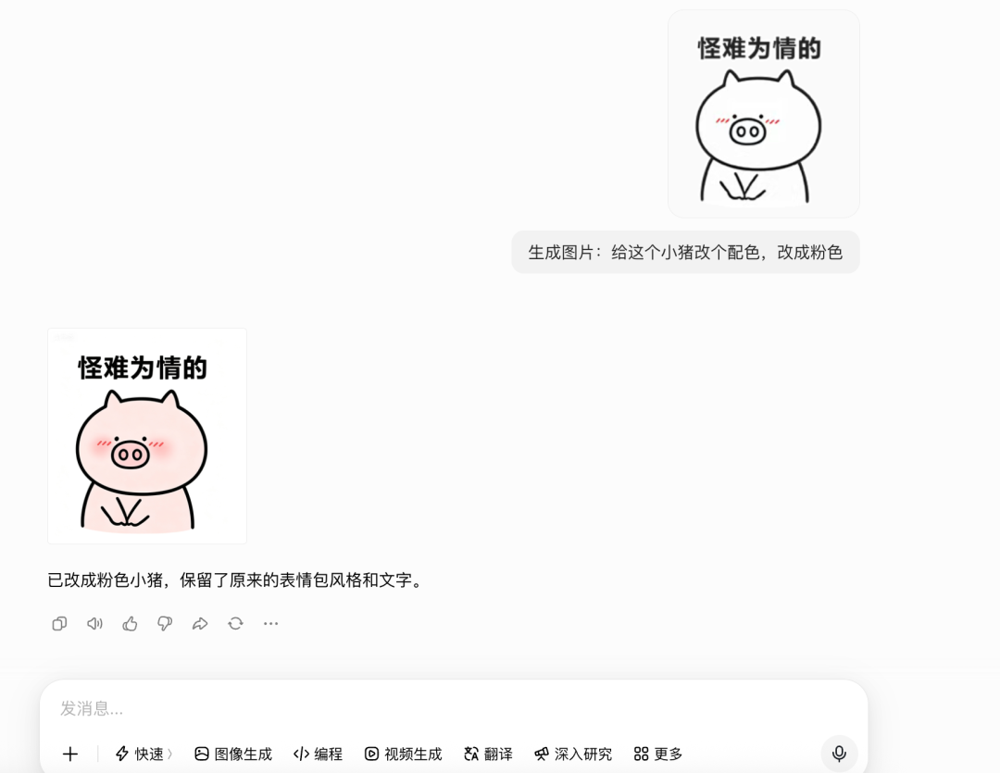
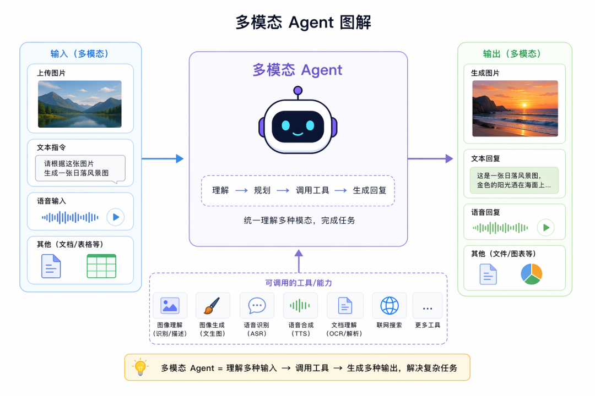
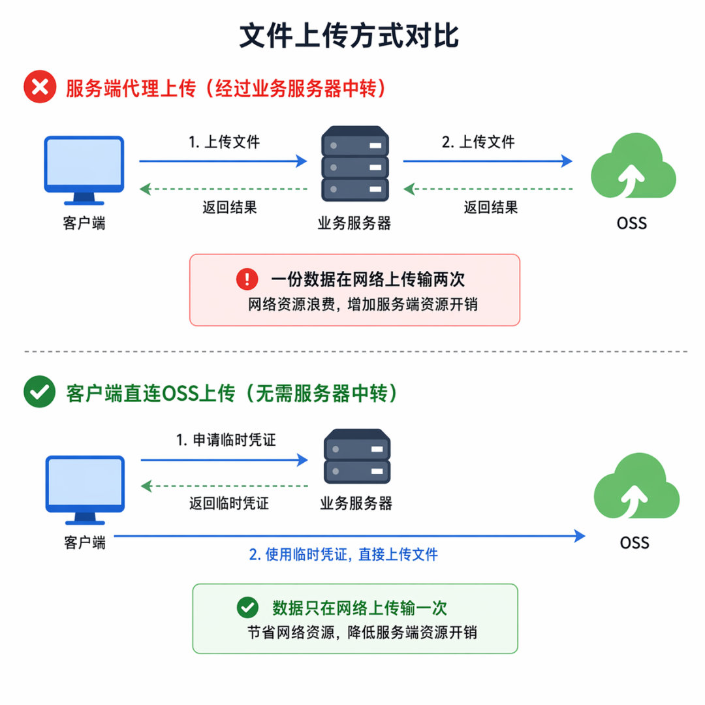
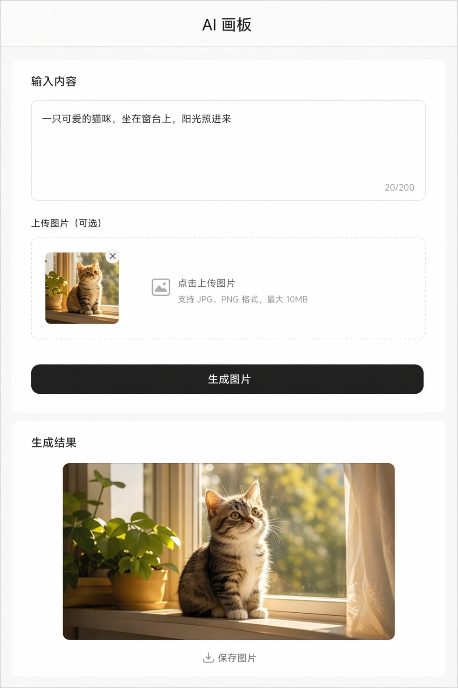

# 多模态与 OSS 前端直传实战：AI 画板

> **Python 版** | 基于 FastAPI + 通义千问多模态 + 阿里云 OSS 技术栈
> 前置知识：[对象存储方案](./38_Agent的对象存储方案.md)、[FastAPI 进阶](./37_FastAPI进阶.md)

---

## 为什么需要多模态？

之前我们的 Agent 都是输入文字、返回文字。但平时用的很多 Agent 都支持输入图片、返回图片——这就是**多模态**。



### 多模态能力

| 能力 | 说明 | 典型模型 |
|------|------|----------|
| **图像理解** | 输入图片，输出文字描述/回答 | qwen-vl-plus, gpt-4o, claude-3 |
| **图像生成** | 输入文字描述，输出图片 | qwen-image, dall-e-3, stable diffusion |
| **视频理解** | 输入视频，输出文字描述/回答 | qwen-vl-max, gemini |
| **视频生成** | 输入文字/图片，输出视频 | sana, runway, pika |
| **语音识别** | 输入音频，输出文字 | whisper, paraformer |
| **语音合成** | 输入文字，输出音频 | cosyvoice, elevenlabs |

### 多模态模型选择



| 模型 | 模态 | 调用方式 | 说明 |
|------|------|----------|------|
| **qwen-vl-plus** | 图像理解 | OpenAI 兼容接口 | 通义千问视觉模型，支持图片理解 |
| **qwen-image** | 图像生成 | DashScope SDK | 通义万相图片生成 |
| **qwen-vl-max** | 视频理解 | DashScope SDK | 支持视频理解 |
| **gpt-4o** | 图像理解 | OpenAI API | OpenAI 多模态模型 |

**兼容 OpenAI 协议的模型可以用 `ChatOpenAI` 调用，其余的直接用 DashScope SDK 调用。**

---

## 图像理解（qwen-vl-plus）

### 安装依赖

```bash
pip install langchain langchain-openai python-dotenv
```

### 完整示例

创建 `image_understanding.py`：

```python
"""
image_understanding.py - 图像理解完整示例
使用 qwen-vl-plus 模型，通过 OpenAI 兼容接口调用
"""
import os
from dotenv import load_dotenv
from langchain_openai import ChatOpenAI
from langchain_core.messages import HumanMessage

load_dotenv()

# 初始化多模态模型（qwen-vl-plus）
model = ChatOpenAI(
    api_key=os.getenv("OPENAI_API_KEY"),
    model="qwen-vl-plus",
    base_url=os.getenv("OPENAI_BASE_URL"),
)


def understand_image(image_url: str, question: str = "详细描述这张图片的内容") -> str:
    """
    图像理解：输入图片 URL，输出文字描述

    Args:
        image_url: 图片 URL（必须是公网可访问的 URL）
        question: 针对图片的问题

    Returns:
        str: 模型回答
    """
    response = model.invoke([
        HumanMessage(content=[
            {"type": "text", "text": question},
            {"type": "image_url", "image_url": {"url": image_url}},
        ])
    ])
    return response.content


# ========== 使用示例 ==========
if __name__ == "__main__":
    # 示例图片（公网可访问）
    image_url = "https://dashscope.oss-cn-beijing.aliyuncs.com/images/dog_and_girl.jpeg"

    # 1. 图片描述
    print("="*60)
    print("示例1：图片描述")
    print("="*60)
    result = understand_image(image_url, "详细描述这张图片的内容")
    print(result)

    # 2. 图片问答
    print("\n" + "="*60)
    print("示例2：图片问答")
    print("="*60)
    result = understand_image(image_url, "图片中有几个人？他们在做什么？")
    print(result)

    # 3. 图片中的文字识别（OCR）
    print("\n" + "="*60)
    print("示例3：图片文字识别")
    print("="*60)
    result = understand_image(image_url, "图片中有没有文字？如果有，请提取出来。")
    print(result)
```

### 运行示例

```bash
# 1. 配置 .env
echo "OPENAI_API_KEY=你的_api_key" > .env
echo "OPENAI_BASE_URL=https://dashscope.aliyuncs.com/compatible-mode/v1" >> .env

# 2. 运行图像理解
python image_understanding.py
```

---

## 图像生成（qwen-image）

### 安装依赖

```bash
pip install dashscope python-dotenv requests
```

### 完整示例

创建 `image_generation.py`：

```python
"""
image_generation.py - 图像生成完整示例
使用通义万相 qwen-image 模型，通过 DashScope SDK 调用
生成的图片 URL 有效期约 24 小时，需要转存到自己的 OSS
"""
import os
import time
import requests
from dotenv import load_dotenv
import dashscope
from dashscope import ImageSynthesis

load_dotenv()

# 配置 DashScope API Key
dashscope.api_key = os.getenv("DASHSCOPE_API_KEY")


def generate_image(prompt: str, size: str = "1024*1024", model: str = "wanx2.1-t2i-turbo") -> dict:
    """
    生成图片

    Args:
        prompt: 图片描述提示词
        size: 图片尺寸，如 "1024*1024", "768*1024", "1024*768"
        model: 模型名称，wanx2.1-t2i-turbo（快速）或 wanx2.1-t2i-plus（高质量）

    Returns:
        dict: 包含图片 URL 和本地保存路径
    """
    print(f"🎨 正在生成图片: {prompt}")

    # 调用图片生成 API（异步任务）
    rsp = ImageSynthesis.call(
        model=model,
        prompt=prompt,
        size=size,
        n=1,
    )

    if rsp.status_code != 200:
        raise Exception(f"生成失败: {rsp.code} - {rsp.message}")

    # 获取任务 ID，轮询结果
    task_id = rsp.output.task_id
    print(f"⏳ 任务已提交，任务ID: {task_id}")

    # 轮询任务状态
    while True:
        time.sleep(2)
        task = ImageSynthesis.fetch(task_id)
        if task.output.task_status == "SUCCEEDED":
            image_url = task.output.results[0]["url"]
            print(f"✅ 图片生成成功: {image_url}")

            # 下载图片到本地
            local_path = f"generated_{int(time.time())}.png"
            response = requests.get(image_url)
            with open(local_path, "wb") as f:
                f.write(response.content)
            print(f"💾 图片已保存到本地: {local_path}")

            return {"image_url": image_url, "local_path": local_path}

        elif task.output.task_status == "FAILED":
            raise Exception(f"生成失败: {task.output.message}")

        else:
            print(f"  ⏳ 任务状态: {task.output.task_status}...")


# ========== 使用示例 ==========
if __name__ == "__main__":
    # 示例1：风景图
    result1 = generate_image(
        prompt="一幅中国风山水画，远山近水，云雾缭绕，水墨风格",
        size="1024*1024",
    )

    # 示例2：人物图
    result2 = generate_image(
        prompt="一个可爱的卡通猫咪，戴着程序员眼镜，正在敲代码，赛博朋克风格",
        size="1024*1024",
    )

    print("\n✅ 所有图片生成完成！")
    print(f"图片1: {result1['local_path']}")
    print(f"图片2: {result2['local_path']}")
```

### 运行示例

```bash
# 1. 配置 .env（添加 DASHSCOPE_API_KEY）
echo "DASHSCOPE_API_KEY=你的_dashscope_api_key" >> .env

# 2. 运行图片生成
python image_generation.py
```

---

## OSS 存储图片


多模态过程中涉及大量 OSS 操作：
- 传入的图片、视频、音频 URL
- 生成的视频、音频、图片的保存

**生成的图片 URL 有效期约 24 小时**，必须转存到自己的 OSS 持久保存。

### 图片转存到 OSS

```python
"""
oss_transfer.py - 生成图片转存到 OSS
将临时 URL 的图片下载并上传到自己的 OSS
"""
import os
import requests
from dotenv import load_dotenv
import boto3
from botocore.config import Config

load_dotenv()


def transfer_to_oss(
    image_url: str,
    object_key: str,
    bucket_name: str = None,
) -> str:
    """
    将图片从临时 URL 转存到 OSS

    Args:
        image_url: 临时图片 URL
        object_key: OSS 对象路径
        bucket_name: OSS 桶名

    Returns:
        str: OSS 中的图片永久 URL
    """
    # 1. 下载图片
    print(f"⬇️  下载图片: {image_url}")
    response = requests.get(image_url)
    image_data = response.content

    # 2. 上传到 OSS
    s3 = boto3.client(
        "s3",
        endpoint_url=os.getenv("OSS_ENDPOINT"),
        aws_access_key_id=os.getenv("OSS_ACCESS_KEY_ID"),
        aws_secret_access_key=os.getenv("OSS_ACCESS_KEY_SECRET"),
        config=Config(signature_version="s3v4", s3={"addressing_style": "path"}),
    )

    bucket = bucket_name or os.getenv("OSS_BUCKET")
    content_type = "image/png" if object_key.endswith(".png") else "image/jpeg"

    s3.put_object(
        Bucket=bucket,
        Key=object_key,
        Body=image_data,
        ContentType=content_type,
    )

    # 3. 返回永久 URL
    permanent_url = f"{os.getenv('OSS_ENDPOINT')}/{bucket}/{object_key}"
    print(f"✅ 图片已转存到 OSS: {permanent_url}")
    return permanent_url


# 使用示例
if __name__ == "__main__":
    # 假设这是 AI 生成的临时图片 URL
    temp_image_url = "https://dashscope-result.oss-cn-beijing.aliyuncs.com/xxx.png"

    # 转存到 OSS
    permanent_url = transfer_to_oss(
        image_url=temp_image_url,
        object_key="ai-generated/canvas_001.png",
    )

    print(f"\n永久 URL: {permanent_url}")
```

---

## 前端直传 OSS（STS 临时凭证）

### 为什么需要前端直传？

生成图片传到 OSS 直接后端做就行，返回 OSS 的 URL。但是用户上传视频，有必要先传到我们服务器，再传到 OSS 么？

**没必要，这种可以用 OSS 前端直传。**



### 前端直传流程

```
前端                          后端                          OSS
 │                             │                             │
 │── 1. 请求上传凭证 ─────────>│                             │
 │                             │── 2. 生成 STS 临时凭证 ────>│
 │                             │<── 3. 返回临时凭证 ─────────│
 │<── 4. 返回临时凭证 ─────────│                             │
 │                             │                             │
 │── 5. 直接上传文件 ──────────────────────────────────────>│
 │<── 6. 返回上传结果 ──────────────────────────────────────│
 │                             │                             │
```

| 步骤 | 说明 | 优点 |
|------|------|------|
| 1-4 | 前端请求后端，后端生成 STS 临时凭证返回 | 不暴露主密钥 |
| 5-6 | 前端直接上传文件到 OSS | 不经过后端服务器，节省带宽 |

### 后端：生成 STS 凭证（FastAPI）

```python
"""
sts_server.py - FastAPI 后端：生成 OSS 前端直传凭证
使用 PostObject 方式（表单上传）
"""
import os
import time
import base64
import hmac
import hashlib
from datetime import datetime, timedelta
from dotenv import load_dotenv
from fastapi import FastAPI
from fastapi.middleware.cors import CORSMiddleware

load_dotenv()

app = FastAPI(title="OSS STS 凭证服务")

# 允许跨域（前端访问）
app.add_middleware(
    CORSMiddleware,
    allow_origins=["*"],
    allow_methods=["*"],
    allow_headers=["*"],
)

# OSS 配置
OSS_REGION = os.getenv("OSS_REGION", "oss-cn-beijing")
OSS_BUCKET = os.getenv("OSS_BUCKET", "agent-bucket123")
OSS_ACCESS_KEY_ID = os.getenv("OSS_ACCESS_KEY_ID")
OSS_ACCESS_KEY_SECRET = os.getenv("OSS_ACCESS_KEY_SECRET")
OSS_HOST = f"https://{OSS_BUCKET}.{OSS_REGION}.aliyuncs.com"


@app.get("/api/oss/sts")
def get_sts_token(filename: str = "file"):
    """
    获取 OSS 前端直传凭证（PostObject 方式）

    Args:
        filename: 文件名

    Returns:
        dict: 包含 host, dir, signature, policy, OSSAccessKeyId 等
    """
    # 1. 生成对象路径（用时间戳避免重名）
    timestamp = int(time.time())
    object_key = f"uploads/{timestamp}_{filename}"

    # 2. 构建 Policy（限制上传条件）
    expiration = (datetime.utcnow() + timedelta(hours=1)).strftime("%Y-%m-%dT%H:%M:%SZ")
    policy = {
        "expiration": expiration,
        "conditions": [
            ["content-length-range", 0, 104857600],  # 最大 100MB
            ["starts-with", "$key", "uploads/"],       # 只能上传到 uploads/ 目录
        ],
    }
    policy_base64 = base64.b64encode(
        str(policy).replace("'", '"').encode("utf-8")
    ).decode("utf-8")

    # 3. 计算签名
    signature = base64.b64encode(
        hmac.new(
            OSS_ACCESS_KEY_SECRET.encode("utf-8"),
            policy_base64.encode("utf-8"),
            hashlib.sha1,
        ).digest()
    ).decode("utf-8")

    # 4. 返回凭证
    return {
        "host": OSS_HOST,
        "dir": "uploads/",
        "filename": object_key,
        "policy": policy_base64,
        "OSSAccessKeyId": OSS_ACCESS_KEY_ID,
        "signature": signature,
        "success_action_status": "200",
    }


if __name__ == "__main__":
    import uvicorn
    uvicorn.run(app, host="0.0.0.0", port=8000)
```

### 前端：直传 OSS（HTML + JS）

```html
<!DOCTYPE html>
<html lang="zh-CN">
<head>
    <meta charset="UTF-8">
    <meta name="viewport" content="width=device-width, initial-scale=1.0">
    <title>OSS 前端直传示例</title>
    <script src="https://unpkg.com/axios@1.6.5/dist/axios.min.js"></script>
</head>
<body>
    <h2>OSS 前端直传示例</h2>
    <input id="fileInput" type="file" accept="image/*,video/*">
    <div id="preview"></div>
    <div id="status"></div>

    <script>
        const fileInput = document.getElementById('fileInput');
        const statusEl = document.getElementById('status');
        const previewEl = document.getElementById('preview');

        // 1. 从后端获取 STS 凭证
        async function getOSSCredentials(filename) {
            const response = await axios.get(`http://localhost:8000/api/oss/sts?filename=${filename}`);
            return response.data;
        }

        // 2. 直接上传到 OSS
        async function uploadToOSS(file, ossInfo) {
            const formData = new FormData();
            formData.append('key', ossInfo.filename);
            formData.append('policy', ossInfo.policy);
            formData.append('OSSAccessKeyId', ossInfo.OSSAccessKeyId);
            formData.append('signature', ossInfo.signature);
            formData.append('success_action_status', ossInfo.success_action_status);
            formData.append('file', file);

            const response = await axios.post(ossInfo.host, formData, {
                headers: { 'Content-Type': 'multipart/form-data' },
            });
            return response.status === 200;
        }

        // 3. 文件选择事件
        fileInput.onchange = async () => {
            const file = fileInput.files[0];
            if (!file) return;

            statusEl.textContent = '正在获取上传凭证...';

            try {
                // 获取凭证
                const ossInfo = await getOSSCredentials(file.name);

                statusEl.textContent = '正在上传到 OSS...';

                // 直接上传到 OSS
                const success = await uploadToOSS(file, ossInfo);

                if (success) {
                    const fileUrl = `${ossInfo.host}/${ossInfo.filename}`;
                    statusEl.textContent = `✅ 上传成功！URL: ${fileUrl}`;

                    // 预览图片
                    if (file.type.startsWith('image/')) {
                        previewEl.innerHTML = ``;
                    }
                } else {
                    statusEl.textContent = '❌ 上传失败';
                }
            } catch (error) {
                statusEl.textContent = `❌ 错误: ${error.message}`;
            }
        };
    </script>
</body>
</html>
```

---

## AI 画板实战




### 功能说明

AI 画板综合运用了：
1. **前端直传 OSS**：用户上传参考图片直接传到 OSS
2. **图像理解**：qwen-vl-plus 理解参考图片
3. **图像生成**：qwen-image 根据描述生成图片
4. **图片转存**：生成的临时图片转存到 OSS 持久保存

### 后端接口（FastAPI）

```python
"""
ai_canvas_server.py - AI 画板后端（FastAPI）
接口：
- GET /api/oss/sts: 获取 OSS 直传凭证
- POST /api/canvas/generate: 生成图片（文字描述 + 参考图）
- POST /api/canvas/understand: 理解图片
"""
import os
import time
import base64
import hmac
import hashlib
from datetime import datetime, timedelta
from dotenv import load_dotenv
from fastapi import FastAPI, HTTPException
from fastapi.middleware.cors import CORSMiddleware
from pydantic import BaseModel
import dashscope
from dashscope import ImageSynthesis
from langchain_openai import ChatOpenAI
from langchain_core.messages import HumanMessage
import requests
import boto3
from botocore.config import Config

load_dotenv()

app = FastAPI(title="AI 画板服务")
app.add_middleware(CORSMiddleware, allow_origins=["*"], allow_methods=["*"], allow_headers=["*"])

# 配置
dashscope.api_key = os.getenv("DASHSCOPE_API_KEY")
OSS_REGION = os.getenv("OSS_REGION", "oss-cn-beijing")
OSS_BUCKET = os.getenv("OSS_BUCKET", "agent-bucket123")
OSS_HOST = f"https://{OSS_BUCKET}.{OSS_REGION}.aliyuncs.com"

# 多模态模型
vl_model = ChatOpenAI(
    api_key=os.getenv("OPENAI_API_KEY"),
    model="qwen-vl-plus",
    base_url=os.getenv("OPENAI_BASE_URL"),
)

# S3 客户端（用于转存 OSS）
s3 = boto3.client(
    "s3",
    endpoint_url=os.getenv("OSS_ENDPOINT"),
    aws_access_key_id=os.getenv("OSS_ACCESS_KEY_ID"),
    aws_secret_access_key=os.getenv("OSS_ACCESS_KEY_SECRET"),
    config=Config(signature_version="s3v4", s3={"addressing_style": "path"}),
)


# ========== 请求模型 ==========
class GenerateRequest(BaseModel):
    prompt: str                    # 图片描述
    reference_image: str = None   # 参考图片 URL（可选）
    size: str = "1024*1024"


class UnderstandRequest(BaseModel):
    image_url: str
    question: str = "详细描述这张图片"


# ========== 接口1：OSS 直传凭证 ==========
@app.get("/api/oss/sts")
def get_sts_token(filename: str = "file"):
    """获取 OSS 前端直传凭证"""
    timestamp = int(time.time())
    object_key = f"canvas/uploads/{timestamp}_{filename}"

    expiration = (datetime.utcnow() + timedelta(hours=1)).strftime("%Y-%m-%dT%H:%M:%SZ")
    policy = {
        "expiration": expiration,
        "conditions": [
            ["content-length-range", 0, 52428800],  # 50MB
            ["starts-with", "$key", "canvas/uploads/"],
        ],
    }
    policy_base64 = base64.b64encode(str(policy).replace("'", '"').encode()).decode()
    signature = base64.b64encode(
        hmac.new(os.getenv("OSS_ACCESS_KEY_SECRET").encode(), policy_base64.encode(), hashlib.sha1).digest()
    ).decode()

    return {
        "host": OSS_HOST,
        "filename": object_key,
        "policy": policy_base64,
        "OSSAccessKeyId": os.getenv("OSS_ACCESS_KEY_ID"),
        "signature": signature,
        "success_action_status": "200",
    }


# ========== 接口2：生成图片 ==========
@app.post("/api/canvas/generate")
def generate_image(req: GenerateRequest):
    """
    生成图片：文字描述 + 可选参考图
    生成后转存到 OSS，返回永久 URL
    """
    try:
        # 1. 如果有参考图，先理解参考图
        full_prompt = req.prompt
        if req.reference_image:
            understand_result = vl_model.invoke([
                HumanMessage(content=[
                    {"type": "text", "text": "描述这张图片的风格、色彩、构图特点"},
                    {"type": "image_url", "image_url": {"url": req.reference_image}},
                ])
            ])
            full_prompt = f"{req.prompt}。参考风格：{understand_result.content}"

        # 2. 调用图片生成
        rsp = ImageSynthesis.call(
            model="wanx2.1-t2i-turbo",
            prompt=full_prompt,
            size=req.size,
            n=1,
        )
        if rsp.status_code != 200:
            raise HTTPException(status_code=500, detail=f"生成失败: {rsp.message}")

        # 3. 轮询结果
        task_id = rsp.output.task_id
        for _ in range(30):
            time.sleep(2)
            task = ImageSynthesis.fetch(task_id)
            if task.output.task_status == "SUCCEEDED":
                temp_url = task.output.results[0]["url"]
                break
            elif task.output.task_status == "FAILED":
                raise HTTPException(status_code=500, detail="生成失败")
        else:
            raise HTTPException(status_code=500, detail="生成超时")

        # 4. 转存到 OSS
        object_key = f"canvas/generated/{int(time.time())}.png"
        image_data = requests.get(temp_url).content
        s3.put_object(Bucket=OSS_BUCKET, Key=object_key, Body=image_data, ContentType="image/png")
        permanent_url = f"{OSS_HOST}/{object_key}"

        return {"success": True, "image_url": permanent_url, "prompt": full_prompt}

    except Exception as e:
        raise HTTPException(status_code=500, detail=str(e))


# ========== 接口3：理解图片 ==========
@app.post("/api/canvas/understand")
def understand_image(req: UnderstandRequest):
    """理解图片内容"""
    try:
        result = vl_model.invoke([
            HumanMessage(content=[
                {"type": "text", "text": req.question},
                {"type": "image_url", "image_url": {"url": req.image_url}},
            ])
        ])
        return {"success": True, "description": result.content}
    except Exception as e:
        raise HTTPException(status_code=500, detail=str(e))


if __name__ == "__main__":
    import uvicorn
    uvicorn.run(app, host="0.0.0.0", port=8000)
```

### 前端页面

```html
<!DOCTYPE html>
<html lang="zh-CN">
<head>
    <meta charset="UTF-8">
    <meta name="viewport" content="width=device-width, initial-scale=1.0">
    <title>AI 画板</title>
    <style>
        body { font-family: sans-serif; max-width: 800px; margin: 0 auto; padding: 20px; }
        .container { display: flex; gap: 20px; }
        .panel { flex: 1; }
        textarea { width: 100%; height: 100px; padding: 10px; }
        button { padding: 10px 20px; background: #4CAF50; color: white; border: none; border-radius: 4px; cursor: pointer; }
        button:disabled { background: #ccc; }
        #result { margin-top: 20px; }
        #result img { max-width: 100%; border-radius: 8px; }
        .reference { margin-top: 10px; }
        .reference img { max-width: 200px; border-radius: 4px; }
    </style>
</head>
<body>
    <h1>🎨 AI 画板</h1>
    <div class="container">
        <div class="panel">
            <h3>1. 上传参考图（可选）</h3>
            <input type="file" id="refInput" accept="image/*">
            <div class="reference" id="refPreview"></div>

            <h3>2. 输入图片描述</h3>
            <textarea id="prompt" placeholder="例如：一幅中国风山水画，远山近水..."></textarea>

            <h3>3. 选择尺寸</h3>
            <select id="size">
                <option value="1024*1024">正方形 1024×1024</option>
                <option value="768*1024">竖版 768×1024</option>
                <option value="1024*768">横版 1024×768</option>
            </select>

            <br><br>
            <button id="generateBtn" onclick="generate()">✨ 生成图片</button>
        </div>
        <div class="panel">
            <h3>生成结果</h3>
            <div id="result">点击生成按钮开始...</div>
        </div>
    </div>

    <script src="https://unpkg.com/axios@1.6.5/dist/axios.min.js"></script>
    <script>
        const API_BASE = 'http://localhost:8000/api';
        let referenceUrl = null;

        // 上传参考图（前端直传 OSS）
        document.getElementById('refInput').onchange = async (e) => {
            const file = e.target.files[0];
            if (!file) return;

            // 获取 STS 凭证
            const sts = (await axios.get(`${API_BASE}/oss/sts?filename=${file.name}`)).data;

            // 直传 OSS
            const formData = new FormData();
            formData.append('key', sts.filename);
            formData.append('policy', sts.policy);
            formData.append('OSSAccessKeyId', sts.OSSAccessKeyId);
            formData.append('signature', sts.signature);
            formData.append('success_action_status', '200');
            formData.append('file', file);
            await axios.post(sts.host, formData);

            referenceUrl = `${sts.host}/${sts.filename}`;
            document.getElementById('refPreview').innerHTML = `<br><small>参考图已上传</small>`;
        };

        // 生成图片
        async function generate() {
            const btn = document.getElementById('generateBtn');
            const result = document.getElementById('result');
            const prompt = document.getElementById('prompt').value;
            const size = document.getElementById('size').value;

            if (!prompt) { alert('请输入图片描述'); return; }

            btn.disabled = true;
            btn.textContent = '生成中...';
            result.innerHTML = '⏳ 正在生成图片，请稍候...';

            try {
                const res = await axios.post(`${API_BASE}/canvas/generate`, {
                    prompt, reference_image: referenceUrl, size
                });
                result.innerHTML = `<br><small>${res.data.prompt}</small>`;
            } catch (e) {
                result.innerHTML = `❌ 生成失败: ${e.response?.data?.detail || e.message}`;
            } finally {
                btn.disabled = false;
                btn.textContent = '✨ 生成图片';
            }
        }
    </script>
</body>
</html>
```

---

## 学习要点

1. **多模态 Agent**支持输入图片、返回图片，需要多模态大模型 + 对象存储配合
2. **图像理解**用 qwen-vl-plus（OpenAI 兼容接口），通过 `image_url` 传入图片 URL
3. **图像生成**用 qwen-image（DashScope SDK），异步任务需要轮询结果
4. **生成的图片 URL 有效期约 24 小时**，必须转存到自己的 OSS 持久保存
5. **前端直传 OSS**：用户上传大文件时，前端直接传到 OSS，不经过后端服务器，节省带宽
6. **STS 临时凭证**：后端生成临时签名凭证，前端用凭证直传，不暴露主密钥
7. **PostObject 方式**：用表单上传，需要 policy、signature、OSSAccessKeyId 等字段
8. **AI 画板**综合运用：前端直传 OSS + 图像理解 + 图像生成 + 图片转存
9. **兼容 OpenAI 协议的模型用 ChatOpenAI 调用**，其余的用 DashScope SDK 调用
10. **前端直传 OSS + 多模态大模型**会在 Agent 项目中经常用到

## 扩展方向

- 学习视频理解（qwen-vl-max）和视频生成（sana）
- 探索语音识别（whisper/paraformer）和语音合成（cosyvoice）
- 学习 OSS STS 正式版（RAM 角色 STS Token，更安全）
- 探索大文件分片上传（Multipart Upload）和断点续传
- 学习 OSS 图片处理（缩略图、水印、格式转换、内容审核）
- 探索多模态 RAG（图片+文本混合检索）
- 学习图片编辑（inpainting、outpainting、风格迁移）
- 探索实时视频流处理（WebRTC + 多模态模型）
- 学习 OSS 跨域配置（CORS）和防盗链
- 探索多模态 Agent 的评估指标和方法

---

## 配套代码库

**代码库地址**：https://github.com/iiixiyan/agent-learning-code/tree/main/04-storage-monitoring/39-multimodal-oss-ai-canvas

包含本文的完整可运行代码示例（图像理解 + 图像生成 + OSS转存 + 前端直传STS + AI画板完整前后端）。

---

**上一篇**：[对象存储方案](./38_Agent的对象存储方案.md) | **下一篇**：[RabbitMQ 消息队列](./40_RabbitMQ.md)
