# 真实 Agent 简历参考库

> **Python 版** | 10份真实 Agent 项目简历分析，帮你写好简历
> 前置知识：[Agent 基础](../01-第一阶段-Agent基础入门/08_Agent基础.md)、[RAG 检索增强生成](../01-第一阶段-Agent基础入门/11_RAG检索增强生成.md)

---

## 为什么需要简历参考？

很多同学学完 Agent 开发，做完 Agent 项目，但是不知道怎么把它写到简历上。再就是写完简历也不知道自己写的怎么样，别人都是咋写的，做了啥 Agent 项目。

本文收集了 **10 份真实的 Agent 简历**，供大家参考。有两个目的：

1. **参考别人简历咋写的**，来写自己的简历
2. **看下别人都做了啥 Agent 项目**，用了啥技术，有啥功能

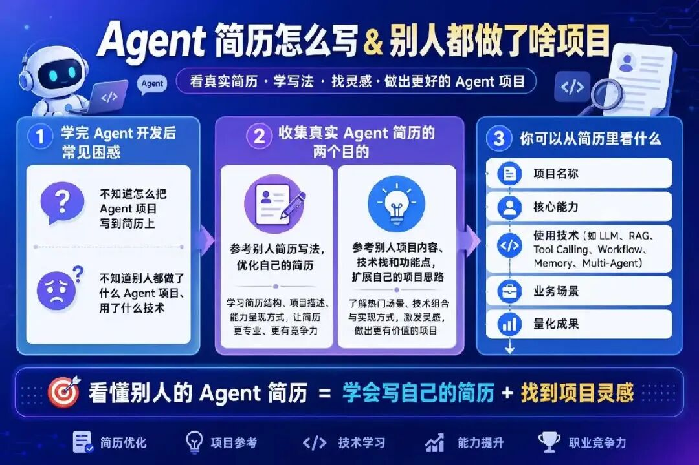

---

## 第一份：医学知识图谱 Agent 问诊系统

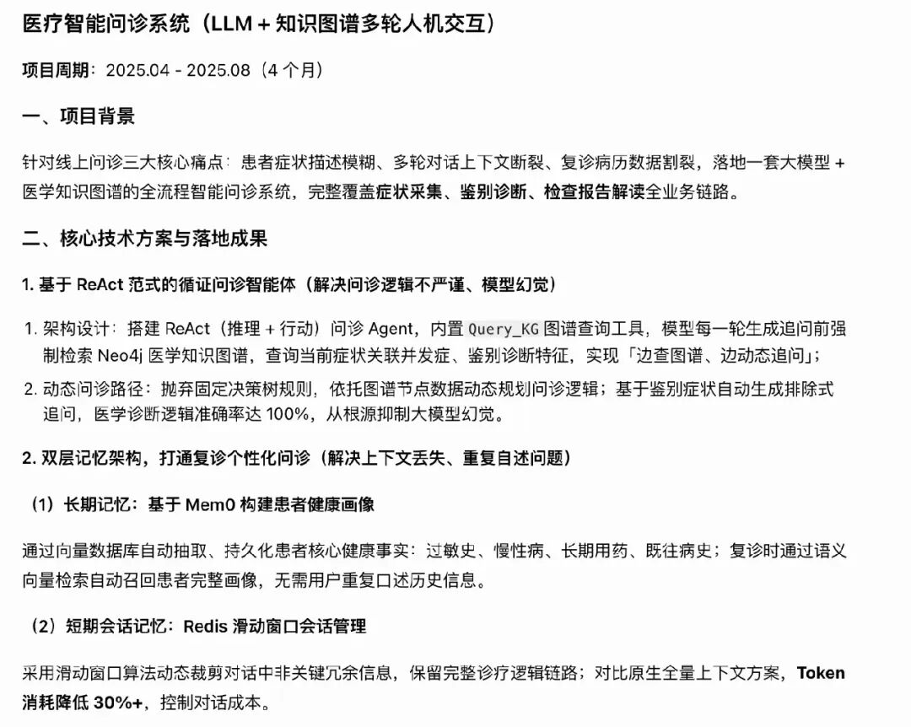

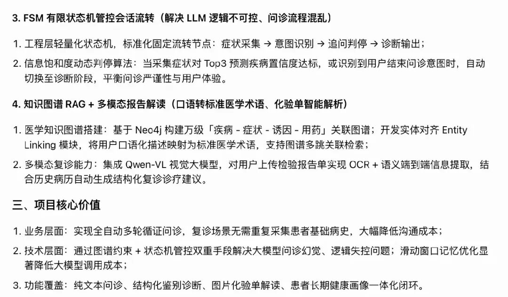

### 项目亮点

| 技术点 | 说明 |
|--------|------|
| **医学知识图谱** | 用 Neo4j 对医学实体、关联关系结构化建模 |
| **问诊推理** | 不再单纯依赖大模型参数内知识，结合知识图谱推理 |
| **短期记忆** | Redis 实现短期记忆 |
| **长期记忆** | Mem0 实现长期记忆 |
| **多模态** | 视觉大模型做检验报告的信息提取 |

**适合参考**：知识图谱类项目、医疗领域 Agent、多模态信息提取。

---

## 第二份：企业级知识库 RAG 系统

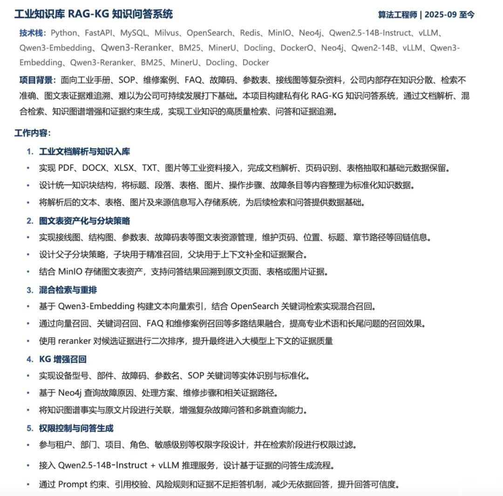

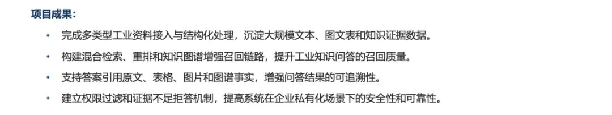

### 项目亮点

| 技术点 | 说明 |
|--------|------|
| **混合检索** | 向量 + 关键词的混合检索 RAG |
| **重排序** | Reranker 重排提升检索精度 |
| **知识图谱检索** | KG 知识图谱检索补充 |
| **权限控制** | 检索资料时过滤掉没有权限的文档 |

**适合参考**：知识库项目简历、企业级 RAG 系统、权限控制。

---

## 第三份：意图识别 + 多 Agent 客服

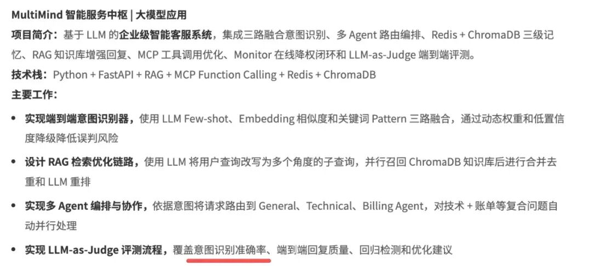

### 项目亮点

| 技术点 | 说明 |
|--------|------|
| **精细意图识别** | 案例库 + 向量 + 关键词检索相关案例，Few-Shot 给 LLM 做意图识别 |
| **RAG 优化** | 查询改写、重排 |
| **多 Agent 拆分** | 按业务场景拆分多个子 Agent |
| **评测体系** | 意图识别准确率、端到端回复质量等可评测指标 |

**简历加分项**：评测部分写得不错，前面两个简历都没这点。大家写简历也可以加上评测这部分。

---

## 第四份：多 Agent + Agentic RAG

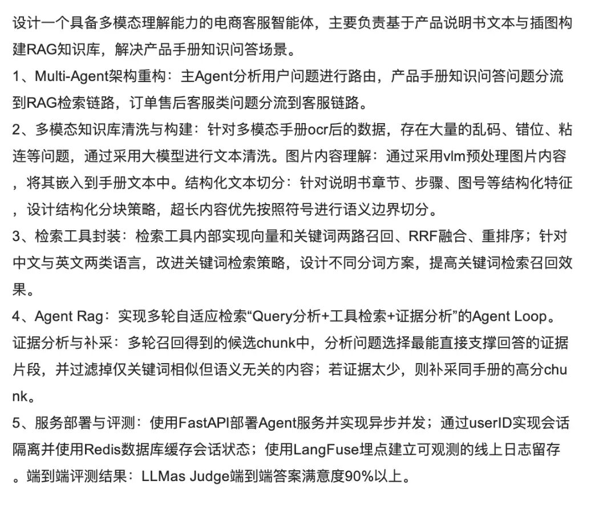

### 项目亮点

| 技术点 | 说明 |
|--------|------|
| **多 Agent 架构** | 主 Agent 路由，两个子 Agent 分别做知识问答、订单售后客服 |
| **混合检索** | 向量 + 关键词 + 重排 |
| **Agentic RAG** | 让 LLM 参与检索过程，决定怎么检索、检索信息是否够、要不要重新检索 |
| **评测系统** | LangFuse 跑评测，LLM as Judge 让大模型评测打分 |

**简历建议**：整体比较完整，但格式上不如前面几个清晰，如果能高亮、加粗每一条的前面部分会更好。

---

## 第五份：Agentic RAG + 大模型微调

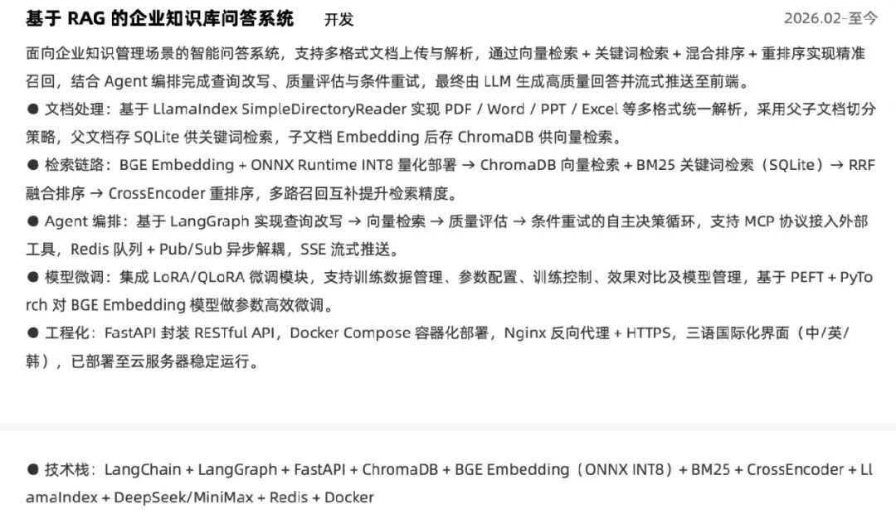

### 项目亮点

| 技术点 | 说明 |
|--------|------|
| **混合检索** | 向量 + BM25 关键词 + RRF 融合 + Reranker 重排序 |
| **Agentic RAG** | 查询改写 → 向量检索 → 质量评估 → 条件重试的自主决策循环 |
| **自主决策** | 让 LLM 参与检索过程，也就是 Agentic RAG |
| **大模型微调** | 针对特定场景微调大模型（一般不是 Agent 开发来做的，了解即可） |

---

## 第六份：意图分类微调项目

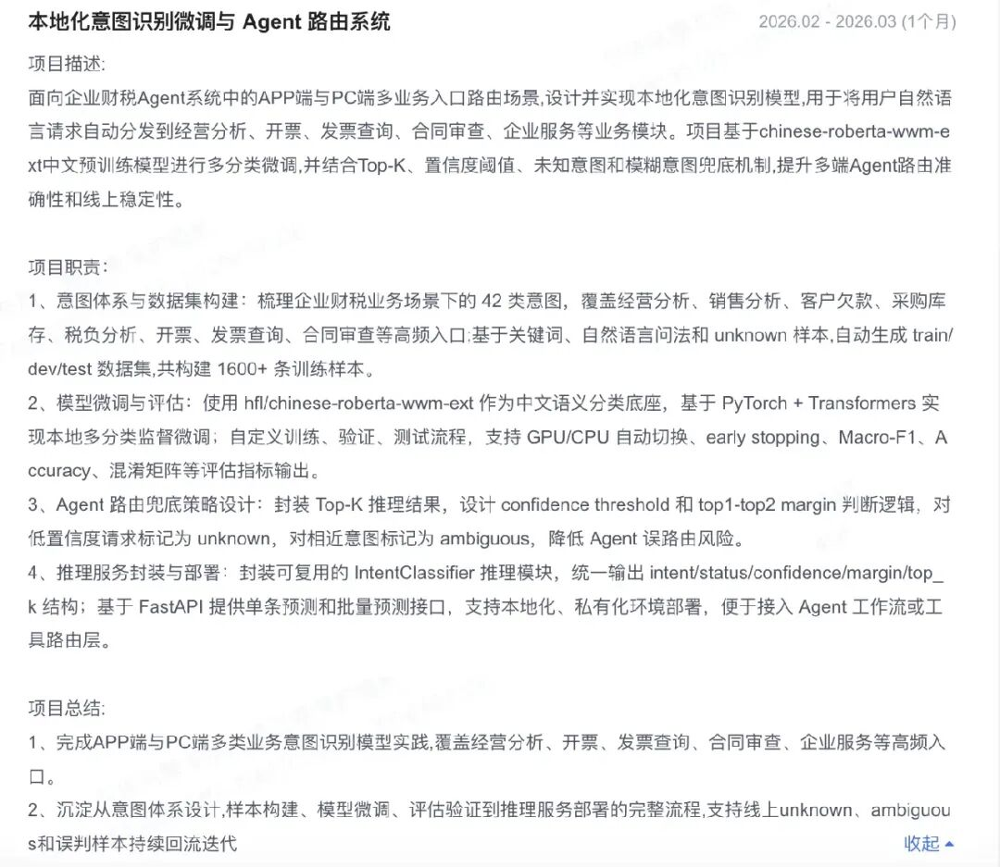

### 项目亮点

| 技术点 | 说明 |
|--------|------|
| **意图分类** | 意图分类比较多，专门微调了一个大模型来做意图识别 |
| **微调方法** | 针对特定任务微调大模型提升准确率 |

**扩展思路**：一般的意图识别用不到微调，写好 Prompt，用 Few-Shot 加一些参考案例就可以了。如果面试问意图识别还可以怎么优化，可以说微调一个专门用来做意图识别的大模型。

---

## 第七份：Text-to-SQL + 知识图谱

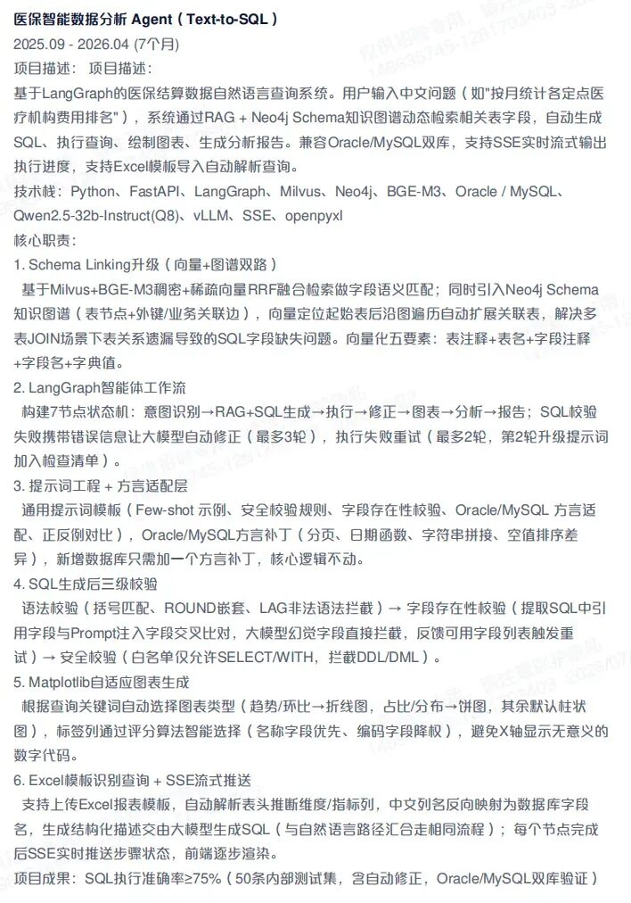

### 项目亮点

| 技术点 | 说明 |
|--------|------|
| **Text-to-SQL** | 自然语言转 SQL 查询 |
| **知识图谱存表关系** | 通过 Neo4j 存储表和表的关联关系 |
| **向量检索起始表** | 通过向量检索找到起始表 |
| **知识图谱查关联表** | 通过知识图谱查询关联表 |
| **生成 SQL** | 基于表信息生成 SQL |

**技术方案亮点**：这个技术方案不错，做类似项目可以参考。但简历写的太细了，看起来比较累，简历还是简洁清晰一点好，突出重点亮点。

---

## 第八份：多 Agent 新闻视频生成

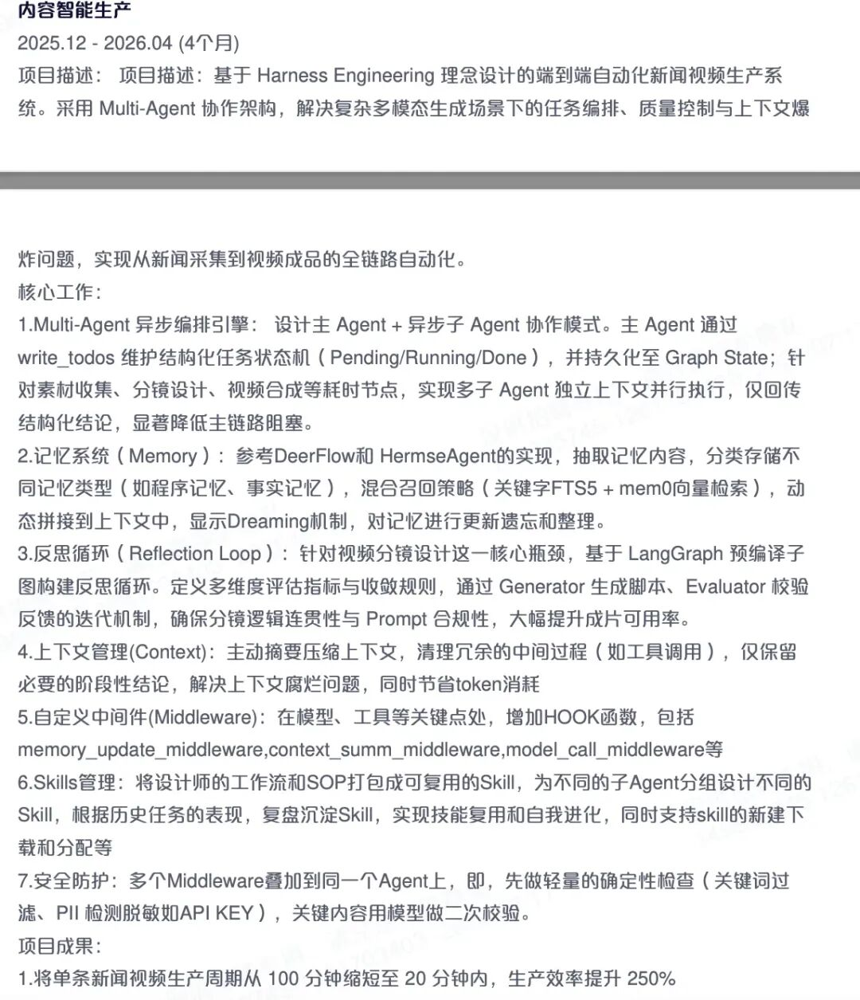

### 项目亮点

| 技术点 | 说明 |
|--------|------|
| **多 Agent 协作** | 生产新闻视频的多 Agent 项目 |
| **长期记忆** | Mem0 做长期记忆 |
| **反思循环** | Evaluator 节点校验反馈，之后回到 Generator 节点重新生成 |
| **自定义中间件** | 自定义中间件扩展功能 |
| **Skill 机制** | 封装某些提示词为单独的 skill |

**Skill 机制说明**：如果用了 DeepAgents 框架，自带了 Skill 机制，也可以通过 skill 的方式来封装某些提示词为单独的 skill。中间件、skill 这些，如果项目中用到，也可以写到简历上。

---

## 第九份：多 Agent 客服 + Human in the Loop

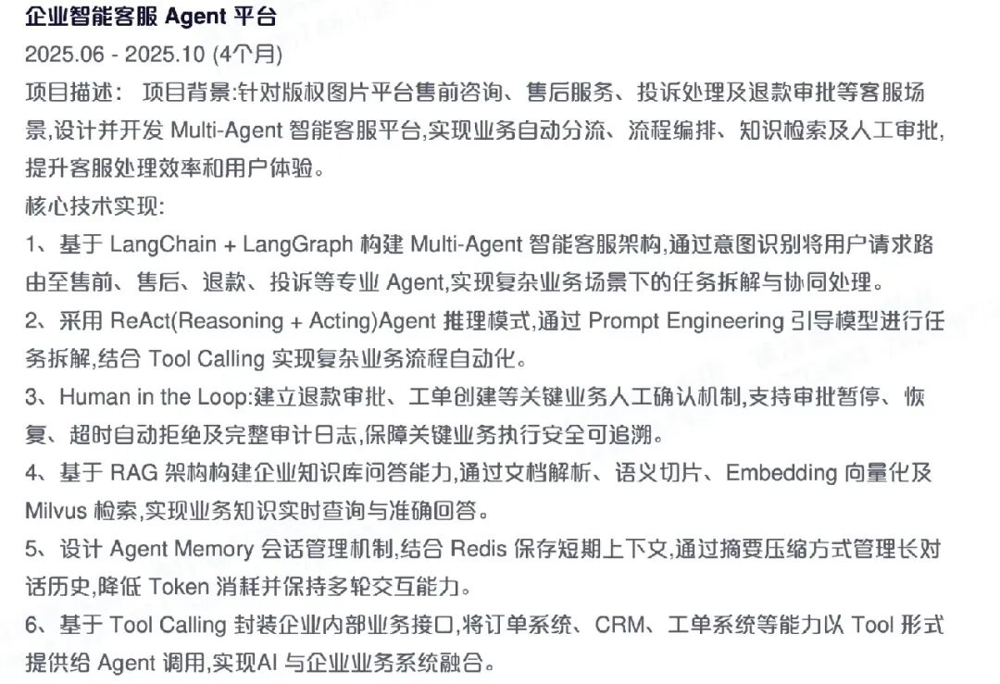

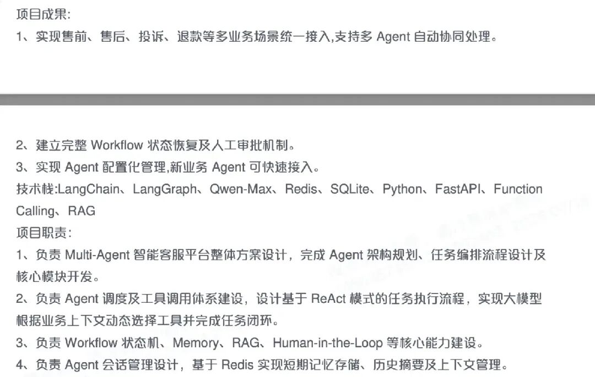

### 项目亮点

| 技术点 | 说明 |
|--------|------|
| **多 Agent 客服** | 主 Agent 做意图识别，子 Agent 分别做售前、售后、退款、投诉等 |
| **Human in the Loop** | 需要人工介入的时候（退款审批、工单创建），人工做决定，之后继续流程 |
| **业务系统整合** | 把订单系统、CRM、工单系统等封装为 tool call 来整合 |
| **短期记忆** | Redis + 摘要压缩 |

### Human in the Loop 实现

LangGraph 自带 Human in the Loop 机制：

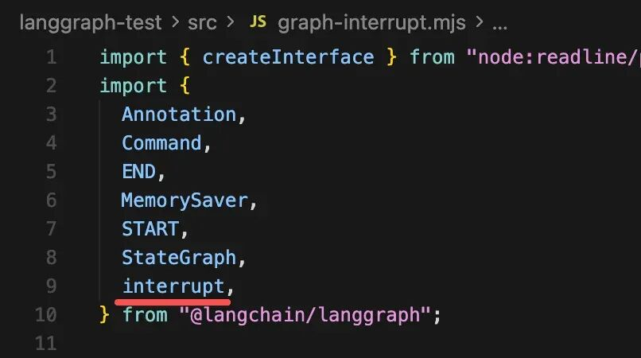

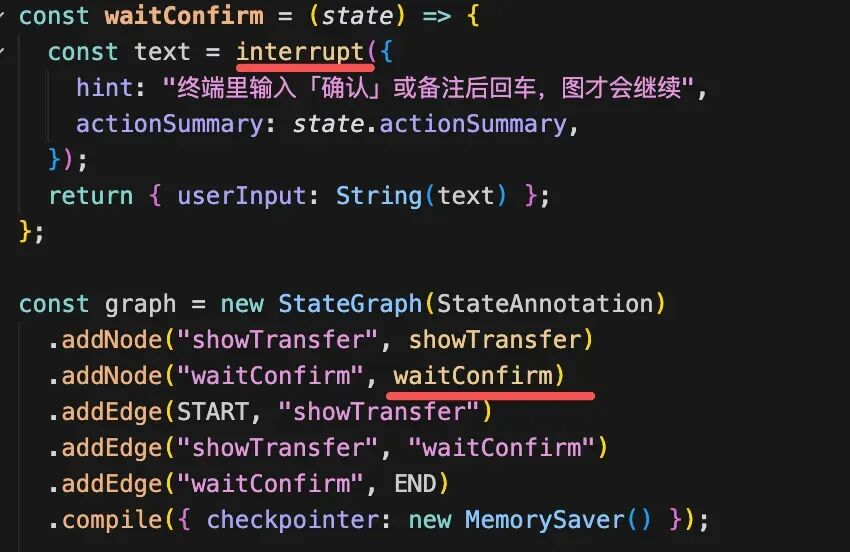

在 LangGraph 的节点里用 `interrupt` 就会中断，然后当人工介入完成，用 `resume` 的 Command 再次调用 graph 就可以继续流程：

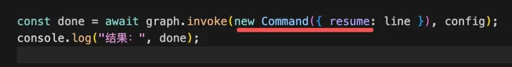

### Workflow vs Agent

| 概念 | 说明 |
|------|------|
| **Workflow** | 人提前定义好固定步骤 |
| **Agent** | LLM 自主动态决定下一步做什么 |

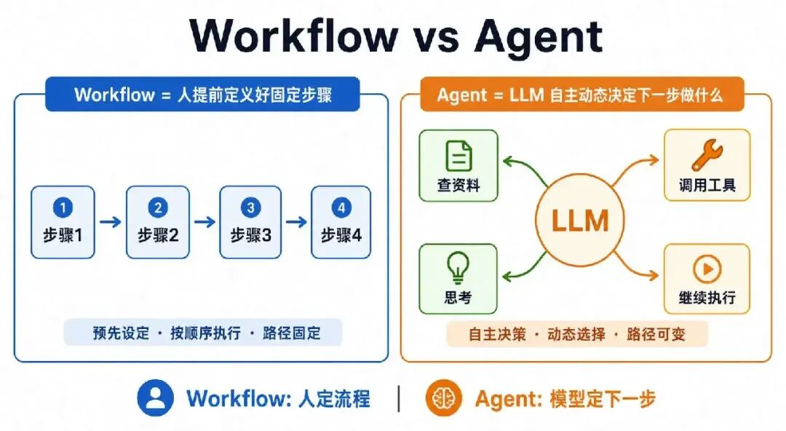

---

## 第十份：跨模态知识库 RAG

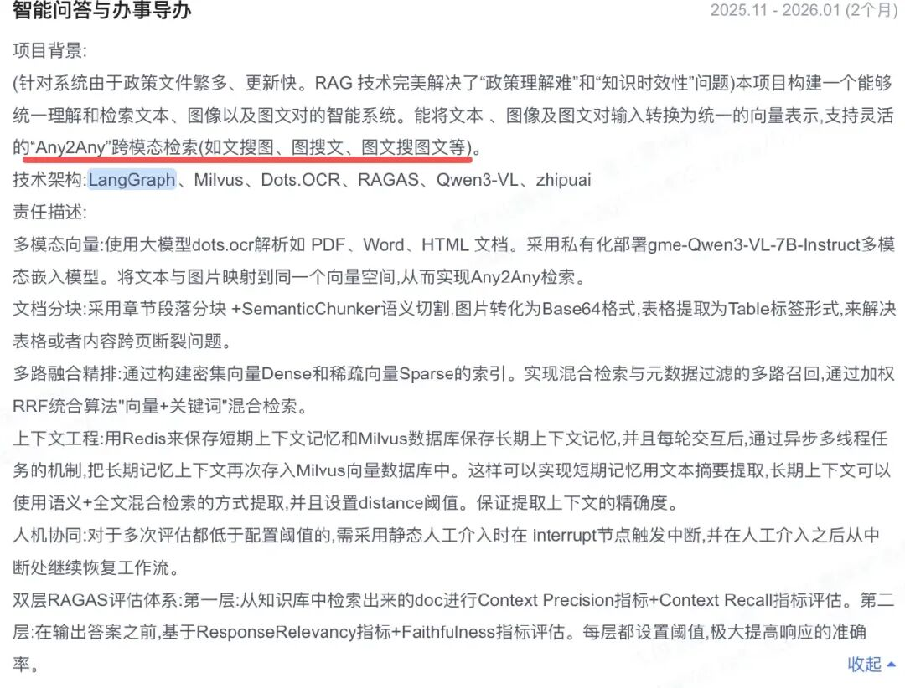

### 项目亮点

| 技术点 | 说明 |
|--------|------|
| **跨模态检索** | Any2Any，文本、图片都能检索 |
| **多模态嵌入** | 用多模态嵌入模型把文本、图片都存到同一个向量空间 |
| **混合检索** | 向量 + 关键词的混合检索 |
| **短期记忆** | Redis 做短期记忆 |
| **长期记忆** | Milvus 做长期记忆，关键词 + 语义混合召回 |
| **Agent 评测** | 召回率、准确率等指标 |

**跨模态实现说明**：不是图片识别转文字然后做文字语义检索，而是用多模态嵌入模型把文本、图片都映射到同一个向量空间，实现真正的跨模态检索。

---

## 简历写作要点总结

### 10份简历覆盖的项目类型

| 项目类型 | 份数 | 代表技术 |
|----------|------|----------|
| **知识库 RAG** | 4份 | 混合检索、Reranker、Agentic RAG、权限控制 |
| **多 Agent 系统** | 3份 | 主从 Agent、意图识别、Human in the Loop |
| **知识图谱** | 2份 | Neo4j 实体关系建模、推理式检索 |
| **Text-to-SQL** | 1份 | 知识图谱存表关系、向量检索起始表 |
| **多模态** | 2份 | 视觉大模型提取、跨模态嵌入检索 |
| **记忆系统** | 4份 | Redis 短期记忆、Mem0/Milvus 长期记忆 |
| **评测系统** | 3份 | LangFuse、LLM as Judge、召回率准确率 |

### 简历加分项

| 加分项 | 说明 |
|--------|------|
| **混合检索** | 向量 + 关键词 + Reranker，是知识库项目标配 |
| **Agentic RAG** | LLM 自主决策检索过程，比普通 RAG 更高级 |
| **知识图谱** | Neo4j 做推理式检索，技术含量高 |
| **多 Agent 协作** | 主从 Agent、意图路由，体现系统设计能力 |
| **Human in the Loop** | 人工介入机制，生产级项目必备 |
| **记忆系统** | Redis 短期 + Mem0 长期，体现 Agent 完整能力 |
| **评测体系** | 召回率、准确率、LLM as Judge，体现工程严谨性 |
| **权限控制** | 企业级项目必备，体现生产意识 |
| **业务系统整合** | Tool call 封装订单/CRM/工单系统，体现落地能力 |

### 简历避坑指南

| 避坑点 | 说明 |
|--------|------|
| **不要写太细** | 简历简洁清晰，突出重点亮点，不要堆砌细节 |
| **格式要清晰** | 高亮、加粗每一条的前面部分，让 HR 一眼看到亮点 |
| **要有量化指标** | 不要只说"做了XX"，要说"提升了XX%"、"准确率XX%" |
| **技术栈要匹配** | 写的技术要和岗位要求匹配，不要写不相关的 |
| **项目要有深度** | 不要只写"用了XX框架"，要写解决了什么问题、怎么优化的 |

---

## 学习要点

1. **知识库 RAG 是简历最常见项目**，但也很加分：混合检索（向量+关键词+Reranker）、Agentic RAG、权限控制都是亮点
2. **知识图谱（Neo4j）**能提升技术含量：实体关系建模、推理式检索、Text-to-SQL 表关系存储
3. **多 Agent 系统**体现系统设计能力：主从 Agent 路由、意图识别、Human in the Loop 人工介入
4. **记忆系统**是 Agent 完整能力的体现：Redis 短期记忆、Mem0/Milvus 长期记忆
5. **评测体系**是简历加分项：召回率、准确率、LLM as Judge、LangFuse 观测
6. **Agentic RAG**比普通 RAG 更高级：让 LLM 参与检索决策（查询改写、质量评估、条件重试）
7. **业务系统整合**体现落地能力：把订单/CRM/工单系统封装为 Tool call
8. **跨模态检索**是新兴方向：多模态嵌入模型把文本图片映射到同一向量空间
9. **简历要简洁清晰**：突出重点亮点，量化指标，格式清晰，不要写太细
10. **参考别人简历**：看别人做了啥项目、用了啥技术，扩展自己的思路和学习方向

## 扩展方向

- 学习如何写好技术简历（STAR 法则、量化指标、关键词匹配）
- 探索 Agent 项目的更多业务场景（金融、法律、教育、医疗）
- 学习 Agent 系统设计（多 Agent 协作、任务分解、冲突解决）
- 探索 RAG 高级技术（HyDE、Query2Doc、Self-RAG、Corrective RAG）
- 学习知识图谱构建（实体抽取、关系抽取、图谱融合、图谱推理）
- 探索多模态 Agent（图文理解、视频理解、语音交互）
- 学习 Agent 评测方法（人工评测、自动评测、LLM as Judge、A/B 测试）
- 探索 Agent 安全与对齐（Prompt 注入防护、输出审核、价值观对齐）
- 学习 Agent 部署与运维（Docker、K8s、监控告警、灰度发布）
- 探索 Agent 产品化（用户体验、交互设计、产品迭代、用户反馈）

---

## 配套代码库

**代码库地址**：https://github.com/iiixiyan/agent-learning-code/tree/main/05-resume-interview/44-agent-resume-reference

包含本文提到的各类 Agent 项目的代码示例（知识库 RAG、多 Agent、知识图谱、记忆系统、评测系统）。

---

**上一篇**：[大模型训练推理全流程](../04-第四阶段-存储消息与监控/43_大模型训练推理全流程.md) | **下一篇**：[真实 Agent 简历参考库（二）](./45_真实Agent简历参考库(二).md)
