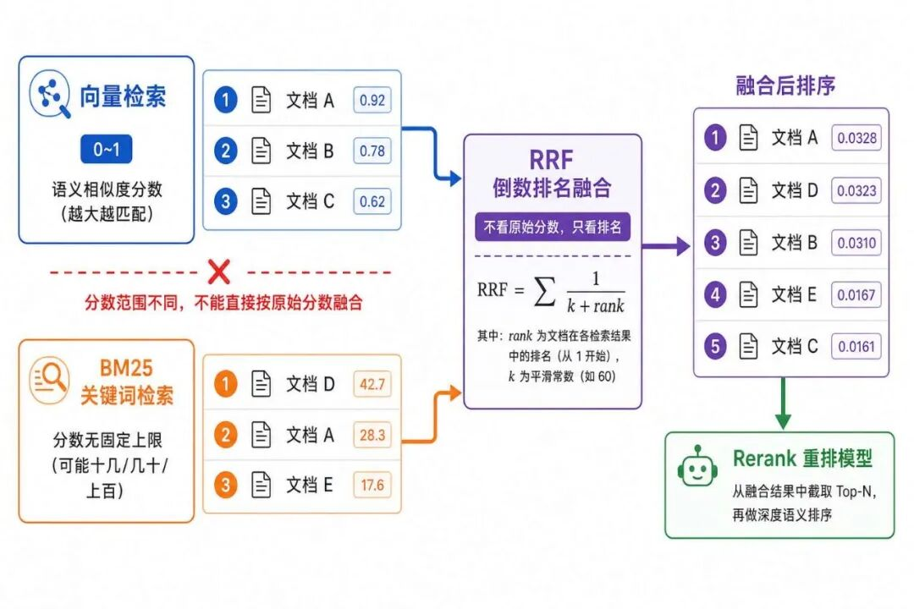
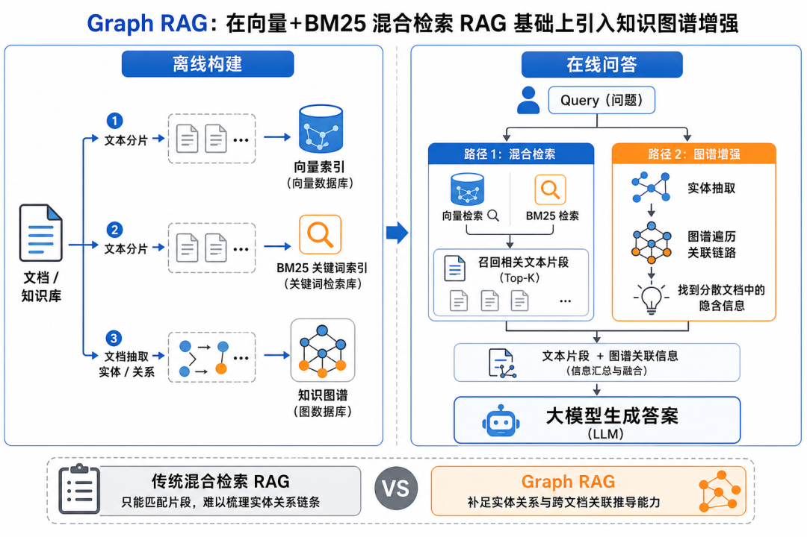
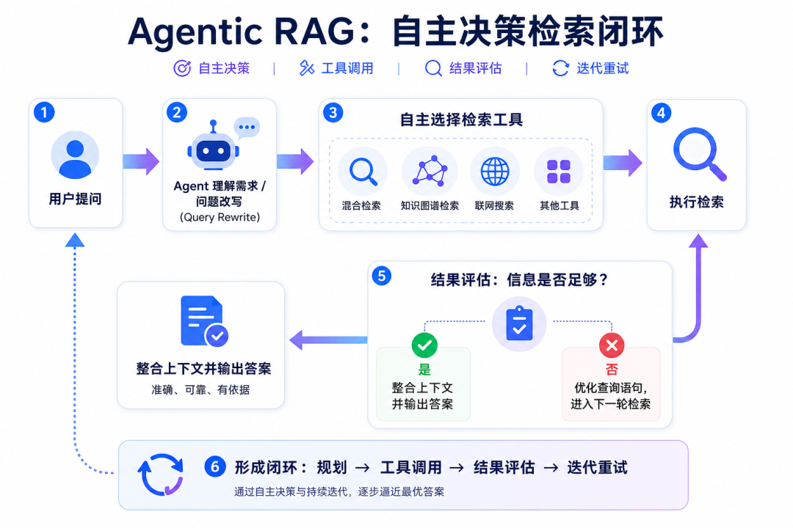
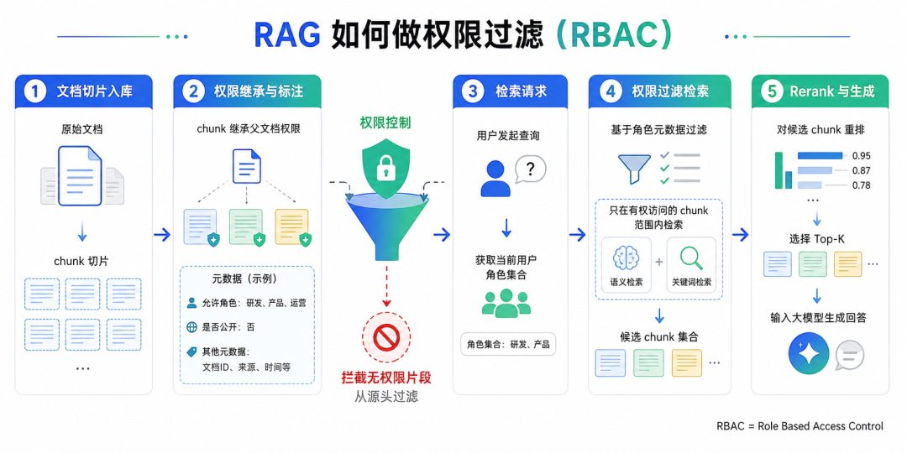
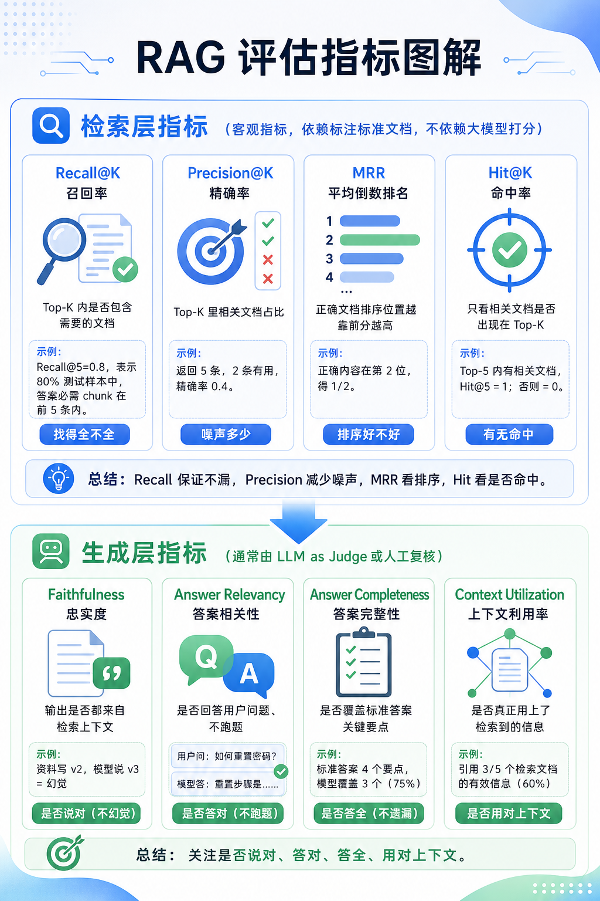
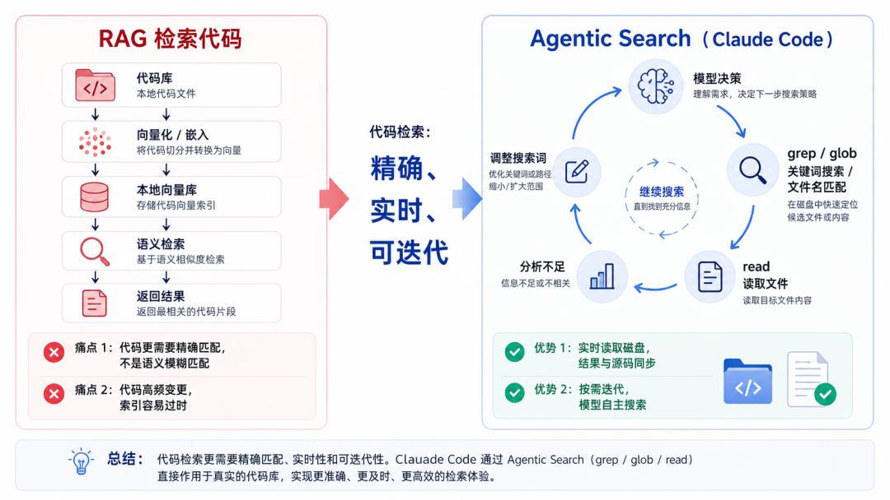

# Agent 面试题押题精讲：RAG 篇

> **Python 版** | 9道 RAG 高频面试题 + 思路解析 + 参考回答
> 前置知识：[RAG 检索增强生成](../01-第一阶段-Agent基础入门/11_RAG检索增强生成.md)、[混合检索 RAG](../03-第三阶段-检索增强与知识图谱/29_混合检索RAG.md)

---

## 为什么要准备 RAG 面试题？

RAG 相关面试题是 Agent 面试**必问**的，需要重点准备一下。

很多都是学员去面试真实遇到的。大家可以先自己想一下怎么答，然后看一下思路解析和参考回答，形成自己的答题思路。这样面试遇到类似问题就能比较完整流畅的回答了。

---

## 面试题 1：说一下 RAG 的流程

### 答题思路

RAG 分为两个阶段：**离线知识库构建阶段**、**在线问答阶段**。

### 参考回答

**知识库构建阶段**：
1. 对各种格式的文档做解析、清洗、分块
2. 分块后用嵌入模型生成向量，存入向量数据库，用于语义检索
3. 构建 BM25 倒排索引，存入全文检索数据库，用于关键词检索

**在线问答阶段**：
1. 对用户问题做 Query 改写，换成更适合检索的表达
2. 做**混合检索**：
   - 向量检索根据语义匹配相似内容
   - 关键词检索根据具体术语、专有名词去精确匹配内容
3. 两路检索完成后，做去重、用 RRF 算法对结果做合并排序
4. 用 Rerank 重排模型筛选和问题最相关的文档片段
5. 把筛选后的文档片段放入 Prompt，交给大模型生成回答

这就是混合检索 RAG 的流程。

### 补充说明：去重

多路召回会出现同一个文本块同时被向量检索和 BM25 检索命中的情况，产生重复数据。我们基于 Chunk 唯一 ID 完成去重，但这要求：**同一个文本块存入向量库、全文检索库时，绑定相同的 chunk_id**。

---

## 面试题 2：什么是 RRF 算法？

### 答题思路

先讲为什么需要 RRF（分数范围不同），再讲 RRF 的原理（倒数排名融合），最后讲为什么需要粗融合。

### 参考回答

向量检索的相似度分数，区间一般 0~1，数值越大语义越匹配。BM25 关键词检索得分没有固定上限，可能是十几、几十甚至上百。二者分数取值范围不同，所以多路召回的两个结果列表不能直接融合。

**RRF（Reciprocal Rank Fusion）全称倒数排名融合**，它不看原始分数，只根据文本块在结果列表中的排名计算融合分值。可以有效融合向量语义检索、BM25 关键词检索两路结果。之后再从融合后的列表截取前面部分，用 Rerank 重排模型做深度语义排序。

### 追问：后续都会经过 Rerank 精排，为什么还需要先用 RRF 做粗融合？

举个例子：向量召回 100 条、BM25 召回 100 条。先基于 chunk_id 完成去重，再使用 RRF 重新排序。从融合后的候选列表截取 Top50，送入 Rerank 重排模型。

**原因**：双路召回的结果会很多，用 RRF 粗融合之后，再从列表里截取一部分来精排，可以减少 Rerank 的计算量，提升效率。

---

## 面试题 3：你知道 Graph RAG 么？

### 答题思路

先讲 Graph RAG 是什么（在混合检索基础上引入知识图谱），再讲离线和在线两个阶段的流程，最后讲解决了什么问题。

### 参考回答

Graph RAG 是在向量 + 关键词混合检索 RAG 的基础上，**引入知识图谱进行能力增强**。

向量检索、BM25 关键词检索仅针对文本块做匹配，缺少实体之间的关联链路，难以推导出分散文档里的间接关联。

**离线构建阶段**：Graph RAG 从文档中抽取实体、关系搭建知识图谱，同时对文本分片，构建向量索引与 BM25 索引。

**在线问答阶段**：
1. 一方面通过混合检索召回相关文本片段
2. 另一方面提取 Query 内的实体，在图谱中遍历关联链路，找到分散在不同文档里的隐含信息
3. 把图谱关联信息和检索得到的文本内容整合在一起，交给大模型生成答案

**解决的问题**：传统混合检索 RAG 只能匹配片段，无法梳理实体关系链条。Graph RAG 可以发现分散在不同文档里的隐含关联。

---

## 面试题 4：什么是 Agentic RAG？

### 答题思路

先讲 Agentic RAG 的核心（大模型自主决策怎么检索），再讲具体流程（规划→工具调用→结果评估→迭代重试），最后讲和普通 RAG 的区别。

### 参考回答

Agentic RAG 是**引入大模型来自主决策怎么检索**。

把混合检索、知识图谱检索、联网搜索等各类检索能力封装为工具。收到用户提问后：
1. Agent 会理解需求，完成 Query 改写，自主选择调用哪种检索工具
2. 拿到检索结果之后，Agent 会校验现有信息是否能够充分解答问题
3. 如果信息不足，它会优化查询语句，发起新一轮检索
4. 形成**规划、工具调用、结果评估、迭代重试**的闭环
5. 直到搜集到充足信息，再整合上下文输出答案

**和普通 RAG 的区别**：普通 RAG 是固定流程（检索→生成），Agentic RAG 是大模型自主决策检索过程，可以多轮迭代检索，信息更充分。

---

## 面试题 5：你知道父子分块策略么？

### 答题思路

先讲父子分块是什么（父块大、子块小），再讲怎么关联（parent_id），然后讲各自的作用（子块检索、父块生成），最后讲好处。

### 参考回答

父子分块策略，是**先将长文档切分为粒度较大的父块，再在父块内部进一步切分出更小的子块**。

- 子块做向量化，存在向量数据库
- 父块不做向量化，存在其他数据库（如 PostgreSQL）
- 子块通过 parent_id 和对应父块建立关联

**各自的作用**：
- 子块负责向量检索，保障召回的精准度
- 检索命中子块后，再通过关联关系取出完整父块，把父块作为上下文交给大模型做生成

**本质**：把检索用的分块和生成用的分块进行解耦，子块做检索，父块做生成。

**好处**：
1. 既能发挥小分块检索精准的优势
2. 又解决了子块内容碎片化、上下文不全的问题
3. 同时规避大分块直接向量化造成的召回噪声
4. 让大模型获取完整连贯的上下文，有效缓解幻觉，提升回答的完整度与准确性

### 补充说明：召回噪声

长文档直接向量化，会导致召回不够精准，容易把无关的文档召回，这就是**召回噪声**，它属于检索阶段的概念。

用子块做检索可以缓解这类召回噪声，让检索更精准，定位到真正相关的父块；之后再取出完整父块上下文交给大模型做生成。

---

## 面试题 6：如何降低大模型的幻觉？

### 答题思路

从 4 个层面回答：知识层、提示词层、模型层、校验层。每个层面讲 2-3 个具体方法。

### 参考回答

降低大模型幻觉可以从**知识层、提示词层、模型层、校验层** 4 个层面处理：

**知识层**：
- 接入 RAG 检索机制，保障知识库原始数据准确，合理划分 Chunk
- 采用向量检索 + 关键词混合检索，兼顾语义匹配与关键词精准匹配
- 用 Rerank 重排模型，过滤相关度低的文档片段
- 设置相似度阈值，阻止低相似度片段进入上下文
- 引入 Agentic RAG 自主评估检索结果，信息不足时迭代补充检索

**提示词层**：
- 通过 Prompt 强约束模型，仅依据给定上下文生成答案，要求答案标注原文引用
- 开启拒答机制，无匹配信息时如实回复，禁止模型编造内容

**模型层**：
- 选用事实性、稳定性表现更优的大模型
- 面向垂直领域，可使用高质量业务数据进行微调，让模型更倾向依据外部资料作答

**校验层**：
- 调用大模型对输出结果做二次事实核查，比对原始上下文
- 识别出无依据、前后矛盾的内容，进行拦截、修正，减少错误输出

---

## 面试题 7：RAG 如何做权限过滤？

### 答题思路

先讲用什么模型（RBAC），再讲入库时怎么存权限（元数据），然后讲检索时怎么过滤（角色筛选），最后讲流程。

### 参考回答

我们项目基于 **RBAC 模型**做检索权限控制。

**文档切片入库时**：chunk 会继承父文档的权限配置，将允许访问的角色、是否公开等权限信息作为元数据，同步存入向量数据库与全文检索库。

**用户检索时**：
1. 先获取当前用户的角色集合
2. 基于角色元数据做筛选，只在该用户有权访问的切片范围内执行语义与关键词匹配
3. 从源头拦截无权限的文档片段
4. 之后再做 Rerank 重排，选出 Top-K 相关 chunk 交给大模型生成回答

**关键点**：权限过滤在检索阶段就完成，从源头拦截无权限内容，而不是检索后再过滤（那样会泄露无权限文档的存在）。

---

## 面试题 8：如何评估 RAG 的效果？

### 答题思路

先讲要搭建测试数据集，再讲两个维度（检索层、生成层），每个维度讲指标和含义。

### 参考回答

评估 RAG 效果，一般会拆成**检索层、生成层**两个维度。

首先，要搭建一套贴近真实业务的测试数据集，覆盖高频问题、边界 case、易混淆的问题等。每个问题都要提前标注好标准答案、应该命中的文档以及核心 chunk 片段，作为后续评测的依据。

**检索层**主要看两点：
1. 有效信息能否成功召回
2. 召回的有效信息排序是否合理

对应的量化指标：**Recall@K、Hit@K、MRR、Precision@K** 等。

**生成层**也主要看两点：
1. 忠实度，保证回答不瞎编、全部有据可依
2. 答案相关性、完整性，对标标准答案，校验回答是否答得准、答得全

对应的指标：**Faithfulness、Answer Relevancy、Answer Completeness、Context Utilization** 等。

整体来看，检索层侧重信息的充分召回与合理排序，生成层侧重回答的答案准确、避免幻觉，二者共同构成完整的 RAG 效果评估体系。

### 检索层指标详解

| 指标 | 说明 | 示例 |
|------|------|------|
| **Recall@K 召回率** | Top-K 内是否包含需要的文档，衡量找得全不全 | Recall@5=0.8，80% 的测试样本中必需的 chunk 落在前 5 条 |
| **Precision@K 精确率** | Top-K 里相关文档占比，衡量噪声多少 | 返回 5 条，只有 2 条有用，精确率 0.4 |
| **MRR** | 衡量正确文档排序位置，越靠前分越高 | 正确内容排第 2 位，打 1/2 分 |
| **Hit@K** | 相关文档只要出现在 Top-K 即命中，只看有无不看位置 | — |

**检索层这些指标依赖标注好的标准文档，是可精确计算的客观指标，不依赖大模型打分。**

### 生成层指标详解

| 指标 | 说明 | 示例 |
|------|------|------|
| **Faithfulness 忠实度** | 输出内容是否全部来源于检索上下文，识别幻觉 | 资料写 v2 支持，AI 说成 v3 支持，忠实度差 |
| **Answer Relevancy 答案相关性** | 回答是否针对用户提问，不跑题 | 用户问接口报错，模型大段讲业务背景，相关性差 |
| **Answer Completeness 答案完整性** | 是否覆盖标准答案全部关键要点 | 需要返回 3 个配置项，只说了 2 个，完整性不足 |
| **Context Utilization 上下文利用率** | 模型对检索回来的上下文信息的实际利用程度 | 检索结果已包含解决方案，模型仍输出通用套话 |

**生成层的指标一般都是 LLM as Judge 让大模型来判断打分，也可以人工复核。**

---

## 面试题 9：为什么 Claude Code 不用 RAG 检索代码，而是用 grep？

### 答题思路

先讲背景（早期试过 RAG 后来放弃了），再讲两个原因（精确匹配、代码高频变更），最后讲现在用什么（Agentic Search）。

### 参考回答

Claude Code 早期试过本地向量库 + 嵌入模型的 RAG 方案，后来放弃了，改用模型自主调用 grep、glob、read 等工具的 **Agentic Search**。

有几个原因：

**一是因为代码需要的是精确匹配，而不是语义模糊匹配**
自然语言适合向量语义检索；但代码的函数名、类名、变量名、报错字符串本身就是标识符，更适合关键词精确查找。

**二是代码库高频变更，RAG 索引很容易过时**
代码库频繁改动，RAG 要持续更新索引，滞后就会拿到已删除、重构的旧代码。grep 直接读取磁盘实时文件，结果和源码版本完全同步。

**Claude Code 现在是 Agentic Search**，让大模型自主决策检索过程：
1. 决定使用 grep 做内容关键词检索，或是 glob 做文件名匹配
2. 获取候选文件列表后，调用 read 读取目标文件完整内容
3. 如果信息不足，自动调整搜索关键词，循环迭代继续查找

---

## 面试答题技巧总结

### 答题结构

| 步骤 | 说明 | 示例 |
|------|------|------|
| **1. 先给结论** | 一句话回答问题核心 | "RAG 分为离线构建和在线问答两个阶段" |
| **2. 分点展开** | 用 2-4 个要点展开说明 | "离线阶段：解析、分块、向量化；在线阶段：改写、检索、重排、生成" |
| **3. 补充细节** | 讲具体实现、原因、好处 | "用 RRF 融合是因为向量和 BM25 分数范围不同" |
| **4. 总结升华** | 一句话总结价值 | "这样既能保证召回全面，又能保证生成准确" |

### 常见追问准备

| 问题 | 可能的追问 |
|------|-----------|
| RAG 流程 | 去重怎么做？为什么需要 RRF？Rerank 和 RRF 的区别？ |
| Graph RAG | 实体怎么抽取？图谱怎么构建？和普通 RAG 的效果对比？ |
| Agentic RAG | 怎么判断信息不足？最多迭代几轮？成本怎么控制？ |
| 父子分块 | 父块子块大小怎么选？parent_id 怎么关联？召回噪声怎么理解？ |
| 降低幻觉 | 各层方法的优先级？拒答机制怎么实现？事实核查怎么做？ |
| 权限过滤 | RBAC 具体怎么实现？元数据存在哪？向量库支持元数据过滤吗？ |
| RAG 评估 | 测试集怎么构建？标注成本高吗？LLM as Judge 靠谱吗？ |
| Claude Code | Agentic Search 的具体流程？grep 和向量检索的适用场景？ |

### 面试准备建议

1. **先理解原理，再背答案**：理解了原理，遇到变体问题也能回答
2. **形成自己的答题模板**：每个问题都用"结论→分点→细节→总结"的结构
3. **结合自己的项目**：回答时可以说"在我的项目中，我们是这样做的..."
4. **准备追问**：每个问题都想一下面试官可能追问什么
5. **多练多说**：自己对着镜子或录音回答，确保流畅自然

---

## 学习要点

1. **RAG 流程是面试必问**：离线构建（解析、分块、向量化、BM25索引）+ 在线问答（Query改写、混合检索、RRF融合、Rerank重排、生成）
2. **RRF 算法**：倒数排名融合，不看原始分数只看排名，解决向量和 BM25 分数范围不同的问题；粗融合减少 Rerank 计算量
3. **Graph RAG**：在混合检索基础上引入知识图谱，发现分散在不同文档里的隐含关联，解决普通 RAG 只能匹配片段的问题
4. **Agentic RAG**：大模型自主决策检索过程，形成规划→工具调用→结果评估→迭代重试的闭环，信息更充分
5. **父子分块**：子块做检索（精准）、父块做生成（完整），通过 parent_id 关联，解耦检索和生成分块，缓解召回噪声和上下文不全
6. **降低幻觉四层**：知识层（RAG、混合检索、Rerank、阈值、Agentic RAG）、提示词层（强约束、拒答）、模型层（选好模型、微调）、校验层（事实核查、拦截修正）
7. **权限过滤**：RBAC 模型，入库时存权限元数据，检索时基于角色筛选，从源头拦截无权限内容
8. **RAG 评估两维度**：检索层（Recall@K、Precision@K、MRR、Hit@K，客观指标）+ 生成层（Faithfulness、Answer Relevancy、Completeness、Context Utilization，LLM as Judge）
9. **Claude Code 不用 RAG**：代码需要精确匹配不是语义匹配，代码库高频变更索引易过时，改用 Agentic Search（grep+glob+read 自主决策）
10. **答题技巧**：先给结论→分点展开→补充细节→总结升华，准备追问，结合自己项目，多练多说

## 扩展方向

- 学习更多 Agent 面试题（Agent 架构、Tool 调用、Memory、多 Agent、部署运维）
- 探索 RAG 高级技术（HyDE、Query2Doc、Self-RAG、Corrective RAG、RAPTOR、ColBERT）
- 学习 RAG 评估工具（RAGAS、TruLens、DeepEval、LangFuse 评测）
- 探索向量数据库选型（Milvus、Qdrant、Weaviate、Chroma、PGVector）
- 学习 Embedding 模型选型和对比（OpenAI、BGE、GTE、E5、M3E）
- 探索 Reranker 模型（BGE-Reranker、Cohere Rerank、Jina Reranker）
- 学习知识图谱构建工具（Neo4j、GraphRAG、LightRAG、Kuzu）
- 探索 Agentic Search 和代码检索（Claude Code、Cursor、Aider、OpenHands）
- 学习 RAG 性能优化（缓存、预计算、批量检索、异步流水线）
- 探索多模态 RAG（图文检索、视频检索、跨模态嵌入）

---

## 配套代码库

**代码库地址**：https://github.com/iiixiyan/agent-learning-code/tree/main/05-resume-interview/46-rag-interview-questions

包含本文提到的 RAG 相关技术的代码示例（混合检索、RRF融合、Rerank、父子分块、Graph RAG、Agentic RAG、权限过滤、RAG评估）。

---

**上一篇**：[真实 Agent 简历参考库（二）](./45_真实Agent简历参考库(二).md) | **下一篇**：[真实 Agent 简历参考库（知识库 RAG 专场）](./47_真实Agent简历参考库(知识库RAG专场).md)
