# 企业级知识库项目：项目介绍、多模态 RAG 流程梳理

> **Python 版** | 企业级 AI 知识库项目全景介绍 + 多模态 RAG 全流程梳理
> 前置知识：[RAG 检索增强生成](../01-第一阶段-Agent基础入门/11_RAG检索增强生成.md)、[混合检索 RAG](../03-第三阶段-检索增强与知识图谱/29_混合检索RAG.md)

---

## 项目背景

AI 时代，知识库已经是非常普遍的内部基建项目了。

员工日常工作中积累了大量的业务资料、操作经验、问题解决方案和流程规范。但这些宝贵的知识资产，大多是零散保存、分散在各处的，没有统一归集。

传统资料查找效率极低，单纯手动翻找文档、或者关键词检索都十分局限，遇到问题只能反复问人、反复试错，耽误工作进度。

搭载 AI 能力的知识库，支持语义检索、AI 一键问答，看懂需求就能匹配对应资料、直接给出解决方案。极大缩短查询和答疑时间，彻底解决传统查资料繁琐低效的问题，全方位提升工作效率。

所以，搭建统一的企业知识库，是非常有必要的基础建设。

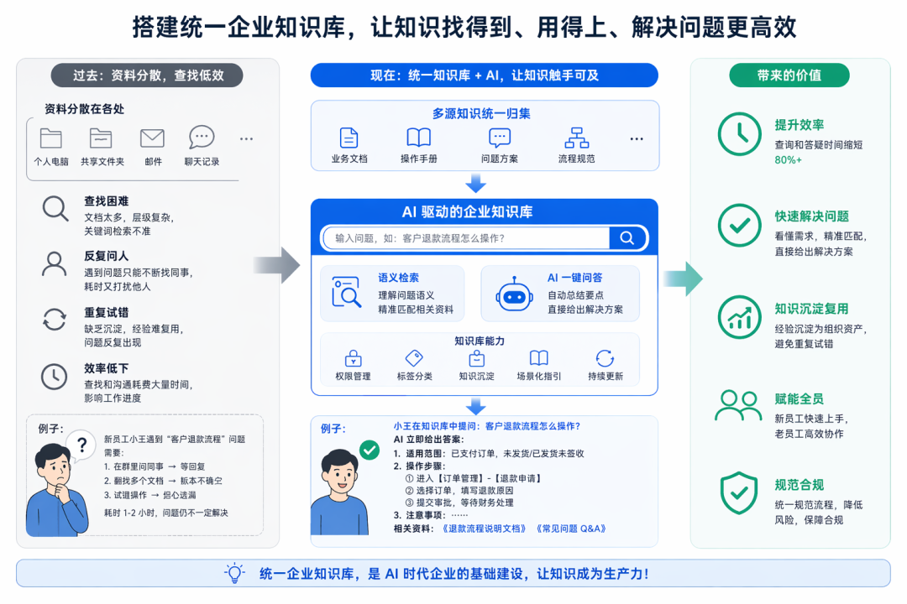

---

## 项目原型图

大概画了一下原型图：

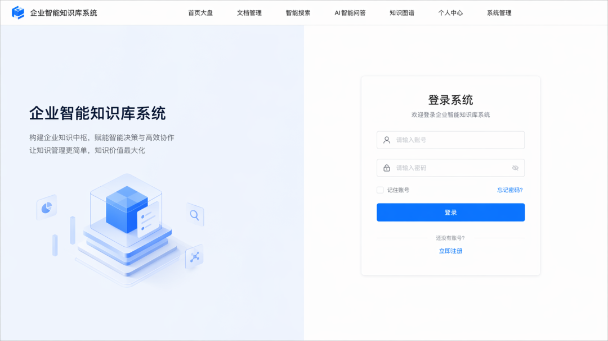

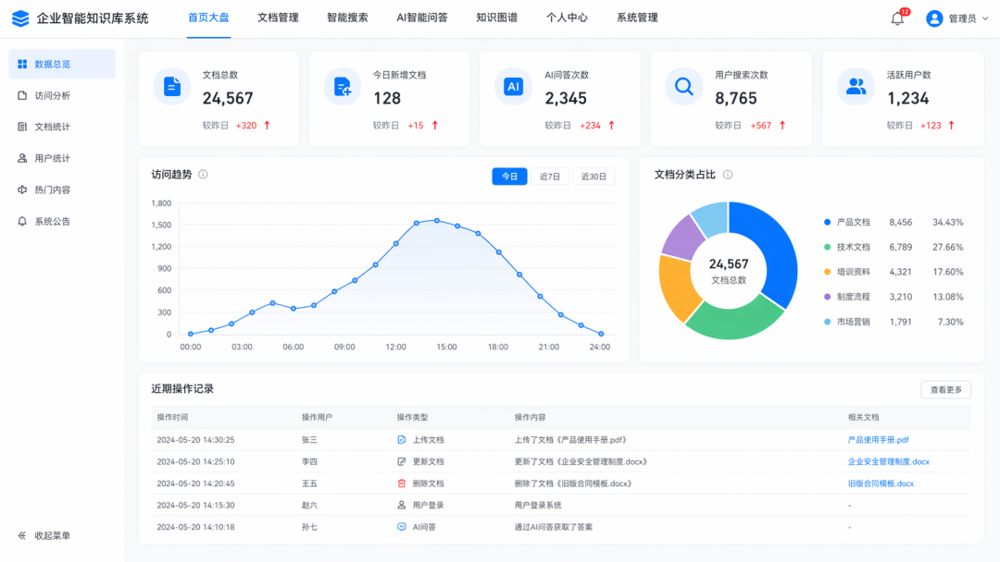

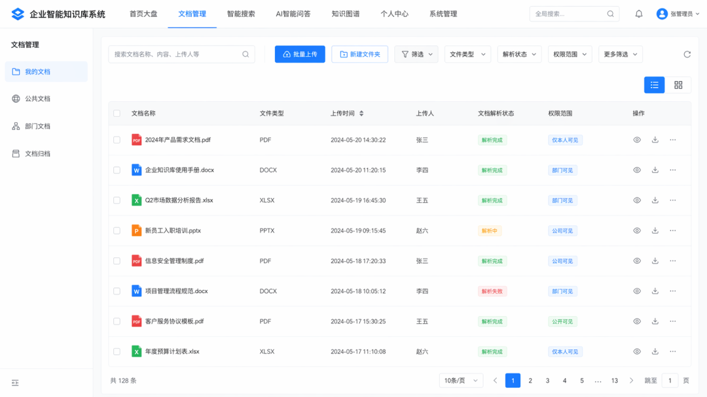

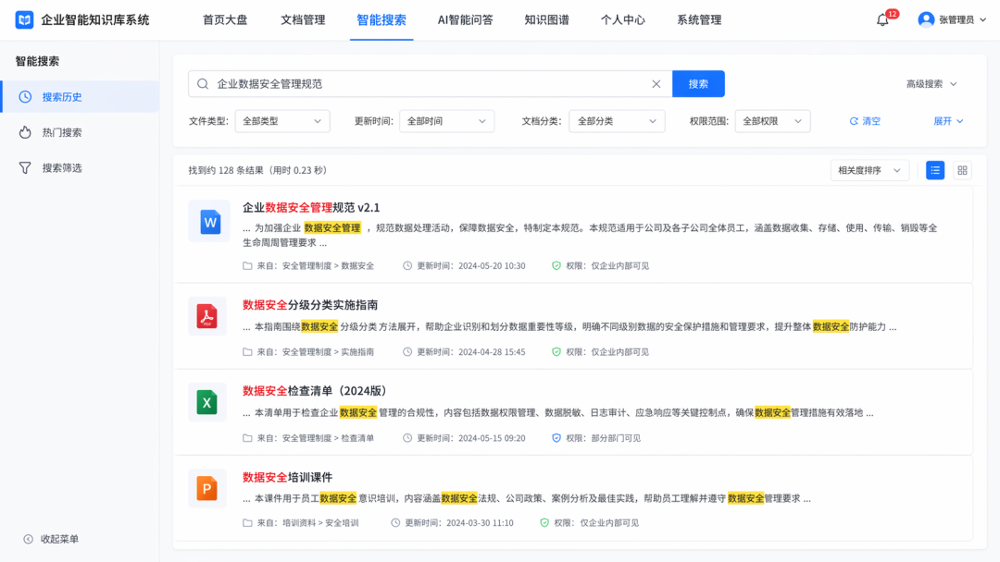

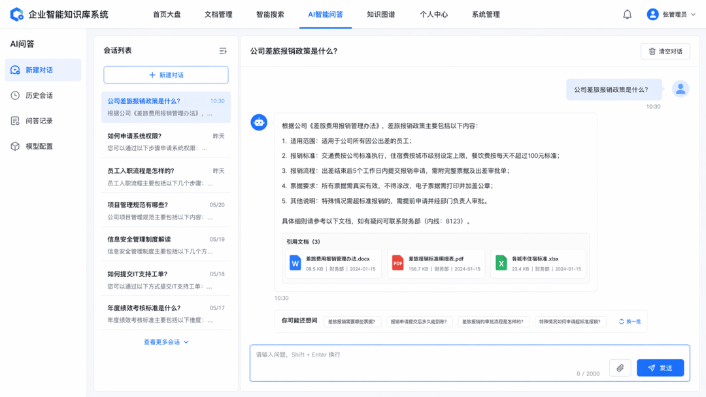

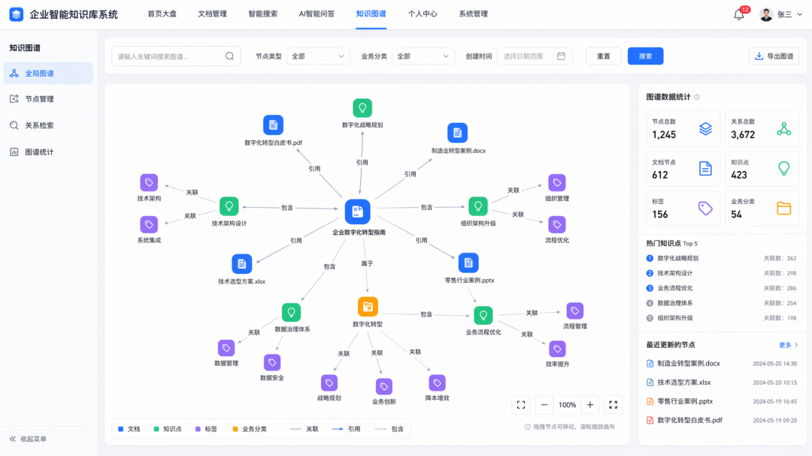

核心是**文档管理、AI 问答、知识图谱**这些。文档会做权限管理，只有有权限的文档可以检索出来用来生成回答。

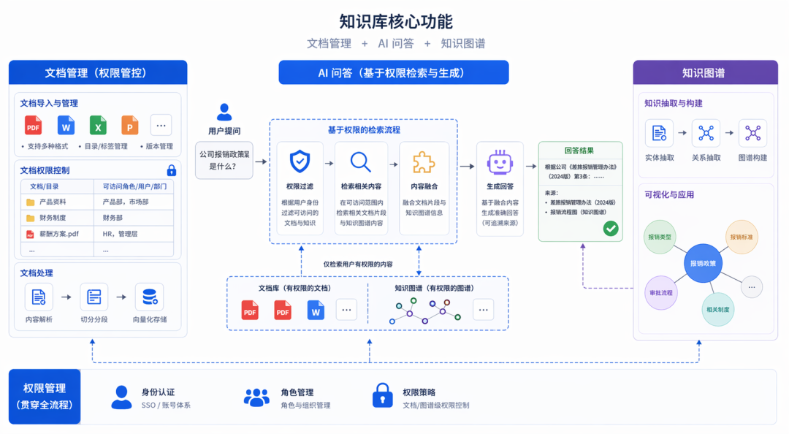

---

## 支持的文档类型

我们会支持这些类型文档的检索：

### 文本类文件

| 格式 | 说明 |
|------|------|
| **PDF、DOCX、DOC** | 文档类 |
| **XLSX、XLS、CSV** | 表格类 |
| **PPTX、PPT** | 演示文稿 |
| **TXT、MD、JSON** | 纯文本/结构化 |
| **网页 URL** | 输入网页 URL，系统自动抓取页面正文并导入知识库归档检索 |

### 图片文件（JPG、PNG）

上传后通过视觉嵌入模型提取图像特征，同时调用大模型 OCR / 图像理解生成图片描述文本。支持双向多模态检索：文字搜图片、本地上传图片以图搜图。

### 音频文件（MP3、WAV、M4A）

上传自动执行 ASR 语音转文字，将完整转录文本归档，依托文本内容参与检索。

### 视频文件（MP4）

用视频理解模型做全维度内容解析，同步提取音频文字与画面视觉信息，整合生成完整文本内容用于检索，并输出视频多模态向量，实现图文视频跨模态检索。

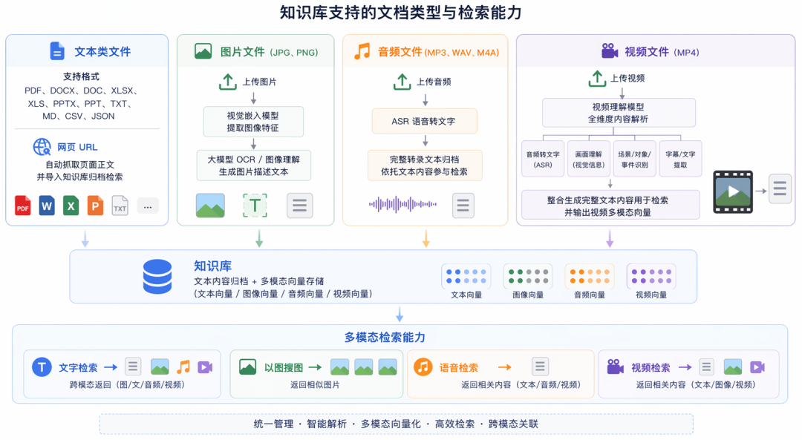

---

## 简历写法示例

学完之后，你可以在简历里加上这个项目，类似这样：

**项目描述**：
> 企业内部知识碎片化严重，跨部门资料无统一归集渠道，传统文档检索效率低下。为盘活企业各类知识资产，集中管理高效复用，因此主导开发了企业级知识库管理平台。包括文档管理、AI 问答、全文搜索、知识图谱、用户权限控制、数据统计等功能。

**技术栈**：
LangChain、LangGraph、DeepAgents、FastAPI、Redis、PostgreSQL、ElasticSearch、Neo4j、MinIO、Docker Compose、Mem0、LangSmith、LangFuse 等

**项目亮点**：

| 序号 | 亮点 | 说明 |
|------|------|------|
| 1 | **混合检索** | 向量 + 关键词（PGVector + ElasticSearch）实现混合检索，用 RRF 融合和 Reranker 模型重排，实现多路召回，提高检索准确率 |
| 2 | **知识图谱** | 利用 Neo4j 构建知识图谱，通过 LLM 抽取文档实体、关系自动存入图数据库。用户问题用 LLM 抽取实体，执行多跳检索，把推理链路和 RAG 结果融合送入 Prompt，提升复杂业务问题回答的完整性与逻辑性 |
| 3 | **多模态解析** | 支持 PDF、Word、TXT 等图文格式文档，支持图片、音视频等多媒体文件，统一解析为 Markdown 文档，自动提取文档中的图片上传到 MinIO，并替换文档中的图片为 URL。图片基于 OCR 解析、音频基于 ASR、视频基于分片 + 视频理解模型解析成文档 |
| 4 | **记忆系统** | Redis 实现短期记忆存储（滑动窗口 + 摘要），Mem0 实现长期记忆分层存储，包括用户级、会话级记忆 |
| 5 | **权限控制** | 基于 RBAC 模型搭建分层权限管控体系，落地页面、菜单、按钮三级细粒度权限拦截；同时联动检索逻辑做数据权限隔离，依据当前用户角色过滤文档池，不同人员仅可查询自身权限范围内的知识资料，实现功能权限与数据权限双重隔离，满足多部门资料分级保密需求 |
| 6 | **Agentic RAG** | 基于 LangGraph 实现 Agentic RAG 架构，Agent 自主判别问题复杂度，动态决策调用混合检索、图谱推理等工具，灵活适配多维度复杂业务提问，规避固定检索流程带来的回答局限性 |
| 7 | **语音交互** | 基于 ASR + 流式 TTS 实现语音交互，SSE 实现文字流式输出，WebSocket + 流式 TTS 实现语音的同步流式播放 |
| 8 | **全链路观测** | 本地开发用 LangSmith 调试，线上用 LangFuse 收集数据，实现全链路观测，记录检索耗时、LLM 调用成本、问答召回来源、模型报错日志等。搭建 RAG 和 Agent 效果量化评估机制，自动跑实验来评估检索效果 |

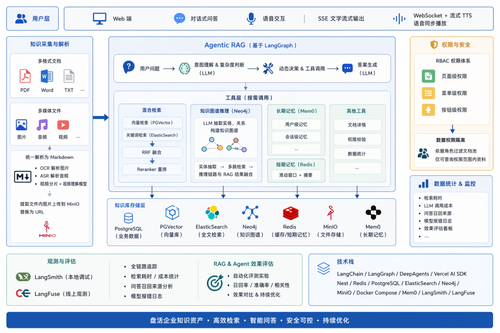

按照这个来写简历，就是一个比较能打的 Agent 项目了。

---

## 存储组件介绍

项目会涉及到一些数据库、中间件用于存储数据：

### PostgreSQL（带 PGVector 向量扩展）

存储结构化业务数据 + 文档分片向量：

| 数据类型 | 表名 | 说明 |
|----------|------|------|
| **RBAC 数据** | user、role、permission、department | 用户、角色、权限、部门 |
| **文档数据** | document、doc_chunk | 文档表、文档分片表 |
| **问答历史** | chat_session、chat_message | 对话会话表、问答消息记录表 |

### ElasticSearch（全文关键词检索引擎）

文档分片全文索引库，负责关键词召回、全文模糊检索。

### Neo4j（知识图谱图数据库）

存储实体、关系，支撑多跳图谱推理检索。

### Redis（缓存中间件）

| 用途 | 说明 |
|------|------|
| **短期记忆** | 滑动窗口、近期对话摘要 |
| **全局缓存** | 用户权限等 |
| **排行榜** | 热门文档等 |

### MinIO（对象存储）

存储全部静态文件资源：
- 用户上传原始文件：PDF、Word、PPT、图片、音频、视频源文件
- 文档解析资源：解析后内嵌图片

### Mem0（长期记忆存储）

| 类型 | 说明 |
|------|------|
| **用户级长期记忆** | 用户个人偏好、检索偏好、业务角色习惯 |
| **会话级长期记忆** | 单次对话上下文 |

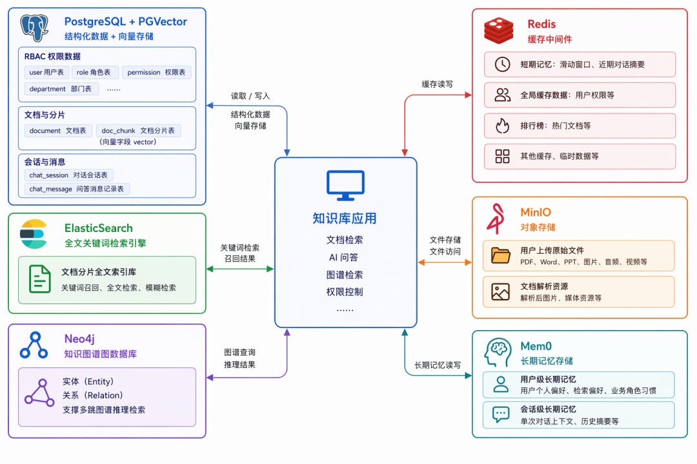

---

## 多媒体文档上传解析全流程

用户上传 PDF / 图片 / 音频 / 视频 → Redis 异步任务队列消费：

| 步骤 | 操作 | 存储位置 |
|------|------|----------|
| 1 | 原始文件存入 MinIO | MinIO |
| 2 | 文本文件直接提取内容转为 MD；图片调用视觉嵌入 + 大模型 OCR 生成图文描述；音频 ASR 转写文本；视频视频理解模型提取音频 + 帧画面整合 MD | 内存处理 |
| 3 | 文档内嵌图片、视频帧图上传 MinIO，MD 内替换为资源 URL | MinIO |
| 4 | MD 原文存入 PostgreSQL document 表；自动切片生成 chunk 存入 PGVector 向量表 | PostgreSQL + PGVector |
| 5 | 分片文本同步写入 ElasticSearch 建立关键词倒排索引 | ElasticSearch |
| 6 | LLM 自动抽取分片内实体、关系，写入 Neo4j 构建知识图谱 | Neo4j |
| 7 | 任务状态更新至 document_task 表，前端实时展示进度 | PostgreSQL |

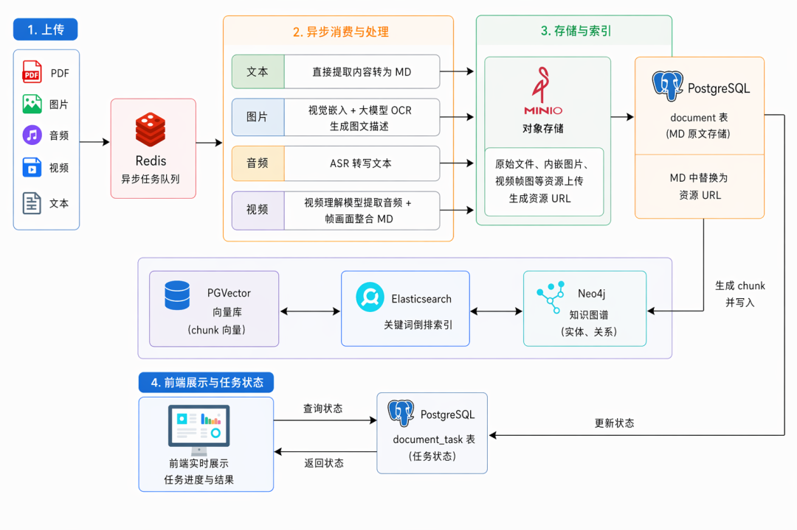

**说明**：文档上传后的处理耗时比较高，所以放到 Redis 任务队列里，异步来做。加一个任务表来记录进度，前端可以从这个表中查询任务状态。

---

## Agent 问答全流程

用户输入自然语言提问 → 鉴权校验 Redis 缓存用户权限白名单：

| 步骤 | 操作 | 说明 |
|------|------|------|
| 1 | LangGraph Agent 自主判断问题复杂度 | 简单问题仅调用混合检索，复杂业务问题额外触发图谱多跳推理 |
| 2 | 多路召回 | ES 关键词召回 + PGVector 向量召回；RRF 融合得分，Reranker 重排 |
| 3 | 图谱推理 | LLM 抽取问题实体，查询 Neo4j 执行多跳关联检索，获取实体推理链路 |
| 4 | 权限过滤 | 过滤所有用户无权限文档分片 |
| 5 | 记忆读取 | Redis 读取短期滑动窗口对话摘要，Mem0 拉取用户 / 会话长期记忆 |
| 6 | 上下文拼接 | 检索分片、图谱推理结果、分层记忆统一拼接至 Prompt 上下文 |
| 7 | 生成回答 | LLM 生成回答，SSE 流式推送文字；可选 TTS 生成语音 WebSocket 同步播放 |
| 8 | 全链路日志 | 全链路日志上报 LangFuse，记录耗时、Token 消耗、召回分片、异常报错 |
| 9 | 持久化 | 问答记录持久化存入 chat_session/chat_message 表 |

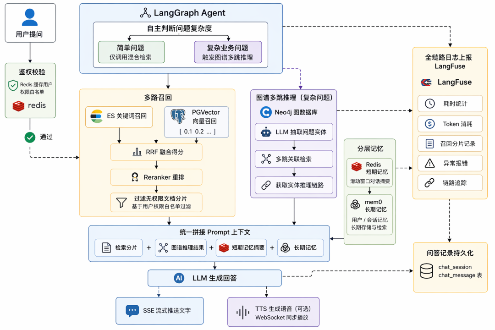

**权限白名单说明**：权限白名单就是当前登录用户能访问的全部文件夹、文档 ID 集合，放在 Redis 里。我们检索出文档后，会过滤掉无权限的文档，再来生成回答。

---

## 为什么不自研而不用 Dify？

有的同学可能会问，那 Dify 之类的知识库呢？

Dify 搭建的知识库支持递归分块、向量 + 全文检索 + 重排的混合检索。但是它有以下不足：

| 不足 | 说明 |
|------|------|
| **不支持知识图谱** | 无法通过 LLM 自动抽取文档中的实体、关系，从而实现多跳关联推理 |
| **缺少分级数据权限管控** | 无法按部门、岗位隔离知识库与文档，检索时不能自动过滤无权限资料，存在内部涉密文档泄露风险 |
| **不支持完整多模态解析** | 缺少图片 OCR 图文识别、音频 ASR 转写、视频理解解析能力，无法处理图片、音频、视频类业务资料 |
| **平台封装度高** | 底层架构封装度高，难以深度对接自定义 Agent，拓展成本极高 |

所以，为适配复杂业务场景下的知识检索与智能问答，我们要自己实现知识库。

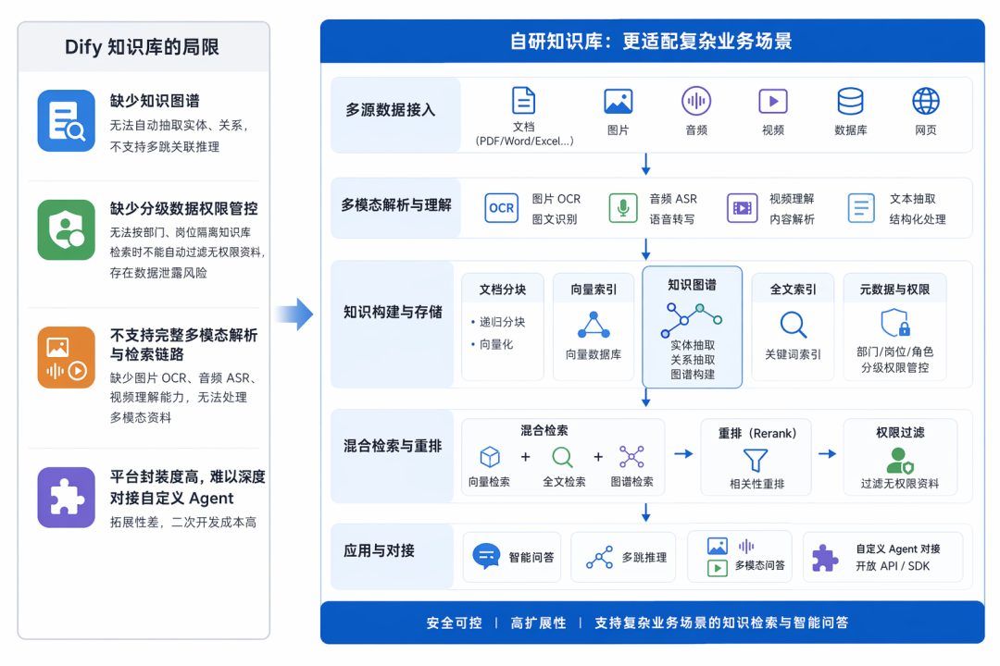

---

## 项目技术全景总结

### 核心技术栈

| 层级 | 技术 | 说明 |
|------|------|------|
| **后端框架** | FastAPI | Python 高性能 Web 框架 |
| **Agent 框架** | LangChain + LangGraph | LLM 应用开发 + 图编排 |
| **向量数据库** | PostgreSQL + PGVector | 结构化数据 + 向量存储 |
| **全文检索** | ElasticSearch | 关键词倒排索引 |
| **知识图谱** | Neo4j | 实体关系存储 + 多跳推理 |
| **缓存/队列** | Redis | 缓存 + 异步任务队列 + 短期记忆 |
| **对象存储** | MinIO | 文件、图片、音视频存储 |
| **长期记忆** | Mem0 | 用户级 + 会话级长期记忆 |
| **观测评估** | LangSmith + LangFuse | 本地调试 + 线上监控 + 效果评估 |
| **部署** | Docker Compose | 一键部署 |

### 核心功能模块

| 模块 | 功能 |
|------|------|
| **文档管理** | 多格式上传、多模态解析、Markdown 统一存储、父子分块 |
| **AI 问答** | 混合检索、RRF 融合、Reranker 重排、Agentic RAG、流式输出 |
| **知识图谱** | LLM 实体关系抽取、Neo4j 存储、多跳推理检索 |
| **权限控制** | RBAC 三级权限、数据权限隔离、功能权限 + 数据权限双重隔离 |
| **记忆系统** | Redis 短期记忆（滑动窗口+摘要）、Mem0 长期记忆（用户级+会话级） |
| **语音交互** | ASR 语音识别、TTS 语音合成、WebSocket 流式播放 |
| **全链路观测** | LangSmith 调试、LangFuse 监控、RAG 效果量化评估 |

---

## 学习要点

1. **企业级知识库是 Agent 最常见的项目方向**：文档管理 + AI 问答 + 知识图谱 + 权限控制，是简历加分项
2. **多模态解析是核心能力**：文本、图片、音频、视频统一解析为 Markdown，图片 OCR、音频 ASR、视频理解
3. **混合检索是标配**：PGVector 向量检索 + ElasticSearch 关键词检索 + RRF 融合 + Reranker 重排
4. **知识图谱是加分项**：LLM 抽取实体关系存入 Neo4j，多跳推理检索，提升复杂问题回答质量
5. **权限控制是企业级必备**：RBAC 三级权限（页面/菜单/按钮）+ 数据权限隔离，功能权限与数据权限双重隔离
6. **记忆系统是 Agent 完整能力**：Redis 短期记忆（滑动窗口+摘要）+ Mem0 长期记忆（用户级+会话级）
7. **Agentic RAG 是高级能力**：LangGraph 实现 Agent 自主判断问题复杂度，动态决策检索策略
8. **异步处理是性能关键**：文档上传解析耗时高，用 Redis 任务队列异步处理，任务表记录进度
9. **全链路观测是工程必备**：LangSmith 本地调试 + LangFuse 线上监控，记录耗时、Token、召回来源、报错
10. **自研 vs Dify**：Dify 不支持知识图谱、分级权限、完整多模态，复杂业务场景需要自研

## 扩展方向

- 学习企业级知识库项目实战（数据库设计、文件解析、异步流水线、全文检索、知识图谱、审核机制、用户鉴权、用户模块）
- 探索 RAG 高级技术（HyDE、Query2Doc、Self-RAG、Corrective RAG、RAPTOR、ColBERT）
- 学习多模态 RAG 深度实现（图文检索、视频检索、跨模态嵌入、图文混合生成）
- 探索知识图谱构建（实体抽取、关系抽取、图谱融合、图谱推理、GraphRAG、LightRAG）
- 学习企业级权限系统（RBAC、ABAC、数据权限、行级权限、列级权限）
- 探索 Agent 记忆系统（短期记忆、长期记忆、情景记忆、语义记忆、程序记忆）
- 学习全链路观测（LangSmith、LangFuse、OpenTelemetry、Prometheus、Grafana）
- 探索 RAG 效果评估（RAGAS、TruLens、DeepEval、A/B 测试、LLM as Judge）
- 学习企业级部署（Docker Compose、Kubernetes、CI/CD、灰度发布、监控告警）
- 探索 Agent 安全与合规（Prompt 注入防护、数据脱敏、审计日志、合规要求）

---

## 配套代码库

**代码库地址**：https://github.com/iiixiyan/agent-learning-code/tree/main/05-resume-interview/48-enterprise-kb-intro

包含企业级知识库项目的完整代码示例（数据库设计、文件解析、异步流水线、混合检索、知识图谱、权限控制、记忆系统、Agentic RAG、全链路观测）。

---

**上一篇**：[真实 Agent 简历参考库（知识库 RAG 专场）](./47_真实Agent简历参考库(知识库RAG专场).md) | **下一篇**：[企业级知识库项目 - 数据库设计](./49_企业级知识库项目-数据库设计.md)
