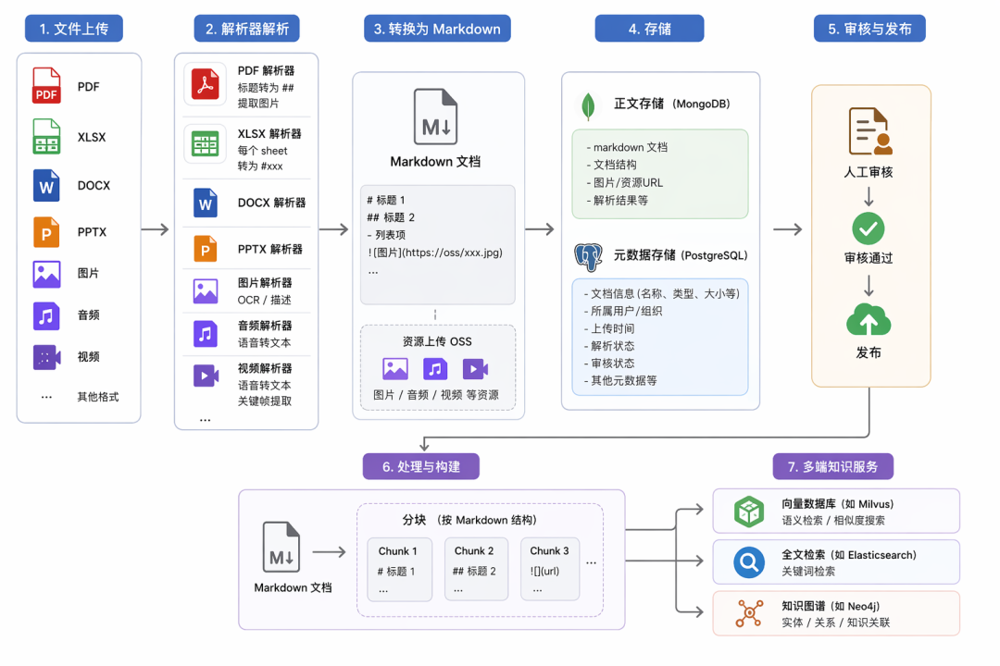
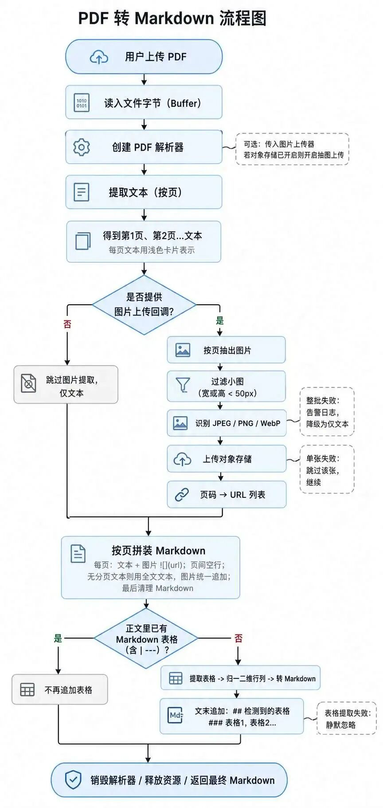
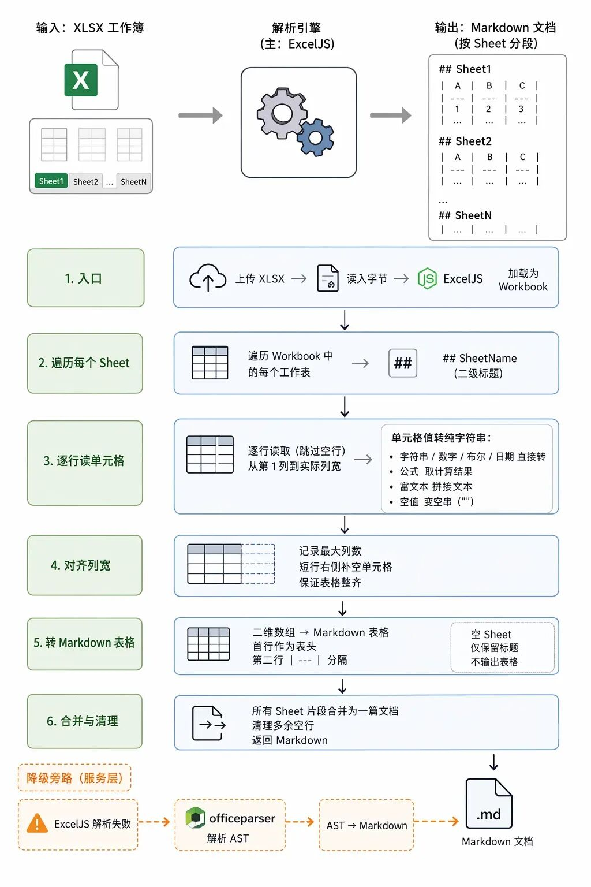
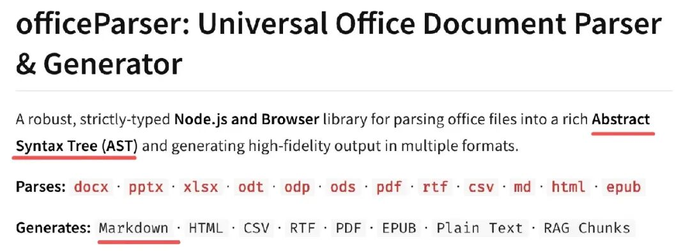
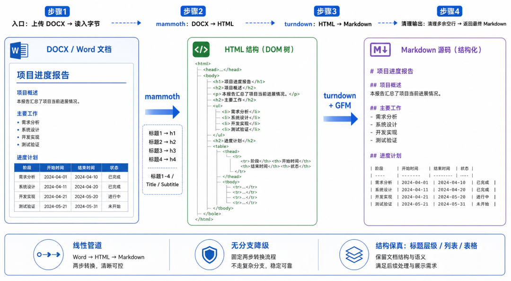
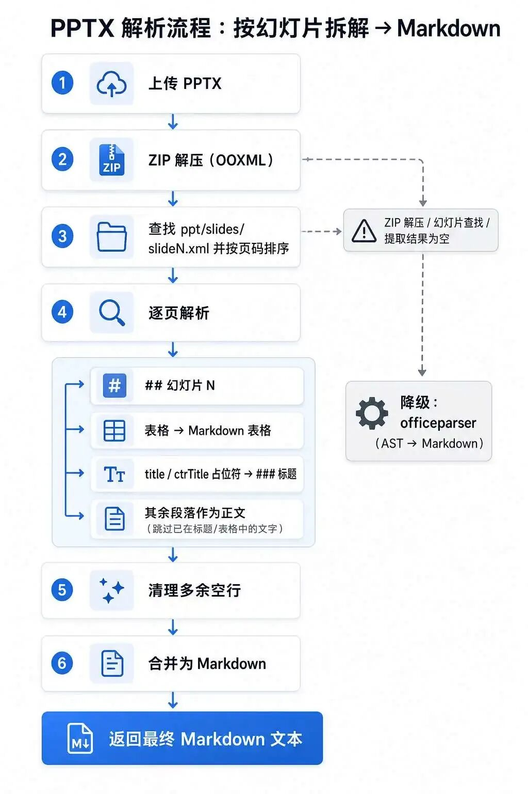
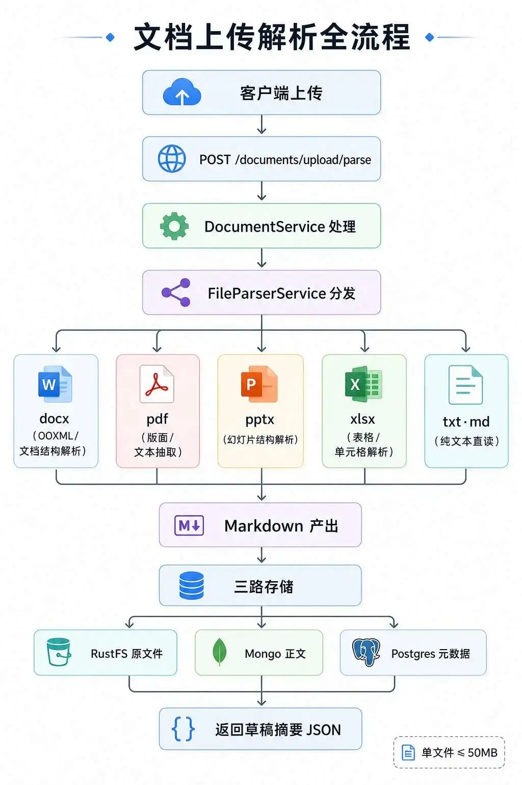
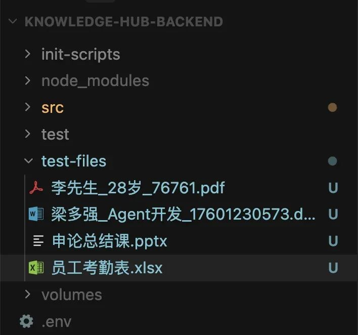

# 企业级知识库项目：PDF/XLSX/DOCX/PPTX 文件解析为 md 文档

> **Python 版** | 多格式文件解析为 Markdown + 图片提取上传 + 完整 Python 实现
> 前置知识：[企业级知识库项目介绍](./48_企业级知识库项目-项目介绍.md)、[数据库设计](./49_企业级知识库项目-数据库设计.md)

---

## 为什么需要文件解析？

上节我们做了文档模块的数据库设计，打通了从接口到数据库的流程。

但大多数场景下，不是直接传入文档内容，而是上传文件，服务端解析后保存为文档。



一般上传的文件解析后，都是用 **Markdown 格式**保存解析结果：

| 文件类型 | 解析方式 | Markdown 输出 |
|----------|----------|---------------|
| **PDF** | 提取文本、表格、图片 | 标题转 `##`，图片转 ``，表格转 Markdown 表格 |
| **XLSX** | 遍历 Sheet 和单元格 | 每个 Sheet 转 `## Sheet名`，内容转 Markdown 表格 |
| **DOCX** | 转 HTML 再转 Markdown | 保留标题、段落、表格、图片格式 |
| **PPTX** | 按页解析（压缩包解压） | 每页转 `## 第N页`，提取标题、段落、表格 |
| **TXT/MD** | 直接读取 | 原样保存 |

这样的内容正文保存到 MongoDB 里，元数据放 PostgreSQL。

当文档审核通过、发布后，会按照 Markdown 格式来分块，写入向量数据库、全文检索（ElasticSearch）、知识图谱（Neo4j）等。

---

## 为什么不用 LangChain 的 Loader？

有同学问，是用 LangChain 的 loader 来处理么？

**不是。**

就比如 PDF，用 loader 只会提取文本，不会提取图片，我们要提取上传 OSS，而且我们还想把标题转为 `## xxx` 格式。

定制化需求比较多，所以自己实现各类文件的解析。

---

## PDF 解析流程



用户上传了 PDF，我们会用 **pdfplumber** 这个库来解析：

1. 提取每页的文本
2. 如果传了提取图片的回调函数，就提取图片上传 OSS，然后把返回的图片 URL 放到那页文本后面，`` 这样的格式
3. 如果提取的文本里有表格，就解析表格然后转成 Markdown 的表格放到本页后面

### Python 实现

```python
"""
pdf_parser.py - PDF 文件解析为 Markdown
"""
import pdfplumber
from typing import Callable, Optional


def parse_pdf_to_markdown(
    file_path: str,
    extract_image_callback: Optional[Callable[[bytes, str], str]] = None,
) -> str:
    """
    将 PDF 文件解析为 Markdown

    Args:
        file_path: PDF 文件路径
        extract_image_callback: 图片提取回调函数，接收(图片字节, 文件名)返回URL

    Returns:
        str: Markdown 格式的文档内容
    """
    markdown_parts = []

    with pdfplumber.open(file_path) as pdf:
        for page_num, page in enumerate(pdf.pages, 1):
            # 1. 提取文本
            text = page.extract_text() or ""

            # 2. 提取表格并转为 Markdown 表格
            tables = page.extract_tables()
            table_markdown = ""
            for table in tables:
                if table and len(table) > 0:
                    table_markdown += "\n" + _table_to_markdown(table) + "\n"

            # 3. 提取图片（如果有回调函数）
            image_markdown = ""
            if extract_image_callback and page.images:
                for img_idx, img in enumerate(page.images):
                    try:
                        # 提取图片字节
                        img_bytes = _extract_pdf_image(page, img)
                        if img_bytes:
                            img_name = f"page{page_num}_img{img_idx}.png"
                            img_url = extract_image_callback(img_bytes, img_name)
                            image_markdown += f"\n\n"
                    except Exception as e:
                        print(f"提取图片失败: {e}")

            # 4. 合并本页内容
            page_content = f"## 第 {page_num} 页\n\n{text}\n{table_markdown}\n{image_markdown}\n"
            markdown_parts.append(page_content)

    return "\n---\n\n".join(markdown_parts)


def _table_to_markdown(table: list) -> str:
    """将表格数据转为 Markdown 表格"""
    if not table or len(table) == 0:
        return ""

    # 第一行作为表头
    header = table[0]
    separator = ["---"] * len(header)
    rows = table[1:]

    markdown = "| " + " | ".join(str(h) if h else "" for h in header) + " |\n"
    markdown += "| " + " | ".join(separator) + " |\n"
    for row in rows:
        markdown += "| " + " | ".join(str(c) if c else "" for c in row) + " |\n"

    return markdown


def _extract_pdf_image(page, img) -> Optional[bytes]:
    """从 PDF 页面提取图片（简化实现）"""
    try:
        # pdfplumber 的图片提取需要额外处理
        # 实际项目中可以使用 PyMuPDF (fitz) 来提取图片
        import fitz  # PyMuPDF
        # 这里简化处理，实际项目需要根据 img 的位置裁剪
        return None
    except ImportError:
        return None
```

### 使用 PyMuPDF 提取图片（推荐）

```python
"""
pdf_image_extractor.py - 使用 PyMuPDF 提取 PDF 图片
"""
import fitz  # PyMuPDF
from typing import List, Tuple


def extract_pdf_images(file_path: str) -> List[Tuple[int, bytes, str]]:
    """
    提取 PDF 中的所有图片

    Returns:
        list: [(page_num, image_bytes, filename), ...]
    """
    images = []
    doc = fitz.open(file_path)

    for page_num in range(len(doc)):
        page = doc[page_num]
        image_list = page.get_images(full=True)

        for img_idx, img in enumerate(image_list):
            xref = img[0]
            base_image = doc.extract_image(xref)
            image_bytes = base_image["image"]
            image_ext = base_image["ext"]
            filename = f"page{page_num + 1}_img{img_idx}.{image_ext}"
            images.append((page_num + 1, image_bytes, filename))

    doc.close()
    return images
```

---

## XLSX 解析流程



用 **openpyxl** 来解析用户上传的 XLSX 文件：

1. 遍历工作表 Sheet，提取标题
2. 遍历单元格，根据单元格类型来提取文本
3. 根据列宽来补齐一下
4. 转为 Markdown 格式的文本就好了

如果解析失败，就换成其他库（如 pandas）。



### Python 实现

```python
"""
xlsx_parser.py - XLSX 文件解析为 Markdown
"""
from openpyxl import load_workbook
from typing import Optional


def parse_xlsx_to_markdown(file_path: str) -> str:
    """
    将 XLSX 文件解析为 Markdown

    Args:
        file_path: XLSX 文件路径

    Returns:
        str: Markdown 格式的文档内容
    """
    markdown_parts = []
    wb = load_workbook(file_path, data_only=True)

    for sheet_name in wb.sheetnames:
        ws = wb[sheet_name]

        # 读取所有数据
        data = []
        for row in ws.iter_rows(values_only=True):
            # 跳过全空行
            if any(cell is not None and str(cell).strip() for cell in row):
                data.append([str(cell) if cell is not None else "" for cell in row])

        if not data:
            continue

        # 转为 Markdown 表格
        table_markdown = _data_to_markdown_table(data)
        sheet_content = f"## {sheet_name}\n\n{table_markdown}\n"
        markdown_parts.append(sheet_content)

    wb.close()
    return "\n---\n\n".join(markdown_parts)


def _data_to_markdown_table(data: list) -> str:
    """将二维数据转为 Markdown 表格"""
    if not data:
        return ""

    # 确定最大列数
    max_cols = max(len(row) for row in data)

    # 补齐列数
    normalized = [row + [""] * (max_cols - len(row)) for row in data]

    # 第一行作为表头
    header = normalized[0]
    separator = ["---"] * max_cols
    rows = normalized[1:]

    markdown = "| " + " | ".join(header) + " |\n"
    markdown += "| " + " | ".join(separator) + " |\n"
    for row in rows:
        markdown += "| " + " | ".join(row) + " |\n"

    return markdown
```

### 使用 pandas 解析（备选方案）

```python
"""
xlsx_parser_pandas.py - 使用 pandas 解析 XLSX
"""
import pandas as pd


def parse_xlsx_with_pandas(file_path: str) -> str:
    """使用 pandas 解析 XLSX 为 Markdown"""
    markdown_parts = []
    xls = pd.ExcelFile(file_path)

    for sheet_name in xls.sheet_names:
        df = pd.read_excel(xls, sheet_name=sheet_name)
        if df.empty:
            continue

        # 转为 Markdown 表格
        table_markdown = df.to_markdown(index=False)
        sheet_content = f"## {sheet_name}\n\n{table_markdown}\n"
        markdown_parts.append(sheet_content)

    return "\n---\n\n".join(markdown_parts)
```

---

## DOCX 解析流程



我们先用 **mammoth** 把 DOCX 的文档转为 HTML 格式，然后再用 **markdownify** 把 HTML 转换为 Markdown 就好了。

### Python 实现

```python
"""
docx_parser.py - DOCX 文件解析为 Markdown
"""
import mammoth
from markdownify import markdownify as md
from typing import Optional, Callable


def parse_docx_to_markdown(
    file_path: str,
    extract_image_callback: Optional[Callable[[bytes, str], str]] = None,
) -> str:
    """
    将 DOCX 文件解析为 Markdown

    Args:
        file_path: DOCX 文件路径
        extract_image_callback: 图片提取回调函数

    Returns:
        str: Markdown 格式的文档内容
    """
    with open(file_path, "rb") as docx_file:
        if extract_image_callback:
            # 自定义图片转换：提取图片上传 OSS，替换为 URL
            def convert_image(image):
                with image.open() as image_bytes:
                    img_bytes = image_bytes.read()
                    img_name = f"docx_img_{image.content_type.split('/')[-1]}"
                    img_url = extract_image_callback(img_bytes, img_name)
                    return {"src": img_url}

            result = mammoth.convert_to_html(
                docx_file,
                convert_image=mammoth.images.img_element(convert_image),
            )
        else:
            result = mammoth.convert_to_html(docx_file)

    html = result.value  # 生成的 HTML
    markdown = md(html, heading_style="ATX")  # 转为 Markdown

    return markdown
```

### 使用 python-docx 解析（备选方案）

```python
"""
docx_parser_python_docx.py - 使用 python-docx 解析 DOCX
"""
from docx import Document
from docx.document import Document as DocType


def parse_docx_with_python_docx(file_path: str) -> str:
    """使用 python-docx 解析 DOCX 为 Markdown"""
    doc: DocType = Document(file_path)
    markdown_parts = []

    for para in doc.paragraphs:
        if not para.text.strip():
            continue

        # 根据样式判断标题级别
        style = para.style.name
        if style.startswith("Heading 1"):
            markdown_parts.append(f"# {para.text}")
        elif style.startswith("Heading 2"):
            markdown_parts.append(f"## {para.text}")
        elif style.startswith("Heading 3"):
            markdown_parts.append(f"### {para.text}")
        else:
            markdown_parts.append(para.text)

    # 处理表格
    for table in doc.tables:
        data = []
        for row in table.rows:
            data.append([cell.text for cell in row.cells])
        table_markdown = _data_to_markdown_table(data)
        markdown_parts.append(table_markdown)

    return "\n\n".join(markdown_parts)


def _data_to_markdown_table(data: list) -> str:
    """将二维数据转为 Markdown 表格"""
    if not data:
        return ""
    max_cols = max(len(row) for row in data)
    normalized = [row + [""] * (max_cols - len(row)) for row in data]
    header = normalized[0]
    separator = ["---"] * max_cols
    rows = normalized[1:]
    markdown = "| " + " | ".join(header) + " |\n"
    markdown += "| " + " | ".join(separator) + " |\n"
    for row in rows:
        markdown += "| " + " | ".join(row) + " |\n"
    return markdown
```

---

## PPTX 解析流程



PPTX 本质上是压缩包，所以按照 zip 解压来处理：

1. 查找到那个 XML 的页码等元数据
2. 按页来做转换，比如表格、title、段落等
3. 最后也是合并为 Markdown 文档

如果解析失败，也是换其他库通过 AST 来转换。

### Python 实现

```python
"""
pptx_parser.py - PPTX 文件解析为 Markdown
"""
from pptx import Presentation
from pptx.util import Inches
from typing import Optional, Callable


def parse_pptx_to_markdown(
    file_path: str,
    extract_image_callback: Optional[Callable[[bytes, str], str]] = None,
) -> str:
    """
    将 PPTX 文件解析为 Markdown

    Args:
        file_path: PPTX 文件路径
        extract_image_callback: 图片提取回调函数

    Returns:
        str: Markdown 格式的文档内容
    """
    prs = Presentation(file_path)
    markdown_parts = []

    for slide_num, slide in enumerate(prs.slides, 1):
        slide_parts = [f"## 第 {slide_num} 页"]

        for shape in slide.shapes:
            # 1. 文本框
            if shape.has_text_frame:
                for para in shape.text_frame.paragraphs:
                    if para.text.strip():
                        # 判断是否为标题
                        if shape.is_placeholder and shape.placeholder_format.idx == 0:
                            slide_parts.append(f"### {para.text}")
                        else:
                            slide_parts.append(para.text)

            # 2. 表格
            elif shape.has_table:
                table = shape.table
                data = []
                for row in table.rows:
                    data.append([cell.text for cell in row.cells])
                table_markdown = _data_to_markdown_table(data)
                slide_parts.append(table_markdown)

            # 3. 图片
            elif shape.shape_type == 13:  # PICTURE
                if extract_image_callback:
                    try:
                        img_bytes = shape.image.blob
                        img_ext = shape.image.ext
                        img_name = f"slide{slide_num}_{shape.shape_id}.{img_ext}"
                        img_url = extract_image_callback(img_bytes, img_name)
                        slide_parts.append(f"")
                    except Exception as e:
                        print(f"提取PPT图片失败: {e}")

        slide_content = "\n\n".join(slide_parts)
        markdown_parts.append(slide_content)

    return "\n---\n\n".join(markdown_parts)


def _data_to_markdown_table(data: list) -> str:
    """将二维数据转为 Markdown 表格"""
    if not data:
        return ""
    max_cols = max(len(row) for row in data)
    normalized = [row + [""] * (max_cols - len(row)) for row in data]
    header = normalized[0]
    separator = ["---"] * max_cols
    rows = normalized[1:]
    markdown = "| " + " | ".join(header) + " |\n"
    markdown += "| " + " | ".join(separator) + " |\n"
    for row in rows:
        markdown += "| " + " | ".join(row) + " |\n"
    return markdown
```

---

## TXT/MD 解析

```python
"""
txt_parser.py - TXT/MD 文件解析
"""


def parse_txt_to_markdown(file_path: str) -> str:
    """直接读取 TXT/MD 文件内容"""
    with open(file_path, "r", encoding="utf-8") as f:
        return f.read()
```

---

## 统一解析入口

```python
"""
file_parser.py - 统一文件解析入口
"""
from typing import Callable, Optional
from pdf_parser import parse_pdf_to_markdown
from xlsx_parser import parse_xlsx_to_markdown
from docx_parser import parse_docx_to_markdown
from pptx_parser import parse_pptx_to_markdown
from txt_parser import parse_txt_to_markdown


def parse_file_to_markdown(
    file_path: str,
    file_type: str,
    extract_image_callback: Optional[Callable[[bytes, str], str]] = None,
) -> str:
    """
    统一文件解析入口

    Args:
        file_path: 文件路径
        file_type: 文件类型 (pdf/xlsx/docx/pptx/txt/md)
        extract_image_callback: 图片提取回调函数

    Returns:
        str: Markdown 格式的文档内容

    Raises:
        ValueError: 不支持的文件类型
    """
    parsers = {
        "pdf": parse_pdf_to_markdown,
        "xlsx": parse_xlsx_to_markdown,
        "docx": parse_docx_to_markdown,
        "pptx": parse_pptx_to_markdown,
        "txt": parse_txt_to_markdown,
        "md": parse_txt_to_markdown,
    }

    file_type = file_type.lower()
    if file_type not in parsers:
        raise ValueError(f"不支持的文件类型: {file_type}")

    parser = parsers[file_type]

    # PDF/DOCX/PPTX 支持图片提取回调
    if file_type in ["pdf", "docx", "pptx"]:
        return parser(file_path, extract_image_callback=extract_image_callback)
    else:
        return parser(file_path)


# 使用示例
if __name__ == "__main__":
    # 图片上传回调函数（示例：上传到 MinIO）
    def upload_to_minio(image_bytes: bytes, filename: str) -> str:
        """上传图片到 MinIO，返回 URL"""
        # 实际项目中实现 MinIO 上传
        return f"https://minio.example.com/documents/{filename}"

    # 解析 PDF
    markdown = parse_file_to_markdown(
        "test.pdf",
        "pdf",
        extract_image_callback=upload_to_minio,
    )
    print(markdown[:500])
```

---

## 完整解析流程



```
用户上传文件
    ↓
1. 原始文件存入 MinIO / OSS
    ↓
2. 根据文件类型选择解析器
    ├── PDF  → pdfplumber + PyMuPDF（提取图片）
    ├── XLSX → openpyxl / pandas
    ├── DOCX → mammoth（转HTML）+ markdownify（转MD）
    ├── PPTX → python-pptx
    └── TXT/MD → 直接读取
    ↓
3. 提取图片上传 MinIO，替换为 URL
    ↓
4. 生成 Markdown 文档
    ↓
5. Markdown 正文存入 MongoDB
    ↓
6. 元数据存入 PostgreSQL（documents 表）
    ↓
7. 更新任务状态（document_tasks 表）
```

---

## 安装依赖

```bash
# PDF 解析
pip install pdfplumber PyMuPDF

# XLSX 解析
pip install openpyxl pandas tabulate

# DOCX 解析
pip install mammoth markdownify python-docx

# PPTX 解析
pip install python-pptx

# 全部安装
pip install pdfplumber PyMuPDF openpyxl pandas tabulate mammoth markdownify python-docx python-pptx
```

---

## FastAPI 集成示例

```python
"""
main.py - FastAPI 文件上传解析接口
"""
from fastapi import FastAPI, UploadFile, File, Form, Depends, HTTPException
from sqlalchemy.orm import Session
from file_parser import parse_file_to_markdown
from models import SessionLocal, Document, DocumentTask
import os
import uuid

app = FastAPI()


def get_db():
    db = SessionLocal()
    try:
        yield db
    finally:
        db.close()


def upload_to_minio(image_bytes: bytes, filename: str) -> str:
    """上传图片到 MinIO，返回 URL"""
    # 实际项目中实现 MinIO 上传
    return f"https://minio.example.com/documents/{filename}"


@app.post("/documents/upload/parse")
async def upload_and_parse(
    file: UploadFile = File(...),
    author_id: int = Form(...),
    create_by: int = Form(...),
    db: Session = Depends(get_db),
):
    """
    上传文件并解析为 Markdown

    - 支持 PDF/XLSX/DOCX/PPTX/TXT/MD
    - 自动提取图片上传 OSS
    - 解析结果存入 MongoDB，元数据存入 PostgreSQL
    """
    # 1. 保存上传文件到临时目录
    file_ext = file.filename.split(".")[-1].lower()
    temp_path = f"/tmp/{uuid.uuid4()}.{file_ext}"

    with open(temp_path, "wb") as f:
        content = await file.read()
        f.write(content)

    # 2. 创建文档记录
    doc = Document(
        title=file.filename,
        file_name=file.filename,
        file_type=file_ext,
        file_size=len(content),
        file_url=f"https://minio.example.com/documents/{file.filename}",
        status="parsing",
        uploader_id=create_by,
    )
    db.add(doc)
    db.commit()
    db.refresh(doc)

    # 3. 创建解析任务
    task = DocumentTask(
        document_id=doc.id,
        task_type="parse",
        status="running",
    )
    db.add(task)
    db.commit()

    try:
        # 4. 解析文件为 Markdown
        markdown = parse_file_to_markdown(
            temp_path,
            file_ext,
            extract_image_callback=upload_to_minio,
        )

        # 5. 存入 MongoDB（实际项目中实现）
        # mongo_db.document_contents.insert_one({
        #     "document_id": doc.id,
        #     "markdown": markdown,
        #     "parsed_at": datetime.now(),
        # })

        # 6. 更新文档状态
        doc.status = "parsed"
        doc.word_count = len(markdown)
        task.status = "completed"
        task.progress = 100
        db.commit()

        # 7. 清理临时文件
        os.remove(temp_path)

        return {
            "code": 0,
            "message": "解析成功",
            "data": {
                "document_id": doc.id,
                "title": doc.title,
                "word_count": doc.word_count,
                "markdown_preview": markdown[:500],
            },
        }

    except Exception as e:
        # 解析失败
        doc.status = "failed"
        doc.error_message = str(e)
        task.status = "failed"
        task.error_message = str(e)
        db.commit()
        os.remove(temp_path)
        raise HTTPException(status_code=500, detail=f"解析失败: {str(e)}")
```

---

## 测试

准备几个测试文件：



使用 curl 测试：

```bash
curl -s -X POST http://localhost:8000/documents/upload/parse \
  -F 'file=@./test.pdf' \
  -F 'authorId=10001' \
  -F 'createBy=10001' | jq
```

---

## 学习要点

1. **文件解析是知识库的第一步**：PDF/XLSX/DOCX/PPTX 分别用不同的工具、不同的解析流程，最终都是产出 Markdown 文档
2. **不用 LangChain Loader 的原因**：定制化需求多（图片提取、标题格式、表格转换），自己实现更灵活
3. **PDF 解析用 pdfplumber + PyMuPDF**：pdfplumber 提取文本和表格，PyMuPDF 提取图片
4. **XLSX 解析用 openpyxl 或 pandas**：openpyxl 更底层，pandas 更方便（to_markdown）
5. **DOCX 解析用 mammoth + markdownify**：mammoth 转 HTML，markdownify 转 Markdown，保留格式
6. **PPTX 解析用 python-pptx**：按页解析，提取文本、表格、图片
7. **图片提取上传 OSS 是关键**：PDF/DOCX/PPTX 中的图片要提取上传，替换为 URL，保留在 Markdown 中
8. **统一解析入口设计**：根据文件类型分发到不同解析器，支持图片提取回调函数
9. **异步处理是性能关键**：大文件解析耗时高，用任务队列异步处理，任务表记录进度
10. **错误处理很重要**：解析失败要记录错误信息，更新文档状态为 failed

## 扩展方向

- 学习更多文件格式解析（HTML、EPUB、CSV、JSON、XML）
- 探索 OCR 识别（扫描版 PDF、图片中的文字）：Tesseract、PaddleOCR
- 学习音频转文字（ASR）：Whisper、FunASR
- 探索视频理解：视频帧提取 + 视觉模型
- 学习文档布局分析：LayoutLM、DocLayNet
- 探索表格识别高级技术：Table Transformer、Camelot
- 学习 Markdown 高级处理：front matter、目录生成、链接检查
- 探索文档去重和相似度检测：MinHash、SimHash
- 学习文档质量评估：可读性、完整性、准确性
- 探索批量解析和并发处理：asyncio、多进程、Celery

---

## 配套代码库

**代码库地址**：https://github.com/iiixiyan/agent-learning-code/tree/main/05-resume-interview/50-kb-file-parser

包含本文的完整文件解析代码（PDF/XLSX/DOCX/PPTX/TXT/MD）、统一解析入口、FastAPI 集成示例、测试文件。

---

**上一篇**：[数据库设计](./49_企业级知识库项目-数据库设计.md) | **下一篇**：[异步 RAG 流水线](./51_企业级知识库项目-异步RAG流水线.md)
